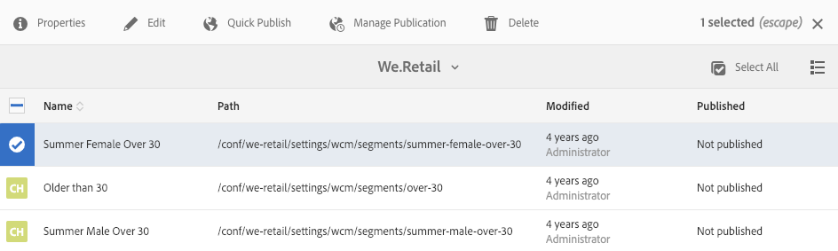

# Hantera aktiviteter{#managing-activities}

Med aktivitetskonsolen kan ni skapa, organisera och hantera marknadsföringsaktiviteter  för era varumärken:

* Lägg till varumärken.
* Lägg till och konfigurera aktiviteter för varje varumärke.
* Administrera aktiviteter.

>[!NOTE]
>
>Om du använder Adobe Target som målmotor kan du även [visa prestandadata för dina aktiviteter](#viewing-performance-and-converting-winning-experiences-a-b-test). Om ni använder A/B-tester kan ni [konvertera vinnarna](#viewing-performance-and-converting-winning-experiences-a-b-test).

På aktivitetskonsolen ordnas aktiviteterna efter varumärke. Du kan använda varumärken och mappar för att strukturera organisationen av dina aktiviteter. Du navigerar till aktivitetskonsolen genom att trycka på/klicka på **Personalisering** och trycka/klicka på **Aktiviteter**.

Aktiviteter är tillgängliga i målläge för [redigering av riktat innehåll](/help/sites-authoring/content-targeting-touch.md), där du också kan skapa aktiviteter. Aktiviteter som du skapar i målläge visas i aktivitetskonsolen.

Aktiviteter visas med en etikett som beskriver vilken typ av aktivitet som definieras:

* XT - målinriktning för Adobe Target-upplevelser
* A/B - Adobe Target A/B-testning
* AEM - Adobe Experience Manager med målinriktning (kontextub- eller klientstyrd)

>[!NOTE]
>
>Vilka typer av aktiviteter som är tillgängliga bestäms av följande:

>* Om alternativet **xt_only** är aktiverat på Adobe Target-klienten (klientkod) som används på AEM-sidan för att ansluta till Adobe Target, kan du **bara** skapa XT-aktiviteter i AEM.
   >
* Om alternativen **xt_only** **inte** är aktiverade på Adobe Target-klienten (klientkod) kan du skapa **både** XT- och A/B-aktiviteter i AEM.

**** Ytterligare information: Alternativen **xt_only** är en inställning som används för en viss målklient (klientkod) och kan bara ändras direkt i Adobe Target. Du kan inte aktivera eller inaktivera det här alternativet i AEM.

>[!CAUTION]
Du måste skydda aktivitetsinställningsnoden **cq:ActivitySettings** i publiceringsinstansen så att den inte är tillgänglig för vanliga användare. Noden för aktivitetsinställningar ska endast vara tillgänglig för tjänsten som hanterar aktivitetssynkroniseringen till Adobe Target.
Mer information finns i [Förutsättningar för att integrera med Adobe Target](/help/sites-administering/target-requirements.md#securingtheactivitysettings) .

## Skapa ett varumärke med hjälp av aktivitetskonsolen {#creating-a-brand-using-the-activities-console}

Skapa ett varumärke som ni vill hantera marknadsföringsaktiviteter för.

När du skapar ett varumärke med hjälp av aktivitetskonsolen visas det också i [offertkonsolen](/help/sites-authoring/offerlib.md) , där du kan skapa erbjudanden för upplevelserna av dina aktiviteter.

1. Klicka eller tryck på **Personalisering** i navigeringskonsolen. Klicka på eller tryck på **Aktiviteter**.

   

1. Klicka eller tryck på **Skapa** och sedan **Skapa varumärke** i aktivitetskonsolen.
1. Välj varumärkesmallen och klicka eller tryck på **Nästa**.
1. Skriv en rubrik för varumärket som du vill att det ska visas i aktivitets- och offertkonsolerna. Du kan också ange eller markera en eller flera taggar som ska kopplas till varumärket.
1. Klicka eller tryck på **Skapa**. Ditt varumärke visas i aktivitetskonsolen.

## Lägga till/redigera en aktivitet med aktivitetskonsolen {#adding-editing-an-activity-using-the-activities-console}

Lägg till en aktivitet eller redigera en befintlig aktivitet för att fokusera era marknadsföringssatsningar på specifika målgrupper. När du skapar/redigerar en aktivitet anger du följande information:

* **** Namn: Namnet på aktiviteten.
* **** Målmotor: Antingen [AEM](/help/sites-authoring/personalization.md#aem) eller [Adobe Target](/help/sites-authoring/personalization.md#adobe-target) som motor för riktat innehåll.

* **** Välj en målkonfiguration: (Endast Adobe Target) Den molnkonfiguration som den här aktiviteten ska använda för att ansluta till Adobe Target. Det här alternativet visas bara när Adobe Target har valts för målmotor.
* **Aktivitetstyp: **Aktivitetstyp - A/B-test eller målinriktning efter upplevelse
* **** Mål: (Valfritt) En beskrivning av aktiviteten.
* **** Upplevelser: Mappningar mellan målgruppsnamn och de marknadsföringssegment som ni riktar in er på.
* **** Trafikprocent: Om A/B-test är valt kan du ändra hur mycket trafik (i procent) som går till varje upplevelse.
* **** Varaktighet: Tidsperioden då aktiviteten används.
* **** Prioritet: Aktivitetens relativa prioritet. När aktiviteter tillhandahåller innehåll för samma användarsegment har aktiviteten med högre prioritet företräde.
* **** Målmått: Om du väljer Adobe Target som målmotor kan du lägga till framgångsmått till aktiviteten. Ett framgångsmått krävs.

>[!NOTE]
Nya Adobe Target-aktiviteter måste ***skapas*** i den riktade innehållsredigeraren, inte i **aktivitetskonsolen** , eftersom synkroniseringen med Adobe Target misslyckas.
Du kan dock redigera befintliga Adobe Target-aktiviteter i konsolen.

Så här lägger du till en aktivitet:

1. Klicka på eller tryck på det varumärke som du skapar aktiviteten för och klicka eller tryck sedan på **Create **then** Create Activity (Skapa aktivitet). **Om du redigerar markerar du aktiviteten på skärmen Huvudområde och klickar eller trycker på **Redigera aktivitet**.
1. Ange följande information och klicka eller tryck sedan på **Nästa**:

   * Ett namn för aktiviteten.
   * Målmotorn som ska användas. ContextHub (AEM) är valt som standard. Om du behöver använda Adobe Target skapar du aktiviteten i den aktiva innehållsredigeraren.
   * Om du valde Adobe Target som målmotor väljer/redigerar du den molnkonfiguration som ska användas för att ansluta till Adobe Target. (Se till att du inte väljer något ramverk som du har skapat för din molnkonfiguration.)
   * (Valfritt) Syftet med eller en beskrivning av aktiviteten.
   * Välj aktivitetstyp.

1. Lägg till en eller flera upplevelser till aktiviteten. Klicka eller tryck på **Add Experience**.
1. Om ni använder AEM-målinriktning eller Adobe Target-upplevelser som mål:

   1. Klicka eller tryck på **Välj publik **och välj det segment som upplevelsen ska rikta in sig på.
   1. Klicka eller tryck på **Lägg till upplevelse**, skriv ett namn och klicka eller tryck på **OK**.

   1. Klicka eller tryck på **Nästa**.
   Om du använder A/B-testning i Adobe Target:

   1. Klicka på eller tryck på pennan i rutan Målgrupper för att välja en målgrupp.
   1. Klicka eller tryck på **Lägg till upplevelse**, skriv ett namn och klicka eller tryck på **OK**.

   1. Ange den procentandel av trafiken som visar varje upplevelse.
   1. Klicka eller tryck på **Nästa**.

1. Om du vill ange när aktiviteten ska starta använder du **listrutan Start** och väljer något av följande värden:

   * **** Vid aktivering: Aktiviteten startar när sidan som innehåller målinnehållet aktiveras.
   * **** Angivet datum och tid: En viss tid. När du väljer det här alternativet klickar eller trycker du på kalenderikonen, väljer ett datum och anger vilken tid aktiviteten ska starta.

1. Om du vill ange när aktiviteten slutar använder du den nedrullningsbara menyn Slut och väljer något av följande värden:

   * **Vid inaktivering**: Aktiviteten avslutas när sidan som innehåller målinnehållet inaktiveras.
   * **Angivet datum och tid**: En viss tid. När du väljer det här alternativet klickar eller trycker du på kalenderikonen, väljer ett datum och anger tidpunkten för att avsluta aktiviteten.

1. Om du vill ange en prioritet för aktiviteten använder du skjutreglaget för att välja **Låg**, **Normal** eller **Hög**.
1. Om du använder Adobe Target som målmotor väljer du vad du vill mäta med den här aktiviteten. Mer information om tillgängliga framgångsmått finns i [Konfigurera aktiviteten och ställa in mål](/help/sites-authoring/content-targeting-touch.md) . Du måste välja minst ett mål.
1. Klicka eller tryck på **Spara**.

   >[!NOTE]
   När du har skapat en aktivitet måste du publicera den så att den blir tillgänglig.

## Förlags- och avpubliceringsverksamhet {#publishing-and-unpublishing-activities}

Du måste publicera aktiviteter för att göra dem tillgängliga. Omvänt kanske du vill göra aktiviteter otillgängliga genom att avpublicera dem.

>[!NOTE]
När en aktivitet avpubliceras

Så här publicerar eller avpublicerar du aktiviteter:

1. Klicka på eller tryck på varumärket och sedan det område som innehåller aktiviteten som du vill publicera eller avpublicera.
1. Tryck eller klicka på ikonen bredvid aktiviteten eller aktiviteterna som du vill publicera eller avpublicera.

   

1. Om du vill publicera trycker eller klickar du på **Publicera**. Avpublicera genom att trycka eller klicka på **Avpublicera**. Dina aktiviteter publiceras eller avpubliceras och deras status ändras i aktivitetskonsolen (kan kräva en uppdatering).

## Aktiviteter för författare och publiceringsinstanser {#activities-on-author-and-publish-instances}

När en aktivitet som använder målmotorn i Adobe Target aktiveras skapas en andra aktivitet i publiceringsinstansen:

* Aktiviteten på författarinstansen spårar aktivitet på författarinstansen och är användbar för att simulera besökarupplevelsen. De analyser som registreras för den här aktiviteten återspeglar bara vad som händer på författarinstansen.
* Aktiviteten i publiceringsinstansen speglar och svarar på aktiviteten på publiceringsservern. Detta är den aktivitet som körs på den offentliga webbplatsen. Det är bara publiceringsaktiviteten som är relevant för att spåra och analysera användningen av den publika webbplatsen.

## Visningsprestanda och konvertering av vinnande upplevelser (A/B-test) {#viewing-performance-and-converting-winning-experiences-a-b-test}

Du kan se prestanda för alla Adobe Target-aktiviteter (XT eller A/B). Om du använder A/B-testning kan du även konvertera den vinnande upplevelsen, som sedan blir standardupplevelsen.

Så här visar du aktivitetsprestanda och konverterar vinnande upplevelser:

1. I **Personalisering** klickar eller trycker du på **Aktiviteter** för att navigera till **aktivitetskonsolen** .
1. Klicka på eller peka på det varumärke som du vill se aktiviteter för.
1. Markera aktiviteten och klicka eller tryck på **Visa egenskaper** och klicka på fliken **Rapporter** och välj den aktivitet som du vill visa prestanda för/konvertera vinnande upplevelser för. Prestandadata visas.

   

1. Klicka på eller tryck på länken **Push winner** (Push-vinnare) för att göra den upplevelsen till standard.

   Att konvertera vinnaren gör följande:

   * Det inaktiverar den aktuella aktiviteten
   * Ändrar alla sidor och ersätter målinnehållet med det faktiska innehållet i den vinnande upplevelsen. Innehållet i den vinnande upplevelsen blir en del av den normala sidan **utan** målinriktning.
   

   En vinnande upplevelse är den upplevelse som genererar mer Lyft i rapporterna, som baseras på konverteringsgraden.

1. Klicka på eller tryck på **Ja** för att bekräfta att du vill konvertera vinnaren, inaktivera den aktuella upplevelsen och ersätta den med innehållet i den vinnande upplevelsen.

## Synkronisera aktiviteter med Adobe Target {#synchronizing-activities-with-adobe-target}

Aktiviteter som använder Adobe Target-målmotorn synkroniseras med Adobe Target-kampanjer. En aktivitet synkroniseras automatiskt till Adobe Target när följande villkor uppfylls:

* Aktiviteten innehåller minst en upplevelse.
* Minst en upplevelse innehåller ett mappat segment och ett erbjudande.
* Varje upplevelse i aktiviteten måste ha samma antal erbjudanden.

Dessa villkor gäller för aktiviteter på författare och publiceringsinstanser.

När en aktivitet synkroniseras skapas en motsvarande kampanj i Adobe Target:

* Aktiviteter i publiceringsinstansen har samma namn som motsvarande Adobe Target-kampanj.
* Aktiviteter i författarinstansen motsvarar målkampanjer med samma namn som `_author` suffixet.

_författaraktiviteter synkroniseras omedelbart när aktiviteten ändras. Omedelbar synkronisering möjliggör simulering av aktiviteter med Client Context eller ContextHub.

Publiceringsaktiviteter synkroniseras när aktiviteten publiceras till AEM-publiceringsinstansen.

## Felsökning av aktivitetssynkronisering {#troubleshooting-activity-synchronization}

När AEM synkroniserar en aktivitet med Adobe Target inkluderar AEM en egenskap för aktiviteten med namnet `thirdPartyId`. Värdet för den här egenskapen baseras på sökvägen för aktiviteten i AEM-databasen. Två kampanjer i Adobe Target kan inte ha samma värde för `thirdPartyId` egenskapen. En aktivitet kan därför inte synkroniseras om en befintlig kampanj (av en annan typ AB, XT) i Adobe Target använder samma värde för `thirdPartyId`.

Denna situation kan uppstå under följande omständigheter:

1. En aktivitet skapas och synkroniseras med Adobe Target.
1. I en annan AEM-instans skapas en aktivitet under samma varumärke och med samma namn. Synkronisering av den här aktiviteten misslyckas vid försök.

Denna situation kan även uppstå under följande omständigheter:

1. En aktivitet skapas och synkroniseras med Adobe Target. Aktiviteten tas sedan bort på AEM.
1. En aktivitet skapas under samma varumärke och använder samma namn som den borttagna aktiviteten. Synkronisering av den här aktiviteten misslyckas vid försök.

Använd alltid unika namn för aktiviteter för att undvika synkroniseringsproblem. Om en aktivitet inte kan synkroniseras kan du ta bort kampanjen i Adobe Target som använder samma namn om kampanjen inte används.

>[!NOTE]
När du skapar en kampanj i Adobe Target tilldelas varje kampanj en egenskap `thirdPartyId t`som kallas. När du tar bort kampanjen i Adobe Target tas `thirdPartyId` inte bort. Du kan inte återanvända `thirdPartyId` för kampanjer av olika typer (AB, XT) och den kan inte tas bort manuellt. För att undvika detta bör varje kampanj namnges med ett unikt namn. kampanjnamn kan därför inte återanvändas i olika kampanjtyper.
Om du använder samma namn i samma kampanjtyp skriver du över den befintliga kampanjen.
Om du får felmeddelandet&quot;Begäran misslyckades&quot; under synkroniseringen. `thirdPartyId` finns redan&quot;, ändrar namnet på kampanjen och synkroniserar igen.

