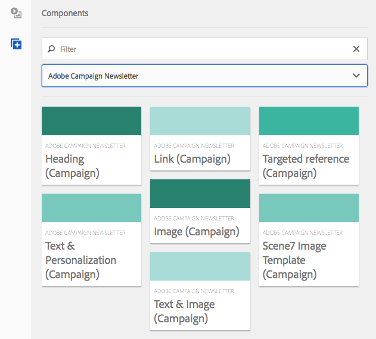

# Adobe Campaign-komponenter{#adobe-campaign-components}

När ni integrerar med Adobe Campaign finns det komponenter tillgängliga för när ni arbetar med nyhetsbrev och formulär. Båda beskrivs i det här dokumentet.

>[!CAUTION]
>
>AEM-e-postkomponenterna har tagits bort. På grund av e-postens natur, som sammanfogar innehåll och format, kommer de e-postkomponenter som tillhandahålls av AEM att ha begränsad återanvändning för kunderna eftersom de måste implementera anpassade format i de komponenter som behövs för projekten.
>
>E-postkomponenter kan implementeras på projektnivå och de inaktuella AEM-e-postkomponenterna visar hur man kan uppnå detta. Dessa inaktuella komponenter bör dock inte användas i projekt.

## Adobe Campaign Newsletter Components {#adobe-campaign-newsletter-components}

Alla Campaign-komponenter följer den bästa praxis som beskrivs i [Bästa praxis för e-postmallar](/help/sites-administering/best-practices-for-email-templates.md) och baseras på Adobes [HTML-kod](https://helpx.adobe.com/experience-manager/htl/using/overview.html).

När du öppnar ett nyhetsbrev/e-postmeddelande som är konfigurerat för integrering med Adobe Campaign bör du se följande komponenter i **Adobe Campaign Newsletter** :

* Rubrik (kampanj)
* Bild (Campaign)
* Länk (kampanj)
* Scene7 Image Template (Campaign)
* Riktad referens (Campaign)
* Text och bild (kampanj)
* Text och personalisering (Campaign)

En beskrivning av de här komponenterna finns i följande avsnitt.

Komponenterna ser ut så här:

### Rubrik (kampanj) {#heading-campaign}

Rubrikkomponenten kan antingen:

* Visa namnet på den aktuella sidan genom att lämna fältet **Titel** tomt.
* Visa en text som du anger i fältet **Titel** .

Du redigerar **rubrikkomponenten (Campaign)** direkt. Lämna tomt om du vill använda sidrubriken.

Du kan konfigurera följande:

* **Titel** Om du vill använda ett annat namn än sidrubriken anger du det här.

* **Rubriknivå (1, 2, 3, 4)** Rubriknivån som baseras på HTML-rubrikstorlekarna 1-4.

I följande exempel visas en rubrikkomponent (Campaign).

### Bild (Campaign) {#image-campaign}

Komponenten image (campaign) visar en bild och tillhörande text enligt de angivna parametrarna.

Du kan överföra en bild och sedan redigera den (till exempel beskära, rotera, lägga till länk/titel/text).

Du kan antingen dra och släppa en bild från [Resursläsaren](/help/sites-authoring/author-environment-tools.md#assetsbrowsertouchoptimizedui) direkt till komponenten eller dess [konfigurationsdialogruta](/help/sites-authoring/editing-content.md#editconfigurecopycutdeletepastetouchoptimizedui). Du kan också överföra en bild från dialogrutan Konfigurera. Den här dialogrutan styr också alla definitioner och ändringar av bilden:

>[!NOTE]
>
>Du måste ange information i fältet **Alt-text** , annars kan bilden inte sparas.

När bilden har överförts (och inte tidigare) kan du använda [redigering](/help/sites-authoring/editing-content.md#editcontenttouchoptimizedui) i stället för att beskära/rotera bilden efter behov:

>[!NOTE]
>
>I redigeraren på plats används bildens ursprungliga storlek och proportioner vid redigering. Du kan också ange höjd- och breddegenskaper. Alla storleks- och proportionsbegränsningar som definieras i egenskaperna används när du sparar redigeringsändringarna.

>Beroende på din instans kan minimi- och maximibegränsningar även anges av sidans design. dessa utvecklas under projektgenomförandet.
>
Flera ytterligare alternativ finns i helskärmsläge. till exempel mappa och zooma:

När en bild har lästs in kan du konfigurera följande:

* **Karta** Om du vill mappa en bild väljer du Karta. Du kan ange hur du vill skapa bildschemat (rektangel, polygon och så vidare) och var området ska peka.

* **Beskär** Välj Beskär för att beskära en bild. Beskär bilden med musen.

* **Rotera** om du vill rotera en bild väljer du Rotera. Använd detta upprepade gånger tills bilden roteras som du vill ha den.

* **Rensa** Ta bort den aktuella bilden.

* Zoomfält (endast klassisk)Använd bildfältet under bilden om du vill zooma in och ut i bilden (ovanför knapparna OK och Avbryt)
* **Bildens titel**.

* **Alt-text** En alternativ text som kan användas när hjälpmedelsanpassat innehåll skapas.

* **Länk till** Skapa en länk till resurser eller andra sidor på webbplatsen.

* **Beskrivning** En beskrivning av bilden.

* **Storlek** Anger bildens höjd och bredd.

>[!NOTE]
Du måste ange information i fältet **Alt-text** på fliken **Avancerat** , annars kan bilden inte sparas och följande felmeddelande visas:
`Validation failed. Verify the values of the marked fields.`

I följande exempel visas en bildkomponent (Campaign).

### Länk (kampanj) {#link-campaign}

Med komponenten Länk (Campaign) kan du lägga till en länk i nyhetsbrevet.

Du kan konfigurera följande på flikarna **Visning**, **URL-information** eller **Avancerat** :

* **Länkbeskrivning** Länkens bildtext. Det här är den text som användarna ser.

* **Länkverktygstips** Lägger till ytterligare information om hur du använder länken.

* **LinkType** I listrutan väljer du mellan en **anpassad URL** och ett **anpassat dokument**. Det här fältet är obligatoriskt. Om du väljer Anpassad URL kan du ange länkens URL. Om du väljer Adaptivt dokument kan du ange dokumentets sökväg.

* **Ytterligare URL-parameter** Lägg till ytterligare URL-parametrar. Klicka på Lägg till objekt om du vill lägga till flera objekt.

>[!NOTE]
Du måste ange information i fältet **Länktyp** på fliken **URL-information** , annars kan komponenten inte sparas och följande felmeddelande visas:
`Validation failed. Verify the values of the marked fields.`

I följande exempel visas en länkkomponent (Campaign).

### Scene7 Image Template (Campaign) {#scene-image-template-campaign}

[Scene7-bildmallar](https://help.adobe.com/en_US/scene7/using/WS60B68844-9054-4099-BF69-3DC998A04D3C.html) är lageruppbyggda bildfiler, där innehåll och egenskaper kan parametriseras för variabilitet. Med **bildmallskomponenten** kan du använda Scene7-mallar i nyhetsbrev och ändra värdena för mallparametrar. Dessutom kan ni använda Adobe Campaign-metadatavariabler inuti parametrarna, så att varje användare upplever bilden på ett personaliserat sätt.

Klicka på **Redigera** för att konfigurera komponenten. Du kan konfigurera inställningarna som beskrivs i det här avsnittet. Den här Scene7-bildmallen beskrivs i detalj i [Bildmallskomponenten](/help/assets/scene7.md#image-template)Scene7.

Dessutom visar parameterpanelen alla mallparametrar som har definierats för mallen i Scene7. För var och en av dessa parametrar kan du anpassa värdet, infoga variabler eller återställa dem till deras standardvärde.

### Riktad referens (Campaign) {#targeted-reference-campaign}

Med komponenten Målreferens (Campaign) kan du skapa en referens till ett målstycke.

I den här komponenten navigerar du till målstycket för att markera det.

Klicka på mappikonen för att navigera till stycket som du vill referera till. När du är klar klickar du på bockmarkeringen.

### Text och bild (kampanj) {#text-image-campaign}

Komponenten Text och bild (Campaign) lägger till ett textblock och en bild.

När du klickar för att konfigurera komponenten väljer du Text eller Bild.

Om du väljer **Text** visas en textbunden redigerare:

Om du väljer **Bild** visas den redigerare som är placerad för bilder:

Mer information om hur du arbetar med bilder finns i Komponenten  Bild (Campaign). Mer information om hur du arbetar med text finns i Komponenten  Text och anpassning (Campaign).

Precis som med komponenterna Text &amp; Personalization (Campaign) och Image (Campaign) kan du konfigurera:

* **Text** Ange text. Använd verktygsfältet för att ändra formatering, skapa listor och lägga till länkar.

* **Bild** Dra en bild från innehållssökaren eller klicka för att bläddra till en bild. Beskär eller rotera efter behov.

* **Bildegenskaper** (**Avancerade bildegenskaper**)Gör att du kan ange följande:

   * **Blockets titel**. visas med muspekaren.

   * **Alternativ text** visas om bilden inte kan visas.

   * **Länk till** Skapa en länk till resurser eller andra sidor på webbplatsen.

   * **Beskrivning** En beskrivning av bilden.

   * **Storlek** Anger bildens höjd och bredd.

>[!NOTE]
Fältet **Alt-text** på fliken **Avancerat** är obligatoriskt eller så kan komponenten inte spara och du ser följande felmeddelande:
`Validation failed. Verify the values of the marked fields.`

I följande exempel visas en text- och bildkomponent (Campaign).

### Text och personalisering (Campaign) {#text-personalization-campaign}

Med komponenten Text &amp; Personalization (Campaign) kan du ange ett textblock med en WYSIWYG-redigerare, med funktioner som tillhandahålls av [RTF-redigeraren](/help/sites-authoring/rich-text-editor.md). Med den här komponenten kan du dessutom använda kontextfält och personaliseringsblock som finns i Adobe Campaign; Se även [Infoga personalisering](/help/sites-authoring/campaign.md#inserting-personalization).

Om du väljer ikoner kan du formatera texten, inklusive teckensnittsegenskaper, justering, länkar, listor och indrag. Funktionen är i stort sett densamma i [båda gränssnitten](/help/sites-authoring/editing-content.md), även om utseendet och känslan är annorlunda:

I redigeraren kan du lägga till text, ändra justeringen, lägga till och ta bort länkar, lägga till kontextfält eller anpassningsblock och ange helskärmsläge. När du är klar med att lägga till text/personalisering markerar du kryssrutan för att spara ändringarna (eller x för att avbryta). Mer information finns i [Direktredigering](/help/sites-authoring/editing-content.md#editcontenttouchoptimizedui) .

>[!NOTE]
* Vilka anpassningsfält som är tillgängliga beror på vilken Adobe Campaign-mall nyhetsbrevet är länkat till.
* När du har valt en profil från ContextHub ersätts personaliseringsfälten automatiskt av data från den valda profilen.

Se [Infoga personalisering](/help/sites-authoring/campaign.md#inserting-personalization).

>[!NOTE]
Endast de fält som definieras i **nms:seedMember** -schemat eller ett av dess tillägg tas med i beräkningen. Attributen för de tabeller som är länkade till **nms:seedMember** är inte tillgängliga.

## Adobe Campaign-formulärkomponenter {#adobe-campaign-form-components}

Du använder Adobe Campaign-komponenter för att skapa ett formulär som användarna fyller i för att antingen prenumerera på ett nyhetsbrev, avbryta prenumerationen på ett nyhetsbrev eller uppdatera sina användarprofiler. Mer information finns i [Skapa Adobe Campaign-formulär](/help/sites-authoring/adobe-campaign-forms.md) .

Varje komponentfält kan länkas till ett Adobe Campaign-databasfält. De tillgängliga fälten skiljer sig åt beroende på vilken typ av data de innehåller, vilket beskrivs i avsnittet [Komponenter och Datatyp](#components-and-data-type). Om du utökar ditt mottagarschema i Adobe Campaign är de nya fälten tillgängliga i de komponenter vars datatyper matchar.

När du öppnar ett formulär som är konfigurerat att integreras med Adobe Campaign visas följande komponenter i **Adobe Campaign** -avsnittet:

* Kryssruta (kampanj)
* Datumfält (kampanj) och Datumfält/HTML5 (kampanj)
* Krypterad primärnyckel (kampanj)
* Felvisning (kampanj)
* Dold avstämningsnyckel (kampanj)
* Numeriskt fält (kampanj)
* Alternativfält (kampanj)
* Checklista för prenumerationer (kampanj)
* Textfält (kampanj)

Komponenterna ser ut så här:

I det här avsnittet beskrivs varje komponent i detalj.

### Komponenter och datatyp {#components-and-data-type}

I följande tabell beskrivs de komponenter som är tillgängliga för att visa och ändra Adobe Campaign-profildata. Varje komponent kan mappas till ett Adobe Campaign-profilfält för att visa dess värde och uppdatera fältet när formuläret skickas. De olika komponenterna kan bara matchas mot fält av lämplig datatyp.

<table>
 <tbody>
  <tr>
   <td>
<strong>Komponent</strong>
 </td>
   <td>
<strong>Datatyp för Adobe Campaign-fältet</strong>
 </td>
   <td>
<strong>Exempelfält</strong>
 </td>
  </tr>
  <tr>
   <td>
Kryssruta (kampanj)
 </td>
   <td>
boolean
 </td>
   <td>
Inte längre kontakt (via någon kanal)
 </td>
  </tr>
  <tr>
   <td>
Datumfält (kampanj)
 
Datumfält/HTML 5 (kampanj)
 </td>
   <td>
date
 </td>
   <td>
Födelsedatum
 </td>
  </tr>
  <tr>
   <td>
Numeriskt fält (kampanj)
 </td>
   <td>
numerisk (byte, short, long, double)
 </td>
   <td>
Ålder
 </td>
  </tr>
  <tr>
   <td>
Alternativfält (kampanj)
 </td>
   <td>
byte med associerade värden
 </td>
   <td>
Kön
 </td>
  </tr>
  <tr>
   <td>
Textfält (kampanj)
 </td>
   <td>
string
 </td>
   <td>
E-post
 </td>
  </tr>
 </tbody>
</table>

### Inställningar som är gemensamma för de flesta komponenter {#settings-common-to-most-components}

Adobe Campaign-komponenterna har inställningar som är gemensamma för alla komponenter (förutom komponenterna Encrypted Primary Key och Hidden Reconcilation Key).

I de flesta komponenter kan du konfigurera följande:

#### Titel och text {#title-and-text}

* **Titel** Om du vill använda ett annat namn än elementnamnet anger du det här.

* **Dölj rubrik** Markera den här kryssrutan om du inte vill att titeln ska vara synlig.

* **Beskrivning** Lägg till en beskrivning i fältet för att ge mer information för användarna.

* **Visa endast värdet** om det finns ett

#### Adobe Campaign {#adobe-campaign}

Du kan konfigurera följande:

* **Mappning** Välj ett personaliseringsfält för Adobe Campaign, om det är lämpligt.

* **Avstämningsnyckel** Markera den här kryssrutan om det här fältet är en del av avstämningsnyckeln.

#### Begränsningar {#constraints}

* **Obligatoriskt** Markera den här kryssrutan för att göra den här komponenten obligatorisk. alltså måste användaren ange ett värde.
* **Obligatoriskt meddelande** . Lägg till ett meddelande om att fältet är obligatoriskt.

#### Stilar {#styling}

* **CSS** Ange de CSS-klasser som du vill använda för den här komponenten.

### Kryssruta (kampanj) {#checkbox-campaign}

Med komponenten Kryssruta (Campaign) kan användaren ändra Adobe Campaign-profilfält som är av boolesk datatyp. Du kan till exempel ha en kryssrutekomponent (Campaign) som gör att mottagaren kan ange att han eller hon inte vill bli kontaktad via någon kanal.

Du kan [konfigurera inställningar som är gemensamma för de flesta Adobe Campaign-komponenter](#settings-common-to-most-components) i kryssrutekomponenten (Campaign).

I följande exempel visas en CheckBox-komponent (Campaign).

### Datumfält (kampanj) och Datumfält/HTML 5 (kampanj) {#date-field-campaign-and-date-field-html-campaign}

Använd datumfältet för att tillåta mottagarna att ange ett datum, Du kanske till exempel vill att mottagarna ska ange sina födelsedatum. Datumformatet matchar formatet som används i Adobe Campaign-instansen.

Förutom de [inställningar som är gemensamma för de flesta Adobe Campaign-komponenter](#settings-common-to-most-components)kan du konfigurera följande:

* **Begränsningar - listrutan Begränsning** Du kan välja **Ingen** eller **Datum -** om du vill lägga till begränsningen för ett datum eller ingen begränsning. Om du väljer ett datum måste de svar som användarna anger i fältet ha ett datumformat.

* **Begränsningsmeddelande** Dessutom kan du lägga till ett begränsningsmeddelande så att användarna vet hur de formaterar sina svar korrekt.
* **Format - Bredd** Justera fältets bredd genom att klicka eller trycka på **+** och **-** ikonerna eller genom att ange ett tal.

I följande exempel visas en datumfältskomponent (Campaign) där bredden justeras.

### Krypterad primärnyckel (kampanj) {#encrypted-primary-key-campaign}

Den här komponenten definierar namnet på URL-parametern som ska innehålla identifieraren för en Adobe Campaign-profil (**Main Resource Identifier** eller **Encrypted primary key** in Adobe Campaign Standard and 6.1).

Varje formulär som visar och ändrar Adobe Campaign-profildata **måste** innehålla en krypterad primärnyckelkomponent.

Du kan konfigurera följande i komponenten Encrypted Primary Key (Campaign):

* **Titel och text - Elementnamnet** är som standard encryptedPK. Du behöver bara ändra elementnamnet när det står i konflikt med namnet på ett annat element i formuläret. Två formulärfält kan inte ha samma elementnamn.
* **Adobe Campaign - URL-parameter** Lägg till URL-parametern för EPK. Du kan till exempel använda värdet **epk**.

I följande exempel visas en krypterad primärnyckelkomponent (Campaign).

### Felvisning (kampanj) {#error-display-campaign}

Med den här komponenten kan du visa serverdelsfel. Formulärets felhantering måste ställas in på Framåt för att komponenten ska fungera ordentligt.

I följande exempel visas en felvisningskomponent (Campaign).

### Dold avstämningsnyckel (kampanj) {#hidden-reconciliation-key-campaign}

Med komponenten Dold avstämningsnyckel (Campaign) kan du lägga till dolda fält som en del av avstämningsnyckeln i ett formulär.

Du kan konfigurera följande i komponenten Dold avstämningsnyckel (Campaign):

* **Titel och text - Elementnamnet** är som standard concilKey. Du behöver bara ändra elementnamnet när det står i konflikt med namnet på ett annat element i formuläret. Två formulärfält kan inte ha samma elementnamn.
* **Adobe Campaign - Mappa** kartor till ett personaliseringsfält för Adobe Campaign.

I följande exempel visas en komponent för dold avstämningsnyckel (Campaign).

### Numeriskt fält (kampanj) {#numeric-field-campaign}

Använd det numeriska fältet för att tillåta mottagarna att ange siffror, till exempel deras ålder.

Förutom de [inställningar som är gemensamma för de flesta Adobe Campaign-komponenter](#settings-common-to-most-components)kan du konfigurera följande:

* **Begränsningar - listrutan Begränsning** Du kan välja **Ingen** eller **Numerisk -** om du vill lägga till begränsningen för ett tal eller ingen begränsning. Om du väljer siffra måste de svar som användarna anger i fältet vara numeriska.

* **Begränsningsmeddelande** Dessutom kan du lägga till ett begränsningsmeddelande så att användarna vet hur de formaterar sina svar korrekt.
* **Format - Bredd** Justera fältets bredd genom att klicka eller trycka på **+** och **-** ikonerna eller genom att ange ett tal.

I följande exempel visas en Numeric Field-komponent (Campaign) med den konfigurerade bredden.

### Alternativfält (kampanj) {#option-field-campaign}

I den här nedrullningsbara listan kan du välja ett alternativ; till exempel en mottagares kön eller status.

Du kan [konfigurera inställningar som är gemensamma för de flesta Adobe Campaign-komponenter](#settings-common-to-most-components) i alternativfältskomponenten (Campaign). Om du vill fylla i den nedrullningsbara listan väljer du lämpligt fält i Adobe Campaign-anpassningsfälten genom att klicka eller trycka på Adobe Campaign-symbolen och navigera till fältet.

I följande exempel visas en alternativfältskomponent (Campaign).

### Checklista för prenumerationer (kampanj) {#subscriptions-checklist-campaign}

Använd komponenten **Checklista för prenumerationer (Campaign)** om du vill ändra de prenumerationer som är kopplade till en Adobe Campaign-profil.

När den här komponenten läggs till i ett formulär visas alla tillgängliga prenumerationer som kryssrutor där användaren kan välja önskad prenumeration. När användare skickar formuläret prenumererar den här komponenten på användaren eller avbryter prenumerationen på de valda tjänsterna beroende på typ av formuläråtgärd (**Adobe Campaign: Prenumerera på Services** eller **Adobe Campaign: Avbeställ tjänsterna**).

>[!NOTE]
Komponenten kontrollerar inte vilka tjänster användaren redan prenumererar på/avbeställer.

Du kan [konfigurera inställningar som är gemensamma för de flesta Adobe Campaign-komponenter](#settings-common-to-most-components) i komponenten Checklista för prenumerationer (Campaign). (Det finns inga Adobe Campaign-konfigurationer tillgängliga för den här komponenten.)

I följande exempel visas en komponent för checklista för prenumerationer (Campaign).

### Textfält (kampanj) {#text-field-campaign}

Komponenten Textfält (Campaign) som gör att du kan ange strängtypsdata, t.ex. förnamn, efternamn, adress, e-postadress osv.

Förutom de [inställningar som är gemensamma för de flesta Adobe Campaign-komponenter](#settings-common-to-most-components)kan du konfigurera följande:

* **Begränsningar - listrutan Begränsning** Du kan välja - **Ingen,** **E-post** eller **Namn** (inga omljud) - om du vill lägga till begränsningen för en e-postadress, ett namn eller ingen begränsning. Om du väljer e-postadress måste det svar som användarna anger i fältet vara en e-postadress. Om du väljer ett namn måste det vara ett namn (omljud tillåts inte).

* **Begränsningsmeddelande** Dessutom kan du lägga till ett begränsningsmeddelande så att användarna vet hur de formaterar sina svar korrekt.
* **Format - Bredd** Justera fältets bredd genom att klicka eller trycka på **+** och **-** ikonerna eller genom att ange ett tal.

I följande exempel visas en textfältskomponent (Campaign).

