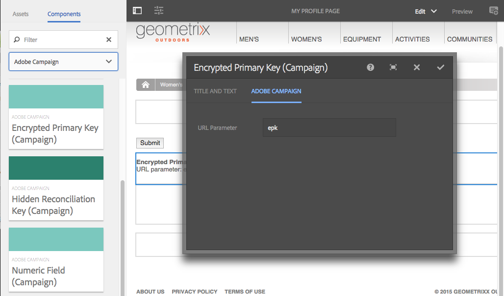

# Skapa Adobe Campaign Forms i AEM {#creating-adobe-campaign-forms-in-aem}

Med AEM kan du skapa och använda formulär som interagerar med Adobe Campaign på din webbplats. Specifika fält kan infogas i formulären och mappas till Adobe Campaign-databasen.

Du kan hantera nya kontaktprenumerationer, avbeställningar och användarprofildata samtidigt som du integrerar deras data i din Adobe Campaign-databas.

Om du vill använda Adobe Campaign-formulär i AEM måste du följa de här stegen som beskrivs i det här dokumentet:

1. Gör en mall tillgänglig.
1. Skapa ett formulär.
1. Redigera formulärinnehåll.

Tre typer av formulär som är specifika för Adobe Campaign är tillgängliga som standard:

* Spara en profil
* Prenumerera på en tjänst
* Avbeställ en tjänst

Dessa formulär definierar en URL-parameter som godkänner den krypterade primärnyckeln för en Adobe Campaign-profil. Baserat på den här URL-parametern uppdaterar formuläret data i den associerade Adobe Campaign-profilen.

Även om du skapar de här formulären oberoende av varandra, genererar du i ett vanligt fall en personlig länk till en formulärsida i nyhetsbrevets innehåll, så att mottagarna kan öppna länken och göra ändringar i profildata (oavsett om de avregistrerar, prenumererar eller uppdaterar deras profil).

Formuläret uppdateras automatiskt baserat på användaren. Se [Redigera formulärinnehåll](#editing-form-content) för mer information.

## Göra en mall tillgänglig {#making-a-template-available}

Innan du kan skapa formulär som är specifika för Adobe Campaign måste du göra de olika mallarna tillgängliga i ditt AEM.

Om du vill göra det går du till [Dokumentation för mallar](/help/sites-developing/templates.md#template-availability).

## Skapa ett formulär {#creating-a-form}

Först och främst bör du kontrollera anslutningen mellan författaren och publicera instanser så fungerar Adobe Campaign. Se [Integrera med Adobe Campaign Standard](/help/sites-administering/campaignstandard.md) eller [Integrera med Adobe Campaign Classic](/help/sites-administering/campaignonpremise.md).

>[!NOTE]
>
>Se till att **acMapping** på sidans **jcr:innehåll** noden är inställd på **mapRecipient** eller **profil** när du använder Adobe Campaign Classic eller Adobe Campaign Standard

1. I AEM navigerar du till den plats där du vill skapa en ny sida.
1. Skapa en sida och markera **Adobe Campaign Classic-profil** eller **Adobe Campaign Standard-profil** och klicka **Nästa**.

   

   >[!NOTE]
   >
   >Om den önskade mallen inte är tillgänglig går du till [Malltillgänglighet](/help/sites-developing/templates.md#template-availability).

1. I **Namn** lägger du till sidans namn. Det måste vara ett giltigt JCR-namn.
1. I **Titel** ange en titel och klicka på **Skapa**.
1. Öppna sidan och markera **Öppna egenskaper** och i Cloud Services lägger du till Adobe Campaign-konfigurationen och markerar kryssrutan för att spara ändringarna.

   

1. På sidan, i **Formulärstart** väljer du den typ av formulär det är - **Prenumerera, avbeställ,** eller **Spara profil**. Du kan bara ha en typ per formulär. Nu kan du [redigera formulärets innehåll](#editing-form-content).

## Redigera formulärinnehåll {#editing-form-content}

Forms som riktar sig till Adobe Campaign har specifika komponenter. Dessa komponenter har ett alternativ som gör att du kan länka varje fält i formuläret till ett fält i Adobe Campaign-databasen.

>[!NOTE]
>
>Om den önskade mallen inte är tillgänglig går du till [Göra en mall tillgänglig](/help/sites-authoring/adobe-campaign.md).

I det här avsnittet beskrivs endast specifika länkar till Adobe Campaign. Mer information om hur du använder formulär i Adobe Experience Manager finns i [Redigeringslägeskomponenter](/help/sites-authoring/default-components-foundation.md).

1. Välj **Öppna egenskaper** och i Cloud Services lägger du till Adobe Campaign-konfigurationen och markerar kryssrutan för att spara ändringarna.

   

1. På sidan, i **Formulärstart** klickar du på ikonen Konfiguration.

   

1. Klicka på **Avancerat** och väljer typ av formulär - **Prenumerera, avbeställ,** eller **Spara profil** och klicka **OK.** Du kan bara ha en typ per formulär.

   * **Adobe Campaign: Spara profil**: Med kan du skapa eller uppdatera en mottagare i Adobe Campaign (standardvärde).
   * **Adobe Campaign: Prenumerera på tjänster**: gör att du kan hantera prenumerationer för en mottagare i Adobe Campaign.
   * **Adobe Campaign: Avbeställ Services**: Med kan du avbryta prenumerationer på en mottagare i Adobe Campaign.

1. Du måste ha en **Krypterad primärnyckel** -komponenten i varje formulär. Den här komponenten definierar vilken URL-parameter som ska användas för att acceptera den krypterade primärnyckeln för en Adobe Campaign-profil. I Komponenter väljer du Adobe Campaign så att bara de komponenterna visas.
1. Dra komponenten **Krypterad primärnyckel** till formuläret (var som helst) och klicka eller tryck på **Konfiguration** ikon. I **Adobe Campaign** anger du ett namn för URL-parametern. Klicka eller tryck på bockmarkeringen för att spara ändringarna.

   Genererade länkar till det här formuläret måste använda den här URL-parametern och tilldela den krypterade primärnyckeln till en Adobe Campaign-profil. Den krypterade primärnyckeln måste vara rätt URL-kodad (procent).

   

1. Lägg till komponenter i formuläret efter behov, t.ex. textfält, datumfält, kryssrutefält, alternativfält osv. Se [Adobe Campaign Form Components](/help/sites-authoring/adobe-campaign-components.md) för mer information om varje komponent.
1. Klicka på ikonen Konfiguration för att öppna komponenten. I **Textfält (kampanj)** ändrar du titeln och texten.

   Klicka **Adobe Campaign** för att mappa formulärfältet till en Adobe Campaign-metadatavariabel. När du skickar formuläret uppdateras det mappade fältet i Adobe Campaign. Endast fält med matchande typer är tillgängliga i variabelväljaren (till exempel strängvariabler för textfält).

   

   >[!NOTE]
   >
   >Du kan lägga till/ta bort fält som visas i mottagartabellen genom att följa instruktionerna här: [https://blogs.adobe.com/experiencedelivers/experience-management/aem-campaign-integration/](https://blogs.adobe.com/experiencedelivers/experience-management/aem-campaign-integration/)

1. Klicka **Publicera sida**. Sidan aktiveras på din webbplats. Du kan visa den genom att gå till AEM. Du kan också [testa ett formulär](#testing-a-form).

   >[!CAUTION]
   >
   >Du måste ange läsbehörigheter till den anonyma användaren i molntjänsten för att kunna använda formulär vid publicering. Tänk dock på de potentiella säkerhetsproblemen med att ge läsbehörigheter till den anonyma användaren och se till att minska risken genom att till exempel konfigurera dispatchern.

## Testa ett formulär {#testing-a-form}

När du har skapat ett formulär och redigerat formulärinnehållet kanske du vill testa att formuläret fungerar som det ska.

>[!NOTE]
>
>Du måste ha en **Krypterad primärnyckel** -komponenten i varje formulär. I Komponenter väljer du Adobe Campaign så att bara de komponenterna visas.
>
>I den här proceduren anger du telefonnumret manuellt, men i praktiken får användarna en länk till den här sidan (om de vill avbeställa, prenumerera eller uppdatera din profil) i ett nyhetsbrev. Paketet uppdateras automatiskt beroende på användaren.
>
>Om du vill skapa länken använder du variabeln **Identifierare för huvudresurs**(Adobe Campaign Standard) eller **Krypterad identifierare** (Adobe Campaign Classic) (t.ex. i en **Text och personalisering (Campaign)** ) som länkar till sidorna i Adobe Campaign.

Om du vill göra det måste du hämta EPK-filen för en Adobe Campaign-profil manuellt och sedan bifoga den till webbadressen:

1. Så här hämtar du den krypterade primärnyckeln (EPK) för en Adobe Campaign-profil:

   * I Adobe Campaign Standard - Navigera till **Profiler och målgrupper** > **Profiler**, som listar de befintliga profilerna. Se till att tabellen visar **Identifierare för huvudresurs** fält i en kolumn (detta kan konfigureras genom att klicka/trycka på **Konfigurera lista**). Kopiera huvudresursidentifieraren för den önskade profilen.
   * I Adobe Campaign Classic går du till **Profiler och mål** >  **Mottagare**, som listar de befintliga profilerna. Se till att tabellen visar **Krypterad identifierare** fält i en kolumn (Detta kan konfigureras genom att högerklicka på en post och välja **Konfigurera lista...**). Kopiera den krypterade identifieraren för den önskade profilen.

1. I AEM öppnar du formulärsidan i publiceringsinstansen och lägger till EPK från steg 1 som en URL-parameter: Använd samma namn som du tidigare definierade i EPK-komponenten när du redigerar formuläret (till exempel: `?epk=...`)
1. Formuläret kan nu användas för att ändra data och prenumerationer som är kopplade till den länkade Adobe Campaign-profilen. När du har ändrat vissa fält och skickat in formuläret kan du verifiera i Adobe Campaign att data har uppdaterats.

Data i Adobe Campaign-databasen uppdateras när ett formulär har validerats.
