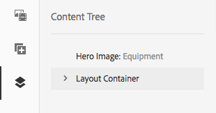

# Redigering - miljö och verktyg{#authoring-the-environment-and-tools}

I redigeringsmiljön i AEM finns olika sätt att ordna och redigera ditt innehåll. Verktygen som tillhandahålls är tillgängliga från olika konsoler och sidredigerare.

## Hantera din webbplats {#managing-your-site}

Med **platskonsolen** kan du navigera och hantera webbplatsen med hjälp av sidhuvudsfältet, verktygsfältet, åtgärdsikonerna (gäller för den valda resursen), vägbeskrivningar och, när du väljer det, sekundära spår (t.ex. tidslinje och referenser).

Till exempel kolumnvy:

## Redigera sidinnehåll {#editing-page-content}

Du kan redigera en sida med sidredigeraren. Exempel:

`https://localhost:4502/editor.html/content/we-retail/us/en/equipment.html`

>[!NOTE]
>
>Första gången du öppnar en sida för redigering visas en serie bilder med en genomgång av funktionerna.
>
>Du kan när som helst hoppa över genomgången och upprepa den genom att välja **Sidinformation** på menyn.

## Få hjälp {#accessing-help}

När du redigerar en sida kan du komma åt **hjälpen** från:

* Väljaren för [**sidinformation **](/help/sites-authoring/editing-page-properties.md#page-properties). Då visas introduktionsbilderna (som visas första gången du öppnar redigeraren).
* dialogrutan för [konfiguration](/help/sites-authoring/editing-content.md#edit-configure-copy-cut-delete-paste) av specifika komponenter (med ? ikon i dialogrutans verktygsfält); detta visar sammanhangsberoende hjälp.

Ytterligare [hjälprelaterade resurser finns på konsoler](/help/sites-authoring/basic-handling.md#accessing-help).

## Komponentbläddraren {#components-browser}

Komponentwebbläsaren visar alla komponenter som är tillgängliga för användning på den aktuella sidan. Dessa kan dras till rätt plats och sedan redigeras för att lägga till ditt innehåll.

Komponentwebbläsaren är en flik i sidopanelen (tillsammans med [resursläsaren](/help/sites-authoring/author-environment-tools.md#assets-browser) och [innehållsträdet](/help/sites-authoring/author-environment-tools.md#content-tree)). Om du vill öppna (eller stänga) sidopanelen använder du ikonen längst upp till vänster i verktygsfältet:

När du öppnar sidopanelen öppnas den från vänster sida (välj fliken **Komponenter** om det behövs). När du är öppen kan du bläddra igenom alla komponenter som är tillgängliga för sidan.

Det faktiska utseendet och hanteringen beror på vilken enhetstyp du använder:

>[!NOTE]
>
>En mobil enhet identifieras när bredden är mindre än 1 024 pixlar. Detta kan även vara fallet för ett litet skrivbordsfönster.

* **Mobil enhet (t.ex. iPad)**

   Komponentwebbläsaren täcker hela sidan som redigeras.

   Om du vill lägga till en komponent på sidan trycker du på och håller ned den nödvändiga komponenten och flyttar den åt höger. Komponentwebbläsaren stängs och sidan visas igen, där du kan placera komponenten.

   

* **Skrivbordsenhet**

   Komponentwebbläsaren öppnas till vänster i fönstret.

   Om du vill lägga till en komponent på sidan klickar du på den önskade komponenten och drar den till önskad plats.

   

   Komponenterna representeras av

   * Komponentnamn
   * Komponentgrupp (i grått)
   * Ikon eller förkortning

      * Standardkomponentens ikoner är monokroma.
      * Förkortningar är alltid de två första tecknen i komponentnamnet.
   I det övre verktygsfältet i **komponentwebbläsaren** kan du:

   * Filtrera komponenter efter namn.
   * Begränsa visningen till en viss grupp med listrutan.
   Om du vill ha en mer detaljerad beskrivning av komponenten kan du klicka eller trycka på informationsikonen bredvid komponenten i **komponentwebbläsaren** (om den är tillgänglig). För **layoutbehållaren**:

   

   Mer information om de komponenter som är tillgängliga finns i [komponentkonsolen](/help/sites-authoring/default-components-console.md).

## Resursläsaren {#assets-browser}

Resursläsaren visar alla [resurser](/help/assets/home.md) som är tillgängliga för direkt användning på den aktuella sidan.

Resursläsaren är en flik i sidopanelen tillsammans med [komponenternas](/help/sites-authoring/author-environment-tools.md#components-browser)webbläsare och [innehållsträd](/help/sites-authoring/author-environment-tools.md#content-tree). Om du vill öppna eller stänga sidopanelen använder du ikonen längst upp till vänster i verktygsfältet:

När du öppnar sidopanelen öppnas den från vänster sida. Välj vid behov fliken **Resurser** .

När resursläsaren är öppen kan du bläddra bland alla resurser som är tillgängliga för sidan. Oändlig rullning används för att expandera listan vid behov.

Om du vill lägga till en resurs på sidan markerar och drar du den till önskad plats. Detta kan vara:

* En befintlig komponent av lämplig typ.

   * Du kan till exempel dra en resurs av typen bild till en bildkomponent.

* En [platshållare](/help/sites-authoring/editing-content.md#component-placeholder) i styckesystemet som skapar en ny komponent av lämplig typ.

   * Du kan till exempel dra en resurs av typen bild till styckesystemet för att skapa en bildkomponent.

>[!NOTE]
>
>Detta är tillgängligt för specifika resurser och komponenttyper. Mer information finns i [Infoga en komponent med Resursläsaren](/help/sites-authoring/editing-content.md#inserting-a-component-using-the-assets-browser) .

I det övre verktygsfältet i resursläsaren kan du filtrera resurserna efter:

* Namn
* Bana
* Resurstyp som bilder, manuskript, dokument, videor, sidor, stycken och produkter
* Resursegenskaper som Orientation (stående, liggande, fyrkantig) och Style (färg, monokrom, gråskala)

   * Endast tillgängligt för vissa tillgångstyper

Det faktiska utseendet och hanteringen beror på vilken enhetstyp du använder:

>[!NOTE]
>
>En mobil enhet upptäcks när bredden är mindre än 1024px. dvs. även i ett litet skrivbordsfönster.

* **Mobil enhet som iPad**

   Resursläsaren täcker hela sidan som redigeras.

   Om du vill lägga till en resurs på sidan håller du pekaren över den resurs du behöver och sedan flyttar den åt höger. Resursläsaren stängs och sidan visas igen, där du kan lägga till resursen i den nödvändiga komponenten.

   

* **Skrivbordsenhet**

   Resursläsaren öppnas till vänster i fönstret.

   Om du vill lägga till en resurs på sidan klickar du på den önskade resursen och drar den till önskad komponent eller plats.

   

Om du snabbt behöver göra en ändring i en resurs kan du starta [resursredigeraren](/help/assets/managing-assets-touch-ui.md) direkt från resursläsaren genom att klicka på redigeringsikonen som visas bredvid resursens namn.

## Innehållsträd {#content-tree}

Med **innehållsträdet** får du en översikt över alla komponenter på sidan i en hierarki så att du snabbt kan se hur sidan är uppbyggd.

Innehållsträdet är en flik i sidopanelen (tillsammans med komponenterna och resursläsaren). Om du vill öppna (eller stänga) sidopanelen använder du ikonen längst upp till vänster i verktygsfältet:

När du öppnar sidopanelen öppnas den (från vänster sida). Välj vid behov fliken **Innehållsträd** . När den är öppen kan du se en trädvyrepresentation av sidan eller mallen, så att det blir lättare att förstå hur innehållet är hierarkiskt strukturerat. På en komplex sida är det dessutom enklare att växla mellan sidans komponenter.

En sida kan enkelt bestå av många av samma typ av komponenter, så innehållsträdet (komponentträdet) visar beskrivande text (i grått) efter komponenttypens namn (i svart). Den beskrivande texten kommer från vanliga egenskaper för komponenten, t.ex. rubrik eller text.

Komponenttyper visas på användarspråket, medan komponentbeskrivningstexten kommer från sidspråket.

Om du klickar på markören bredvid en komponent kommer den nivån att komprimeras eller utökas.

>[!NOTE]
>
>Innehållsträdet är inte tillgängligt om du redigerar en sida på en mobil enhet (om webbläsarbredden är mindre än 1024px).

Om du klickar på komponenten markeras komponenten i sidredigeraren. Vilka åtgärder som är tillgängliga beror på sidstatus:

* En grundsida:

   `https://localhost:4502/editor.html/content/we-retail/language-masters/en/equipment.html`

   

   Om komponenten som du klickar på i trädet är redigerbar visas en skiftnyckelsikon till höger om namnet. Om du klickar på den här ikonen öppnas redigeringsdialogrutan för komponenten.

   

* Eller en sida som ingår i en [livecopy](/help/sites-administering/msm.md), där komponenterna ärvs från en annan sida, till exempel:

   `https://localhost:4502/editor.html/content/we-retail/us/en/equipment.html`

   

## Fragment - Associerad innehållsläsare {#fragments-associated-content-browser}

Om sidan innehåller innehållsfragment får du även åtkomst till [webbläsaren för associerat innehåll](/help/sites-authoring/content-fragments.md#using-associated-content).

## Referenser {#references}

**Referenser** visar anslutningar till den valda sidan:

* Blueprints
* Startar
* Live-kopior
* Språkversioner
* Inkommande länkar
* Användning av referenskomponenten: lånat och lånat innehåll
* Referenser till produktsidor (från Commerce - Products-konsolen)

Öppna den nödvändiga konsolen, navigera sedan till den önskade resursen och öppna **referenser** med:

[Välj den resurs](/help/sites-authoring/basic-handling.md#viewing-and-selecting-resources) du vill använda för att visa en lista över referenstyper som är relevanta för resursen:

Välj lämplig referenstyp för mer information. I vissa situationer är ytterligare åtgärder tillgängliga när du väljer en specifik referens, bland annat:

* **Inkommande länkar** innehåller en lista med sidor som refererar till sidan, tillsammans med direktåtkomst till **Redigera** en av dessa sidor när du markerar en viss länk

* Instanser av lånat och lånat innehåll med hjälp av komponenten **Reference** , härifrån kan du navigera till den refererande/refererade sidan

* [Referenser till produktsidor](/help/sites-administering/generic.md#showing-product-references) (finns i Commerce-Products-konsolen)
* [Startar](/help/sites-authoring/launches.md), ger åtkomst till relaterade starter
* [Live-kopior](/help/sites-administering/msm.md) visar sökvägarna för alla live-kopior som baseras på den valda resursen.
* [utkast](/help/sites-administering/msm-best-practices.md), innehåller information och olika åtgärder
* [Språk Kopior](/help/sites-administering/tc-manage.md#creating-translation-projects-using-the-references-panel), innehåller information och olika åtgärder

Du kan till exempel korrigera en bruten referens i en Reference-komponent:

## Händelser - Tidslinje {#events-timeline}

För lämpliga resurser (t.ex. sidor från konsolen **Platser** eller resurser från konsolen **Resurser** ) kan [tidslinjen användas för att visa den senaste aktiviteten för valda objekt](/help/sites-authoring/basic-handling.md#timeline).

Öppna den nödvändiga konsolen, navigera sedan till önskad resurs och öppna **tidslinjen** med:

[Välj önskad resurs](/help/sites-authoring/basic-handling.md#viewing-and-selecting-resources)och **visa sedan alla** eller **aktiviteter** för att lista alla senaste åtgärder för de valda resurserna:

## Sidinformation {#page-information}

Sidinformation (ikonen för utjämning) öppnar en meny som även innehåller information om den senaste redigeringen och det senaste dokumentet. Beroende på sidans egenskaper, dess plats och din instans kan det finnas fler eller färre alternativ:

* [Öppna egenskaper](/help/sites-authoring/editing-page-properties.md)
* [Utrullningssida](/help/sites-administering/msm.md#msm-from-the-ui)
* [Starta arbetsflöde](/help/sites-authoring/workflows-applying.md#starting-a-workflow-from-the-page-editor)
* [Lås sida](/help/sites-authoring/editing-content.md#locking-a-page)
* [Publicera sida](/help/sites-authoring/publishing-pages.md#main-pars-title-10)
* [Avpublicera sida](/help/sites-authoring/publishing-pages.md#main-pars-title-5)
* [Redigera mall](/help/sites-authoring/templates.md); när sidan är baserad på en [redigerbar mall](/help/sites-authoring/templates.md#editable-and-static-templates)

* [Visa som publicerad](/help/sites-authoring/editing-content.md#view-as-published)
* [Visa i Admin](/help/sites-authoring/basic-handling.md#viewing-and-selecting-resources)
* [Hjälp](/help/sites-authoring/basic-handling.md#accessing-help)

Exempel: **Sidinformation** har även följande alternativ:

* [Befordra Launch](/help/sites-authoring/launches-promoting.md) om sidan är en start.
* [Öppna i Classic UI](/help/sites-authoring/select-ui.md#switching-to-classic-ui-when-editing-a-page) om det här alternativet har [aktiverats av en administratör](/help/sites-administering/enable-classic-ui-editor.md)

Dessutom kan **sidinformation** ge tillgång till analyser och rekommendationer, när det är lämpligt.

## Sidlägen {#page-modes}

Det finns olika lägen när du redigerar en sida som tillåter olika åtgärder:

* [Redigera](/help/sites-authoring/editing-content.md) - det läge som ska användas när sidinnehållet redigeras.
* [Layout](/help/sites-authoring/responsive-layout.md) - gör att du kan skapa och redigera din responsiva layout beroende på enhet (om sidan baseras på en layoutbehållare)

* [Skolning](/help/sites-authoring/scaffolding.md) - hjälper dig att skapa en stor uppsättning sidor som har samma struktur men olika innehåll.
* [Utvecklare](/help/sites-developing/developer-mode.md) - gör att du kan utföra olika åtgärder (kräver behörighet). Dessa omfattar granskning av den tekniska informationen på en sida och dess komponenter.

* [Design](/help/sites-authoring/default-components-designmode.md) - gör att du kan aktivera/inaktivera komponenter för användning på en sida och konfigurera komponentens design (om sidan är baserad på en [statisk mall](/help/sites-authoring/templates.md#editable-and-static-templates)).

* [Målinriktning](/help/sites-authoring/content-targeting-touch.md) - öka innehållets relevans genom målinriktning och mätning i alla kanaler.
* [Activity Map](/help/sites-authoring/page-analytics-using.md#analyticsvisiblefromthepageeditor) - visar analysdata för sidan.

* [Timewarp](/help/sites-authoring/working-with-page-versions.md#timewarp) - gör att du kan visa ett sidläge vid en viss tidpunkt.
* [Live Copy-status](/help/sites-authoring/editing-content.md#live-copy-status) - ger en snabb översikt av live-kopians status och vilka komponenter som ärvs/inte ärvs.
* [Förhandsgranska](/help/sites-authoring/editing-content.md#previewing-pages) - används för att visa sidan så som den kommer att visas i publiceringsmiljön. eller navigera med hjälp av länkar i innehållet.

* [Anteckning](/help/sites-authoring/annotations.md) - används för att lägga till eller visa anteckningar på sidan.

Du kommer åt dem med hjälp av ikonerna i det övre högra hörnet. Den faktiska ikonen ändras för att återspegla det läge som du använder för närvarande:

>[!NOTE]
>
>* Beroende på sidans egenskaper kanske vissa lägen inte är tillgängliga.
>* Åtkomst till vissa lägen kräver lämplig behörighet/behörighet.
>* Utvecklarläget är inte tillgängligt på mobila enheter på grund av utrymmesbegränsningar.
>* Det finns ett [kortkommando](/help/sites-authoring/page-authoring-keyboard-shortcuts.md) ( `Ctrl-Shift-M`) som du kan använda för att växla mellan **förhandsvisning** och det aktuella läget (t.ex. **Redigera**, **Layout**).
>

## Banmarkering {#path-selection}

När du redigerar är det ofta nödvändigt att välja en annan resurs, till exempel när du definierar en länk till en annan sida eller resurs eller markerar en bild. För att det ska vara enkelt att välja en sökväg kan du fylla i [sökvägsfälten](/help/sites-authoring/author-environment-tools.md#path-fields) automatiskt och med [sökvägsläsaren](/help/sites-authoring/author-environment-tools.md#path-browser) kan du göra ett mer robust val.

### Sökvägsfält {#path-fields}

Det exempel som används här för att illustrera är bildkomponenten. Mer information om hur du använder och redigerar komponenter finns i [Komponenter för sidredigering](/help/sites-authoring/default-components.md).

Sökvägsfält har automatisk komplettering och framåtblickande funktioner som gör det enklare att hitta en resurs.

Om du klickar på knappen **Öppna dialogrutan** för markering i sökvägsfältet öppnas dialogrutan [för sökvägsläsaren](/help/sites-authoring/author-environment-tools.md#path-browser) så att du kan använda mer detaljerade markeringsalternativ.

Du kan också börja skriva i sökvägsfältet så kommer AEM att erbjuda matchande sökvägar när du skriver.

### Sökvägsläsaren {#path-browser}

Sökvägsläsaren är organiserad som [kolumnvyn](/help/sites-authoring/basic-handling.md#column-view) i webbplatskonsolen, vilket ger ett mer detaljerat urval av resurser.

* När en resurs har valts aktiveras knappen **Välj** i dialogrutans övre högra hörn. Klicka eller tryck för att bekräfta markeringen eller **Avbryt** för att avbryta.
* Om kontexten tillåter val av flera resurser aktiveras även knappen **Välj** när du väljer en resurs, men även antalet markerade resurser läggs till i fönstrets övre högra hörn. Klicka på **X** bredvid talet för att avmarkera alla.
* När du navigerar genom trädet visas platsen i de synliga kolumnerna högst upp i dialogrutan. Dessa vägbeskrivningar kan också användas för att snabbt hoppa in i resurshierarkin.
* Du kan när som helst använda sökfältet högst upp i dialogrutan. Klicka på **X** i sökfältet för att rensa sökningen.
* Om du vill begränsa sökningen kan du visa filteralternativen och filtrera resultaten baserat på en viss bana.

   

## Kortkommandon {#keyboard-shortcuts}

Det finns olika [kortkommandon](/help/sites-authoring/page-authoring-keyboard-shortcuts.md) .
