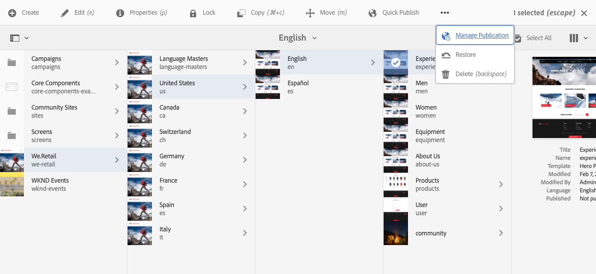

# Grundläggande hantering{#basic-handling}

>[!NOTE]
>
>* Den här sidan är avsedd att ge en översikt över grundläggande hantering när du använder Adobe Experience Manager (AEM) redigeringsmiljö. Konsolen **Platser** används som bas.
>
>* Vissa funktioner är inte tillgängliga i alla konsoler, och i vissa konsoler kan ytterligare funktioner vara tillgängliga. Specifik information om de enskilda konsolerna och deras relaterade funktioner beskrivs mer ingående på andra sidor.
>* Kortkommandon finns i hela AEM. Särskilt när [använder konsoler](/help/sites-authoring/keyboard-shortcuts.md) och [redigerar sidor](/help/sites-authoring/page-authoring-keyboard-shortcuts.md).
>

## Komma igång {#getting-started}

### Ett pekaktiverat användargränssnitt {#a-touch-enabled-ui}

AEM användargränssnitt har aktiverats för beröring. Med ett pekaktiverat gränssnitt kan du använda touchfunktioner för att interagera med programvaran med gester som att markera, hålla ned och dra. Detta står i kontrast till hur ett vanligt skrivbordsgränssnitt fungerar med musåtgärder som att klicka, dubbelklicka, högerklicka och föra musen över.

När användargränssnittet i AEM är pekaktiverat kan du använda pekgester på dina touchenheter (till exempel mobilenheter eller surfplattor) och musåtgärder på en vanlig stationär dator.

### Steg 1 {#first-steps}

Omedelbart efter inloggningen kommer du till [navigeringspanelen](#navigation-panel). Om du väljer något av alternativen öppnas respektive konsol.

>[!NOTE]
>
>För att få en god förståelse för den grundläggande användningen av AEM är det här dokumentet baserat på konsolen **Platser**.
>
>Klicka på **Webbplatser** för att komma igång.

### Produktnavigering {#product-navigation}

När en användare först kommer åt en konsol startas en produktnavigeringssjälvstudie. Klicka igenom så får du en bra översikt över AEM grundläggande hantering.

Klicka på **Nästa** om du vill gå vidare till nästa sida i översikten. Klicka på **Stäng** eller klicka utanför översiktsdialogrutan för att stänga.

Översikten startas om nästa gång du öppnar en konsol, såvida du inte antingen visar alla bilder eller markerar alternativet **Visa inte detta igen**.

## Global navigering {#global-navigation}

Du kan navigera mellan konsolerna med den globala navigeringspanelen. Detta aktiveras som en listruta i helskärmsläge när du klickar på länken Adobe Experience Manager längst upp till vänster på skärmen.

Du kan stänga den globala navigeringspanelen genom att klicka eller trycka på **Stäng** för att gå tillbaka till föregående plats.

>[!NOTE]
>
>När du loggar in första gången visas panelen **Navigering**

Global navigering har två paneler, som representeras av ikoner i skärmens vänstra marginal:

* **[Navigering](/help/sites-authoring/basic-handling.md#navigation-panel)** - motsvaras av en kompass
* **[Verktyg](/help/sites-authoring/basic-handling.md#tools-panel)** - motsvaras av en hammare

De alternativ som är tillgängliga på dessa paneler beskrivs nedan.

### Navigeringspanel {#navigation-panel}

Navigeringspanelen ger åtkomst till AEM-konsolerna:

Titeln på fliken Webbläsare uppdateras för att återspegla din position när du navigerar mellan konsolerna och innehållet.

Följande konsoler finns i Navigation:

<table>
 <tbody>
  <tr>
   <td><strong>Konsol</strong></td>
   <td><strong>Syfte</strong></td>
  </tr>
  <tr>
   <td>Assets  </td>
   <td>Med dessa konsoler kan du importera och <a href="/help/assets/assets.md">hantera digitala resurser</a>, till exempel bilder, videor, dokument och ljudfiler. Dessa resurser kan sedan användas av alla webbplatser som körs på samma AEM-instans. </td>
  </tr>
  <tr>
   <td>Communities</td>
   <td>Med den här konsolen kan du skapa och hantera <a href="/help/communities/sites-console.md">communitywebbplatser</a> för <a href="/help/communities/overview.md#engagement-community">engagemang</a> och <a href="/help/communities/overview.md#enablement-community">aktivering</a>.</td>
  </tr>
  <tr>
   <td>Commerce</td>
   <td>På så sätt kan du hantera produkter, produktkataloger och beställningar som är kopplade till dina <a href="/help/commerce/cif-classic/administering/ecommerce.md">Commerce</a> -platser.</td>
  </tr>
  <tr>
   <td>Upplevelsefragment</td>
   <td>En <a href="/help/sites-authoring/experience-fragments.md">Experience Fragment</a> är en fristående upplevelse som kan återanvändas i alla kanaler och ha variationer, vilket sparar problem med att kopiera och klistra in upplevelser eller delar av upplevelser upprepade gånger.</td>
  </tr>
  <tr>
   <td>Forms</td>
   <td>Med den här konsolen kan du skapa, hantera och bearbeta dina <a href="/help/forms/using/introduction-aem-forms.md">formulär och dokument</a>.</td>
  </tr>
  <tr>
   <td>Personalization</td>
   <td>Den här konsolen innehåller ett <a href="/help/sites-authoring/personalization.md">ramverk med verktyg för att skapa riktat innehåll och presentera personaliserade upplevelser</a>.</td>
  </tr>
  <tr>
   <td>Projekt</td>
   <td><a href="/help/sites-authoring/touch-ui-managing-projects.md">Projektkonsolen ger dig direktåtkomst till dina projekt</a>. Projekt är virtuella kontrollpaneler. De kan användas för att bygga upp ett team och sedan ge teamet tillgång till resurser, arbetsflöden och uppgifter så att andra kan arbeta med ett gemensamt mål.   </td>
  </tr>
  <tr>
   <td>Screens</td>
   <td>Med <a href="https://experienceleague.adobe.com/docs/experience-manager-screens/user-guide/authoring/setting-up-projects/creating-a-screens-project.html?lang=sv-SE">Screens</a> kan du hantera alla kundriktade skärmar, oavsett storlek och plats.</td>
  </tr>
  <tr>
   <td>Sites</td>
   <td>På webbplatskonsolerna kan du <a href="/help/sites-authoring/page-authoring.md">skapa, visa och hantera webbplatser</a> som körs på din AEM-instans. Med dessa konsoler kan du skapa, redigera, kopiera, flytta och ta bort webbsidor, starta arbetsflöden och publicera sidor.  </td>
  </tr>
 </tbody>
</table>

### Panelen Verktyg {#tools-panel}

På verktygspanelen innehåller varje alternativ på sidopanelen ett intervall med undermenyer. [Verktygskonsolerna](/help/sites-administering/tools-consoles.md) som är tillgängliga här ger tillgång till flera specialiserade verktyg och konsoler som hjälper dig att administrera dina webbplatser, digitala resurser och andra aspekter av innehållsdatabasen.

## Sidhuvudet {#the-header}

Rubriken visas alltid längst upp på skärmen. De flesta alternativen i huvudet är desamma oavsett var du befinner dig i systemet, men vissa är sammanhangsspecifika.

* [Global navigering](#navigatingconsolesandtools)

  Markera länken **Adobe Experience Manager** där du kan navigera mellan konsoler.

  

* [Sök](/help/sites-authoring/search.md)

  

  Du kan också använda [kortkommandot](/help/sites-authoring/keyboard-shortcuts.md) `/` (snedstreck) för att starta sökningen från en konsol.

* [Lösningar](https://business.adobe.com/se/)

  

* [Hjälp](#accessinghelptouchoptimizedui)

  

* [Meddelanden](/help/sites-authoring/inbox.md)

  

  Den här ikonen är märkt med antalet för närvarande tilldelade ofullständiga meddelanden.

  >[!NOTE]
  >
  >Körklar AEM levereras med administrativa uppgifter som tilldelats administratörsanvändargruppen. Mer information finns i [Inkorgen - administrativa uppgifter som inte är tillgängliga](/help/sites-authoring/inbox.md#out-of-the-box-administrative-tasks).

* [Användaregenskaper](/help/sites-authoring/user-properties.md)

  

* [Järnvägsväljare](/help/sites-authoring/basic-handling.md#rail-selector)

  

  Vilka alternativ som visas beror på den aktuella konsolen. I **Webbplatser** kan du t.ex. markera endast innehåll (standardvärdet), tidslinjen, referenser eller panelen på filtersidan.

  

* Breadcrumbs

  

  Visas mitt i rälsen, och alltid med beskrivningen av det markerade objektet kan du navigera i en viss konsol med hjälp av vägbeskrivningar. På webbplatskonsolen kan du navigera på webbplatsnivå.

  När du klickar på den synliga texten öppnas en listruta som visar hierarkinivåerna för det markerade objektet. Klicka på en post om du vill gå till den platsen.

  

* Val av analystidsperiod

  

  Detta är endast tillgängligt i listvyn. Mer information finns i [listvyn](#list-view).

* Knappen **Skapa**

  

  När du klickar på det här alternativet passar de alternativ som visas konsolen/kontexten.

* [Vyer](/help/sites-authoring/basic-handling.md#viewingandselectingyourresourcescardlistcolumn)

  Vyikonen finns längst till höger i verktygsfältet i AEM. Eftersom den aktuella vyn också visas ändras den. I standardvyn **Kolumnvy** visas till exempel:

  

  Du kan växla mellan kolumnvy, kortvy och listvy. I listvyn visas visningsinställningarna.

  

* Tangentbordsnavigering

  Du kan bara navigera på en webbplats med hjälp av tangentbordet. Detta använder standardwebbläsarfunktionen för tangenten **TAB** (eller **OPT+TAB**) för att flytta dig mellan element på sidan som är *fokuserbara*.

  I konsolen **Platser** finns det ett tillagt alternativ för att **Hoppa till huvudinnehåll**. Detta blir synligt när du *tabbar* går igenom rubrikalternativen och snabbar upp navigeringen genom att du kan hoppa över standardelementen i verktygsfältet (produkten) och ta dig direkt till huvudinnehållet.

  

## Få hjälp {#accessing-help}

Det finns olika hjälpresurser:

* **Verktygsfältet Konsol**

  Beroende på din plats öppnar ikonen **Hjälp** lämpliga resurser:

  

* **Navigering**

  Första gången du navigerar i systemet introducerar [en serie bilder AEM-navigering](/help/sites-authoring/basic-handling.md#product-navigation).

* **Sidredigeraren**

  Första gången du redigerar en sida innehåller en serie bilder en sidredigerare.

  

  Navigera i den här översikten på samma sätt som du gör med [produktnavigeringsöversikten](/help/sites-authoring/basic-handling.md#product-navigation) när du först öppnar en konsol.

  På menyn **Sidinformation** kan du när som helst välja [**Hjälp**](/help/sites-authoring/author-environment-tools.md#accessing-help) för att visa detta igen.

* **Verktygskonsol**

  Från konsolen **Verktyg** kan du även komma åt de externa **resurserna**:

   * **Dokumentation**
Visa dokumentationen för Web Experience Management

   * **Resurser för utvecklare**
Resurser och nedladdningar för utvecklare

  >[!NOTE]
  >
  >Du kan när som helst få tillgång till en översikt över kortkommandon med snabbtangenten `?` (frågetecken) i en konsol.
  >
  >En översikt över alla kortkommandon finns i följande avsnitt:
  >
  >* [Kortkommandon för sidredigering](/help/sites-authoring/page-authoring-keyboard-shortcuts.md)
  >* [Kortkommandon för konsoler](/help/sites-authoring/keyboard-shortcuts.md)

## Verktygsfältet Åtgärder {#actions-toolbar}

När en resurs är markerad (till exempel en sida eller en resurs) visas olika åtgärder med ikoner med förklarande text i verktygsfältet. Dessa åtgärder är beroende av:

* Aktuell konsol
* Aktuellt sammanhang
* Om du är i [markeringsläge](#navigatingandselectionmode) eller inte

De åtgärder som är tillgängliga i verktygsfältet ändras för att återspegla de åtgärder du kan vidta för de specifika objekten.

Hur du [väljer en resurs](/help/sites-authoring/basic-handling.md#viewing-and-selecting-resources) beror på vyn.

På grund av utrymmesbegränsningar i vissa fönster kan verktygsfältet snabbt bli längre än det tillgängliga utrymmet. När detta inträffar visas ytterligare alternativ. Om du klickar eller trycker på ellipsen (de tre punkterna eller **...**) öppnas en listruta med alla återstående åtgärder. När du till exempel har valt en sida i **Sites**-konsolen:

>[!NOTE]
>
>De enskilda ikonerna som är tillgängliga dokumenteras i relation till rätt konsol/funktion/scenario.

## Snabbåtgärder {#quick-actions}

I [kortvyn](#cardviewquickactions) är vissa åtgärder tillgängliga som snabbikoner och i verktygsfältet. Snabbåtgärdsikoner är tillgängliga för ett enskilt objekt i taget och eliminerar behovet av att välja i förväg.

Snabbåtgärderna visas när du för musen över ett resurskort (en stationär enhet). Vilka snabbåtgärder som är tillgängliga beror på konsolen och sammanhanget. Här följer till exempel snabbåtgärderna för en sida i konsolen **Platser**:

## Visa och välja resurser {#viewing-and-selecting-resources}

Visning, navigering och markering är lika begreppsmässigt för alla vyer, men har små variationer i hantering, beroende på vilken vy du använder.

Du kan visa, navigera i och välja (för ytterligare åtgärder) dina resurser med någon av de tillgängliga vyerna, som du kan markera med ikonen längst upp till höger:

* [Kolumnvy](#column-view)
* [Kortvy](#card-view)

* [Listvy](#list-view)

>[!NOTE]
>
>Som standard visas inte de ursprungliga återgivningarna av resurser i användargränssnittet som miniatyrbilder i någon av vyerna i AEM Assets. Om du är administratör kan du använda övertäckningar för att konfigurera AEM Assets så att de ursprungliga återgivningarna visas som miniatyrbilder.

### Välja resurser {#selecting-resources}

Välja en specifik resurs beror på en kombination av vyn och enheten:

<table>
 <tbody>
  <tr>
   <td> </td>
   <td>Välj</td>
   <td>Avmarkera</td>
  </tr>
  <tr>
   <td>Kolumnvy  </td>
   <td>
    <ul>
     <li>Skrivbord:  Klicka på miniatyrbilden</li>
     <li>Mobila enheter:  Välj miniatyrbilden</li>
    </ul> </td>
   <td>
    <ul>
     <li>Skrivbord:  Klicka på miniatyrbilden</li>
     <li>Mobila enheter:  Välj miniatyrbilden</li>
    </ul> </td>
  </tr>
  <tr>
   <td>Kortvy  </td>
   <td>
    <ul>
     <li>Skrivbord:  MouseOver, använd sedan snabbåtgärden för bockmarkering</li>
     <li>Mobila enheter:  Välj och håll ned kortet</li>
    </ul> </td>
   <td>
    <ul>
     <li>Skrivbord:  Klicka på kortet</li>
     <li>Mobila enheter:  Välj kortet</li>
    </ul> </td>
  </tr>
  <tr>
   <td>Listvy</td>
   <td>
    <ul>
     <li>Skrivbord:  Klicka på miniatyrbilden</li>
     <li>Mobila enheter:  Välj miniatyrbilden</li>
    </ul> </td>
   <td>
    <ul>
     <li>Skrivbord:  Klicka på miniatyrbilden</li>
     <li>Mobila enheter:  Välj miniatyrbilden</li>
    </ul> </td>
  </tr>
 </tbody>
</table>

#### Markera alla {#select-all}

Du kan markera alla objekt i valfri vy genom att klicka på alternativet **Markera alla** längst upp till höger på konsolen.

* I **kortvyn** markeras alla kort.
* I **listvyn** markeras alla objekt i listan.
* I **kolumnvyn** markeras alla objekt i kolumnen längst till vänster.

#### Avmarkera allt {#deselecting-all}

När du markerar objekt visas antalet markerade objekt längst upp till höger i verktygsfältet.

Du kan avmarkera alla objekt och avsluta markeringsläget antingen:

* klicka eller peka på **X** bredvid antalet,

* eller använder **escape**.

I alla vyer kan du avmarkera alla objekt genom att trycka på Esc på tangentbordet om du använder en stationär enhet.

#### Markera exempel {#selecting-example}

1. I kortvyn:

   

1. När du har valt en resurs täcks den översta rubriken av verktygsfältet [Åtgärder](#actionstoolbar) som ger åtkomst till åtgärder som för närvarande gäller för den valda resursen.

   Om du vill avsluta markeringsläget markerar du **X** längst upp till höger eller använder **escape**.

### Kolumnvy {#column-view}

I kolumnvyn kan du visuellt navigera i ett innehållsträd genom en serie överlappande kolumner. I den här vyn kan du visualisera och gå igenom webbplatsens trädstruktur.

Om du väljer en resurs i kolumnen längst till vänster visas de underordnade resurserna i en kolumn till höger. Om du väljer en resurs i den högra kolumnen visas de underordnade resurserna i en annan kolumn till höger och så vidare.

* Du kan navigera uppåt och nedåt i trädet genom att trycka eller klicka på resursnamnet eller nedåt till höger om resursnamnet.

   * Resursnamnet och förvrängningen markeras när användaren knackar på eller klickar på den.

     

   * De underordnade resurserna för den resurs som användaren klickar på/trycker på visas i kolumnen till höger om den resurs som användaren klickar på/trycker på.
   * Om du klickar på ett resursnamn som inte har några underordnade objekt visas informationen i den sista kolumnen.

* Om du trycker eller klickar på miniatyrbilden markeras resursen.

   * När du väljer det här alternativet läggs en bock över miniatyrbilden och resursnamnet markeras också.
   * Information om den valda resursen visas i den sista kolumnen.
   * Verktygsfältet för åtgärder blir tillgängligt.

     

  När en sida är markerad i kolumnvyn visas den markerade sidan i den sista kolumnen tillsammans med följande information:

   * Sidrubrik
   * Sidnamn (del av sidans URL)
   * Mall som sidan baseras på
   * Ändringsinformation
   * Sidspråk
   * Publikationsinformation

### Kortvy {#card-view}

* I kortvyn visas informationskort för varje objekt på den aktuella nivån. Dessa innehåller information som:

   * En visuell representation av sidinnehållet.
   * Sidans titel.
   * Viktiga datum (t.ex. senast redigerade och publicerade).
   * Sidan är låst, dold eller en del av en live-kopia.
   * Om det är lämpligt, när du måste vidta åtgärder som en del av ett arbetsflöde.

      * Markörer som anger nödvändiga åtgärder kan vara relaterade till poster i din [inkorg](/help/sites-authoring/inbox.md).

* [Snabbåtgärder](#quick-actions) är också tillgängliga i den här vyn, till exempel markering och vanliga åtgärder som redigering.

  

* Du kan navigera nedåt i trädet genom att trycka/klicka på kort (var noga med att undvika snabbåtgärderna) eller gå upp igen med [breadcrumbs i sidhuvudet](/help/sites-authoring/basic-handling.md#the-header).

### Listvy {#list-view}

* I listvyn visas information om varje resurs på den aktuella nivån.
* Du kan navigera genom trädet genom att trycka/klicka på resursnamnet och säkerhetskopian med hjälp av [breadcrumbs i rubriken](/help/sites-authoring/basic-handling.md#the-header).

* Om du enkelt vill markera alla objekt i listan använder du kryssrutan längst upp till vänster i listan.

  

   * När alla objekt i listan är markerade visas den här kryssrutan markerad.

      * Om du vill avmarkera alla klickar du i kryssrutan.

   * När bara vissa objekt är markerade visas det med ett minustecken.

      * Markera alla genom att klicka i kryssrutan.
      * Om du vill avmarkera alla klickar du i kryssrutan igen.

* Markera de kolumner som ska visas med alternativet **Visa inställningar** som finns under knappen Vyer. Följande kolumner är tillgängliga för visning:

   * **Namn** - Sidnamn, som kan vara användbart i en flerspråkig redigeringsmiljö eftersom det är en del av sidans URL och inte ändras oavsett språk
   * **Ändrad** - Senast ändrat den och senast ändrad av användaren
   * **Publicerad** - Publiceringsstatus
   * **Mall** - Mall som sidan baseras på
   * **Arbetsflöde** - Arbetsflöde som för närvarande används på sidan. Mer information finns när du för musen över eller öppnar tidslinjen.

   * **Sidanalys**
   * **Unika besökare**
   * **Tid på sidan**

  

  Som standard visas kolumnen **Namn** som utgör en del av sidans URL. Ibland måste författaren komma åt sidor som är på ett annat språk. Att se namnet på sidan (som vanligtvis inte ändras) kan vara till stor hjälp om författaren inte känner till sidans språk.

* Ändra objektens ordning med hjälp av den prickade lodräta listen längst till höger om varje objekt i listan.

  >[!NOTE]
  >
  >Det går bara att ändra ordningen i en ordnad mapp som har värdet `jcr:primaryType` som `sling:OrderedFolder`.

  

  Klicka på det lodräta markeringsfältet och dra objektet till en ny plats i listan.

  

* Du kan visa analysdata genom att visa lämpliga kolumner i dialogrutan **Visa inställningar**.

  Du kan filtrera analysdata under de senaste 30, 90 eller 365 dagarna med filteralternativen till höger i sidhuvudet.

  

## Järnvägsväljare {#rail-selector}

**Rail Selector** är tillgänglig längst upp till vänster i fönstret och visar alternativ beroende på de aktuella konsolerna.

I Platser kan du t.ex. markera endast innehåll (standard), innehållsträdet, tidslinjen, referenser eller panelen på filtersidan.

Om du bara väljer innehåll visas bara ikonen för skenor. När något annat alternativ är markerat visas alternativnamnet bredvid ikonen för skenor.

>[!NOTE]
>
>[Kortkommandon](/help/sites-authoring/keyboard-shortcuts.md) är tillgängliga för att snabbt växla mellan olika visningsalternativ för spår.

### Innehållsträd {#content-tree}

Innehållsträdet kan användas för att snabbt navigera i platshierarkin på sidopanelen och visa mycket information om sidorna i den aktuella mappen.

Med hjälp av innehållsträdets sidopanel med en listvy eller kortvy kan användarna enkelt se projektets hierarkiska struktur. De kan enkelt navigera i innehållsstrukturen med innehållsträdets sidopanel och visa detaljerad sidinformation i listvyn.

>[!NOTE]
>
>När du har markerat en post i hierarkin kan du använda piltangenterna för att snabbt navigera i hierarkin.
>
>Mer information finns i [kortkommandona](/help/sites-authoring/keyboard-shortcuts.md).

### Tidslinje {#timeline}

Tidslinjen kan användas för att visa och/eller initiera händelser som har inträffat i den valda resursen. Om du vill öppna tidslinjekolumnen använder du järnvägsväljaren:

Med tidslinjekolumnen kan du:

* [Visa olika händelser](#timelineviewevents) som är relaterade till ett valt objekt.

   * Händelsetyperna kan väljas i listrutan:

      * [Kommentar](#timelineaddingandviewingcomments)
      * Anteckningar
      * Verksamhet
      * [Launches](/help/sites-authoring/launches.md)
      * [Versioner](/help/sites-authoring/working-with-page-versions.md)
      * [Arbetsflöden](/help/sites-authoring/workflows-applying.md)

         * förutom för [tillfälliga arbetsflöden](/help/sites-developing/workflows.md#transient-workflows) eftersom ingen historikinformation har sparats för dessa

      * och Visa alla

* [Lägg till/visa kommentarer](#timelineaddingandviewingcomments) om det markerade objektet. Rutan **Kommentar** visas längst ned i händelselistan. Om du skriver en kommentar följt av Retur registreras kommentaren. Den visas när **Kommentarer** eller **Visa alla** markeras.

* Specifika konsoler har ytterligare funktioner. I Sites-konsolen kan du till exempel göra följande:

   * [Spara en version](/help/sites-authoring/working-with-page-versions.md#creatinganewversiontouchoptimizedui).
   * [Starta ett arbetsflöde](/help/sites-authoring/workflows-applying.md#startingaworkflowfromtherail).

De här alternativen är tillgängliga via markeringen bredvid fältet **Kommentar**.

### Referenser {#references}

**Referenser** visar anslutningar till den valda resursen. I **Platser**-konsolen [&#x200B; &#x200B;](/help/sites-authoring/author-environment-tools.md#showingpagereferences) visar till exempel referenser för sidor:

* [Ritningar](/help/sites-administering/msm.md)
* [Launches](/help/sites-authoring/launches.md#launches-in-references-sites-console)
* [Live-kopior](/help/sites-administering/msm-livecopy-overview.md#openingthelivecopyoverviewfromreferences)
* [Språkversioner](/help/sites-administering/tc-prep.md#seeing-the-status-of-language-roots)
* Innehållsreferenser:

   * Direktlänkar från andra sidor till den markerade sidan
   * Innehåll som lånats från, lånats ut till, eller båda, den valda sidan av referenskomponenten

### Filter {#filter}

Då öppnas en panel som liknar [search](/help/sites-authoring/search.md), med lämpliga platsfilter inställda så att du kan filtrera innehållet ytterligare.

