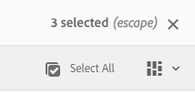
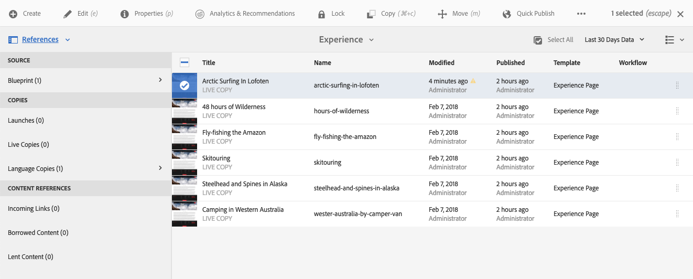
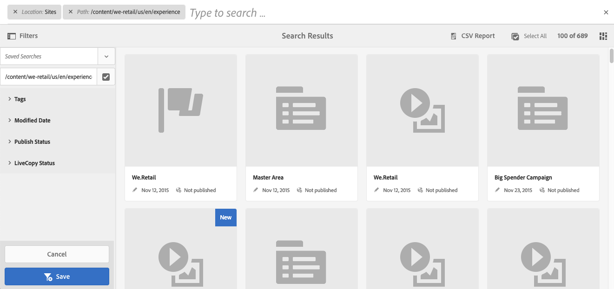

# Grundläggande hantering{#basic-handling}

>[!NOTE]
>
>* Den här sidan är avsedd att ge en översikt över grundläggande hantering när du använder AEM redigeringsmiljö. Den använder **Webbplatser** som bas.
>
>* Vissa funktioner är inte tillgängliga i alla konsoler, och i vissa konsoler kan ytterligare funktioner vara tillgängliga. Specifik information om de enskilda konsolerna och deras tillhörande funktioner beskrivs mer ingående på andra sidor.
>* Kortkommandon är tillgängliga i hela AEM. I synnerhet när [använda konsoler](/help/sites-authoring/keyboard-shortcuts.md) och [redigera sidor](/help/sites-authoring/page-authoring-keyboard-shortcuts.md).
>

## Komma igång {#getting-started}

### Ett pekaktiverat användargränssnitt {#a-touch-enabled-ui}

AEM användargränssnitt har aktiverats för beröring. Med ett pekaktiverat gränssnitt kan du använda touchfunktioner för att interagera med programvaran med gester som att trycka, hålla ned och dra. Detta står i kontrast till hur ett vanligt skrivbordsgränssnitt fungerar med musåtgärder som att klicka, dubbelklicka, högerklicka och föra musen över.

När användargränssnittet för AEM är pekaktiverat kan du använda pekgester på dina touchenheter (till exempel mobilenheter eller surfplattor) och musåtgärder på en vanlig stationär dator.

### Steg 1 {#first-steps}

Omedelbart efter att du loggat in kommer du till [Navigeringspanelen](#navigation-panel). Om du väljer något av alternativen öppnas respektive konsol.

>[!NOTE]
>
>För att få en bättre förståelse för AEM basanvändning är det här dokumentet baserat på **Webbplatser** konsol.
>
>Klicka eller tryck på **Webbplatser** för att komma igång.

### Produktnavigering {#product-navigation}

När en användare först kommer åt en konsol startas en produktnavigeringssjälvstudiekurs. Klicka eller tryck en minut för att få en bra överblick över den grundläggande hanteringen av AEM.

Klicka eller tryck **Nästa** för att gå vidare till nästa sida i översikten. Klicka eller tryck **Stäng** eller klicka eller tryck utanför översiktsdialogrutan för att stänga.

Översikten startas om nästa gång du öppnar en konsol, såvida du inte antingen visar alla bilder eller markerar alternativet **Visa inte det här igen**.

## Global navigering {#global-navigation}

Du kan navigera mellan konsolerna med den globala navigeringspanelen. Detta aktiveras som en listruta i helskärmsläge när du klickar eller trycker på länken Adobe Experience Manager längst upp till vänster på skärmen.

Du kan stänga den globala navigeringspanelen genom att klicka eller trycka på **Stäng** för att återgå till din tidigare plats.

>[!NOTE]
>
>När du loggade in för första gången visas **Navigering** -panelen.

Global navigering har två paneler, som representeras av ikoner i skärmens vänstra marginal:

* **[Navigering](/help/sites-authoring/basic-handling.md#navigation-panel)** - motsvaras av en kompass
* **[verktyg](/help/sites-authoring/basic-handling.md#tools-panel)** - Representeras av en hammare

De alternativ som är tillgängliga på dessa paneler beskrivs nedan.

### Navigeringspanel {#navigation-panel}

Navigeringspanelen ger åtkomst till AEM:

Titeln på webbläsarfliken uppdateras för att återspegla din position när du navigerar genom konsolerna och innehållet.

Följande konsoler finns i Navigation:

<table>
 <tbody>
  <tr>
   <td><strong>Konsol</strong></td>
   <td><strong>Syfte</strong></td>
  </tr>
  <tr>
   <td>Assets  </td>
   <td>Med dessa konsoler kan du importera och <a href="/help/assets/home.md">hantera digitala resurser</a> som bilder, videor, dokument och ljudfiler. Dessa resurser kan sedan användas av alla webbplatser som körs på samma AEM. </td>
  </tr>
  <tr>
   <td>Communities</td>
   <td>Med den här konsolen kan du skapa och hantera <a href="/help/communities/sites-console.md">communitysajter</a> for <a href="/help/communities/overview.md#engagement-community">engagemang</a> och <a href="/help/communities/overview.md#enablement-community">aktivering</a>.</td>
  </tr>
  <tr>
   <td>Handel</td>
   <td>På så sätt kan du hantera produkter, produktkataloger och beställningar som är kopplade till dina <a href="/help/commerce/cif-classic/administering/ecommerce.md">Handel</a> webbplatser.</td>
  </tr>
  <tr>
   <td>Experience Fragments</td>
   <td>An <a href="/help/sites-authoring/experience-fragments.md">upplevelsefragment</a> är en fristående upplevelse som kan återanvändas i olika kanaler och som har variationer, vilket besparar dig problem med att kopiera och klistra in upplevelser eller delar av upplevelser.</td>
  </tr>
  <tr>
   <td>Forms</td>
   <td>Med den här konsolen kan du skapa, hantera och bearbeta <a href="/help/forms/home.md">formulär och dokument</a>.</td>
  </tr>
  <tr>
   <td>Personanpassning</td>
   <td>Den här konsolen tillhandahåller en <a href="/help/sites-authoring/personalization.md">ramverk med verktyg för att skapa riktat innehåll och presentera personaliserade upplevelser</a>.</td>
  </tr>
  <tr>
   <td>Projekt</td>
   <td>The <a href="/help/sites-authoring/touch-ui-managing-projects.md">Med projektkonsolen får du direktåtkomst till dina projekt</a>. Projekt är virtuella kontrollpaneler. De kan användas för att bygga upp ett team och sedan ge teamet tillgång till resurser, arbetsflöden och uppgifter så att andra kan arbeta med ett gemensamt mål.   </td>
  </tr>
  <tr>
   <td>Skärmar</td>
   <td><a href="https://experienceleague.adobe.com/docs/experience-manager-screens/user-guide/authoring/setting-up-projects/creating-a-screens-project.html">Skärmar</a> gör att ni kan hantera alla kundorienterade skärmar, oavsett storlek och plats.</td>
  </tr>
  <tr>
   <td>Sites</td>
   <td>Med platskonsolerna kan du <a href="/help/sites-authoring/page-authoring.md">skapa, visa och hantera webbplatser</a> som körs på din AEM. Med dessa konsoler kan du skapa, redigera, kopiera, flytta och ta bort webbsidor, starta arbetsflöden och publicera sidor.  </td>
  </tr>
 </tbody>
</table>

### Panelen Verktyg {#tools-panel}

På verktygspanelen innehåller varje alternativ på sidopanelen ett intervall med undermenyer. The [Verktygskonsoler](/help/sites-administering/tools-consoles.md) finns här för att ge tillgång till ett antal specialiserade verktyg och konsoler som hjälper dig att administrera dina webbplatser, digitala resurser och andra aspekter av din innehållsdatabas.

## Sidhuvudet {#the-header}

Rubriken visas alltid längst upp på skärmen. De flesta alternativen i huvudet är desamma oavsett var du befinner dig i systemet, men vissa är sammanhangsspecifika.

* [Global navigering](#navigatingconsolesandtools)

   Välj **Adobe Experience Manager** för att navigera mellan konsoler.

   

* [Sökning](/help/sites-authoring/search.md)

   

   Du kan också använda [kortkommando](/help/sites-authoring/keyboard-shortcuts.md) `/` (snedstreck) för att starta sökning från en konsol.

* [Lösningar](https://www.adobe.com/experience-cloud.html)

   

* [Hjälp](#accessinghelptouchoptimizedui)

   

* [Meddelanden](/help/sites-authoring/inbox.md)

   

   Den här ikonen kommer att märkas med antalet för närvarande tilldelade ofullständiga meddelanden.

   >[!NOTE]
   >
   >AEM levereras förinläst med administrativa uppgifter som tilldelats administratörsanvändargruppen. Se [Inkorgen - administrativa uppgifter som inte är tillgängliga](/help/sites-authoring/inbox.md#out-of-the-box-administrative-tasks) för mer information.

* [Användaregenskaper](/help/sites-authoring/user-properties.md)

   

* [Järnvägsväljare](/help/sites-authoring/basic-handling.md#rail-selector)

   

   Vilka alternativ som visas beror på den aktuella konsolen. I **Webbplatser** Du kan bara markera innehåll (standardvärdet), tidslinjen, referenser eller sidopanelen för filter.

   

* Breadcrumbs

   

   I mitten av spåret, och alltid med beskrivningen av det markerade objektet, kan du navigera i en viss konsol med hjälp av de synliga kolumnerna. På webbplatskonsolen kan du navigera på webbplatsnivå.

   Klicka bara på den breda texten för att visa en listruta med hierarkinivåerna för det markerade objektet. Klicka på en post för att hoppa till den platsen.

   

* Val av analystidsperiod

   

   Detta är endast tillgängligt i listvyn. Se [listvy](#list-view) för mer information.

* **Skapa** knapp

   

   När du klickar på det här alternativet lämpar sig de alternativ som visas för konsolen/kontexten.

* [Vyer](/help/sites-authoring/basic-handling.md#viewingandselectingyourresourcescardlistcolumn)

   Vyikonen finns längst till höger i verktygsfältet AEM. Eftersom den aktuella vyn också visas ändras den. I standardvyn, till exempel **Kolumnvy** den visar:

   

   Du kan växla mellan kolumnvy, kortvy och listvy; i listvyn visas även visningsinställningarna.

   

* Tangentbordsnavigering

   Du kan bara navigera på en webbplats med hjälp av tangentbordet. Detta använder webbläsarens standardfunktioner i **TABB** tangent (eller **OPT+TAB**) för att flytta dig mellan element på sidan som *fokuserbar*.

   I **Webbplatser** konsolen där det finns ett tillagt alternativ för  **Hoppa till huvudinnehåll**. Detta syns när du *tab* genom rubrikalternativen och snabbar upp navigeringen genom att du kan hoppa över standardelementen i verktygsfältet (produkten) och ta dig direkt till huvudinnehållet.

   

## Få hjälp {#accessing-help}

Det finns olika hjälpresurser:

* **Verktygsfältet Konsol**

   Beroende på var du befinner dig **Hjälp** öppnas lämpliga resurser:

   

* **Navigering**

   Första gången du navigerar i systemet [en serie bilder AEM navigering](/help/sites-authoring/basic-handling.md#product-navigation).

* **Page Editor**

   Första gången du redigerar en sida innehåller en serie bilder en sidredigerare.

   

   Navigera i den här översikten precis som i [produktnavigering - översikt](/help/sites-authoring/basic-handling.md#product-navigation) vid första åtkomst till en konsol.

   Från [**Sidinformation** meny som du kan välja **Hjälp**](/help/sites-authoring/author-environment-tools.md#accessing-help) för att visa detta igen när som helst.

* **Verktygskonsol**

   Från **verktyg** konsolen som du också kan komma åt externt **Resurser**:

   * **Dokumentation**
Visa dokumentationen för Web Experience Management

   * **Resurser för utvecklare**
Resurser och nedladdningar för utvecklare
   >[!NOTE]
   >
   >Du kan när som helst få tillgång till en översikt över kortkommandon via snabbtangenten `?` (frågetecken) i en konsol.
   >
   >En översikt över alla kortkommandon finns i följande dokumentation:
   >
   >    * [Kortkommandon för att redigera sidor](/help/sites-authoring/page-authoring-keyboard-shortcuts.md)
   >    * [Kortkommandon för konsoler](/help/sites-authoring/keyboard-shortcuts.md)

## Verktygsfältet Åtgärder {#actions-toolbar}

När en resurs är markerad (t.ex. en sida eller en resurs) visas olika åtgärder med ikoner med förklarande text i verktygsfältet. Dessa åtgärder är beroende av:

* Den aktuella konsolen.
* Det aktuella sammanhanget.
* Om du är [markeringsläge](#navigatingandselectionmode).

Den åtgärd som är tillgänglig i verktygsfältet ändras så att den återspeglar de åtgärder du kan vidta för de valda objekten.

Hur du [välj en resurs](/help/sites-authoring/basic-handling.md#viewing-and-selecting-resources) beror på vyn.

På grund av utrymmesbegränsningar i vissa fönster kan verktygsfältet snabbt bli längre än det tillgängliga utrymmet. När detta inträffar visas ytterligare alternativ. Om du klickar eller trycker på ellipsen (de tre punkterna eller **...**) öppnas en listruta med alla återstående åtgärder. När du till exempel har valt en sida i **Sites**-konsolen:

>[!NOTE]
>
>De enskilda ikonerna som är tillgängliga dokumenteras i relation till rätt konsol/funktion/scenario.

## Snabbåtgärder {#quick-actions}

I [Kortvy](#cardviewquickactions) vissa åtgärder är tillgängliga både som snabbikoner och i verktygsfältet. Snabbåtgärdsikoner är tillgängliga för ett enskilt objekt i taget och eliminerar behovet av att välja i förväg.

Snabbåtgärderna är synliga när du för musen över ett resurskort (en stationär enhet). Vilka snabbåtgärder som är tillgängliga beror på konsolen och sammanhanget. Här följer t.ex. snabbåtgärderna för en sida i **Webbplatser** konsol:

## Visa och välja resurser {#viewing-and-selecting-resources}

Visning, navigering och markering är lika begreppsmässigt för alla vyer, men har små variationer i hantering, beroende på vilken vy du använder.

Du kan visa, navigera i och välja (för ytterligare åtgärder) dina resurser med någon av de tillgängliga vyerna, som du kan markera med ikonen längst upp till höger:

* [Kolumnvy](#column-view)
* [Kortvy](#card-view)

* [Listvy](#list-view)

>[!NOTE]
>
>Som standard visas inte de ursprungliga återgivningarna av resurser i användargränssnittet som miniatyrbilder i någon av vyerna i AEM Assets. Om du är administratör kan du använda övertäckningar för att konfigurera AEM Assets så att ursprungliga återgivningar visas som miniatyrbilder.

### Välja resurser {#selecting-resources}

Välja en specifik resurs beror på en kombination av vyn och enheten:

<table>
 <tbody>
  <tr>
   <td> </td>
   <td>Välj</td>
   <td>Avmarkera</td>
  </tr>
  <tr>
   <td>Kolumnvy  </td>
   <td>
    <ul>
     <li>Skrivbord:  Klicka på miniatyrbilden</li>
     <li>Mobil enhet:  Tryck på miniatyrbilden</li>
    </ul> </td>
   <td>
    <ul>
     <li>Skrivbord:  Klicka på miniatyrbilden</li>
     <li>Mobil enhet:  Tryck på miniatyrbilden</li>
    </ul> </td>
  </tr>
  <tr>
   <td>Kortvy  </td>
   <td>
    <ul>
     <li>Skrivbord:  För musen över och använd sedan snabbåtgärden bock</li>
     <li>Mobil enhet:  Tryck och håll på kortet</li>
    </ul> </td>
   <td>
    <ul>
     <li>Skrivbord:  Klicka på kortet</li>
     <li>Mobil enhet:  Tryck på kortet</li>
    </ul> </td>
  </tr>
  <tr>
   <td>Listvy</td>
   <td>
    <ul>
     <li>Skrivbord:  Klicka på miniatyrbilden</li>
     <li>Mobil enhet:  Tryck på miniatyrbilden</li>
    </ul> </td>
   <td>
    <ul>
     <li>Skrivbord:  Klicka på miniatyrbilden</li>
     <li>Mobil enhet:  Tryck på miniatyrbilden</li>
    </ul> </td>
  </tr>
 </tbody>
</table>

#### Markera alla {#select-all}

Du kan markera alla objekt i valfri vy genom att klicka på **Markera alla** i konsolens övre högra hörn.

* I **Kortvy** alla kort är markerade.
* I **Listvy** alla objekt i listan markeras.
* I **Kolumnvy** alla objekt i kolumnen längst till vänster är markerade.

#### Avmarkera allt {#deselecting-all}

När du markerar objekt visas antalet markerade objekt längst upp till höger i verktygsfältet.

Du kan avmarkera alla objekt och avsluta markeringsläget genom att antingen:

* klicka eller trycka på **X** bredvid antalet,

* eller använda **escape**.

I alla vyer kan du avmarkera alla objekt genom att trycka på Esc på tangentbordet om du använder en stationär enhet.

#### Markera exempel {#selecting-example}

1. I kortvyn:

   

1. När du har valt en resurs täcks den översta rubriken av [åtgärdsverktygsfält](#actionstoolbar) som ger åtkomst till åtgärder som för närvarande gäller för den valda resursen.

   Om du vill avsluta markeringsläget väljer du **X** längst upp till höger, eller använd **escape**.

### Kolumnvy {#column-view}

I kolumnvyn kan du visuellt navigera i ett innehållsträd genom en serie överlappande kolumner. I den här vyn kan du visualisera och gå igenom webbplatsens trädstruktur.

Om du väljer en resurs i kolumnen längst till vänster visas de underordnade resurserna i en kolumn till höger. Om du väljer en resurs i den högra kolumnen visas de underordnade resurserna i en annan kolumn till höger och så vidare.

* Du kan navigera uppåt och nedåt i trädet genom att trycka eller klicka på resursnamnet eller nedåt till höger om resursnamnet.

   * Resursnamnet och förvrängningen markeras när användaren knackar på eller klickar på den.

   

   * De underordnade resurserna för den resurs som användaren klickar på/trycker på visas i kolumnen till höger om den resurs som användaren klickar på/trycker på.
   * Om du trycker eller klickar på ett resursnamn som inte har några underordnade objekt visas informationen i den sista kolumnen.

* Om du trycker eller klickar på miniatyrbilden markeras resursen.

   * När du väljer det här alternativet åsidosätts en bock på miniatyrbilden och resursnamnet markeras också.
   * Information om den valda resursen visas i den sista kolumnen.
   * Verktygsfältet för funktionsmakron blir tillgängligt.

   

   När en sida är markerad i kolumnvyn visas den markerade sidan i den sista kolumnen tillsammans med följande information:

   * Sidtitel
   * Sidnamn (del av sidans URL)
   * Mall som sidan baseras på
   * Ändringsinformation
   * Sidspråk
   * Publikationsinformation

### Kortvy {#card-view}

* I kortvyn visas informationskort för varje objekt på den aktuella nivån. Dessa innehåller information som:

   * En visuell representation av sidinnehållet.
   * Sidans titel.
   * Viktiga datum (t.ex. senast redigerade och publicerade).
   * Om sidan är låst, dold eller ingår i en livecopy.
   * Om det är lämpligt, när du måste vidta åtgärder som en del av ett arbetsflöde.

      * Markörer som anger obligatoriska åtgärder kan vara relaterade till poster i [Inkorg](/help/sites-authoring/inbox.md).

* [Snabbåtgärder](#quick-actions) är även tillgängliga i den här vyn, t.ex. markering och vanliga åtgärder som redigering.

   

* Du kan navigera nedåt i trädet genom att trycka på/klicka på kort (var noga med att undvika snabbåtgärderna) eller uppåt igen genom att använda [vägbeskrivningar i sidhuvudet](/help/sites-authoring/basic-handling.md#the-header).

### Listvy {#list-view}

* I listvyn visas information om varje resurs på den aktuella nivån.
* Du kan navigera nedåt i trädet genom att trycka på/klicka på resursnamnet och sedan säkerhetskopiera genom att använda [vägbeskrivningar i sidhuvudet](/help/sites-authoring/basic-handling.md#the-header).

* Om du enkelt vill markera alla objekt i listan använder du kryssrutan längst upp till vänster i listan.

   

   * När alla objekt i listan är markerade visas den här kryssrutan markerad.

      * Avmarkera alla genom att klicka eller trycka på kryssrutan.
   * När bara vissa objekt är markerade visas det med ett minustecken.

      * Markera alla genom att klicka eller trycka på kryssrutan.
      * Klicka eller tryck på kryssrutan igen för att avmarkera alla.

* Markera de kolumner som ska visas med **Visa inställningar** som finns under knappen Vyer. Följande kolumner är tillgängliga för visning:

   * **Namn** - Sidnamn, som kan vara användbart i en flerspråkig redigeringsmiljö eftersom det är en del av sidans URL och inte ändras oavsett språk
   * **Ändrad** - Senast ändrat den och senast ändrat av användaren
   * **Publicerad** - Publiceringsstatus
   * **Mall** - Mall som sidan baseras på
   * **Arbetsflöde** - Det arbetsflöde som för närvarande används på sidan. Mer information finns när du för musen över eller öppnar tidslinjen.

   * **Sidanalys**
   * **Unika besökare**
   * **Tid på sidan**

   

   Som standard är **Namn** -kolumnen visas, vilket utgör en del av sidans URL. I vissa fall kan författaren behöva komma åt sidor som är på ett annat språk och det kan vara bra att se sidans namn (som vanligtvis är oföränderligt) om författaren inte kan sidans språk.

* Ändra objektens ordning med hjälp av den prickade lodräta listen längst till höger om varje objekt i listan.

   >[!NOTE]
   >
   >Att ändra ordningen fungerar bara i en ordnad mapp som har `jcr:primaryType` värde som `sling:OrderedFolder`.

   

   Klicka eller tryck på det lodräta markeringsfältet och dra objektet till en ny plats i listan.

   

* Du kan visa analysdata genom att visa lämpliga kolumner med hjälp av **Visa inställningar** -dialogrutan.

   Du kan filtrera analysdata under de senaste 30, 90 eller 365 dagarna med filteralternativen till höger i sidhuvudet.

   

## Järnvägsväljare {#rail-selector}

The **Järnvägsväljare** är tillgängligt längst upp till vänster i fönstret och visar alternativ beroende på dina aktuella konsoler.

I Platser kan du t.ex. markera endast innehåll (standard), innehållsträdet, tidslinjen, referenser eller panelen på filtersidan.

Om du bara väljer innehåll visas bara ikonen för skenor. När något annat alternativ är markerat visas alternativnamnet bredvid ikonen för skenor.

>[!NOTE]
>
>[Kortkommandon](/help/sites-authoring/keyboard-shortcuts.md) är tillgängliga för att snabbt växla mellan olika visningsalternativ för skenor.

### Innehållsträd {#content-tree}

Innehållsträdet kan användas för att snabbt navigera i platshierarkin på sidopanelen och visa mycket information om sidorna i den aktuella mappen.

Med innehållsträdets sidopanel i kombination med en listvy eller kortvy kan användarna enkelt se projektets hierarkiska struktur och enkelt navigera i innehållsstrukturen med innehållsträdets sidopanel, samt visa detaljerad sidinformation i listvyn.

>[!NOTE]
>
>När du har markerat en post i hierarkin kan du använda piltangenterna för att snabbt navigera i hierarkin.
>
>Se [kortkommandon](/help/sites-authoring/keyboard-shortcuts.md) för mer information.

### Tidslinje {#timeline}

Tidslinjen kan användas för att visa och/eller initiera händelser som har inträffat på den valda resursen. Om du vill öppna tidslinjekolumnen använder du järnvägsväljaren:

I tidslinjekolumnen kan du:

* [Visa olika händelser](#timelineviewevents) relaterat till ett valt objekt.

   * Händelsetyperna kan väljas i listrutan:

      * [Kommentarer](#timelineaddingandviewingcomments)
      * Anteckningar
      * Verksamhet
      * [Launches](/help/sites-authoring/launches.md)
      * [Versioner](/help/sites-authoring/working-with-page-versions.md)
      * [Arbetsflöden](/help/sites-authoring/workflows-applying.md)

         * med undantag för [tillfälliga arbetsflöden](/help/sites-developing/workflows.md#transient-workflows) eftersom ingen historikinformation har sparats för dessa
      * och Visa alla

* [Lägg till/visa kommentarer om det markerade objektet. ](#timelineaddingandviewingcomments) Rutan **Kommentar** visas längst ned i händelselistan. Om du skriver en kommentar följt av Retur registreras kommentaren. Den visas när **Kommentarer** eller **Visa alla** markeras.

* Specifika konsoler har ytterligare funktioner. I Platskonsolen kan du till exempel:

   * [Spara en version](/help/sites-authoring/working-with-page-versions.md#creatinganewversiontouchoptimizedui).
   * [Starta ett arbetsflöde](/help/sites-authoring/workflows-applying.md#startingaworkflowfromtherail).

De här alternativen är tillgängliga via markören bredvid **Kommentar** fält.

### Referenser {#references}

**Referenser** visar alla anslutningar till den valda resursen. I **Webbplatser** konsol [referenser](/help/sites-authoring/author-environment-tools.md#showingpagereferences) för sidor:

* [Launches](/help/sites-authoring/launches.md#launches-in-references-sites-console)
* [Live-kopior](/help/sites-administering/msm-livecopy-overview.md#openingthelivecopyoverviewfromreferences)
* [Språkversioner](/help/sites-administering/tc-prep.md#seeing-the-status-of-language-roots)
* Innehållsreferenser:

   * länkar från andra sidor till den markerade sidan
   * innehåll som lånats från och/eller lånats ut till den valda sidan av referenskomponenten

### Filter {#filter}

Då öppnas en panel som liknar [sök](/help/sites-authoring/search.md) med rätt platsfilter redan inställda så att du kan filtrera innehållet ytterligare.

