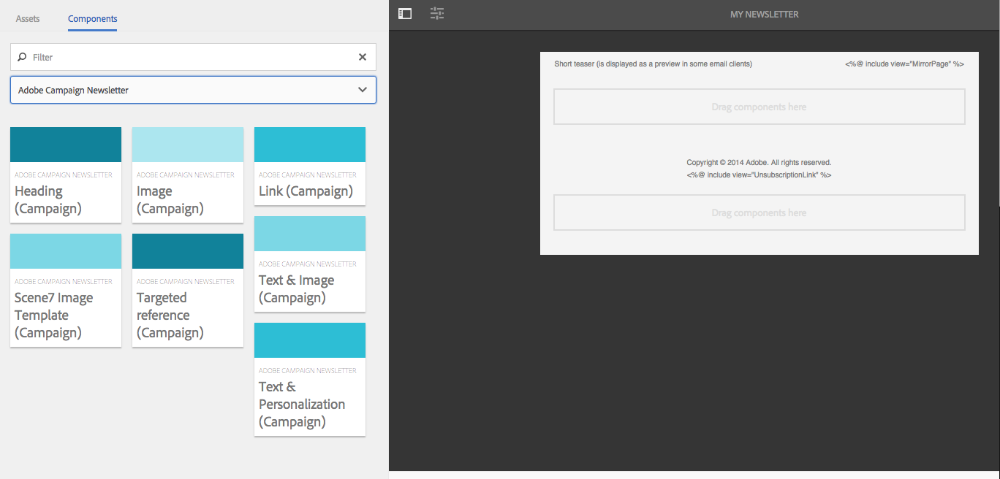

# Arbeta med Adobe Campaign Classic och Adobe Campaign Standard{#working-with-adobe-campaign-classic-and-adobe-campaign-standard}

Du kan skapa e-postinnehåll i AEM och bearbeta det i Adobe Campaign e-postmeddelanden. Om du vill göra det måste du:

1. Skapa ett nyhetsbrev i AEM från en Adobe Campaign-specifik mall.
1. Markera [en Adobe Campaign-tjänst](#selecting-the-adobe-campaign-cloud-service-and-template) innan du redigerar innehållet för att få tillgång till alla funktioner.
1. Redigera innehållet.
1. Validera innehållet.

Innehållet kan sedan synkas med en leverans i Adobe Campaign. Detaljerade instruktioner beskrivs i det här dokumentet.

Se även [Skapa Adobe Campaign Forms i AEM](/help/sites-authoring/adobe-campaign-forms.md).

>[!NOTE]
>
>Innan du kan använda den här funktionen måste du konfigurera AEM att integrera med antingen [Adobe Campaign](/help/sites-administering/campaignonpremise.md) eller [Adobe Campaign Standard](/help/sites-administering/campaignstandard.md).

## Skicka e-postinnehåll via Adobe Campaign {#sending-email-content-via-adobe-campaign}

När du har konfigurerat AEM och Adobe Campaign kan du skapa e-postleveransinnehåll direkt i AEM och sedan bearbeta det i Adobe Campaign.

När du skapar Adobe Campaign-innehåll i AEM måste du länka till en Adobe Campaign-tjänst innan du redigerar innehållet för att få tillgång till alla funktioner.

Det finns två möjliga fall:

* Innehållet kan synkas med en leverans från Adobe Campaign. På så sätt kan du använda AEM innehåll i en leverans.
* (Endast Adobe Campaign Classic) Innehållet kan skickas direkt till Adobe Campaign, som automatiskt genererar en ny e-postleverans. Det här läget har begränsningar.

Detaljerade instruktioner beskrivs i det här dokumentet.

### Skapa nytt e-postinnehåll {#creating-new-email-content}

>[!NOTE]
>
>När du lägger till e-postmallar måste du lägga till dem under **/content/campaign** för att göra dem tillgängliga.

#### Skapa nytt e-postinnehåll {#creating-new-email-content-1}

1. I AEM väljer du **Webbplatser**, **Kampanjer** och bläddrar sedan till var e-postkampanjer hanteras. I följande exempel är sökvägen **Webbplatser** > **Kampanjer** > **Geometrixx Outdoors** > **E-postkampanjer**.

   >[!NOTE]
   >
   >[E-postexempel är bara tillgängliga i Geometrixx](/help/sites-developing/we-retail.md). Hämta exempelinnehåll för Geometrixx från paketresurs.

   

1. Välj **Skapa** och sedan **Skapa sida**.
1. Välj en av de tillgängliga mallarna som Adobe Campaign du ansluter till och klicka sedan på **Nästa**. Tre mallar är tillgängliga som standard:

   * **Adobe Campaign Classic-e-post**: gör att du kan lägga till innehåll i en fördefinierad mall (två kolumner) innan du skickar den till Adobe Campaign Classic för leverans.
   * **Adobe Campaign Standard-e-post**: gör att du kan lägga till innehåll i en fördefinierad mall (två kolumner) innan du skickar den till Adobe Campaign Standard för leverans.

1. Fyll i **Titel** och eventuellt i **Beskrivning** och klicka på **Skapa**. Titeln används som ämne i nyhetsbrevet/e-postmeddelandet såvida du inte skriver över den när du redigerar e-postmeddelandet.

### Välja molntjänst och mall för Adobe Campaign {#selecting-the-adobe-campaign-cloud-service-and-template}

Om du vill integrera med Adobe Campaign måste du lägga till en molntjänst från Adobe Campaign på sidan. Om du gör det får du tillgång till personalisering och annan Adobe Campaign-information.

Dessutom kan du behöva välja Adobe Campaign-mallen, ändra ämnet och lägga till oformaterad text för användare som inte vill visa e-postmeddelandet i HTML.

Du kan välja molntjänsten antingen på fliken **Platser** eller från e-postmeddelandet/nyhetsbrevet när du har skapat den.

Vi rekommenderar att du väljer molntjänsten på fliken **Platser**. Du måste lösa problemet genom att välja molntjänsten i e-postmeddelandet/nyhetsbrevet.

Från sidan **Webbplatser**:

1. I AEM markerar du e-postsidan och klickar på **Visa egenskaper**.

   

1. Välj **Redigera** och sedan fliken **Cloud-tjänster** och rulla nedåt och klicka på plustecknet (+) för att lägga till en konfiguration och välj sedan **Adobe Campaign**.

   

1. Välj den konfiguration som matchar din Adobe Campaign-instans i listrutan och bekräfta sedan genom att klicka på **Spara**.
1. Du kan visa mallen som e-postmeddelandet har tillämpat på den genom att klicka på fliken **Adobe Campaign**. Om du vill välja en annan mall kan du komma åt den inifrån e-postmeddelandet när du redigerar.

   Om du vill använda en annan e-postleveransmall (från Adobe Campaign) än standardmallen för e-post i **Egenskaper** väljer du fliken **Adobe Campaign** . Ange e-postleveransmallens interna namn i den relaterade Adobe Campaign-instansen.

   Vilken mall du väljer avgör vilka anpassningsfält som är tillgängliga från Adobe Campaign.

   

I nyhetsbrevet/e-postmeddelandet när du redigerar kanske du inte kan välja Adobe Campaign molntjänstkonfiguration i **Sidegenskaper** på grund av ett layoutproblem. Du kan använda den tillfälliga lösning som beskrivs här:

1. I AEM markerar du e-postsidan och klickar på **Redigera**. Klicka på **Öppna egenskaper**.

   

1. Välj **Molntjänster** och klicka på **+** för att lägga till en konfiguration. Välj en synlig konfiguration (spelar ingen roll vilken). Klicka på **+**-tecknet för att lägga till en annan konfiguration och välj sedan **Adobe Campaign**.

   >[!NOTE]
   >
   >Du kan också välja molntjänster genom att välja **Visa egenskaper** på fliken **Platser** .

1. Välj den konfiguration som matchar din Adobe Campaign-instans i listrutan, ta bort den första konfigurationen som du skapade och som inte var för Adobe Campaign och bekräfta sedan genom att klicka på bockmarkeringen.
1. Fortsätt med steg 4 i föregående procedur för att välja mallar och lägga till ren text.

### Redigera e-postinnehåll {#editing-email-content}

Så här redigerar du e-postinnehåll:

1. Öppna e-postmeddelandet och som standard går du till redigeringsläget.

   

1. Om du vill ändra e-postmeddelandets ämne eller lägga till oformaterad text för användare som inte vill visa e-postmeddelandet i HTML, markerar du **E-post** och lägger till ett ämne och text. Välj sidikonen om du vill generera en oformaterad textversion automatiskt från HTML. Klicka på bockmarkeringen när du är klar.

   Du kan anpassa nyhetsbrevet med hjälp av Adobe Campaign anpassningsfält. Om du vill lägga till ett anpassningsfält öppnar du väljaren för anpassningsfält genom att klicka på knappen som visar Adobe Campaign logotyp. Du kan sedan välja bland alla fält som är tillgängliga för det här nyhetsbrevet.

   >[!NOTE]
   >
   >Om personaliseringsfälten i egenskaperna i redigeraren är nedtonade bör du kontrollera konfigurationen igen.

   

1. Öppna komponentpanelen till vänster på skärmen och välj **Adobe Campaign Newsletter** i listrutan för att hitta de komponenterna.

   

1. Dra komponenter direkt till sidan och redigera dem därefter. Du kan till exempel dra en **Text- och Personalization-komponent (Campaign)** och lägga till anpassad text.

   

   I [Adobe Campaign Components](/help/sites-authoring/adobe-campaign-components.md) finns en detaljerad beskrivning av varje komponent.

   

### Infogar personalisering {#inserting-personalization}

När du redigerar innehåll kan du infoga:

* Adobe Campaign-kontextfält. Det här är fält som du kan infoga i texten och som anpassas efter mottagarens data (till exempel förnamn, efternamn eller andra data i måldimensionen).
* Adobe Campaign personaliseringsblock. Detta är block med fördefinierat innehåll som inte är relaterat till mottagarens data, t.ex. en logotyp eller en länk till en spegelsida.

En fullständig beskrivning av Campaign-komponenterna finns i [Adobe Campaign-komponenter](/help/sites-authoring/adobe-campaign-components.md).

>[!NOTE]
>
>* Endast fälten i måldimensionen för Adobe Campaign **Profiles** beaktas.
>* När du visar egenskaper från **Webbplatser** har du inte åtkomst till Adobe Campaign-kontextfält. Du kan komma åt dessa direkt från e-postmeddelandet när du redigerar.

Så här infogar du anpassning:

1. Infoga ett nytt **nyhetsbrev** > **Text och Personalization (Campaign)** genom att dra det till sidan.

   

1. Öppna komponenten genom att klicka på pennikonen. Inplace-redigeraren öppnas.

   

   >[!NOTE]
   >
   >**För Adobe Campaign Standard:**
   >
   >* Tillgängliga kontextfält motsvarar måldimensionen **Profiler** i Adobe Campaign.
   >* Se [Länka en AEM till ett Adobe Campaign-e-postmeddelande](#linking-an-aem-page-to-an-adobe-campaign-email-adobe-campaign-standard).
   >
   >**För Adobe Campaign Classic:**
   >
   >* Tillgängliga kontextfält återställs dynamiskt från Adobe Campaign **nms:seedMember**-schemat. Måltilläggsdata återställs dynamiskt från arbetsflödet som innehåller leveransen synkroniserad med innehållet. (Se avsnittet [Synkronisera innehåll som skapats i AEM med en leverans från Adobe Campaign](#synchronizing-content-created-in-aem-with-a-delivery-from-adobe-campaign-classic).)
   >
   >* Mer information om hur du lägger till eller döljer personaliseringselement finns i [Hantera fält och block för personalisering](/help/sites-administering/campaignonpremise.md#managing-personalization-fields-and-blocks).
   >* **Viktigt**: Alla startregisterfält måste också finnas i mottagartabellen (eller motsvarande kontakttabell).

1. Infoga text genom att skriva. Infoga kontextfält eller personaliseringsblock genom att klicka på Adobe Campaign-komponenterna och markera dem. När du är klar markerar du bockmarkeringen.

   

   När du har infogat snabbfält eller anpassningsblock kan du förhandsgranska nyhetsbrevet och testa fälten. Se [Förhandsgranska ett nyhetsbrev](#previewing-a-newsletter).

### Förhandsgranska ett nyhetsbrev {#previewing-a-newsletter}

Du kan förhandsgranska hur nyhetsbrevet kommer att se ut och förhandsgranska personaliseringen.

1. Öppna nyhetsbrevet och klicka på **Förhandsgranska** i det övre högra hörnet av AEM. AEM visar hur nyhetsbrevet ser ut när användarna får det.

   

   >[!NOTE]
   >
   >Om du använder Adobe Campaign Standard och exempelmallen genererar två anpassningsblock som visar det ursprungliga innehållet - **&quot;&lt;%@ include view=&quot;MirrorPage&quot; %>&quot;** och **&quot;&lt;%@ include view=&quot;UnsubscriptionLink&quot; %>&quot;** - fel när du importerar innehållet under leveransen. Du kan justera dessa genom att markera motsvarande block med hjälp av personaliseringsblockväljaren.

1. Om du vill förhandsgranska personaliseringen öppnar du ContextHub genom att klicka/trycka på motsvarande ikon i verktygsfältet. Anpassningsfältets taggar ersätts nu av startdata för den valda personen. Se hur variablerna anpassar sig när du byter profil i ContextHub.

   

1. Du kan visa startdata från Adobe Campaign som är associerade med den valda personen. Det gör du genom att klicka på Adobe Campaign-modulen i ContextHub-fältet. Då öppnas en dialogruta med alla startvärdesdata för den aktuella profilen. Återigen anpassas data när du byter till en annan person.

   

### Godkänna innehåll i AEM {#approving-content-in-aem}

När innehållet är klart kan du starta godkännandeprocessen. Gå till fliken **Arbetsflöde** i verktygslådan och välj arbetsflödet **Godkänn för Adobe Campaign** .

Det här färdiga arbetsflödet består av två steg: revision, godkännande eller revision och avvisande. Arbetsflödet kan dock utvidgas och anpassas till en mer komplex process.

Om du vill godkänna innehåll för Adobe Campaign använder du arbetsflödet genom att välja **Arbetsflöde** och välja **Godkänn för Adobe Campaign** och sedan klicka på **Starta arbetsflöde**. Gå igenom stegen och godkänn innehållet. Du kan också avvisa innehållet genom att välja **Avvisa** i stället för **Godkänn** i det sista arbetsflödessteget.

När innehållet har godkänts visas det som godkänt i Adobe Campaign. E-postmeddelandet kan sedan skickas.

I Adobe Campaign Standard:

I Adobe Campaign Classic:

>[!NOTE]
>
>Ej godkänt innehåll kan synkroniseras med en leverans i Adobe Campaign, men leveransen kan inte utföras. Endast godkänt innehåll kan skickas via kampanjleveranser.

## Länka AEM med Adobe Campaign Standard och Adobe Campaign Classic {#linking-aem-with-adobe-campaign-standard-and-adobe-campaign-classic}

Hur du länkar eller synkroniserar AEM med Adobe Campaign beror på om du använder prenumerationsbaserade Adobe Campaign Standard eller lokalt baserade Adobe Campaign Classic.

I följande avsnitt finns instruktioner om din Adobe Campaign-lösning:

* [Länka en AEM till ett Adobe Campaign-e-postmeddelande (Adobe Campaign Standard)](#linking-an-aem-page-to-an-adobe-campaign-email-adobe-campaign-standard)
* [Synkronisera innehåll som skapats i AEM med en leverans från Adobe Campaign Classic](#synchronizing-content-created-in-aem-with-a-delivery-from-adobe-campaign-classic)

### Länka en AEM till ett Adobe Campaign-e-postmeddelande (Adobe Campaign Standard) {#linking-an-aem-page-to-an-adobe-campaign-email-adobe-campaign-standard}

Med Adobe Campaign Standard kan du återställa och länka innehåll som skapats i AEM med:

* Ett mejl.
* En e-postmall.

På så sätt kan ni leverera innehållet. Du ser om ett nyhetsbrev är länkat till en enskild leverans av koden som visas på sidan.

>[!NOTE]
>
>Om ett nyhetsbrev är länkat till flera leveranser visas antalet länkade leveranser (men inte varje ID).

Så här länkar du en sida som skapats i AEM med ett e-postmeddelande från Adobe Campaign:

1. Skapa ett e-postmeddelande baserat på en AEM specifik e-postmall. Mer information finns i [Skapa e-postmeddelanden i Adobe Campaign Standard](https://helpx.adobe.com/se/campaign/standard/channels/using/creating-an-email.html).

   

1. Öppna **innehålls**-blocket från kontrollpanelen för leverans.

   

1. Välj **Länka med ett Adobe Experience Manager-innehåll** i verktygsfältet för att komma åt innehållslistan i AEM.

   >[!NOTE]
   >
   >Om alternativet **Länka med en Adobe Experience Manager** inte visas i åtgärdsfältet kontrollerar du att **redigeringsläget** är korrekt konfigurerat till **Adobe Experience Manager** i e-postegenskaperna.

   

1. Markera det innehåll som du vill använda i e-postmeddelandet.

   I den här listan anges:

   * Etiketten för innehållet i AEM.
   * Godkännandestatus för innehållet i AEM. Om innehållet inte godkänns kan du synkronisera innehållet, men det måste godkännas innan leveransen skickas. Du kan dock utföra vissa åtgärder, som att skicka ett korrektur eller ett förhandsgranskningstest.
   * Datumet för den senaste ändringen av innehållet.
   * Allt innehåll som redan är länkat till en leverans.

   >[!NOTE]
   >
   >Som standard är det innehåll som redan är synkroniserat med en leverans dolt. Du kan dock visa den och använda den. Om du till exempel vill använda innehåll som mall för flera leveranser.

   När e-postmeddelandet är länkat till ett AEM kan innehållet inte redigeras i Adobe Campaign.

1. Ange de andra parametrarna för e-postmeddelandet från kontrollpanelen (målgrupper, körningsschema).
1. Kör e-postleveransen. Under leveransanalysen hämtas den senaste versionen av AEM.

   >[!NOTE]
   >
   >Om innehållet uppdateras i AEM medan det länkas till ett e-postmeddelande uppdateras det automatiskt i Adobe Campaign under analysen. Synkroniseringen kan också utföras manuellt med **Uppdatera Adobe Experience Manager-innehåll** från innehållsåtgärdsfältet.
   >
   >Du kan avbryta länken mellan ett e-postmeddelande och AEM innehåll med **Ta bort länken med Adobe Experience Manager-innehållet** från innehållsåtgärdsfältet. Den här knappen är bara tillgänglig om innehållet redan är länkat till leveransen. Om du vill länka ett annat innehåll till en leverans måste du ta bort den aktuella innehållslänken innan du kan skapa en ny länk.
   >
   >När länken tas bort behålls det lokala innehållet och blir redigerbart i Adobe Campaign. Om du länkar innehållet igen efter att ha ändrat det går alla ändringar förlorade.

### Synkronisera innehåll som skapats i AEM med en leverans från Adobe Campaign Classic {#synchronizing-content-created-in-aem-with-a-delivery-from-adobe-campaign-classic}

Med Adobe Campaign kan du återställa och synkronisera innehåll som skapats i AEM med:

* En kampanjleverans
* En leveransaktivitet i ett kampanjarbetsflöde
* En återkommande leverans
* En kontinuerlig leverans
* Leverans till ett meddelandecenter
* En leveransmall

Om ett nyhetsbrev är länkat till en enda leverans AEM visas leveranskoden på sidan.

>[!NOTE]
>
>Om nyhetsbrevet är länkat till flera leveranser visas antalet länkade leveranser (men inte varje ID).
>
>[!NOTE]
>
>Arbetsflödessteget **Publish till Adobe Campaign** har tagits bort i AEM 6.1. Detta steg ingick i AEM 6.0-integreringen med Adobe Campaign och behövs inte längre.

Synkronisera innehåll som skapats i AEM med en leverans från Adobe Campaign:

1. Skapa en leverans eller lägg till en leveransaktivitet i ett kampanjarbetsflöde genom att välja leveransmallen **E-post med AEM (mailAEMContent)**.

   

1. Välj **Synkronisera** i verktygsfältet för att komma åt innehållslistan som är tillgänglig i AEM.

   >[!NOTE]
   >
   >Om alternativet **Synkronisera** inte visas i leveransens verktygsfält kontrollerar du att fältet **Innehållsredigeringsläge** är korrekt konfigurerat i **AEM** genom att välja **Egenskaper** > **Avancerat**.

   

1. Markera det innehåll som du vill synkronisera med leveransen.

   I den här listan anges:

   * Etiketten för innehållet i AEM.
   * Godkännandestatus för innehållet i AEM. Om innehållet inte godkänns kan du synkronisera innehållet, men det måste godkännas innan leveransen skickas. Du kan dock utföra vissa åtgärder, som att skicka ett BAT eller ett förhandsgranskningstest.
   * Datumet för den senaste ändringen av innehållet.
   * Allt innehåll som redan är länkat till en leverans.

   >[!NOTE]
   >
   >Som standard är det innehåll som redan är synkroniserat med en leverans dolt. Du kan dock visa den och använda den. Om du till exempel vill använda innehåll som mall för flera leveranser.

   

1. Ange de andra parametrarna för leveransen (mål och så vidare)
1. Starta godkännandeprocessen i Adobe Campaign om det behövs. Godkännande av innehåll i AEM krävs utöver godkännanden som konfigurerats i Adobe Campaign (budget, mål och så vidare). Godkännande av innehåll i Adobe Campaign är bara möjligt om innehållet redan har godkänts i AEM.
1. Kör leveransen. Under leveransanalysen återställs den senaste versionen av det AEM innehållet.

   >[!NOTE]
   >
   >* När leverans och innehåll har synkroniserats blir leveransinnehållet i Adobe Campaign skrivskyddat. Ämnet och innehållet i e-postmeddelandet kan inte längre ändras.
   >* Om innehållet uppdateras i AEM medan det är länkat till en leverans i Adobe Campaign uppdateras det automatiskt i leveransen under leveransanalysen. Synkroniseringen kan också utföras manuellt med knappen **Uppdatera innehåll nu** .
   >* Du kan avbryta synkroniseringen mellan en leverans och AEM innehåll med knappen **Avsynkronisera** . Detta är bara tillgängligt om innehållet redan är synkroniserat med leveransen. Om du vill synkronisera ett annat innehåll med en leverans måste du avbryta den aktuella innehållssynkroniseringen innan du kan skapa en ny länk.
   >* Om det lokala innehållet avsynkroniseras behålls det och blir redigerbart i Adobe Campaign. Om du synkroniserar om innehållet efter att ha ändrat det förlorar du alla ändringar.
   >* För återkommande och kontinuerliga leveranser stoppas synkroniseringen med AEM innehåll varje gång leveransen utförs.
