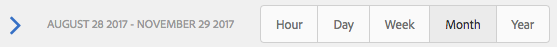

# Analyserar sidprestanda{#analyzing-page-performance}

Öppna sidan [Content Insight](/help/sites-authoring/content-insights.md) om du vill analysera prestandan för sidan som du redigerar. Konfigurera rapporteringsperioden så att analysen fokuseras.

## Öppna Analytics och Recommendations för en sida {#opening-analytics-and-recommendations-for-a-page}

Använd följande procedur för att visa Analytics och Recommendations för en sida:

1. Navigera till sidan som du vill analysera.
1. Klicka på **Analytics (Analyser) och Recommendations** i verktygsfältet.

   >[!NOTE]
   >
   >Analyser och Recommendations för en sida visas bara om du har konfigurerat AEM för att [integrera med Adobe Analytics](/help/sites-administering/adobeanalytics-connect.md).

   

### Ändra rapporteringsperioden {#changing-the-reporting-period}

Ändra följande tidsrelaterade aspekter av analysrapporterna:

* Den tidsperiod som ska rapporteras.
* Datas granularitet.

Verktygen för att ändra de tidsrelaterade aspekterna av rapporterna visas högst upp på sidan Innehållsinsikter. 

#### Ändra rapporteringsperioden {#changing-the-reporting-period-1}

Ändra rapporteringsperioden för Content Insight-sidan så att analysen av sidaktiviteten fokuseras till en viss tidsperiod. När du ändrar rapporteringsperioden uppdateras rapporterna automatiskt. Det skuggade området i tidsramen representerar rapporteringsperioden. Datumen i tidsramen ökar från vänster till höger.

Så här ändrar du rapporteringsperioden för en Content Insight-sida:

1. Om tidsramen inte visas överst på sidan klickar du på ikonen Växla tidsram.

   

1. Om du vill ändra startdatumet för rapportperioden drar du cirkeln som visas till vänster om det skuggade området till önskat startdatum.

   Om du inte kan se den vänstra sidan av det skuggade området använder du rullningslisten för att visa det.

1. Om du vill ändra slutdatumet för rapportperioden drar du cirkeln som visas till höger om det skuggade området till önskat slutdatum.

#### Ändra rapportperiodens kornighet {#changing-the-granularity-of-the-reporting-period}

Ändra den tid som varje datapunkt sträcker sig över i en rapport. Om du t.ex. markerar granulariteten för vecka, representerar varje datapunkt i rapporten Vyer antalet vyer under en vecka.

Granulariteten påverkar rapporter som anger data i förhållande till tid, t.ex. rapporter om Vyer och Genomsnittligt engagerade sidminuter. Kornigheten påverkar också skalan för tidsramen.

1. Om granularitetskontrollen inte visas klickar du på ikonen Växla granularitet.

   

1. Klicka på önskad granularitet. När du har valt det här alternativet uppdateras rapporten automatiskt så att den avspeglar granulariteten.

### Tilldela uppgifter för SEO Recommendations {#assigning-tasks-for-seo-recommendations}

Använd SEO Recommendations-rapporten för att skapa uppgifter för att förbättra sidsynligheten för sökmotorer. För varje rekommendation i rapporten som inte har någon bock kan du skapa en uppgift som du tilldelar en användare för att utföra det arbete som krävs.

Statusen för SEO-rekommendationen anger när uppgiften har skapats men inte slutförts än.

När uppgiften skapas visas den i användarens uppgiftslista. Mer information om uppgifter finns i [Arbeta med uppgifter](/help/sites-authoring/task-content.md).

Använd följande procedur för att skapa en uppgift för en SEO-rekommendation.

1. Klicka på informationsikonen för SEO-rekommendationen.

   

1. Klicka på den inringade triangeln som visas bredvid informationsikonen.

   

1. Fyll i formulärfälten som visas och välj Skapa:

   * Projekt: Välj i vilket projekt uppgiften ska skapas.
   * Namn: Namnet som identifierar uppgiften. Standardnamnet är titeln på SEO-rekommendationen.
   * Tilldela till: Välj den användare som ska tilldelas uppgiften. Börja skriva användarens namn för att filtrera listan.
   * Beskrivning: En beskrivning av aktiviteten som krävs för att slutföra uppgiften. Standardbeskrivningen är den information som medföljer SEO-rekommendationen.
   * Aktivitetsprioritet: Uppgiftens prioritet.
   * Förfallodatum: Det datum då uppgiften ska vara slutförd.

   **Obs!** Den uppgift som skapas innehåller även sökvägen till sidan som SEO-rekommendationen gäller för.

1. Klicka på Klar för att stänga meddelandet Aktiviteten har skapats.
