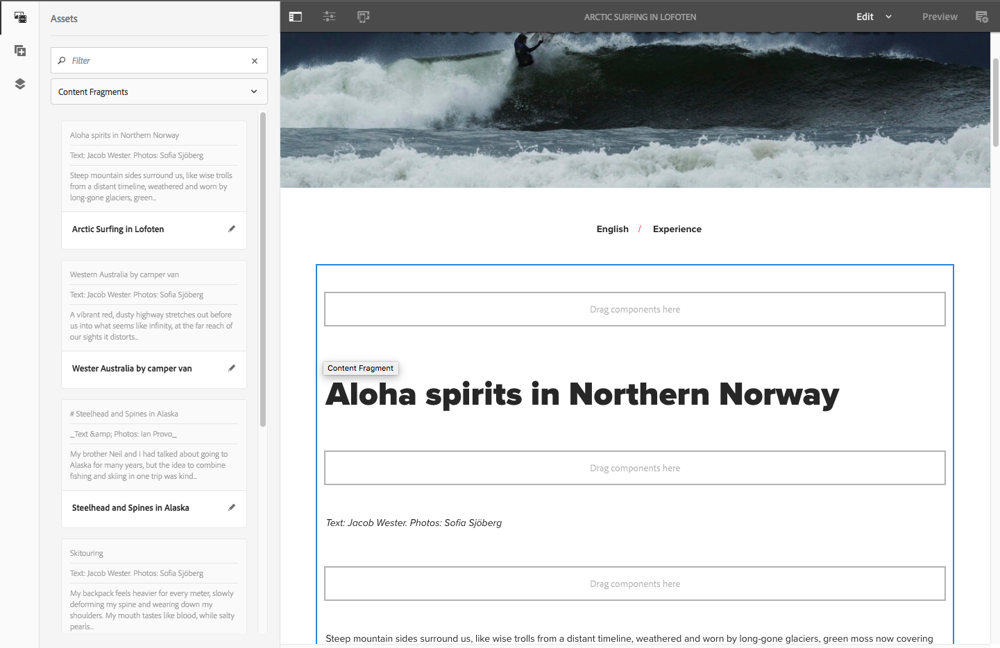

# Sidredigering med innehållsfragment{#page-authoring-with-content-fragments}

Innehållsfragment i Adobe Experience Manager (AEM) [skapas och hanteras som sidoberoende resurser](/help/assets/content-fragments/content-fragments.md).

Med dem kan du skapa kanalneutralt innehåll tillsammans med (eventuellt kanalspecifika) variationer. Du kan sedan använda dessa fragment och deras variationer när du redigerar innehållssidorna.

Tillsammans med den uppdaterade JSON-exporteraren kan strukturerade innehållsfragment även användas för att leverera AEM innehåll via Content Services till andra kanaler än AEM.

>[!NOTE]
>
>**Innehållsfragment** och **[Upplevelsefragment](/help/sites-authoring/experience-fragments.md)** är olika funktioner i AEM:
>
>* **Innehållsfragment** är redaktionellt innehåll, främst text och relaterade bilder. De är rent innehåll, utan design och layout.
>* **Upplevelsefragment** är helt utformat för innehåll, ett fragment av en webbsida.
>
>Upplevelsefragment kan innehålla innehåll i form av innehållsfragment, men inte tvärtom.

>[!CAUTION]
>
>Den här sidan måste läsas med [Arbeta med innehållsfragment](/help/assets/content-fragments/content-fragments.md) (och relaterade sidor) eftersom den innehåller grundläggande terminologi och koncept, tillsammans med att skapa och hantera fragment.

Innehållsfragmenten aktiverar:

* **Marknadsföring och kampanjstrategi**

   * Granska innehåll via centralt hanterade innehållsfragment.

* **Creative Pro**

   * Spåra kreativa resurser via samlingar som är kopplade till innehållsfragment.

* **Kopiera författare**

   * Skriv i AEM innehållsfragmentredigerare.
   * Kan skapa innehållsvariationer.
   * Kan associera relevant innehåll med innehållsfragmentet.
   * Kan använda versionshantering/arbetsflöde.
   * Kan dela innehållsfragment.
   * Kan hantera översättningar centralt.

* **Producenter och reseansvariga**

   * Välj bland fördefinierade fragment och variationer med AEM.
   * Kan förlita sig på att fragment och tillhörande innehåll alltid är uppdaterade när kopieringsförfattare och kreatörer uppdaterar centralt hanterade fragment och resurser.
   * Kan lita på att tillhörande medieinnehåll kurateras för relevans.
   * Kan skapa tillfälliga innehållsvariationer direkt samtidigt som dessa variationer förblir centralt hanterade i fragmentet.

## Lägga till ett innehållsfragment på sidan {#adding-a-content-fragment-to-your-page}

1. Öppna sidan för redigering.

1. Lägg till komponenten **Innehållsfragment**, antingen från webbläsaren **Komponenter** eller från **Infoga ny komponent**.

1. Du kan antingen:

   * Öppna webbläsaren **Assets** och filtrera efter **Innehållsfragment** (standardvärdet är Bilder). Dra sedan det önskade fragmentet till komponentinstansen.

   * Markera innehållskomponenten och **Konfigurera** i verktygsfältet. I dialogrutan kan du öppna valdialogrutan för att bläddra och välja önskat **innehållsfragment**.

   >[!NOTE]
   >
   >Ett annat sätt är att dra ett visst innehållsfragment direkt till sidan. Då skapas automatiskt den associerade komponenten (innehållsfragment).

1. Inledningsvis visas innehållet från elementet **Main** och **Master** (variation). Du kan [markera andra element och/eller variationer](#selecting-the-element-or-variation) efter behov.

   

   >[!NOTE]
   >
   >Mer information om ytterligare redigeringsfunktioner finns i:
   >
   >
   >
   >    * [Responsiv layout](/help/sites-authoring/responsive-layout.md)
   >    * [Redigera sidinnehåll](/help/sites-authoring/editing-content.md)
   >
   >

### Markera elementet eller variationen {#selecting-the-element-or-variation}

Öppna fragmentets dialogruta **Konfiguration** så att du kan konfigurera fragmentet för användning på den aktuella sidan. Dialogrutan kan vara beroende av vilken komponent som används.

I rätt konfigurationsdialogruta kan du välja tillgängliga parametrar, bland annat:

* **Innehållsfragment**

  Ange det fragment som ska användas.

* **Visningsläge**:

   * **Enkelt textelement**

   * **Flera element**

* **Element**

   * Standardvärdet **Main** är alltid tillgängligt.
   * En markering är tillgänglig om fragmentet skapades med en lämplig mall.

  >[!NOTE]
  >
  >Vilka element som är tillgängliga beror på vilken mall som används.

* **Variant**

   * **Mallen** är alltid tillgänglig som standard.
   * En markering är tillgänglig om variationer har skapats för fragmentet.

* **Stycken**: ange det styckeintervall som ska inkluderas:

   * **Alla**
   * **Intervall**: till exempel `1`, `3-5`, `9-*`

      * **Hantera rubriker som egna stycken**

* **Hantera rubriker som egna stycken**

### Snabb anslutning till Fragment Editor {#quick-connection-to-fragment-editor}

Du kan öppna fragmentkällan för redigering (resursen) med ikonen **Redigera** i komponentverktygsfältet. På så sätt kan du [redigera och hantera innehållsfragmentet](/help/assets/content-fragments/content-fragments.md).

>[!CAUTION]
>
>Som alltid kan redigering av fragmentkällan påverka alla sidor som refererar till det innehållsfragmentet.

### Lägga till mellaninnehåll {#adding-in-between-content}

När ett visst innehållsfragment läggs till på sidan finns det en **Drag-komponent här** mellan varje HTML-stycke (och längst upp/längst ned) i fragmentet.

Detta gör att du kan lägga till extra innehåll [däremellan (det vill säga mellanliggande innehåll)](/help/assets/content-fragments/content-fragments.md#in-between-content-when-page-authoring-with-content-fragments) i fragmentinnehållet (vid någon av de tillgängliga punkterna), utan att behöva ändra rotfragmentet.

För mellanliggande innehåll kan du:

* Lägg till komponenter från [komponentwebbläsaren](/help/sites-authoring/author-environment-tools.md#components-browser).
* Lägg till resurser från [Assets-webbläsaren](/help/sites-authoring/author-environment-tools.md#assets-browser).
* Använd [Associerat innehåll](#using-associated-content) som källa för mellanliggande innehåll.

>[!CAUTION]
>
>Det mellanliggande innehållet är sidinnehåll. Den lagras inte i innehållsfragmentet.

>[!NOTE]
>
>Du kan också [infoga visuella resurser (bilder) i själva fragmentet](/help/assets/content-fragments/content-fragments-variations.md#inserting-assets-into-your-fragment).
>
>Visuella resurser som infogats i själva fragmentet kopplas till föregående stycke i fragmentet. Det innebär att du inte kan placera innehåll mellan en visuell resurs och föregående stycke.

>[!CAUTION]
>
>När du har lagt till mellanliggande innehåll i ett innehållsfragment på sidan kan en ändring av strukturen för det underliggande innehållsfragmentet (det vill säga i innehållsfragmentets redigerare) leda till felaktiga/oväntade resultat.
>
>När detta inträffar behålls det mellanliggande innehållet som det är:
>
>* Mellanliggande komponenter har en absolut position inom komponentsekvensen i fragmentflödet. Den här positionen ändras inte, även när innehållet i styckena i fragmentet ändras.
>
>  Detta kan få det att se ut som om den relativa placeringen har ändrats, eftersom mellanliggande stycken inte har någon kontextuell relation till (fragmentet) stycken som de är placerade bredvid.
>* Såvida inte de två styckestrukturerna står i konflikt med varandra, visas inte det mellanliggande innehållet (även om det fortfarande finns internt).
>

### Använda associerat innehåll {#using-associated-content}

Om du har [associerat innehåll](/help/assets/content-fragments/content-fragments-assoc-content.md) med [innehållsfragmentet](/help/assets/content-fragments/content-fragments.md) är dessa resurser tillgängliga från sidopanelen (efter att du har placerat fragmentet på innehållssidan). Associerat innehåll är i själva verket en särskild innehållskälla för [mellanliggande innehåll](#adding-in-between-content).

>[!NOTE]
>
>Det finns olika metoder för att lägga till [visuella resurser (till exempel bilder)](/help/assets/content-fragments/content-fragments.md#fragments-with-visual-assets) till avsnittet och/eller sidan.

>[!NOTE]
>
>Om du har flera innehållsfragment på en sida visar fliken **Associerat innehåll** resurser som passar alla fragment.

När du har lagt till ett fragment med associerat innehåll på sidan öppnas en ny flik (**Associerat innehåll**) på sidopanelen.

Här kan du dra resurserna till önskad plats (antingen till en befintlig komponent eller till önskad plats där rätt komponent skapas):

### Assets infogat i fragmentet {#assets-inserted-into-the-fragment}

Om resurser (till exempel bilder) har infogats i själva fragmentet är alternativen för att redigera dessa resurser i sidredigeraren begränsade. <!-- Removed link as it was a 404 on helpx -->

För en bild kan du till exempel

* Beskär, rotera eller vänd bilden.
* Lägg till en titel eller alternativ text.
* Ange en storlek.
* Du kan också konfigurera layouten.

Andra ändringar, som att flytta, kopiera och ta bort, måste göras i fragmentredigeraren.

### Publicering {#publishing}

Fragment måste publiceras så att de kan användas på dina publicerade webbsidor:

* Ett fragment kan publiceras när [fragmentet har skapats i Assets-konsolen](/help/assets/content-fragments/content-fragments.md#publishingandreferencingafragment).
* Om ett *opublicerat fragment* används på en sida som publiceras, kan fragmentet också publiceras nu.
