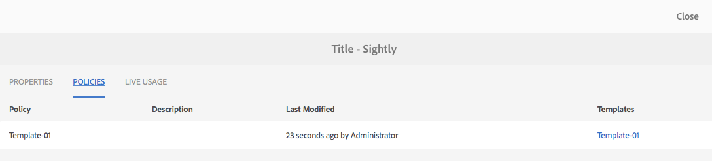

# Komponentkonsol{#components-console}

Med komponentkonsolen kan du bläddra igenom alla komponenter som definierats för instansen och visa nyckelinformation för varje komponent.

Den finns under **Verktyg ->** **Allmänt ->** **Komponenter**. I konsolen finns kortvyn och listvyn. Eftersom det inte finns någon trädstruktur för komponenter är kolumnvyn inte tillgänglig.

>[!NOTE]
>
>Komponentkonsolen visar alla komponenter i systemet. The [Komponentbläddraren](/help/sites-authoring/author-environment-tools.md#components-browser) visar komponenter som är tillgängliga för författare och döljer komponentgrupper som börjar med en punkt ( `.`).

## Sökning {#searching}

Med ikonen **Endast innehåll** (överst till vänster) kan du öppna **sökpanelen** och söka efter och/eller filtrera komponenterna:

### Komponentinformation {#component-details}

Om du vill visa information om en viss komponent trycker/klickar du på den nödvändiga resursen. Tre flikar innehåller:

* **Egenskaper**

  

  På fliken Egenskaper kan du:

   * Visa komponentens allmänna egenskaper.
   * Visa hur [ikon eller förkortning har definierats](/help/sites-developing/components-basics.md#component-icon-in-touch-ui) för komponenten.

      * Om du klickar på ikonens källa kommer du till den komponenten.

   * Visa **Resurstyp** och **Resurssupertyp** (om det är definierat) för komponenten.

      * Om du klickar på Resurssupertypen kommer du till den komponenten.

  >[!NOTE]
  >
  >För `/apps` går inte att redigera vid körning, komponentkonsolen är skrivskyddad.

* **Profiler**

  

* **Live-användning**

  

  >[!CAUTION]
  >
  >På grund av den typ av information som samlas in för den här vyn kan det ta en stund att sortera/visa informationen.

* **Dokumentation**

  Om utvecklaren har tillhandahållit [dokumentation för komponenten](/help/sites-developing/developing-components.md#documenting-your-component)visas den på **Dokumentation** -fliken. Om det inte finns någon tillgänglig dokumentation **Dokumentation** kommer inte att visas.

  
