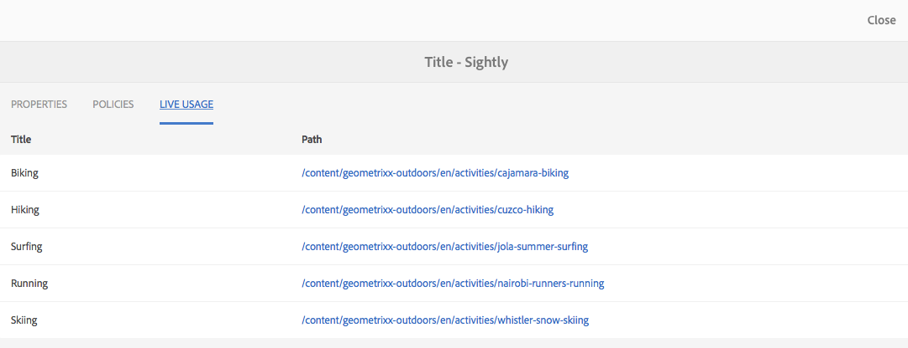

# Komponentkonsol{#components-console}

Med komponentkonsolen kan du bläddra igenom alla komponenter som definierats för instansen och visa nyckelinformation för varje komponent.

Den finns under **Verktyg ->** Allmänt -> **** Komponenter ****. I konsolen är kort- och listvyn tillgängliga. Eftersom det inte finns någon trädstruktur för komponenter är kolumnvyn inte tillgänglig.

>[!NOTE]
>
>Komponentkonsolen visar alla komponenter i systemet. I [komponentwebbläsaren](/help/sites-authoring/author-environment-tools.md#components-browser) visas komponenter som är tillgängliga för författare och alla komponentgrupper som börjar med en punkt ( `.`) döljs.

## Sök {#searching}

Med ikonen Endast **** innehåll (överst till vänster) kan du öppna **sökpanelen** och söka efter och/eller filtrera komponenterna:

### Komponentinformation {#component-details}

Om du vill visa information om en viss komponent trycker/klickar du på den nödvändiga resursen. Tre flikar innehåller:

* **Egenskaper**

   

   På fliken Egenskaper kan du:

   * Visa komponentens allmänna egenskaper.
   * Visa hur [ikonen eller förkortningen har definierats](/help/sites-developing/components-basics.md#component-icon-in-touch-ui) för komponenten.

      * Om du klickar på ikonens källa kommer du till den komponenten.
   * Visa komponentens **resurstyp** och **resurssupertyp** (om den är definierad).

      * Om du klickar på Resurssupertypen kommer du till den komponenten.
   >[!NOTE]
   >
   >Eftersom `/apps` inte kan redigeras under körning är komponentkonsolen skrivskyddad.

* **Profiler**

   

* **Live-användning**

   

   >[!CAUTION]
   >
   >På grund av den typ av information som samlas in för den här vyn kan det ta en stund att sortera/visa informationen.

* **Dokumentation**

   Om utvecklaren har tillhandahållit [dokumentation för komponenten](/help/sites-developing/developing-components.md#documenting-your-component)visas den på fliken **Dokumentation** . Om det inte finns någon tillgänglig dokumentation visas inte fliken **Dokumentation** .

   

