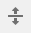

# Konfigurera komponenter i designläge{#configuring-components-in-design-mode}

När AEM-instansen är installerad direkt är ett urval av komponenter omedelbart tillgängliga i komponentwebbläsaren.

Förutom dessa finns även andra komponenter tillgängliga. Du kan använda designläget för att [aktivera/inaktivera sådana komponenter](#enable-disable-components). När det är aktiverat och finns på sidan kan du sedan använda designläget för att [konfigurera olika aspekter av komponentdesignen](#configuring-the-design-of-a-component) genom att redigera attributparametrarna.

>[!NOTE]
>
>Försiktighet måste iakttas vid redigering av dessa komponenter. Designinställningarna är ofta en viktig del av designen för hela webbplatsen, så de bör bara ändras av någon med rätt behörighet och upplevelse, ofta en administratör eller en utvecklare. Mer information finns i [Utveckla komponenter](/help/sites-developing/components.md) .

>[!NOTE]
>
>Designläget är bara tillgängligt för statiska mallar. Mallar som skapas med redigerbara mallar bör redigeras med [mallredigeraren](/help/sites-authoring/templates.md).

>[!NOTE]
>
>Designläget är bara tillgängligt för designkonfigurationer som lagras som innehåll under ( `/etc`).
>
>Från och med AEM 6.4 rekommenderar vi att du lagrar designer som konfigurationsdata under `/apps` för att stödja scenarier med kontinuerlig driftsättning. Designer som lagras under `/apps` kan inte redigeras under körning och designläget är inte tillgängligt för användare som inte är administratörer för sådana mallar.

Det innebär att du lägger till eller tar bort de komponenter som är tillåtna i sidans styckesystem. Styckesystemet ( `parsys`) är en sammansatt komponent som innehåller alla andra styckekomponenter. Med styckesystemet kan författare lägga till komponenter av olika typer på en sida eftersom det innehåller alla andra styckekomponenter. Varje stycketyp representeras som en komponent.

Innehållet på en produktsida kan till exempel innehålla ett styckesystem som innehåller följande:

* En bild av produkten (i form av en bild eller ett textimagestycke)
* Produktbeskrivningen (som ett textstycke)
* En tabell med tekniska uppgifter (som ett tabellstycke)
* En formuläranvändare fyller i (när ett formulär börjar, formulärelement och slutstycke för formulär)

>[!NOTE]
>
>Mer information om hur du använder mallar och komponenter finns i [Utveckla komponenter](/help/sites-developing/components.md) och [Riktlinjer för användning av mallar och komponenter](/help/sites-developing/dev-guidelines-bestpractices.md#guidelines-for-using-templates-and-components) `parsys`.

>[!CAUTION]
>
>Vi rekommenderar att du definierar design av statiska mallar genom att redigera designen i designläge enligt beskrivningen i den här artikeln
>
>Det är till exempel inte bra att ändra designen i CRX DE och tillämpningen av den kan variera från förväntat beteende. Mer information finns i utvecklardokumentet [Sidmallar - statisk](/help/sites-developing/page-templates-static.md#how-template-designs-are-applied) .

## Aktivera/inaktivera komponenter {#enable-disable-components}

Så här aktiverar eller inaktiverar du en komponent:

1. Välj **designläge** .

   

1. Tryck eller klicka på en komponent. Komponenten får en blå kantlinje när den markeras.

   

1. Klicka på eller tryck på ikonen **Överordnad** .

   

   Då väljs det styckesystem som innehåller den aktuella komponenten.

1. Ikonen **Konfigurera** för styckesystemet visas i det överordnade objektets åtgärdsfält.

   

   Välj det här alternativet om du vill visa dialogrutan.

1. Använd dialogrutan för att definiera de komponenter som är tillgängliga i komponentwebbläsaren när du redigerar den aktuella sidan.

   

   Dialogrutan har två flikar:

   * Tillåtna komponenter
   * Inställningar
   **Tillåtna komponenter**

   På fliken **Tillåtna komponenter** definierar du vilka komponenter som är tillgängliga för parsysen.

   * Komponenterna grupperas efter komponentgrupperna, som kan expanderas och komprimeras.
   * Du kan markera en hel grupp genom att markera gruppnamnet och avmarkera alla genom att avmarkera kryssrutan.
   * Ett minustecken representerar minst ett, men inte alla, objekt i en grupp markeras.
   * En sökning är tillgänglig för att filtrera efter en komponent efter namn.
   * Antalet som visas till höger om komponentgruppens namn representerar det totala antalet valda komponenter i dessa grupper oavsett filtret.
   Du definierar konfigurationen per sidkomponent. Om underordnade sidor använder samma mall och/eller sidkomponent (vanligtvis justerad) används samma konfiguration för motsvarande styckesystem.

   >[!NOTE]
   >
   >Adaptiva formulärkomponenter är utformade för att fungera i adaptiva formulärbehållare för att utnyttja Forms-ekosystemet. Därför får dessa komponenter endast användas i en anpassad formulärredigerare och de fungerar inte i sidredigeraren Platser.

   **Inställningar**

   På fliken **Inställningar** kan du definiera ytterligare alternativ som att rita en ankarpunkt för varje komponent och definiera cellutfyllnaden för varje behållare.

1. Välj **Klar** för att spara konfigurationen.

## Konfigurera designen för en komponent {#configuring-the-design-of-a-component}

1. Välj **designläge** .

   

1. Tryck eller klicka på en komponent med en blå ram. I det här exemplet markeras en hjältebildkomponent.

   

1. Använd ikonen **Konfigurera** för att öppna dialogrutan.

   

   I designdialogrutan kan du konfigurera komponenten enligt tillgängliga designparametrar.

   

   Dialogrutan har tre flikar:

   * Huvud
   * Funktioner
   * Format
   **Egenskaper**

   På fliken **Egenskaper** kan du konfigurera komponentens viktiga designparametrar. För en bildkomponent kan du till exempel definiera den största och minsta tillåtna storleken för bilden.

   **Funktioner**

   På fliken **Funktioner** kan du aktivera eller inaktivera ytterligare funktioner för komponenten. För en bildkomponent kan du till exempel definiera bildens orientering, tillgängliga beskärningsalternativ och om en bild kan överföras.

   **Format**

   På fliken **Format** kan du definiera de CSS-klasser och -format som ska användas med komponenten.

   

   Använd knappen **Lägg** till om du vill lägga till fler poster i en dialogrutelista där flera poster ingår.

   

   Använd ikonen** Ta bort **för att ta bort en post från en dialogrutelista med flera poster.

   

   Använd ikonen **Flytta** för att ändra ordningen på posterna i en flerpostsdialogruta.

   

1. Klicka på eller tryck på ikonen **Klar** för att spara och stänga dialogrutan.

