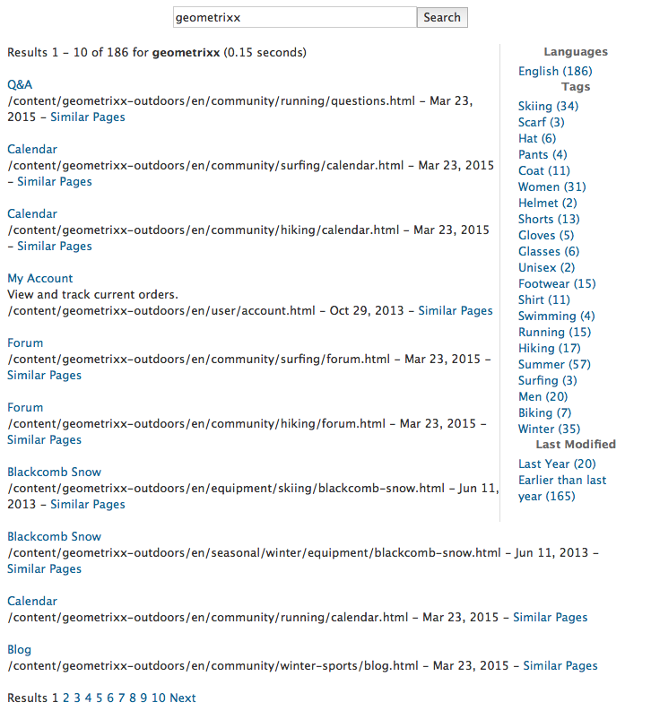
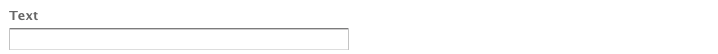

# Foundation Components {#foundation-components}

>[!CAUTION]
>
>De flesta Foundation Components är nu föråldrade med AEM 6.5. Mer information finns i [versionsinformationen](/help/release-notes/deprecated-removed-features.md).
>
>Adobe rekommenderar att du använder de mer moderna och utbyggbara [kärnkomponenterna](https://experienceleague.adobe.com/docs/experience-manager-core-components/using/introduction.html) i AEM-projekt. De här komponenterna ingår i [Web.Retail-exempelinnehållet](/help/sites-developing/we-retail.md) och kan även [installeras separat och användas för utveckling](https://experienceleague.adobe.com/docs/experience-manager-core-components/using/get-started/using.html) av administratören.
>
>Du kan använda [AEM Modernize Tools Suite](https://opensource.adobe.com/aem-modernize-tools/) för att omforma din Foundation Components-baserade webbplats så att du kan använda Core Components.

Grundekomponenterna har utformats för att användas vid utveckling av innehåll för en standardwebbsida. De utgör en delmängd av de komponenter som finns för en standardinstallation av AEM.

Vissa är tillgängliga direkt via komponentwebbläsaren. Flera andra är också tillgängliga genom att använda [designläget](/help/sites-authoring/default-components-designmode.md) (om sidan är baserad på en statisk mall) eller genom att [redigera mallen](/help/sites-authoring/templates.md) (om sidan är baserad på en redigerbar mall).

Det finns stöd för att använda grundkomponenter, men de har i huvudsak ersatts och ersatts av kärnkomponenter som erbjuder större flexibilitet och utbyggbarhet.

>[!NOTE]
>
>I det här avsnittet behandlas endast komponenter som finns i en färdig AEM-standardinstallation.
>
>Beroende på vilken instans du har kan du ha utvecklat anpassade komponenter som är särskilt anpassade för dina behov. Dessa anpassade komponenter kan till och med ha samma namn som några av de komponenter som beskrivs här.

Komponenterna är tillgängliga på fliken **Komponenter** på sidpanelen i sidredigeraren när du [redigerar en sida](/help/sites-authoring/editing-content.md).

Du kan markera en komponent och dra den till önskad plats på sidan. Du kan sedan redigera den med:

* [Konfigurera egenskaper](/help/sites-authoring/editing-page-properties.md)
* [Redigera innehåll](/help/sites-authoring/editing-content.md)

* [Redigera innehåll - helskärmsläge](/help/sites-authoring/editing-content.md#edit-content-full-screen-mode)

Komponenterna sorteras efter olika kategorier, så kallade komponentgrupper, inklusive:

* [Allmänt](#general): Innehåller grundläggande komponenter, inklusive text, bilder, tabeller och diagram.
* [Kolumner](#columns): Inkluderar komponenter som krävs för att ordna innehållets layout.
* [Formulär](#formgroup): Innehåller alla komponenter som behövs för att skapa ett formulär.

## Allmänt {#general}

De allmänna komponenterna är de grundläggande komponenter som du använder för att skapa innehåll.

### Kontouppsättning {#account-item}

>[!CAUTION]
>
>Denna Foundation-komponent är föråldrad. Adobe rekommenderar att du använder [kärnkomponenterna](https://experienceleague.adobe.com/docs/experience-manager-core-components/using/introduction.html) i stället.

Du kan definiera en länk med rubrik och beskrivning.


### Adaptiv bild {#adaptive-image}

>[!CAUTION]
>
>Denna Foundation-komponent är föråldrad. Adobe rekommenderar att du använder [Image Core Component](https://experienceleague.adobe.com/docs/experience-manager-core-components/using/wcm-components/image.html) i stället.

Med komponenten Adaptive Image Foundation genereras bilder som är storleksanpassade för att passa det fönster där webbsidan öppnas. Om du vill använda komponenten anger du en bildresurs från filsystemet eller DAM. När webbsidan öppnas hämtar webbläsaren en kopia av bilden som har ändrat storlek så att den passar för det aktuella fönstret.

Följande egenskaper kan avgöra fönstrets storlek:

* Enhetsskärm: Mobila enheter visar vanligtvis webbsidor så att de sträcker sig över hela skärmen.
* Webbläsarfönsterstorlek: Användare av bärbara och stationära datorer kan ändra storlek på webbläsarfönster.

Komponenten genererar till exempel en liten bild när webbsidan öppnas på en mobiltelefon och en medelstor bild när den öppnas på en surfplatta. På en bärbar dator skapar och levererar komponenten en stor bild när sidan öppnas i en maximerad webbläsare. När webbläsarens storlek ändras för att passa en del av skärmen anpassas komponenten genom att en mindre bild visas och vyn uppdateras.

#### Bildformat som stöds {#supported-image-formats}

Du kan använda bildfiler med följande filnamnstillägg med komponenten Adaptive Image:

* .jpg
* .jpeg
* .png
* .gif &#42;&#42;

>[!CAUTION]
>
>Animerade GIF-filer stöds inte i AEM för adaptiva återgivningar.

#### Bildstorlekar och -kvalitet {#images-sizes-and-quality}

I följande tabell visas bredden på bilden som genereras för den angivna visningsrutans bredd. Höjden på den genererade bilden beräknas för att bibehålla en konstant proportion och inget mellanrum inträffar inuti bildkanten. Beskärning kan användas för att undvika mellanrum.

När bilden är en JPEG-bild kan visningsrutans storlek även påverka JPEG kvalitet. Följande JPEG-egenskaper är möjliga:

* Låg (0,42)
* Medium (0.82)
* Hög (1,00)

| **Breddintervall för visningsruta (pixlar)** | **Bildbredd (pixlar)** | **JPEG-kvalitet** | **Målenhetstyp** |
|---|---|---|---|
| width &lt;= 319 | 320 | låg |  |
| width = 320 | 320 | medium | Mobiltelefon (stående) |
| 320 &lt; bredd &lt; 481 | 480 | medium | Mobiltelefon (liggande) |
| 480 &lt; bredd &lt; 769 | 476 | hög | Tablet PC (stående) |
| 768 &lt; bredd &lt; 1025 | 620 | hög | Tablet (liggande) |
| width &lt;= 1025 | full (ursprunglig storlek) | hög | Skrivbord |

#### Egenskaper {#properties}

I dialogrutan kan du redigera egenskaper för din instans av komponenten Adaptiv bild, som många är gemensamma för den Image-komponent som den baseras på. Egenskaperna finns på två flikar:

* **Bild**

   * **Bild**
Dra en bild från innehållssökaren eller klicka för att öppna ett bläddringsfönster där du kan läsa in en bild. När bilden har lästs in kan du beskära bilden, rotera den eller ta bort den. Om du vill zooma in och ut i bilden använder du bildfältet under bilden (ovanför knapparna OK och Avbryt)

   * **Beskär**
Klipp ut en del av en bild. Dra kanten för att beskära bilden.

   * **Rotera**
Klicka på Rotera upprepade gånger tills bilden roteras som du vill.

   * **Rensa**
Ta bort den aktuella bilden.

* **Avancerat**

   * **Titel**
Komponenten Adaptiv bild använder inte den här egenskapen.

   * **Alt-text**
Den alternativa text som ska användas för bilden.

   * **Länka till**
Komponenten Adaptiv bild använder inte den här egenskapen.

   * **Beskrivning**
Komponenten Adaptiv bild använder inte den här egenskapen.

#### Utöka den adaptiva bildkomponenten {#extending-the-adaptive-image-component}

Mer information om hur du anpassar komponenten Adaptiv bild finns i [Förstå komponenten Adaptiv bild](/help/sites-developing/responsive.md#using-adaptive-images).

### Karusell {#carousel}

>[!CAUTION]
>
>Denna Foundation-komponent är föråldrad. Adobe rekommenderar att du använder [Carousel Core-komponenten](https://experienceleague.adobe.com/docs/experience-manager-core-components/using/wcm-components/carousel.html) i stället.

Med Carousel-komponenten kan du visa bilder som är kopplade till enskilda sidor:

* en åt gången
* under en kort tid
* i den ordning du anger
* med en tidsfördröjning som du anger

Med klickbara kontroller kan användaren även bläddra igenom de visade sidorna i realtid, vid behov. Om du väljer den sidbild som är synlig kommer du till den sidan. Carousel fungerar med andra ord som navigeringskontroll.

#### Egenskaper {#properties-1}

Dessa egenskaper är tillgängliga på två flikar:

* **Carousel**
Här anger du hur karusellen fungerar:

   * Uppspelningshastighet
Tiden i millisekunder innan nästa bild visas.
   * Övergångstid
Tiden i millisekunder för övergången mellan två bildrutor.
   * Kontrollformat
Det finns olika alternativ på en nedrullningsbar meny, till exempel Föregående/Nästa-knappar och Överst till höger-växlar.

* **Lista**

  Här anger du hur sidorna ska inkluderas i Carousel:

   * **Skapa lista med**
Du kan skapa en sidlista på flera olika sätt: Underordnade sidor, Fast lista, Sök eller Avancerad sökning (alla beskrivs nedan).
Oavsett vilken metod du väljer bör sidorna som du inkluderar i listan redan ha en bild kopplad till sidan. Det är den här bilden som visas i Carousel. Om det inte finns någon bild för en viss sida under sidans Sidegenskaper bör du koppla en bild till sidan innan du börjar. Om du inte gör det visas en nästan tom sida. Se [Redigera sidegenskaper](/help/sites-authoring/editing-page-properties.md).
Beroende på vilket objekt du väljer visas en ny panel:

      * **Alternativ för underordnade sidor**

         * **Överordnad sida**
Ange en bana antingen manuellt eller med väljaren. Lämna tomt om du vill använda den aktuella sidan som överordnad.

      * **Alternativ för fast lista**

         * **Sidor**
Välj en lista med sidor. Använd `+` för att lägga till fler poster och upp-/nedknapparna för att justera ordningen.

      * **Alternativ för sökning**

         * **Starta i**
Ange en startbana, antingen manuellt eller med väljaren.

         * **Sökfråga**
Du kan ange en vanlig textsökningsfråga.

      * **Alternativ för avancerad sökning**

         * **Querybuilder-predikatnotation**
Du kan ange en sökfråga med Querybuilder-predikatnotation. Du kan till exempel ange &quot;fulltext=Marketing&quot; om du vill att alla sidor med &quot;Marketing&quot; i innehållet ska visas i Carousel.
Mer information om frågeuttryck och fler exempel finns i [QueryBuilder API](/help/sites-developing/querybuilder-api.md) .

   * **Beställ av**
Välj `jcr:title`, `jcr:created`, `cq:lastModified` eller `cq:template` i listrutan.

   * **Gräns**
Valfritt. Det maximala antalet objekt som du vill använda i Carousel.

>[!NOTE]
>
>Du kan skapa en anpassad karusellkomponent för Adobe Experience Manager som visar digitala resurser i AEM DAM. Se [Skapa anpassade Carousel-komponenter för Adobe Experience Manager](https://experienceleague.adobe.com/docs/experience-manager-learn/getting-started-wknd-tutorial-develop/overview.html).

### Diagram {#chart}

>[!CAUTION]
>
>Denna Foundation-komponent är föråldrad. Adobe rekommenderar att du använder [kärnkomponenterna](https://experienceleague.adobe.com/docs/experience-manager-core-components/using/introduction.html) i stället.

Med diagramkomponenten kan du lägga till ett stapel-, linje- eller cirkeldiagram. AEM skapar ett diagram utifrån de data du anger. Du anger data genom att skriva direkt på fliken Data eller genom att kopiera och klistra in ett kalkylblad.

* **Data**

   * **Diagramdata**
Ange diagramdata i CSV-format. För formatet Kommaavgränsade värden används kommatecken (&quot;,&quot;) som fältavgränsare.

* **Avancerat**

   * **Diagramtyp**
Välj mellan cirkeldiagram, linjediagram och stapeldiagram.

   * **Alternativ text**
Visar alternativ text i stället för diagrammet.

   * **Bredd**
Diagrammets bredd i pixlar.

   * **Höjd**
Diagrammets höjd i pixlar.

I följande exempel visas ett exempel på diagramdata följt av det resulterande stapeldiagrammet:

 

>[!NOTE]
>
>Du kan skapa en anpassad AEM-diagramkontroll som visar data i AEM JCR. Mer information finns i [Visa Adobe Experience Manager-data i ett diagram](https://experienceleague.adobe.com/docs/experience-manager-learn/getting-started-wknd-tutorial-develop/overview.html).

### Innehållsfragment {#content-fragment}

>[!CAUTION]
>
>Denna Foundation-komponent är föråldrad. Adobe rekommenderar att du använder [kärnkomponenten för innehållsfragment](https://experienceleague.adobe.com/docs/experience-manager-core-components/using/wcm-components/content-fragment-component.html) i stället.

[Innehållsfragment](/help/sites-authoring/content-fragments.md) skapas och hanteras som sidoberoende resurser. Du kan sedan använda dessa fragment och deras variationer när du redigerar innehållssidorna.

### Designimporteraren {#design-importer}

>[!CAUTION]
>
>Denna Foundation-komponent är föråldrad. Adobe rekommenderar att du använder [kärnkomponenterna](https://experienceleague.adobe.com/docs/experience-manager-core-components/using/introduction.html) i stället.

Med den här komponenten kan du överföra en ZIP-fil som innehåller ett designpaket.

### Ladda ned {#download}

>[!CAUTION]
>
>Denna Foundation-komponent är föråldrad. Adobe rekommenderar att du använder [kärnkomponenterna](https://experienceleague.adobe.com/docs/experience-manager-core-components/using/introduction.html) i stället.

Komponenten Download skapar en länk på den valda webbsidan för att hämta en viss fil. Du kan antingen dra en resurs från Content Finder eller överföra en fil.

* **Hämta**

   * **Beskrivning**
En kort beskrivning med nedladdningslänken.

   * **Fil**
Den fil som är tillgänglig för hämtning på den slutliga webbsidan. Dra en resurs från innehållssökaren eller markera området så att du kan överföra filen som du vill ha tillgänglig för hämtning.

I följande exempel visas komponenten Download i Geometrixx:


### Extern {#external}

>[!CAUTION]
>
>Denna Foundation-komponent är föråldrad. Adobe rekommenderar att du använder [kärnkomponenterna](https://experienceleague.adobe.com/docs/experience-manager-core-components/using/introduction.html) i stället.

Med den externa programintegrationskomponenten (**External**) kan du bädda in externa program på din AEM-sida med hjälp av en iframe.

* **Extern**

   * **Målprogram**
Ange URL-adressen till webbprogrammet som ska integreras, till exempel:

     ```
     https://en.wikipedia.org/wiki/Main_Page
     ```

   * **Skicka parametrar**
Markera rutan för parametrar som ska skickas till programmet när det behövs.

   * **Bredd och höjd
**Definiera storleken på iframe

Det externa programmet är integrerat i styckesystemet på AEM-sidan, till exempel när du använder ett målprogram på `https://en.wikipedia.org/wiki/Main_Page`:


>[!NOTE]
>
>Beroende på ditt sätt att arbeta är andra alternativ tillgängliga för integrering av externa program, till exempel [Integrering av portlets](/help/sites-administering/aem-as-portal.md).

### Flash {#flash}

>[!CAUTION]
>
>Denna Foundation-komponent är föråldrad. Adobe rekommenderar att du använder [kärnkomponenterna](https://experienceleague.adobe.com/docs/experience-manager-core-components/using/introduction.html) i stället.

>[!CAUTION]
>
>Den här komponenten förväntas inte längre fungera utan omfattande anpassning på projektnivå.

Med Flash-komponenten kan du läsa in en Flash-film. Du kan dra en Flash-resurs från innehållssökaren till komponenten eller använda dialogrutan:

* **Flash**

   * **Flash-film**

     Flash-filmfilen. Dra en resurs från innehållssökaren eller klicka för att öppna ett bläddringsfönster.

   * **Storlek**

     Mått i pixlar på visningsområdet där filmen finns.

* **Alternativ bild**

  En alternativ bild som ska visas

* **Avancerat**

   * **Snabbmeny**

     Anger om snabbmenyn ska visas eller döljas.

   * **Fönsterläge**

     Hur fönstret visas, till exempel ogenomskinligt, genomskinligt eller som ett distinkt (heldraget) fönster.

   * **Bakgrundsfärg**

     En bakgrundsfärg som valts i färgdiagrammet.

   * **Minimiversion**

     Den lägsta version av Adobe Flash Player som krävs för att köra filmen. Standardvärdet är 9.0.0.

   * **Attribut**

     Ytterligare attribut krävs.

### Bild {#image}

>[!CAUTION]
>
>Denna Foundation-komponent är föråldrad. Adobe rekommenderar att du använder [Image Core Component](https://experienceleague.adobe.com/docs/experience-manager-core-components/using/wcm-components/image.html) i stället.

I bildkomponenten visas en bild och tillhörande text enligt de angivna parametrarna.

Du kan överföra en bild och sedan redigera den (till exempel beskära, rotera, lägga till länk/titel/text).

Du kan antingen dra och släppa en bild från [Assets Browser](/help/sites-authoring/author-environment-tools.md#assets-browser) direkt till komponenten eller dess [Konfigurera-dialogruta](/help/sites-authoring/editing-content.md#component-edit-dialog). Du kan också överföra en bild från dialogrutan Konfigurera. I den här dialogrutan finns även information om alla definitioner och ändringar av bilden:


När bilden har överförts (och inte före) kan du använda [infogningsredigering](/help/sites-authoring/editing-content.md#edit-content) för att beskära/rotera bilden efter behov:


>[!NOTE]
>
>I redigeraren på plats används bildens ursprungliga storlek och proportioner vid redigering. Du kan också ange höjd- och breddegenskaper. Alla storleks- och proportionsbegränsningar som definieras i egenskaperna används när du sparar redigeringsändringarna.
>
>Beroende på din instans kan minimi- och maximinivåer även anges av sidans [design](/help/sites-developing/designer.md). Dessa begränsningar utvecklas under projektgenomförandet.

Flera ytterligare alternativ finns i helskärmsläge, till exempel karta och zoomning:


>[!NOTE]
>
>Överföringens förlopp kan inte övervakas med Internet Explorer.
>
>Internet Explorer-användare måste överföra bilden och klicka på **OK**. Öppna sedan bilden igen för att se den överförda filen i förhandsgranskningen och för att kunna utföra ändringar (d.v.s. beskära).
>
>Mer information om HTML5-funktioner som används av AEM finns i avsnittet [Certifierade plattformar](/help/release-notes/release-notes.md#certifiedplatforms).

När en bild har lästs in kan du konfigurera följande:

* **Karta**

  Om du vill mappa en bild väljer du Karta. Du kan ange hur du vill skapa bildschemat (rektangel, polygon och så vidare) och var området ska peka.

* **Beskär**

  Välj Beskär om du vill klippa ut en del av en bild. Beskär bilden med musen.

* **Rotera**

  Om du vill rotera en bild väljer du Rotera. Använd det här alternativet upprepade gånger tills bilden roteras som du vill ha den.

* **Rensa**

  Ta bort den aktuella bilden.

* **Titel**

  Bildens titel.

* **Alt-text**

  En alternativ text som kan användas när hjälpmedelsanpassat innehåll skapas.

* **Länka till**

  Skapa en länk till resurser eller andra sidor på webbplatsen.

* **Beskrivning**

  En beskrivning av bilden.

* **Storlek**

  Anger bildens höjd och bredd.

>[!NOTE]
>
>Vissa alternativ är bara tillgängliga i helskärmsredigeraren.

Den slutliga bilden (med **Rubrik** och **Beskrivning**) kan visas som:


### Layoutbehållare {#layout-container}

Den här komponenten innehåller ett rutnätsstyckesystem där du kan lägga till och placera komponenter i ett [responsivt rutnät](/help/sites-authoring/responsive-layout.md). Du kan definiera olika innehållslayouter baserat på bredden på målenheterna, inklusive en rad telefoner, surfplattor och datorer.


>[!NOTE]
>
>Den här komponenten har implementerats med [HTML Template Language (HTL)](https://experienceleague.adobe.com/docs/experience-manager-htl/content/overview.html).

### Lista {#list}

>[!CAUTION]
>
>Denna Foundation-komponent är föråldrad. Adobe rekommenderar att du använder [List Core Component](https://experienceleague.adobe.com/docs/experience-manager-core-components/using/wcm-components/list.html) i stället.

Med List-komponenten kan du konfigurera sökvillkor för att visa en lista:

* **Lista**

   * **Skapa lista med**

     Här anger du var i listan innehållet hämtas. Det finns flera metoder:

   * Beroende på vilket objekt du väljer visas en ny panel:

      * **Alternativ för underordnade sidor**

         * **Underordnade till** (överordnad sida)

           Ange en bana antingen manuellt eller med väljaren. Lämna tomt om du vill använda den aktuella sidan som överordnad.

      * **Alternativ för fast lista**

         * **Sidor**

           Välj en lista med sidor. Använd + för att lägga till fler poster och upp-/nedknapparna för att justera ordningen.

      * **Alternativ för sökning**

         * Starta i

           Ange en startbana, antingen manuellt eller med väljaren.

         * Sökfråga

           Du kan ange en vanlig textsökningsfråga.

      * **Alternativ för avancerad sökning**

         * **Querybuilder-predikatnotation**

           Du kan ange en sökfråga med Querybuilder-predikatnotation. Du kan till exempel ange &quot;fulltext=Marketing&quot; om du vill att alla sidor med &quot;Marketing&quot; i innehållet ska visas i Carousel.

           Mer information om frågeuttryck och fler exempel finns i [QueryBuilder API](/help/sites-developing/querybuilder-api.md) .

      * **Taggar**

        Ange den **överordnade sidan**, **taggar/nyckelord** och de matchningsvillkor som krävs.

   * **Visa som**

     Hur du vill att objekten ska visas: innehåller länkar, lärare och nyheter.

   * **Beställ av**

     Anger om listan ska ordnas och i så fall vilka villkor som ska användas för sorteringen. Du kan ange ett villkor eller välja ett i listrutan.

   * **Gräns**

     Ange det maximala antalet objekt som ska visas i listan.

   * **Aktivera feed**

     Anger om en RSS-feed ska aktiveras för listan.

   * **Sidnumrera efter**

     Här kan du ange hur många listobjekt som ska visas samtidigt. En lista med fler objekt än angivet använder sidnumrering för att visa listan i flera delar.

I följande exempel visas en **List** -komponent på samma sätt som en lista med underordnade sidor (designen styrs av en webbplatsdesigns anpassade CSS-definitioner).


### Inloggning {#login}

>[!CAUTION]
>
>Denna Foundation-komponent är föråldrad. Adobe rekommenderar att du använder [kärnkomponenterna](https://experienceleague.adobe.com/docs/experience-manager-core-components/using/introduction.html) i stället.

>[!CAUTION]
>
>Den här komponenten förväntas inte längre fungera utan omfattande anpassning på projektnivå.

Tillhandahåller fälten Användarnamn och Lösenord.


Du kan konfigurera

* Logga in

   * Avsnittsetikett

     Inledande text för inmatningsfälten.

   * Etikett för användarnamn

     Text som ska etikettera användarnamnsfältet.

   * Lösenordsetikett

     Text som ska etikettera lösenordsfältet.

   * Etikett för inloggningsknapp

     Text för inloggningsknappen.

   * Omdirigera till

     Du kan ange vilken sida på webbplatsen som ska öppnas när användaren har loggat in.

* Redan inloggad

   * Knappetiketten Fortsätt

     Text som anger att användaren redan är inloggad.

### Orderstatus {#order-status}

>[!CAUTION]
>
>Den här komponenten förväntas inte längre fungera utan omfattande anpassning på projektnivå.

* **Titel**

   * **Titel**

     Ange den titeltext som du vill visa.

   * **Länk**

     Ange den sida (produkt) som orderstatusen ska visas för.

   * **Typ/storlek**

     Välj ett alternativ.


### Referens {#reference}

>[!CAUTION]
>
>Denna Foundation-komponent är föråldrad. Adobe rekommenderar att du använder [kärnkomponenten för innehållsfragment](https://experienceleague.adobe.com/docs/experience-manager-core-components/using/wcm-components/content-fragment-component.html) i stället.

Med komponenten **Reference** kan du referera till text från en annan sida på AEM-webbplatsen (i den aktuella instansen). Innehållet i det refererade stycket visas sedan som om det fanns på den aktuella sidan. Innehållet uppdateras när källstycket ändras (kan behöva uppdateras).

* **Styckereferens**

   * **Referens**

     Ange sökvägen till sidan och stycket som du vill referera till (inkludera innehåll).

Om du vill ange sökvägen till ett stycke måste du lägga till följande suffix till banan (till sidan):

`.../jcr:content/par/<paragraph-ID>`

Till exempel:

`/content/geometrixx-outdoors/en/equipment/biking/cajamara/jcr:content/par/similar-products`

Förutom att referera till ett visst stycke, kan sökvägen även ändras för att ange ett helt par-system. Du kan göra den här referensen genom att lägga till sökvägen med följande:

`/jcr:content/par`

Till exempel:

`/content/geometrixx-outdoors/en/equipment/biking/cajamara/jcr:content/par`

Efter konfigurationen visas innehållet exakt som på källsidan. Det faktum att det är en referens visas bara när du öppnar komponenten för redigering:


### Sök {#searching}

>[!CAUTION]
>
>Denna Foundation-komponent är föråldrad. Adobe rekommenderar att du använder [kärnkomponenten för snabbsökning](https://experienceleague.adobe.com/docs/experience-manager-core-components/using/wcm-components/quick-search.html) i stället.

Sökkomponenten lägger till sökfunktioner på sidan.

Du kan konfigurera

* Sök

   * **Nodtyper**

     Om sökningen ska begränsas till en viss nodtyp kan du visa dem här, till exempel `cq:Page`.

   * **Sökväg att söka i**

     Ange rotsidan för grenen som du vill söka efter.

   * **Text för sökknapp**

     Namnet som visas på den faktiska sökknappen.

   * **Statistiktext**

     Texten som visas ovanför sökresultaten.

   * **Ingen resultattext**

     Om det inte finns några resultat visas den text som anges här.

   * **Stavningskontrollera text**

     Om någon skriver in en liknande term visas den här texten före termen.
Om du till exempel skriver `Geometrixxe` visas&quot;Menade du? Geometrixx&quot;.

   * **Text för liknande sidor**

     Den text som visas bredvid ett resultat för liknande sidor. Klicka på den här länken om du vill visa sidor med liknande innehåll.

   * **Text för relaterade sökningar**

     Texten som visas bredvid söker efter relaterade termer och ämnen.

   * **Texten trender för sökning**

     Titeln ovanför söktermerna som en användare anger.

   * **Etikett för resultatsidor**

     Den text som visas längst ned i listan med länkar till andra resultatsidor.

   * **Föregående etikett**

     Namnet som visas på länken till tidigare söksidor.

   * **Nästa etikett**

     Namnet som visas på länken till efterföljande söksidor.

I följande exempel visas sökkomponenten efter en sökning efter ordet *`geometrixx`* från rotkatalogen i en standardinstallation. Det visar också numreringen av resultaten:



I följande exempel visas en felstavad sökterm som inte är tillgänglig:


### Webbplatskarta {#sitemap}

>[!CAUTION]
>
>Denna Foundation-komponent är föråldrad. Adobe rekommenderar att du använder [Navigation](https://experienceleague.adobe.com/docs/experience-manager-core-components/using/wcm-components/navigation.html), [Language Navigation](https://experienceleague.adobe.com/docs/experience-manager-core-components/using/wcm-components/language-navigation.html) och [Breadcrumb Core-komponenterna](https://experienceleague.adobe.com/docs/experience-manager-core-components/using/wcm-components/breadcrumb.html) i stället.

En automatisk platskarta som (med standardinställningarna) visar alla sidor (som aktiva länkar) på den aktuella webbplatsen. Ett extrakt visar till exempel:


Om det behövs kan du konfigurera följande:

* **Webbplatskarta**

   * **Rotsökväg**

     Sökväg som listan ska börja från.

### Bildspel {#slideshow}

>[!CAUTION]
>
>Denna Foundation-komponent är föråldrad. Adobe rekommenderar att du använder [Carousel Core-komponenten](https://experienceleague.adobe.com/docs/experience-manager-core-components/using/wcm-components/carousel.html) i stället.

>[!CAUTION]
>
>Den här komponenten förväntas inte längre fungera utan omfattande anpassning på projektnivå.

Med den här komponenten kan du läsa in en serie bilder som ska visas som ett bildspel på sidan. Du kan lägga till eller ta bort bilder och tilldela varje titel. Under Avancerat kan du även ange storleken på visningsområdet.

Du kan konfigurera

* **Bilder**

   * **Ny bild**

     Du kan ange ett urval av bildrutor med knapparna **Lägg till** (och **Ta bort**).

   * **Titel**

     Ange en titel om det behövs. Titeln läggs över på lämplig bildruta.

* **Avancerat**

   * **Storlek**

     Ange bredd och höjd i pixlar.

Bildspelskomponenten visar sedan upprepade gånger i sekvens, under en kort tid, innan den tonas fram till nästa bild:


### Tabell {#table}

>[!CAUTION]
>
>Denna Foundation-komponent är föråldrad. Adobe rekommenderar att du använder [textkärnkomponenten](https://experienceleague.adobe.com/docs/experience-manager-core-components/using/wcm-components/text.html) i stället.

>[!NOTE]
>
>Foundation-komponenten **Table** är baserad på [RTF-redigeraren](/help/sites-authoring/rich-text-editor.md), liksom **[Text](#text)** Foundation-komponenten.

Komponenten **Tabell** är förkonfigurerad så att du kan skapa, fylla i och formatera en tabell. I dialogrutan kan du konfigurera tabellen och skapa innehållet genom att antingen:

* från början
* kopiera och klistra in ett kalkylblad eller en tabell från en extern redigerare (t.ex. Excel, OpenOffice och Anteckningar).

Du kan göra grundläggande ändringar i innehållet med den infogade redigeraren:


I helskärmsläge kan du konfigurera tabellayouten:


I följande skärmbild visas ett exempel på tabellkomponenten. Designen bestäms av den platsspecifika CSS:en:


### Tag Cloud {#tag-cloud}

I ett taggmoln visas ett grafiskt presenterat urval av de taggar som används i innehållet på webbplatsen:


När du konfigurerar taggmolnkomponenten kan du ange:

* **Taggar som ska visas**

  Var taggarna som ska visas samlas in. Välj från en sida, en sida med alla underordnade eller alla taggar.

* **Sida**

  Markera sidan som du vill referera till.

* **Inga länkar på taggar**

  Anger om taggarna som visas ska fungera som länkar.

Mer information om hur du använder taggar finns på [Använda taggar](/help/sites-authoring/tags.md).

### Text {#text}

>[!CAUTION]
>
>Denna Foundation-komponent är föråldrad. Adobe rekommenderar att du använder [textkärnkomponenten](https://experienceleague.adobe.com/docs/experience-manager-core-components/using/wcm-components/text.html) i stället.

>[!NOTE]
>
>Foundation-komponenten **Text** är baserad på [RTF-redigeraren](/help/sites-authoring/rich-text-editor.md), liksom Foundation-komponenten **Table**.

Med komponenten Text kan du ange ett textblock med en WYSIWYG-redigerare, med funktioner som tillhandahålls av [RTF-redigeraren](/help/sites-authoring/rich-text-editor.md). Med ett urval ikoner kan du formatera texten, inklusive teckensnittsegenskaper, justering, länkar, listor och indrag.


När du öppnar dialogrutan **Konfigurera** kan du även ange:

* **Mellanrum**
* **Textformat**

Den formaterade texten visas på sidan. Den faktiska designen beror på webbplatsens CSS:


Mer information om textkomponenten och funktionerna i RTF-redigeraren finns på sidan [RTF-redigerare](/help/sites-authoring/rich-text-editor.md).

#### Redigering på plats {#inplace-editing}

Förutom det dialogbaserade redigeringsläget Rich Text innehåller AEM även [Inplace Editing](/help/sites-authoring/editing-content.md) som gör att du kan redigera texten direkt när den visas i layouten på sidan.

### Text och bild {#text-image}

>[!CAUTION]
>
>Denna Foundation-komponent är föråldrad. Adobe rekommenderar att du använder [Image](https://experienceleague.adobe.com/docs/experience-manager-core-components/using/wcm-components/image.html) och [Text Core Component](https://experienceleague.adobe.com/docs/experience-manager-core-components/using/wcm-components/text.html) i stället.

Komponenten Text och bild lägger till ett textblock och en bild. Du kan också lägga till och redigera text och bilder separat. Mer information finns i komponenterna [Text](#text) och [Bild](#image).


Du kan konfigurera

* **Komponentformat** (**Format**)

  Här kan du justera bilden åt vänster eller höger. Standardvärdet är **Vänster** justerat, med bilden till vänster.

* **Bildegenskaper** (**Avancerade bildegenskaper**)

  Här kan du ange följande:

   * **Bildresurs**

     Överför den önskade bilden.

   * **Titel**

     Blockets titel, som visas med muspekaren.

   * **Alt-text**

     Alternativ text som visas om bilden inte kan visas. Om inget anges används rubriken.

   * **Länka till**

     Ange en målsökväg.

   * **Beskrivning**

     En beskrivning av bilden.

   * **Storlek**

     Anger bildens höjd och bredd.

I följande exempel visas en textbildskomponent som visar bilden vänsterjusterad:


### Titel {#title}

>[!CAUTION]
>
>Denna Foundation-komponent är föråldrad. Adobe rekommenderar att du använder [kärnkomponenten för titel](https://experienceleague.adobe.com/docs/experience-manager-core-components/using/wcm-components/list.html) i stället.

Titelkomponenten kan antingen:

* Visa namnet på den aktuella sidan genom att lämna fältet Titel tomt.
* Visa en text som du anger i fältet Titel.

Du kan konfigurera

* **Titel**

  Om du vill använda ett annat namn än sidrubriken anger du det här.

* **Länk**

  URI:n om titeln ska fungera som en länk.

* **Typ/storlek**

  Välj Liten eller Stor i listrutan. Liten genereras som en bild. Stor genereras som text.

I följande exempel visas en **Title** -komponent som visas. Designen bestäms av den platsspecifika CSS:n.


### Video {#video}

>[!CAUTION]
>
>Denna Foundation-komponent är föråldrad. Adobe rekommenderar att du använder [Core Components Embed Component](https://experienceleague.adobe.com/docs/experience-manager-core-components/using/wcm-components/embed.html) i stället.

>[!CAUTION]
>
>Den här komponenten förväntas inte längre fungera utan omfattande anpassning på projektnivå.

Med komponenten **Video** kan du placera ett fördefinierat videoelement direkt på en sida.

Se även [Konfigurera dina videoprofiler](/help/sites-administering/config-video.md#configuringvideoprofiles) för användning med HTML5-element.

När du har placerat en instans av komponenten på sidan kan du konfigurera följande:

* Video

   * **Videoresurs**

     Överför eller släpp videomaterialet.

   * **Storlek**

     Videons ursprungliga storlek (bredd x höjd i pixlar) visas i rutorna intill Storlek (se ovan). Ange bredd- och höjddimensioner manuellt här om du vill åsidosätta videons ursprungliga dimensioner. Om du väljer **OK** stängs dialogrutan.

>[!NOTE]
>
>De format som stöds är:
>
>* `.mp4`
>* `Ogg`
>* `FLV` (Flash-video)

## Kolumner {#columns}

Kolumner är ett sätt att styra layouten för innehåll i AEM. I en standardinstallation finns det komponenter för att skapa två eller tre kolumner.

I följande exempel visas de två kolumnerna som används. Du kan använda platshållarna för nya komponenter:


### 2 kolumner {#columns-1}

En kolumnkontrollkomponent som har två lika stora kolumner som standard.

### 3 kolumner {#columns-2}

En kolumnkontrollkomponent som har standardvärdet tre lika stora kolumner.

### Kolumnkontroll {#column-control}

Med komponenten Kolumnkontroll kan användarna välja hur de vill dela upp innehållet på webbsidans huvudpanel i flera kolumner. Användarna kan välja hur många kolumner som krävs (från en fördefinierad lista) och sedan skapa, ta bort eller flytta innehåll inom varje kolumn.

* **Kolumnkontroll**

   * **Kolumnlayout**

     Markera det antal kolumner som du vill återge. När varje kolumn har skapats har den en egen länk för att dra komponenter eller resurser när du lägger till innehåll.

## Formulär {#form}

>[!CAUTION]
>
>Foundation-komponenten är föråldrad. Adobe rekommenderar att du använder [kärnkomponenterna](https://experienceleague.adobe.com/docs/experience-manager-core-components/using/introduction.html) i stället.

Formulärkomponenter används för att skapa formulär som besökare kan skicka in indata i. Forms och blankettkomponenter kan användas för att samla in information, t.ex. användarfeedback (t.ex. ett kundfrågeformulär) och användarinformation (t.ex. användarregistrering).

>[!NOTE]
>
>Mer information om AEM Forms finns i [hjälpen för AEM Forms](/help/forms/using/introduction-aem-forms.md).

Forms är uppbyggt av flera olika komponenter:

* **Formulär**

  Formulärkomponenten definierar början och slutet av ett nytt formulär på en sida. Andra komponenter kan sedan placeras mellan dessa element, som tabeller och nedladdningar.

* **Formulärfält och element**

  Formulärfält och -element kan innehålla textrutor, alternativknappar och bilder. Användaren slutför ofta en åtgärd i ett formulärfält, till exempel att skriva text. Mer information finns i enskilda formulärelement.

* **Profilkomponenter**

  Profilkomponenter relaterar till besökarprofiler som används för socialt samarbete och andra områden där besökaranpassning krävs.

I följande exempel visas ett exempelformulär. Den består av **Form**-komponenten (start och slut), med två **Form** **Text** -fält som används för indata, ett **Allmänt** **Text** -fält som används för inledande text och en **Submit** -knapp.


>[!NOTE]
>
>Information om hur du utvecklar och anpassar formulär finns på [Forms-sidan ](/help/sites-developing/developing-forms.md) för utveckling. Den här möjligheten innefattar att bland annat lägga till åtgärder, begränsningar, förhandsladda fält och använda skript för att anropa en tjänst till åtgärd.

### Inställningar som är gemensamma för (många) formulärkomponenter {#settings-common-to-many-form-components}

Även om var och en av formulärkomponenterna har olika syften, består många av liknande alternativ och parametrar.

När du konfigurerar någon av formulärkomponenterna är följande flikar tillgängliga i dialogrutan:

* **Titel och text**

  Här måste du ange grundläggande information, t.ex. formulärets rubrik och eventuell tillhörande text. Där det är lämpligt kan du även definiera annan nyckelinformation, t.ex. om fältet är flervalsbart och om det finns objekt tillgängliga för markering.

* **Inledande värden**

  Här kan du ange ett standardvärde.

* **Begränsningar**

  Här kan du ange om ett fält är obligatoriskt och placera begränsningar i det fältet (måste till exempel vara numeriska).

* **Formatering**

  Anger fältets storlek och format.

>[!NOTE]
>
>Fälten som visas varierar avsevärt beroende på den enskilda komponenten.

De här flikarna ger dig de parametrar som behövs. Flikarna kan vara beroende av den enskilda komponenttypen, men kan innehålla följande:

* **Titel och text**

   * **Elementnamn**

     Formulärelementets namn. Den anger var i databasen data lagras.
Det här fältet är obligatoriskt och får endast innehålla följande tecken:

      * alfanumeriska tecken
      * `_ . / : -`

   * **Titel**

     Titeln som visas med fältet. Om inget anges visas standardtiteln.

   * **Beskrivning**

     Här kan du ange ytterligare information för användaren om det behövs. I formuläret visas det under fältet med ett mindre teckensnitt än rubriken.

   * **Visa/dölj**

     Anger när fältet är synligt.

* **Inledande värden**

   * **Standardvärde**

     Värdet som visas i fältet när formuläret öppnas. Det vill säga innan användaren har gjort några indata.

* **Begränsningar**

   * **Krävs**

     Begränsningarna beror på formulärkomponenttypen, men innehåller en eller flera kryssrutor som anger att det här fältet är obligatoriskt, eller att vissa delar av det här fältet är obligatoriska.

   * **Obligatoriskt meddelande**

     Ett meddelande som informerar användarna om att det här fältet är obligatoriskt. Ett obligatoriskt fält markeras också med en asterisk.

   * **Begränsning**

     Vilka begränsningar som är tillgängliga för markeringen beror på vilken typ av formulärkomponent det är.

   * **Begränsningsmeddelande**

     Ett meddelande som informerar användarna om vad som krävs.

* **Formatering**

   * **Storlek**

     I rader och kolumner.

   * **Bredd**

     I pixlar.

   * **CSS**

### Formulär (komponent) {#form-component}

>[!CAUTION]
>
>Denna Foundation-komponent är föråldrad. Adobe rekommenderar att du använder [kärnkomponenten för formulärbehållaren](https://experienceleague.adobe.com/docs/experience-manager-core-components/using/wcm-components/forms/form-container.html) i stället.

Form-komponenten definierar både början och slutet av ett formulär med elementen **Formulärstart** och **Formulärslut** . Början och slutet är alltid kopplade för att säkerställa att formuläret är korrekt definierat.


Mellan formulärets början och slut kan du lägga till formulärkomponenter som definierar de faktiska inmatningsfälten för användarna.

>[!NOTE]
>
>Foundation-komponenterna har bara stöd för användning av andra grundkomponenter (knapp, text, dold och så vidare). Det går inte att använda [kärnkomponenter](https://experienceleague.adobe.com/docs/experience-manager-core-components/using/introduction.html) i ett grundkomponentformulär (och omvänt).

#### Formulärets början {#start-of-form}

Den här komponenten definierar början på ett nytt formulär på en sida. Du kan konfigurera

* **Formulär**

   * **Tack!**

     Sidan som ska refereras till för att tacka besökarna för att de har lämnat sina synpunkter. Om formuläret lämnas tomt visas det igen när det har skickats.

   * **Starta arbetsflöde**

     Bestämmer vilket arbetsflöde som ska aktiveras när ett formulär skickas.

* **Avancerat**

   * **Åtgärdstyp**

     Ett formulär behöver en åtgärd. Åtgärden definierar den åtgärd som utlöses för körning med data som skickas av användaren (liknar action= i HTML). Vissa behöver en motsvarande **åtgärdskonfiguration**.
En rad åtgärdstyper ingår i en standardinstallation av AEM:

      * **Kontobegäran**
      * **Skapa innehåll**
      * **Skapa lead**
      * **Skapa och uppdatera konto**
      * **E-posttjänst: Skapa prenumerant och lägg till i listan**
      * **E-posttjänst: Skicka e-post för automatisk svarare**
      * **E-posttjänst: Avbeställ användare från listan**
      * **Redigera community**
      * **Redigera resurser**
      * **Redigera arbetsflödesstyrda resurser**
      * **E-post**
      * **Information om placerad order**
      * **Profiluppdatering**
      * **Återställ lösenord**
      * **Ange lösenord**
      * **Lagra innehåll**

        Standardåtgärdstypen.

      * **Lagra innehåll med överföringar**
      * **Skicka beställning**
      * **Avsluta prenumerationen**
      * **Uppdatera ordning**

   * **Formuläridentifierare**

     Formuläridentifieraren identifierar formuläret unikt. Använd formuläridentifieraren om du har flera formulär på en sida. Kontrollera att de har olika identifierare.

   * **Läs in bana**

     Sökvägen till nodegenskaper som används för att läsa in fördefinierade värden i formulärfälten.

     Ett valfritt fält som anger sökvägen till en nod i databasen. När den här noden har egenskaper som matchar fältnamnen förinläses motsvarande fält i formuläret med egenskapsvärdet. Om det inte finns någon matchning innehåller fältet standardvärdet.

     Med **Läs in sökväg** kan du förhandsladda formuläret med värden i de obligatoriska fälten. Se [Förhandsladda formulärvärden](/help/sites-developing/developing-forms.md#preloading-form-values).

   * **Klientvalidering**

     Anger om klientvalidering krävs för det här formuläret (servervalidering *alltid* inträffar). Klientvalidering kan göras med komponenten **Forms Captcha**.

   * **Verifieringsresurstyp**

     Definierar resurstypen för formulärvalidering om du vill validera hela formuläret (i stället för enskilda fält). Om du validerar det fullständiga formuläret ska du även inkludera något av följande:

      * Ett skript för klientvalidering:

        `/apps/<*myApp*>/form/<*myValidation*>/formclientvalidation.jsp`

      * Ett skript för validering på serversidan:

        `/apps/<*myApp*>/form/<*myValidation*>/formservervalidation.jsp`

   * **Åtgärdskonfiguration**

     Vilka alternativ som är tillgängliga i **Åtgärdskonfiguration** beror på vald **åtgärdstyp**:

      * **Kontobegäran**

         * **Skapa kontosida**

           Sidan som används när ett konto skapas.

      * **Skapa innehåll**

         * Innehållsbana

           Innehållssökvägen för allt innehåll som formuläret dumpar. Ange en sökväg som slutar med snedstreck `/`. Snedstrecket innebär att för varje formulärport skapas en ny nod på den angivna platsen, till exempel:

           `/forms/feedback/`

         * **Typ**

           Välj typ.

         * **Formulär**

           Ange formuläret.

         * **Återge med**

           Välj önskat alternativ i listan.

         * **Resurstyp**

           Om den anges läggs den till i varje kommentar som `sling:resourceType`

         * **Visa väljare**

      * **Skapa lead**

         * **Lead har lagts till i listan**

           Ange önskad leadlista.

      * **Skapa och uppdatera konto**

         * **Inledande grupp**

           Grupp att tilldela ny användare till.

         * **Startsida**

           Sida som ska visas efter slutförd inloggning.

         * **Sökväg**

           Sökvägen (relativ) till den plats där det nya kontot skapas och lagras.

         * **Visa data..**

           Om du väljer den här knappen får du åtkomst till information om formulärresultat i gruppredigeraren. Härifrån kan du exportera informationen till en `.tsv`-fil (tabbavgränsad) (som exempelvis kan användas i ett Excel-kalkylblad).

      * **E-post**

         * **Från**

           Ange den e-postadress som e-postmeddelandet ska komma från.

         * **Mailto**

           Ange en eller flera e-postadresser som formuläret skickas till.

         * **CC**

           Ange en eller flera e-postadresser för CC.

         * **BCC**

           Ange en eller flera e-postadresser för hemlig kopia.

         * **Ämne**

           Ange ett ämne för e-postmeddelandet.

      * **Återställ lösenord**

         * **Ändra lösenordssida**

           Sidan som används när lösenordet ändras.

      * **Lagra innehåll**

         * **Innehållssökväg**

           Innehållssökvägen för allt innehåll som formuläret dumpar. Ange en sökväg som slutar med snedstreck `/`. Snedstrecket innebär att för varje formulärport skapas en ny nod på den angivna platsen, till exempel:
           `/forms/feedback/`

         * **Visa data..**

           Klicka på den här knappen så att du kan komma åt informationen om formulärresultaten i gruppredigeraren. Härifrån kan du exportera informationen till en .tsv-fil (tabbseparerad) (som exempelvis kan användas i ett Excel-kalkylblad).

      * **Lagra innehåll med överföringar**

        Har samma alternativ som **Lagra innehåll**.

      * **Avsluta prenumerationen**

         * **Lead tas bort från listan**

           Ange önskad leadlista.

#### Formulärets slut {#end-of-form}

Markerar formulärets slut. Du kan konfigurera följande:

* **Formulärslut**

   * **Visa Skicka-knapp**

     Anger om en Skicka-knapp ska visas eller inte.

   * **Skicka namn**

     En identifierare om du använder flera skicka-knappar i ett formulär.

   * **Skicka in titel**

     Namnet som visas på knappen, till exempel Skicka eller Skicka.

   * **Visa knappen Återställ**

     Om du markerar kryssrutan visas knappen Återställ.

   * **Återställ titel**

     Namnet som visas på knappen Återställ.

   * **Beskrivning**

     Information som visas under knappen.

### Kontonamn {#account-name}

>[!CAUTION]
>
>Denna Foundation-komponent är föråldrad. Adobe rekommenderar att du använder [kärnkomponenten för formulärtext](https://experienceleague.adobe.com/docs/experience-manager-core-components/using/wcm-components/forms/form-text.html) i stället.

Låter användaren ange ett kontonamn:


### Adress {#address}

>[!CAUTION]
>
>Denna Foundation-komponent är föråldrad. Adobe rekommenderar att du använder [kärnkomponenten för formulärtext](https://experienceleague.adobe.com/docs/experience-manager-core-components/using/wcm-components/forms/form-text.html) i stället.

Gör att du kan lägga till ett internationellt adressfält med följande format:


Komponenten är konfigurerad för omedelbar användning, men du kan ändra konfigurationen om det behövs. Du kan till exempel lägga till begränsningar för de enskilda elementen i adressen. Om du lämnar fält tomma innebär det att standardinställningarna används.

### Captcha {#captcha}

>[!CAUTION]
>
>Denna Foundation-komponent är föråldrad. Adobe rekommenderar att du använder [kärnkomponenterna](https://experienceleague.adobe.com/docs/experience-manager-core-components/using/introduction.html) i stället.

>[!CAUTION]
>
>Den här komponenten förväntas inte längre fungera utan omfattande anpassning på projektnivå.

Captcha-komponenten kräver att användaren skriver en alfanumerisk sträng som den visas på skärmen. Strängen ändras vid varje uppdatering.


Du kan konfigurera olika parametrar för den här komponenten, inklusive ett meddelande som visas när captcha-strängen är ogiltig.

### Kryssrutegrupp {#checkbox-group}

>[!CAUTION]
>
>Denna Foundation-komponent är föråldrad. Adobe rekommenderar att du använder [kärnkomponenten för formuläralternativ](https://experienceleague.adobe.com/docs/experience-manager-core-components/using/wcm-components/forms/form-options.html) i stället.

Med en kryssruta kan du skapa en lista med en av flera kryssrutor, som flera kan markeras samtidigt.


Du kan ange olika parametrar, inklusive rubrik, beskrivning och elementnamn. Med knapparna + och - kan du lägga till eller ta bort objekt och sedan placera dem med upp- och nedpilarna.

>[!NOTE]
>
>Med **Objektets inläsningssökväg** kan du förhandsladda kryssrutegruppslistan med värden.
>
>Se [Förhandsladda formulärfält med flera värden](/help/sites-developing/developing-forms.md#preloading-form-fields-with-multiple-values).

### Kreditkortsinformation {#credit-card-details}

>[!CAUTION]
>
>Denna Foundation-komponent är föråldrad. Adobe rekommenderar att du använder [kärnkomponenterna](https://experienceleague.adobe.com/docs/experience-manager-core-components/using/introduction.html) i stället.

Här kan du ange de fält som behövs för att ange kreditkortsinformation. Du kan konfigurera det för att ange vilka typer av kort som accepteras och vilken information som krävs (till exempel säkerhetskod).


### Listruta {#dropdown-list}

>[!CAUTION]
>
>Denna Foundation-komponent är föråldrad. Adobe rekommenderar att du använder [kärnkomponenten för formuläralternativ](https://experienceleague.adobe.com/docs/experience-manager-core-components/using/wcm-components/forms/form-options.html) i stället.

En nedrullningsbar lista kan konfigureras så att du kan använda ett intervall av värden för val:


Du kan ange en titel och vilka objekt som ska visas i listan. Med knapparna + och - kan du lägga till eller ta bort listobjekten och sedan placera dem med knapparna Upp och Ned. Du kan ange om användarna ska kunna markera flera objekt i listan och alla objekt som ska väljas automatiskt första gången de öppnar listan (startvärden).

>[!NOTE]
>
>Med **Objektets inläsningssökväg** kan du läsa in listrutan med värden i förväg.
>
>Se [Förhandsladda formulärfält med flera värden](/help/sites-developing/developing-forms.md#preloading-form-fields-with-multiple-values).

### Filöverföring {#file-upload}

>[!CAUTION]
>
>Denna Foundation-komponent är föråldrad. Adobe rekommenderar att du använder [kärnkomponenterna](https://experienceleague.adobe.com/docs/experience-manager-core-components/using/introduction.html) i stället.

Komponenten för filöverföring ger användaren en funktion för att välja och överföra en fil.


>[!NOTE]
>
>Du kan skapa en anpassad överföringskomponent för att överföra filer till en Sling-server. Mer information finns i [Överföra filer till Adobe Experience Manager](https://experienceleaguecommunities.adobe.com/t5/adobe-experience-manager/aem-cloud-service-create-asset-servlet-for-uploading-small-files/td-p/404276).

### Dolt fält {#hidden-field}

>[!CAUTION]
>
>Denna Foundation-komponent är föråldrad. Adobe rekommenderar att du använder [Form Hidden Core Component](https://experienceleague.adobe.com/docs/experience-manager-core-components/using/wcm-components/forms/form-hidden.html) i stället.

Gör att du kan skapa ett dolt fält. Dessa dolda fält kan användas för olika syften. Om du till exempel måste utföra en åtgärd efter att du har skickat formuläret eller när dolda data krävs vid efterbearbetning.


>[!NOTE]
>
>Du kan också anpassa formuläret för att visa eller dölja specifika formulärkomponenter enligt värdet i andra fält i formuläret. Att ändra synligheten för ett formulärfält är användbart när fältet bara behövs under specifika förhållanden.
>
>Se [Visa och dölja formulärkomponenter](/help/sites-developing/developing-forms.md#showing-and-hiding-form-components).

### Bildknapp {#image-button}

>[!CAUTION]
>
>Denna Foundation-komponent är föråldrad. Adobe rekommenderar att du använder [kärnkomponenten för formulärknappen](https://experienceleague.adobe.com/docs/experience-manager-core-components/using/wcm-components/forms/form-button.html) i stället.

Med en bildknapp kan du skapa en knapp med egen bild och text:


### Bildöverföring {#image-upload}

>[!CAUTION]
>
>Denna Foundation-komponent är föråldrad. Adobe rekommenderar att du använder [kärnkomponenterna](https://experienceleague.adobe.com/docs/experience-manager-core-components/using/introduction.html) i stället.

Bildöverföringskomponenten ger användaren en mekanism för att välja och överföra en bildfil.


### Länkfält {#link-field}

>[!CAUTION]
>
>Denna Foundation-komponent är föråldrad. Adobe rekommenderar att du använder [kärnkomponenterna](https://experienceleague.adobe.com/docs/experience-manager-core-components/using/introduction.html) i stället.

I länkfältet kan användaren ange en URL:


Det används oftast för kalenderhändelsematerialet, där det används för URL-/länkfältet för en händelse.

### Lösenordsfält {#password-field}

>[!CAUTION]
>
>Denna Foundation-komponent är föråldrad. Adobe rekommenderar att du använder [kärnkomponenterna](https://experienceleague.adobe.com/docs/experience-manager-core-components/using/introduction.html) i stället.

Låter användaren ange sitt lösenord:


### Återställ lösenord {#password-reset}

>[!CAUTION]
>
>Denna Foundation-komponent är föråldrad. Adobe rekommenderar att du använder [kärnkomponenterna](https://experienceleague.adobe.com/docs/experience-manager-core-components/using/introduction.html) i stället.

Den här komponenten ger användaren två fält för:

* inmatning av ett lösenord
* upprepade inmatningar av lösenordet för att kontrollera att inmatningen är korrekt.

Med standardinställningarna visas komponenten som följande:


### Alternativgrupp {#radio-group}

>[!CAUTION]
>
>Denna Foundation-komponent är föråldrad. Adobe rekommenderar att du använder [kärnkomponenten för formuläralternativ](https://experienceleague.adobe.com/docs/experience-manager-core-components/using/wcm-components/forms/form-options.html) i stället.

En alternativknappsgrupp ger dig en lista över en eller flera kryssrutor, där bara en av kryssrutorna kan markeras vid en viss tidpunkt.

Du kan ange elementnamnet tillsammans med en titel och en beskrivning. Med knapparna + och - kan du lägga till eller ta bort objekt, placera dem med upp- och nedpilarna och ange ett standardvärde om det behövs:


>[!NOTE]
>
>Om du använder **Objekt Läs in sökväg** kan du förhandsladda gruppen med värden.
>
>Se [Förhandsladda formulärfält med flera värden](/help/sites-developing/developing-forms.md#preloading-form-fields-with-multiple-values).

### Skicka-knapp {#submit-button}

>[!CAUTION]
>
>Denna Foundation-komponent är föråldrad. Adobe rekommenderar att du använder [kärnkomponenten för formulärknappen](https://experienceleague.adobe.com/docs/experience-manager-core-components/using/wcm-components/forms/form-button.html) i stället.

Med den här komponenten kan du skapa en skicka-knapp med antingen standardtexten:


Eller med egen text:


### Märkordsfält {#tags-field}

>[!CAUTION]
>
>Denna Foundation-komponent är föråldrad. Adobe rekommenderar att du använder [kärnkomponenterna](https://experienceleague.adobe.com/docs/experience-manager-core-components/using/introduction.html) i stället.

I det här fältet kan du välja taggar:


Du kan ange olika parametrar, inklusive namnutrymmen, med hjälp av fliken Specialtecken:

* **Taggfält**

   * **Tillåtna namnutrymmen**

      * **Geometrixx Outdoors**
      * **Arbetsflöde**
      * **Forum**
      * **Stock Photography**
      * **Geometrixx Media**
      * **Standardtaggar**
      * **Marknadsföring**
      * **Resursegenskaper**
      * **Bredd i pixlar**
      * **Popup-storlek**

### Textfält {#text-field}

>[!CAUTION]
>
>Denna Foundation-komponent är föråldrad. Adobe rekommenderar att du använder [kärnkomponenten för formulärtext](https://experienceleague.adobe.com/docs/experience-manager-core-components/using/wcm-components/forms/form-text.html) i stället.

Standardtextfältet kan konfigureras till den önskade storleken och med ditt eget lead i meddelandet:



### Skicka-knappar för arbetsflöde {#workflow-submit-button-s}

>[!CAUTION]
>
>Denna Foundation-komponent är föråldrad. Adobe rekommenderar att du använder [kärnkomponenten för formulärknappen](https://experienceleague.adobe.com/docs/experience-manager-core-components/using/wcm-components/forms/form-button.html) i stället.

Gör att du kan skapa en Skicka-knapp som kan användas i ett arbetsflöde.


