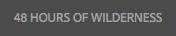
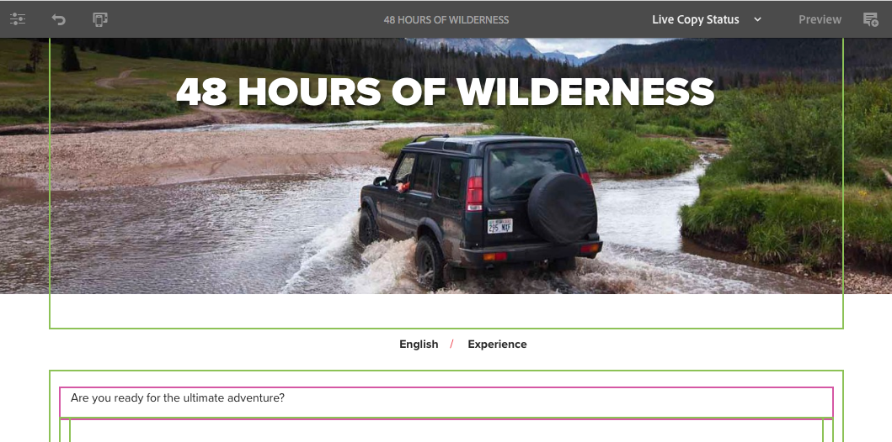

# Redigera sidinnehåll{#editing-page-content}

När sidan har skapats (antingen ny eller som en del av en programstart eller en live-kopia) kan du redigera innehållet för att få de uppdateringar du behöver.

Innehåll läggs till med [komponenter](/help/sites-authoring/default-components-console.md) (anpassat till innehållstypen) som kan dras till sidan. Du kan sedan redigera dem på plats, flytta eller ta bort dem.

>[!NOTE]
>
>Ditt konto behöver [lämpliga åtkomsträttigheter](/help/sites-administering/security.md) och [behörigheter](/help/sites-administering/security.md#permissions) för att redigera sidor.
>
>Om du råkar ut för några problem föreslår Adobe att du kontaktar systemadministratören.

>[!NOTE]
>
>Om sidan, mallen eller båda är korrekt konfigurerade kan du använda en [responsiv layout](/help/sites-authoring/responsive-layout.md) vid redigering.

>[!NOTE]
>
>När **Redigera** -läget är länkar i innehållet synliga, men **inte tillgänglig**. Använd [Förhandsgranskningsläge](#previewingpagestouchoptimizedui) om du vill navigera med hjälp av länkarna i ditt innehåll.

## Verktygsfältet Sida {#page-toolbar}

Verktygsfältet för sidan ger tillgång till lämplig funktionalitet, beroende på sidkonfigurationen.

Verktygsfältet har många alternativ. Beroende på ditt aktuella sammanhang och din konfiguration kanske vissa alternativ inte är tillgängliga.

* **Växla sidopanel**

  Då öppnas/stängs sidopanelen som innehåller [Resursläsaren](/help/sites-authoring/author-environment-tools.md#assets-browser), [Komponentbläddraren](/help/sites-authoring/author-environment-tools.md#components-browser)och [Innehållsträd](/help/sites-authoring/author-environment-tools.md#content-tree).

  

* **Sidinformation**

  Den ger åtkomst till [Sidinformation](/help/sites-authoring/author-environment-tools.md#page-information) meny med sidinformation och åtgärder som kan vidtas på sidan, inklusive visning och redigering av sidinformation, visning av sidegenskaper samt publicering/avpublicering av sidan.

  

* **Emulator**

  Växlar [emulatorverktygsfält](/help/sites-authoring/responsive-layout.md#selecting-a-device-to-emulate), som används för att emulera sidans utseende och känsla på en annan enhet. Detta aktiveras automatiskt i layoutläge.

  

* **ContextHub**

  Öppnar [kontextnav](/help/sites-authoring/ch-previewing.md). Endast tillgängligt i förhandsgranskningsläget.

  

* **Sidrubrik**

  Detta är enbart informativt.

  

* **Lägesväljare**

  Här visas den aktuella [läge](/help/sites-authoring/author-environment-tools.md#page-modes) och låter dig välja ett annat läge, t.ex. redigering, layout, tidsförvrängning eller målinriktning.

  

* **Förhandsgranska**

  Aktiverar [förhandsgranskningsläge](/help/sites-authoring/editing-content.md#preview-mode). Då visas sidan så som den ser ut när den publiceras.

  

* **Anteckna**

  Du kan lägga till [anteckningar](/help/sites-authoring/annotations.md) till sidan när du granskar en sida. Efter den första anteckningen växlar ikonen till ett nummer som anger antalet anteckningar på sidan.

  

### Statusmeddelande {#status-notification}

Om en sida är en del av en [arbetsflöde](/help/sites-authoring/workflows.md) för flera arbetsflöden visas den här informationen i ett meddelandefält högst upp på skärmen när sidan redigeras.

>[!NOTE]
>
>Statusfältet är bara synligt för användarkonton med lämplig behörighet.

I meddelandet visas arbetsflödet som körs mot sidan. Om användaren är involverad i det aktuella arbetsflödessteget kan du välja [påverka arbetsflödets status](/help/sites-authoring/workflows-participating.md) och det finns även mer information om arbetsflödet:

* **Complete** - Öppnar **Slutför arbetsuppgift** dialogruta

* **Delegera** - Öppnar **Slutför arbetsuppgift** dialogruta

* **Visa detaljer** - Öppnar **Information** arbetsflödets fönster

Att slutföra och delegera arbetsflödessteg via meddelandefältet fungerar som när [delta i arbetsflöden](/help/sites-authoring/workflows-participating.md) från meddelandeinkorgen.

Om sidan har flera arbetsflöden visas antalet arbetsflöden till höger om meddelandet tillsammans med pilknapparna så att du kan bläddra igenom arbetsflödena.

## Komponentplatshållare {#component-placeholder}

Komponentplatshållaren är en indikator som visar var en komponent placeras när du släpper den - ovanför den komponent som du håller pekaren över.

* När du lägger till en komponent på sidan (drar från komponentwebbläsaren):

  

* När en befintlig komponent flyttas:

  

## Infoga en komponent {#inserting-a-component}

### Infoga en komponent från komponentwebbläsaren {#inserting-a-component-from-the-components-browser}

Du kan lägga till en komponent med [komponentwebbläsare](/help/sites-authoring/author-environment-tools.md#components-browser). The [platshållare för komponent](#component-placeholder) visar var komponenten är placerad:

1. Kontrollera att sidan finns i [**Redigera** läge](/help/sites-authoring/author-environment-tools.md#page-modes).
1. Öppna [komponentwebbläsare](/help/sites-authoring/author-environment-tools.md#components-browser).
1. Dra den önskade komponenten till [obligatorisk position](#component-placeholder).

1. [Redigera](#editmovecopypastedelete) komponenten.

>[!NOTE]
>
>Komponentwebbläsaren fyller hela skärmen på en mobil enhet. När du börjar dra en komponent stängs webbläsaren och sidan visas igen så att du kan montera komponenten.

### Infoga en komponent från styckesystemet {#inserting-a-component-from-the-paragraph-system}

Du kan lägga till en komponent med **Dra komponenter hit** styckesystemets ruta:

1. Kontrollera att sidan finns i [**Redigera** läge](/help/sites-authoring/author-environment-tools.md#page-modes).
1. Det finns två sätt att markera och lägga till en komponent från styckesystemet:

   * Välj **Infoga komponent** (+) i verktygsfältet för en befintlig komponent eller **Dra komponenter hit** box.

   

   * Om du använder en stationär enhet kan du dubbelklicka på **Dra komponenter hit** box.

   The **Infoga ny komponent** öppnas en dialogruta där du kan välja önskad komponent:

   

1. Den markerade komponenten läggs till längst ned på sidan. [Redigera](#editmovecopypastedelete) komponenten efter behov.

### Infoga en komponent med Resursläsaren {#inserting-a-component-using-the-assets-browser}

Du kan också lägga till en komponent på sidan genom att dra en resurs från [resurshanterare](/help/sites-authoring/author-environment-tools.md#assets-browser). Då skapas automatiskt en komponent av lämplig typ (och som innehåller resursen).

Detta gäller för följande tillgångstyper (vissa är beroende av sidan/styckesystemet):

<table>
 <tbody>
  <tr>
   <th><strong>Resurstyp</strong></th>
   <th><strong>Resulterande komponenttyp</strong></th>
  </tr>
  <tr>
   <td>Bild</td>
   <td>Bild</td>
  </tr>
  <tr>
   <td>Dokument</td>
   <td>Ladda ned</td>
  </tr>
  <tr>
   <td>Produkt</td>
   <td>Produkt</td>
  </tr>
  <tr>
   <td>Video</td>
   <td>Flash</td>
  </tr>
  <tr>
   <td>Innehållsfragment</td>
   <td>Innehållsfragment  </td>
  </tr>
 </tbody>
</table>

>[!NOTE]
>
>Det här beteendet kan konfigureras för din installation. Se [Konfigurera ett styckesystem så att en komponentinstans skapas när en resurs dras](/help/sites-developing/developing-components.md#configuring-a-paragraph-system-so-that-dragging-an-asset-creates-a-component-instance) för mer information.

Så här skapar du en komponent genom att dra en av resurstyperna ovan:

1. Kontrollera att sidan finns i [**Redigera** läge](/help/sites-authoring/author-environment-tools.md#page-modes).
1. Öppna [resursläsare](/help/sites-authoring/author-environment-tools.md#assets-browser).
1. Dra den önskade resursen till önskad position. The [platshållare för komponent](#component-placeholder) visar var komponenten är placerad.

   En komponent som passar för resurstypen skapas på den önskade platsen - den innehåller den valda resursen.

1. [Redigera](#editmovecopypastedelete) komponenten, om det behövs.

>[!NOTE]
>
>På en mobil enhet fyller resursläsaren hela skärmen. När du börjar dra en resurs stängs webbläsaren och sidan visas igen så att du kan montera resursen.

När du bläddrar bland resurserna och upptäcker att du måste göra en snabb ändring i en resurs, klickar du på redigeringsikonen bredvid resursens namn för att starta [Resursredigeraren](/help/assets/manage-assets.md).

## Redigera/konfigurera/kopiera/klipp/ta bort/klistra in {#edit-configure-copy-cut-delete-paste}

När du väljer en komponent öppnas verktygsfältet. Detta ger åtkomst till olika åtgärder som kan utföras på komponenten.

De faktiska åtgärder som är tillgängliga för användaren visas som lämpliga och alla åtgärder kan inte beskrivas här.

* **Redigera**

  [Beroende på komponenttypen](/help/sites-authoring/default-components.md)så kan du [redigera innehållet i komponenten](#edit-content). Ofta finns det ett verktygsfält.

  

* **Konfigurera**

  [Beroende på komponenttypen](/help/sites-authoring/default-components.md) gör att du kan redigera och konfigurera komponentens egenskaper. Ofta öppnas en dialogruta.

  

* **Kopiera**

  Komponenten kopieras till Urklipp. Den ursprungliga komponenten behålls efter en inklistring.

  

* **Klipp ut**

  Komponenten kopieras till Urklipp. Efter inklistringsåtgärden tas den ursprungliga komponenten bort.

  

* **Ta bort**

  Då tas komponenten bort från sidan med din bekräftelse.

  

* **Infoga komponent**

  Dialogrutan öppnas för [lägga till en komponent](/help/sites-authoring/editing-content.md#inserting-a-component-from-the-paragraph-system).

  

* **Klistra in**

  Komponenten klistras in från Urklipp till sidan. Om originalet ska behållas beror på om du har använt kopian eller klippet.

   * Du kan klistra in på samma sida eller på en annan sida.
   * Det inklistrade objektet klistras in ovanför objektet där du väljer åtgärden Klistra in.
   * Åtgärden Klistra in visas bara om det finns innehåll i Urklipp.

  

  >[!NOTE]
  >
  >Om du klistrar in på en annan sida som redan var öppen före klipp ut/kopiera-åtgärden, måste du uppdatera sidan för att se det inklistrade innehållet.

* **Grupp**

  På så sätt kan du markera flera komponenter samtidigt. Samma sak kan man göra på en stationär enhet med **Ctrl+klicka** eller **Kommando+klicka**.

  

* **Överordnad**

  På så sätt kan du markera den överordnade komponenten för den markerade komponenten.

  

* **Layout**

  På så sätt kan du ändra [layout](/help/sites-authoring/editing-content.md#edit-component-layout) för den markerade komponenten. Detta gäller bara den markerade komponenten och aktiverar inte [Layoutläge](/help/sites-authoring/author-environment-tools.md#page-modes) för hela sidan.

  

* **Konvertera till en Experience Fragment-variation**

  Detta gör att du kan skapa en [Experience Fragment](/help/sites-authoring/experience-fragments.md) från den markerade komponenten eller lägg till den i ett befintligt Experience Fragment.

  

## Redigera (innehåll) {#edit-content}

Det finns två sätt att lägga till eller redigera innehåll i komponenter:

* Öppna [komponentdialogruta för redigering](#component-edit-dialog).
* [Dra och släpp en resurs](#draganddropintocomponent) från resursläsaren för att lägga till innehåll direkt.

### Komponentredigeringsdialogruta {#component-edit-dialog}

Du kan öppna en komponent och redigera innehållet med ikonen [Redigera (penna) i komponentverktygsfältet](#edit-configure-copy-cut-delete-paste).

De exakta redigeringsalternativen beror på komponenten. För vissa komponenter [alla åtgärder är endast tillgängliga i helskärmsläge](#edit-content-full-screen-mode). Till exempel:

* [Textkomponent](/help/sites-authoring/rich-text-editor.md#main-pars-title-24)

  

* Bildkomponent

  

  >[!NOTE]
  >
  >Redigering fungerar inte på en tom bildkomponent.
  >
  >
  >[Dra eller överföra en bild (med Konfigurera)](/help/sites-authoring/default-components-foundation.md#image) innan du kan börja redigera den.

* Bildkomponent - helskärm

  [Gå in i helskärmsläge](/help/sites-authoring/editing-content.md#edit-content-full-screen-mode) för bildkomponenten ger mer utrymme för att redigera bilden och visa extra redigeringsalternativ som **Starta karta** och **Återställ zoomning**. I helskärmsläget kan du dessutom välja förinställningar för beskärning.

  

* Komponenter som konstruerats av mer än en grundläggande komponent, t.ex. [Text- och bildstiftskomponent](/help/sites-authoring/default-components-foundation.md#text-image)ber du först att bekräfta vilken uppsättning redigeringsalternativ du vill använda:

  

### Dra och släpp resurser till komponent {#drag-and-drop-assets-into-component}

För specifika komponenttyper kan du dra och släppa resurser från resursläsaren direkt till komponenten för att uppdatera innehållet:

| **Resurstyp** | **Komponenttyp** |
|---|---|
| Bild | Bild |
| Dokument | Ladda ned |
| Produkt | Produkt |
| Video | Flash |
| Innehållsfragment | Innehållsfragment |

## Redigera (innehåll) helskärmsläge {#edit-content-full-screen-mode}

För alla komponenter kan helskärmsläget nås med (och avslutas från):

Till exempel **Text** komponent:

>[!NOTE]
>
>För vissa komponenter har helskärmsläget fler alternativ än den grundläggande redigeraren på plats.

## Flytta en komponent {#moving-a-component}

Så här flyttar du en styckekomponent:

1. Markera det stycke som ska flyttas genom att trycka och hålla ned eller klicka och hålla ned.
1. Dra stycket till den nya platsen. AEM anger var stycket kan placeras. Släpp den där du vill.

   

1. Stycket flyttas.

>[!NOTE]
>
>Du kan också använda [Klipp ut och klistra in](/help/sites-authoring/editing-content.md#edit-configure-copy-cut-delete-paste) för att flytta en komponent.

## Redigera komponentlayout {#edit-component-layout}

I stället för att växla från redigering till [layoutläge](/help/sites-authoring/responsive-layout.md) om du vill justera en komponent kan du markera **Layout** åtgärd för en komponent för att ändra den komponentens layout. Detta sparar tid genom att du inte behöver lämna redigeringsläget.

1. När i **Redigera** platskonsolens läge. Om du väljer en komponent visas komponentens verktygsfält.

   

   Klicka eller tryck på **Layout** så att du kan justera komponentens layout.

   

1. När Layout-åtgärden är markerad:

   * Storlekshandtagen för komponentvisningen.
   * Emulatorverktygsfältet visas högst upp på skärmen.
   * Layoutåtgärder i stället för standardredigeringsåtgärder visas i komponentverktygsfältet.

   

   Nu kan du ändra komponentens layout på samma sätt som i [layoutläge](/help/sites-authoring/responsive-layout.md#defining-layouts-layout-mode).

1. När du har gjort nödvändiga layoutändringar klickar du på **Stäng** på komponentens åtgärdsmeny om du vill sluta ändra komponentens layout. Komponentens verktygsfält återgår till det normala redigeringsläget.

   

>[!NOTE]
>
>Layoutåtgärden är begränsad i omfång till den markerade komponenten. Om du till exempel redigerar layouten för en komponent och sedan markerar en annan komponent, visas standardverktygsfältet för redigering (inte layoutverktygsfältet) för den nyligen markerade komponenten. Storlekshandtagen och emulatorns verktygsfält försvinner.
>
>Om du måste redigera sidans övergripande layout, vilket påverkar flera komponenter, växlar du till [layoutläge](/help/sites-authoring/responsive-layout.md).

## Ärvda komponenter {#inherited-components}

Ärvda komponenter kan vara produkten av olika scenarier, bland annat:

* [Hantering av flera webbplatser](/help/sites-administering/msm.md)
* [Startar](/help/sites-authoring/launches.md) (baserat på live-kopia).
* Specifika komponenter, till exempel det ärvda styckesystemet i Geometrixx.

Du kan avbryta (och sedan återaktivera) arvet. Beroende på vilken komponent det gäller kan det här vara tillgängligt från:

* **Live Copy**

  Komponentens verktygsfält, om komponenten finns på en sida som är en del av en live-kopia eller en start (baserat på en live-kopia). Till exempel:

  

  Alternativet Avbryt arv är tillgängligt:

  

  Eller återaktivera arv om det redan har avbrutits:

  

  Åtgärden Överrullning är även tillgänglig i källan för utkast eller Live-kopia:

  

* **Ett ärvt styckesystem**

  Konfigurationsdialogrutan. Som med det ärvda styckesystemet:

  

## Redigera sidmallen {#editing-the-page-template}

Om sidan är baserad på en [redigerbar mall](/help/sites-authoring/templates.md#editable-and-static-templates)kan du enkelt växla till [mallredigerare](/help/sites-authoring/templates.md#editing-templates-template-authors) genom att välja **Redigera mall** i [Sidinformation-menyn](/help/sites-authoring/author-environment-tools.md#page-information).

Om sidan är baserad på en [statisk mall](/help/sites-authoring/templates.md#editable-and-static-templates)kan du växla till [Designläge](/help/sites-authoring/default-components-designmode.md) med [sidlägesväljare](/help/sites-authoring/author-environment-tools.md#page-modes) i verktygsfältet för att aktivera/inaktivera komponenter för användning på sidan.

Du kan enkelt se vilken mall sidan baseras på när du markerar sidan i [kolumnvyn](/help/sites-authoring/basic-handling.md#column-view) eller [listvyn](/help/sites-authoring/basic-handling.md#list-view).

## Live Copy-status {#live-copy-status}

The [Sidläget Live Copy-status](/help/sites-authoring/author-environment-tools.md#page-modes) ger dig en snabb översikt över live-kopians status och vilka komponenter som ärvs/inte ärvs:

* Grön kant: Ärvd
* Rosa kantlinje: Arvet har avbrutits

Till exempel:

## Lägga till anteckningar {#adding-annotations}

[Anteckningar](/help/sites-authoring/annotations.md) kan granskare och andra författare ge feedback på ditt innehåll. De används ofta för granskning och validering.

## Förhandsgranska sidor {#previewing-pages}

Det finns två alternativ för att förhandsgranska en sida:

* [Förhandsgranskningsläge](#preview-mode) - en snabb förhandsgranskning på plats

* [Visa som publicerad](#view-as-published) - en fullständig förhandsgranskning som öppnar sidan på en ny flik

>[!NOTE]
>
>* Länkarna i innehållet är synliga, men inte tillgängliga i redigeringsläget.
>* Använd något av förhandsvisningsalternativen om du vill navigera med hjälp av länkarna.
>* Använd [kortkommando](/help/sites-authoring/keyboard-shortcuts.md) `Ctrl-Shift-M` om du vill växla mellan förhandsvisning och det senast markerade läget.
>

>[!NOTE]
>
>WCM-lägets cookie är inställd för båda alternativen.

### Förhandsgranskningsläge {#preview-mode}

När du redigerar innehåll kan du förhandsgranska sidan med förhandsgranskningen [läge](/help/sites-authoring/author-environment-tools.md#page-modes). I det här läget kan du göra följande:

* Dölja olika redigeringsfunktioner så att du kan få en snabb överblick över hur sidan visas när den publiceras.
* Navigera med hjälp av länkar.
* Det gör det **not** uppdatera sidinnehållet.

Vid redigering är förhandsgranskningsläget tillgängligt med hjälp av ikonen längst upp till höger i sidredigeraren:

### Visa som publicerad {#view-as-published}

The **Visa som publicerad** är tillgängligt från [Sidinformation](/help/sites-authoring/author-environment-tools.md#page-information) -menyn. Då öppnas sidan på en ny flik, innehållet uppdateras och sidan visas exakt som den ser ut när den publiceras.

## Låsa en sida {#locking-a-page}

AEM kan du låsa en sida så att ingen annan kan ändra innehållet. Detta är användbart när du gör flera ändringar på en viss sida eller när du måste frysa en sida en kort stund.

En sida kan låsas från:

* **Webbplatser** konsol

   1. Markera sidan med [markeringsläge](/help/sites-authoring/basic-handling.md#viewing-and-selecting-resources).
   1. Välj låsikonen.

  

* **Page Editor**

   1. Om du vill öppna menyn väljer du **Sidinformation** -ikon.
   1. Välj **Lås sida** alternativ.

När konsolvyn är låst uppdateras informationen och när du redigerar en låssymbol visas den i verktygsfältet.

>[!CAUTION]
>
>Låsning av en sida kan utföras när [personifiera en användare](/help/sites-administering/security.md#impersonating-another-user). En sida som är låst på det här sättet kan bara låsas upp av den användare som är imiterad eller av administratörsanvändaren.
>
>Sidorna kan inte låsas upp genom att den användare som låste sidan personifieras.

## Låsa upp en sida {#unlocking-a-page}

Att låsa upp en sida påminner om [låsa sidan](#locking-a-page). När sidan är låst ersätts låsalternativen av upplåsningsåtgärder.

På menyn Sidinformation visas **Lås upp** som ett alternativ och låsikonen på Sites-konsolen ersätts av en **Lås upp**-ikon.

>[!CAUTION]
>
>Låsning av en sida kan utföras när [personifiera en användare](/help/sites-administering/security.md#impersonating-another-user). En sida som är låst på det här sättet kan bara låsas upp av den användare som är imiterad eller av administratörsanvändaren.
>
>Sidorna kan inte låsas upp genom att den användare som låste sidan personifieras.

## Ångra och göra om sidredigeringar {#undoing-and-redoing-page-edits}

Med följande ikoner kan du ångra eller göra om en åtgärd. Dessa visas i verktygsfältet när det är lämpligt:

>[!NOTE]
>
>The [kortkommando](/help/sites-authoring/page-authoring-keyboard-shortcuts.md) `Ctrl-Z` kan även ångra sidredigeringsåtgärder.
>
>Kortkommandot `Ctrl-Y` är även tillgängligt för att göra om sidredigeringsåtgärder.

>[!NOTE]
>
>Se [Ångra och göra om sidredigeringar - The Theory](#undoing-and-redoing-page-edits-the-theory) om du vill ha fullständig information om vad som är möjligt när du ångrar och gör om sidredigeringar.

## Ångra och göra om sidredigeringar - The Theory {#undoing-and-redoing-page-edits-the-theory}

>[!NOTE]
>
>Systemadministratören kan [konfigurera olika aspekter av funktionerna Ångra/Gör om](/help/sites-administering/config-undo.md) enligt kraven för din instans.

AEM lagrar en historik över åtgärder som du utför och i vilken ordning du utförde dem. Den här funktionen innebär att du kan ångra flera åtgärder i den ordning som du utförde dem och göra om dem för att återanvända en eller flera av åtgärderna, om det behövs.

Om ett element på innehållssidan är markerat (till exempel en textkomponent) gäller kommandot ångra och gör om det markerade objektet.

Funktionen för kommandona Ångra och Gör om liknar den i andra program. Använd kommandona för att återställa webbsidans senaste status när du bestämmer dig för innehåll. Om du till exempel flyttar ett textstycke till en annan plats på sidan kan du använda kommandot Ångra för att flytta tillbaka stycket. Om du sedan bestämmer dig för att den föregående positionen var bättre använder du kommandot gör om för att ångra.

>[!NOTE]
>
>Du kan:
>
>* Gör om åtgärder så länge du inte har gjort någon sidredigering sedan du använde Ångra.
>* Ångra högst 20 redigeringsåtgärder (standardinställning).
>* Använd även [Kortkommandon](/help/sites-authoring/page-authoring-keyboard-shortcuts.md) för att ångra och göra om.
>

Du kan använda Ångra och Gör om för följande typer av sidändringar:

* Lägga till, redigera, ta bort och flytta stycken
* Redigera styckeinnehåll direkt
* Kopiera, klippa ut och klistra in objekt på en sida

Formulärfält som formulärkomponenter återger ska inte ha värden som anges vid redigering av sidor. Kommandona Ångra och Gör om påverkar därför inte ändringar som du gör i värdena för dessa typer av komponenter. Du kan till exempel inte ångra valet av ett värde i en nedrullningsbar lista.

>[!NOTE]
>
>Särskilda behörigheter krävs för att ångra och göra om ändringar i filer och bilder.

>[!NOTE]
>
>Historiken för ändringar av filer och bilder varar i minst tio timmar. Efter denna tid kan man dock inte garantera att ändringarna återförs. Administratören kan ändra standardtiden på tio timmar.
