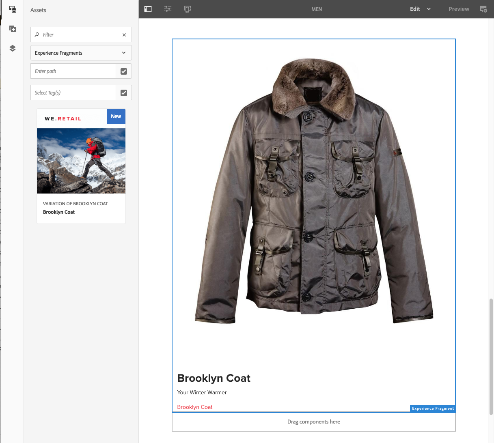
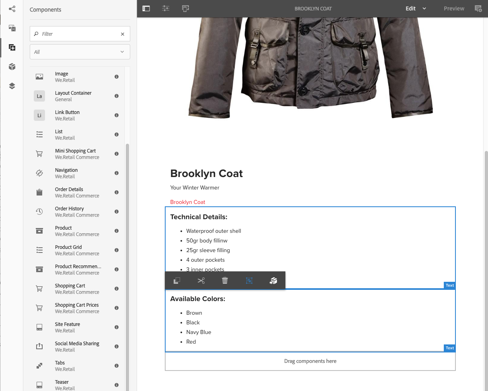
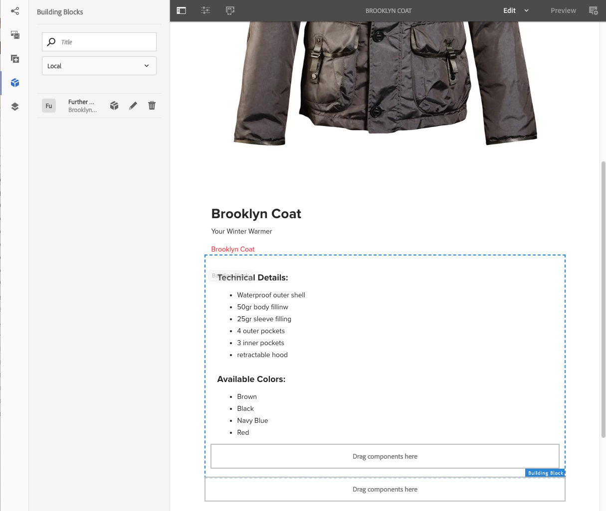

# Experience Fragments{#experience-fragments}

Ett Experience Fragment är en grupp med en eller flera komponenter, inklusive innehåll och layout, som kan refereras till på sidor. De kan innehålla alla komponenter.

An Experience Fragment:

* Är en del av en upplevelse (sida).
* Kan användas på flera sidor.
* Är baserad på en mall (endast redigerbar) för att definiera struktur och komponenter.
* Den här mallen används för att skapa *rotsida* av Experience Fragment.
* Består av en eller flera komponenter med layout i ett styckesystem.
* Kan innehålla andra upplevelsefragment.
* Kan kombineras med andra komponenter (inklusive andra Experience Fragments) för att skapa en komplett sida (upplevelse).
* En eller flera varianter kan skapas baserat på rotsidan.
* Dessa variationer kan dela innehåll och/eller komponenter.
* Kan delas upp i byggstenar som kan användas i flera varianter av fragmentet.

Du kan använda Experience Fragments:

* Om en författare vill återanvända delar (ett fragment av en upplevelse) av en sida måste de kopiera och klistra in det fragmentet. Att skapa och underhålla dessa klipp-och-klistra-upplevelser är tidskrävande och leder ofta till användarfel. Upplevelsefragment eliminerar behovet av att kopiera/klistra in.
* För att stödja headless CMS-fall. Författare vill bara använda AEM för att skapa, men inte för att leverera till kunden. Ett system/kontaktyta från tredje part skulle förbruka upplevelsen och sedan leverera till slutanvändaren.

>[!NOTE]
>
>Skrivåtkomst för upplevelsefragment kräver att användarkontot är registrerat i gruppen:
>
>    `experience-fragments-editors`
>
Kontakta systemadministratören om du har problem.

## När ska ni använda upplevelsefragment? {#when-should-you-use-experience-fragments}

Experience Fragments ska användas:

* När ni vill återanvända upplevelser.

   * Upplevelser som återanvänds med samma eller liknande innehåll

* När du använder AEM som en innehållsleveransplattform för tredje part.

   * Alla lösningar som vill använda AEM som plattform för innehållsleverans
   * Bädda in innehåll i kontaktpunkter från tredje part

* Om du har en upplevelse med olika variationer eller renderingar.

   * Kanal- eller kontextspecifika varianter
   * Upplevelser som är bra att gruppera (till exempel en kampanj med olika upplevelser i olika kanaler)

* När ni använder Omnichannel Commerce.

   * Dela e-handelsrelaterat innehåll på [sociala medier](/help/sites-developing/experience-fragments.md#social-variations) kanaler i skala
   * Göra kontaktytor transaktionella

## Organisera dina upplevelsefragment {#organizing-your-experience-fragments}

Det rekommenderas att
* använda mappar för att ordna dina upplevelsefragment,

* [konfigurera tillåtna mallar för dessa mappar](#configure-allowed-templates-folder).

Genom att skapa mappar kan du:

* skapa en meningsfull struktur för era Experience Fragments, till exempel enligt klassificering

  >[!NOTE]
  >
  Det är inte nödvändigt att anpassa strukturen för dina Experience Fragments till sidstrukturen på din plats.

* [allokera tillåtna mallar på mappnivå](#configure-allowed-templates-folder)

  >[!NOTE]
  >
  Du kan använda [mallredigerare](/help/sites-authoring/templates.md) för att skapa en egen mall.

WKND-projektet strukturerar vissa Experience Fragments enligt `Contributors`. Den struktur som används visar också hur andra funktioner, som Multi Site Management (inklusive språkkopior), kan användas.

Se:

`http://localhost:4502/aem/experience-fragments.html/content/experience-fragments/wknd/language-masters/en/contributors/kumar-selveraj/master`

## Skapa och konfigurera en mapp för dina Experience Fragments {#creating-and-configuring-a-folder-for-your-experience-fragments}

Om du vill skapa och konfigurera en mapp för dina Experience Fragments bör du:

1. [Skapa en mapp](/help/sites-authoring/managing-pages.md#creating-a-new-folder).

1. [Konfigurera tillåtna Experience Fragment-mallar för den mappen](#configure-allowed-templates-folder).

>[!NOTE]
>
Det går också att konfigurera [Tillåtna mallar för din instans](#configure-allowed-templates-instance), men metoden är **not** rekommenderas eftersom värdena kan skrivas över vid uppgradering.

### Konfigurera tillåtna mallar för mappen {#configure-allowed-templates-folder}

>[!NOTE]
>
Detta är den rekommenderade metoden för att ange **Tillåtna mallar**, eftersom värdena inte skrivs över vid uppgraderingen.

1. Navigera till önskad **Upplevelsefragment** mapp.

1. Markera mappen och sedan **Egenskaper**.

1. Ange det reguljära uttrycket för hämtning av de nödvändiga mallarna i **Tillåtna mallar** fält.

   Till exempel:
   `/conf/(.*)/settings/wcm/templates/experience-fragment(.*)?`

   Se:
   `http://localhost:4502/mnt/overlay/cq/experience-fragments/content/experience-fragments/folderproperties.html/content/experience-fragments/wknd`

   

   >[!NOTE]
   >
   Se [Mallar för Experience Fragments](/help/sites-developing/experience-fragments.md#templates-for-experience-fragments) för mer information.

1. Välj **Spara och stäng**.

### Konfigurera tillåtna mallar för din instans {#configure-allowed-templates-instance}

>[!CAUTION]
>
Du bör inte ändra **Tillåtna mallar** den här metoden eftersom de angivna mallarna kan skrivas över vid uppgradering.
>
Använd den här dialogrutan endast i informationssyfte.

1. Navigera till önskad **Upplevelsefragment** konsol.

1. Välj **Konfigurationsalternativ**:

   

1. Ange vilka mallar som krävs i dialogrutan **Konfigurera Experience Fragments** dialog:

   

   >[!NOTE]
   >
   Se [Mallar för Experience Fragments](/help/sites-developing/experience-fragments.md#templates-for-experience-fragments) för mer information.

1. Välj **Spara**.

## Skapa ett upplevelsefragment {#creating-an-experience-fragment}

Så här skapar du ett Experience Fragment:

1. Välj Experience Fragments i Global Navigation.

   

1. Navigera till önskad mapp och markera **Skapa**.

   

1. Välj **Experience Fragment** för att öppna **Skapa upplevelsefragment** guide.

   Välj önskad **mall** och sedan **Nästa**:

   

1. Ange **egenskaperna** för **upplevelsefragmentet**.

   A **Titel** är obligatoriskt. Om **Namn** är tom kommer den att härledas från **Titel**.

   

   >[!NOTE]
   >
   Taggar från Experience Fragment-mallen kommer inte att sammanfogas med taggar på den här Experience Fragment-rotsidan.
   >
   De här är helt separata.

1. Klicka **Skapa**.

   Ett meddelande visas. Välj:

   * **Klar** för att återgå till konsolen

   * **Öppna** för att öppna fragmentredigeraren

## Redigera din upplevelsefragment {#editing-your-experience-fragment}

Experience Fragment Editor har funktioner som liknar den vanliga sidredigeraren.

>[!NOTE]
>
Se [Redigera sidinnehåll](/help/sites-authoring/editing-content.md) om du vill ha mer information om hur du använder sidredigeraren.

Följande exempelprocedur visar hur du skapar ett teaser för en produkt:

1. Dra och släpp en **Teaser** från [Komponentbläddraren](/help/sites-authoring/author-environment-tools.md#components-browser).

   

1. Välj **[Konfigurera](/help/sites-authoring/editing-content.md#edit-configure-copy-cut-delete-paste)** i komponentens verktygsfält.
1. Lägg till **resursen** och definiera **egenskaperna** efter behov.
1. Bekräfta definitionerna med **Klar** (bockikon).
1. Lägg till fler komponenter efter behov.

## Skapa en upplevelsefragmentvariant {#creating-an-experience-fragment-variation}

Ni kan skapa olika upplevelsefragment beroende på era behov:

1. Öppna fragmentet för [redigera](/help/sites-authoring/experience-fragments.md#editing-your-experience-fragment).
1. Öppna **Variationer** -fliken.

   

1. **Skapa** kan du skapa:

   * **Variant**
   * **Variation som [live-copy](/help/sites-administering/msm.md#live-copies)**.

1. Definiera de nödvändiga egenskaperna:

   * **Mall**
   * **Titel**
   * **Namn**; om inget anges hämtas den från titeln
   * **Beskrivning**
   * **Variationstaggar**

   

1. Bekräfta med **Klar** (bock-ikon) visas den nya varianten på panelen:

   

## Använda ditt Experience Fragment {#using-your-experience-fragment}

Nu kan du använda din Experience Fragment när du redigerar dina sidor:

1. Öppna en sida för redigering.

   Till exempel: [https://localhost:4502/editor.html/content/we-retail/language-masters/en/products/men.html](https://localhost:4502/editor.html/content/we-retail/language-masters/en/products/men.html)

1. Skapa en instans av Experience Fragment-komponenten genom att dra komponenten från komponentwebbläsaren till sidstyckesystemet:

   

1. Lägg till den faktiska Experience Fragment-instansen i komponentinstansen, antingen:

   * Dra det önskade fragmentet från Resursläsaren och släpp det på komponenten
   * Välj **Konfigurera** från komponentverktygsfältet och ange vilket fragment som ska användas, bekräfta med **Klar** (tick)

   

   >[!NOTE]
   >
   Redigera i komponentverktygsfältet fungerar som ett kortkommando för att öppna fragmentet i fragmentredigeraren.

## Byggblock {#building-blocks}

Du kan välja en eller flera komponenter för att skapa en byggsten för återvinning i fragmentet:

### Skapa ett byggblock {#creating-a-building-block}

Så här skapar du ett nytt byggblock:

1. Välj de komponenter som du vill återanvända i Experience Fragment-redigeraren:

   

1. Välj **Konvertera till byggblock**:

   

1. Ange namnet på **byggblocket** och bekräfta med **Konvertera**:

   

1. **Byggblocket** visas på fliken och kan markeras i styckesystemet:

   

#### Hantera ett byggblock {#managing-a-building-block}

Byggblocket visas i **Byggblock** -fliken. Följande åtgärder är tillgängliga för varje block:

* Gå till mallsida: öppna varianten av rotsidan på en ny flik
* Byt namn
* Ta bort

#### Använda ett byggblock {#using-a-building-block}

Du kan dra byggblocket till styckesystemet för vilket fragment som helst, precis som med andra komponenter.

## Information om ert Experience Fragment {#details-of-your-experience-fragment}

Information om ditt fragment kan ses:

1. Detaljer visas i alla vyer av konsolen **Upplevelsefragment** och **listvyn**[ visar även information om export till Target](/help/sites-administering/experience-fragments-target.md):

   

1. När du öppnar **Egenskaper** av Experience Fragment:

   

   Egenskaperna är tillgängliga på olika flikar:

   >[!CAUTION]
   >
   De här flikarna visas när du öppnar **Egenskaper** från Experience Fragments-konsolen.
   >
   >
   Om du **öppnar egenskaperna** när du redigerar ett upplevelsefragment visas rätt [Sidegenskaper](/help/sites-authoring/editing-page-properties.md).

   

   * **Grundläggande**

      * **Titel** - obligatoriskt

      * **Beskrivning**
      * **Taggar**
      * **Totalt antal varianter** - endast information

      * **Antal webbvarianter** - endast information
      * **Antal icke-webbvarianter** - inf **endast organisation**

      * **Antal sidor som använder det här fragmentet** - endast information

   * **Cloud Services**

      * **Molnkonfiguration**
      * **Cloud Service Configurations**
      * **Facebook page ID**
      * **Pinterest board**

   * **Referenser**

      * En lista med referenser.

   * **Status för sociala medier**

      * Information om variationer i sociala medier.

## The Plain HTML Rendition {#the-plain-html-rendition}

Använda `.plain.` -väljaren i URL-adressen kan du komma åt den vanliga HTML-återgivningen från webbläsaren.

>[!NOTE]
>
Även om detta är tillgängligt direkt från webbläsaren, [det främsta syftet är att tillåta andra program (till exempel webbprogram från tredje part, anpassade mobilimplementeringar) att få tillgång till innehållet i Experience Fragment direkt, med endast URL:en](/help/sites-developing/experience-fragments.md#the-plain-html-rendition).

## Exportera Experience Fragments {#exporting-experience-fragments}

Som standard levereras Experience Fragments i HTML-format. Detta kan användas av både AEM och tredjepartskanaler.

JSON kan även användas för export till Adobe Target. Se [Målintegrering med upplevelsefragment](/help/sites-administering/experience-fragments-target.md) för fullständig information.
