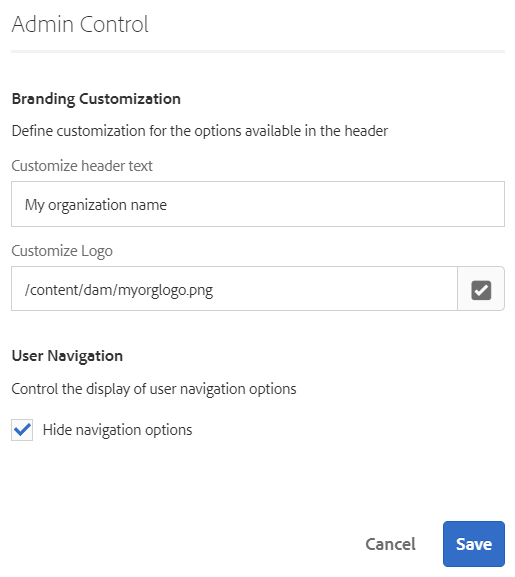

# Din inkorg{#your-inbox}

Du kan få meddelanden från olika AEM-områden, inklusive arbetsflöden och projekt. om:

* Uppgifter:

   * dessa kan också skapas vid olika punkter i AEM-gränssnittet, t.ex. under **Projekt**,
   * these can be the product of a workflow **Create Task** or **Create Project Task** step.

* Arbetsflöden:

   * Arbetsobjekt som representerar åtgärder som du måste utföra på sidinnehåll.

      * detta är produkten av arbetsflödets **deltagarsteg**
   * felobjekt, så att administratörer kan försöka utföra det misslyckade steget igen.

Du får dessa meddelanden i din egen Inkorg där du kan visa dem och vidta åtgärder.

>[!NOTE]
>
>Körklar AEM levereras förinläst med administrativa uppgifter som tilldelats administratörsanvändargruppen. Mer information finns [i Administrativa uppgifter](#out-of-the-box-administrative-tasks) som inte är installerade på kartongen.

>[!NOTE]
>
>Mer information om objekttyperna finns även i:
>
>* [Projekt](/help/sites-authoring/touch-ui-managing-projects.md)
>* [Projekt - arbeta med uppgifter](/help/sites-authoring/task-content.md)
>* [Arbetsflöden](/help/sites-authoring/workflows.md)
>* [Formulär](/help/forms/home.md)
>

## Inkorgen i sidhuvudet {#inbox-in-the-header}

Från någon av konsolerna visas det aktuella antalet objekt i din inkorg i sidhuvudet. Indikatorn kan också öppnas för att ge snabb åtkomst till sidan/sidorna som kräver åtgärder eller åtkomst till inkorgen:

>[!NOTE]
>
>Vissa åtgärder visas även i [kortvyn för den aktuella resursen](/help/sites-authoring/basic-handling.md#card-view).

## Administrativa arbetsmoment som inte går att köra {#out-of-the-box-administrative-tasks}

Körklar AEM levereras förinläst med fyra uppgifter som tilldelats administratörsanvändargruppen.

* [Konfigurera analys och målgruppsanpassning](/help/sites-administering/opt-in.md)
* [Använd AEM Security Checklist](/help/sites-administering/security-checklist.md)
* Aktivera insamling av aggregerad användningsstatistik
* [Konfigurera HTTPS](/help/sites-administering/ssl-by-default.md)

## Öppna Inkorgen {#opening-the-inbox}

Så här öppnar du Inkorgen för AEM-meddelanden:

1. Klicka/tryck på indikatorn i verktygsfältet.

1. Välj **Visa alla**. **AEM -inkorgen** öppnas. I inkorgen visas objekt från arbetsflöden, projekt och uppgifter.
1. Standardvyn är [Listvy](#inbox-list-view), men du kan även växla till [Kalendervy](#inbox-calendar-view). Detta görs med vyväljaren (verktygsfält, överst till höger).

   För båda vyerna kan du även definiera [visningsinställningar](#inbox-view-settings). vilka alternativ som är tillgängliga beror på den aktuella vyn.

   

>[!NOTE]
>
>Inkorgen fungerar som en konsol, och du kan använda [Global navigering](/help/sites-authoring/basic-handling.md#global-navigation) eller [Sök](/help/sites-authoring/search.md) för att navigera till en annan plats när du är klar.

### Inkorg - listvy {#inbox-list-view}

I den här vyn visas alla objekt tillsammans med viktig relevant information:

### Inkorg - kalendervy {#inbox-calendar-view}

I den här vyn visas objekt efter deras placering i kalendern och den exakta vyn som du har valt:

Du kan:

* välja en specifik vy, **Tidslinje**, **kolumn**, **lista**

* specify the tasks to display according to **Schedule**; **All**, **Planned**, **In Progress**, **Due Soon**, **Past Due**

* detaljgranska för mer detaljerad information om ett objekt
* markera ett datumintervall som vyn ska fokuseras i:

### Inkorg - Inställningar {#inbox-view-settings}

För båda vyerna (List och Calendar) kan du definiera inställningar:

* **Kalendervy**

   I **kalendervyn** kan du konfigurera:

   * **Gruppera efter**
   * **Schema** eller **Ingen**
   * **Kortstorlek**
   

* **Listvy**

   I **listvyn** kan du konfigurera sorteringsmekanismen:

   * **Sorteringsfält**
   * **Sorteringsordning**
   

### Inkorg - Administratörskontroll {#inbox-admin-control}

Med alternativet Admin Control kan administratörer:

* Anpassa rubriktext och logotyp

* Styra visningen av navigeringslänkar i sidhuvudet

Alternativet Administratörskontroll är bara synligt för medlemmarna i gruppen Administratörer eller Arbetsflödesadministratörer.

* **Anpassning av varumärkesprofilering**

   * **Anpassa rubriktext:** Ange den text som ska visas i rubriken för att ersätta **Adobe Experience Manager** -standardtexten.

   * **Anpassa logotyp:** Ange bilden som ska visas i sidhuvudet som logotyp. Överför en bild i DAM (Digital Asset Management) och hänvisa till den bilden i fältet.

* **Användarnavigering**
   * **Dölj navigeringsalternativ:** Välj det här alternativet om du vill dölja navigeringsalternativ som är tillgängliga i sidhuvudet. Navigeringsalternativen inkluderar länkar till andra lösningar, hjälplänken och de redigeringsalternativ som finns när man trycker på Adobe Experience Manager-logotypen eller -texten.
* **Spara:** Tryck/klicka på det här alternativet om du vill spara inställningarna.

## Vidta åtgärder för ett objekt {#taking-action-on-an-item}

1. Om du vill utföra en åtgärd för ett objekt markerar du miniatyrbilden för det aktuella objektet. Ikoner för de åtgärder som är tillämpliga på det objektet visas i verktygsfältet:

   

   Åtgärderna är lämpliga för objektet och omfattar:

   * **Fullständig** åtgärd. till exempel en uppgift eller ett arbetsflödesobjekt.
   * **Tilldela** om/**delegera** ett objekt.
   * **Öppna** en artikel; Beroende på objekttypen kan den här åtgärden:

      * visa objektegenskaperna
      * öppna en lämplig kontrollpanel eller guide för ytterligare åtgärder
      * öppna relaterad dokumentation
   * **Gå tillbaka** till ett tidigare steg.
   * Visa nyttolasten för ett arbetsflöde.
   * Skapa ett projekt från objektet.
   >[!NOTE]
   >
   >Mer information finns i:
   >
   >* Arbetsflödesobjekt - [delta i arbetsflöden](/help/sites-authoring/workflows-participating.md)

1. Beroende på vilket objekt som valts kommer en åtgärd att startas; till exempel:

   * en dialogruta som är lämplig för åtgärden öppnas.
   * en åtgärdsguide startas.
   * en dokumentationssida öppnas.
   Om du till exempel **tilldelar** om öppnas en dialogruta:

   

   Beroende på om en dialogruta, guide, dokumentationssida har öppnats kan du:

   * Bekräfta lämpliga åtgärder. t.ex. Tilldela igen.
   * Avbryt åtgärden.
   * Bakpil: Om en åtgärdsguide eller dokumentationssida till exempel har öppnats kan du gå tillbaka till Inkorgen.

## Skapa en uppgift {#creating-a-task}

I inkorgen kan du skapa uppgifter:

1. Välj **Skapa** och sedan **Aktivitet**.
1. Complete the necessary fields in the **Basic** and **Advanced** tabs; only the **Title** is mandatory, all others are optional:

   * **Grundläggande**:

      * **Titel**
      * **Projekt**
      * **Tilldelad**
      * **Innehåll**; liknar Nyttolast är detta en referens från aktiviteten till en plats i databasen
      * **Beskrivning**
      * **Aktivitetsprioritet**
      * **Startdatum**
      * **Förfallodatum**
   

   * **Avancerat**

      * **Namn**: detta kommer att användas för att skapa URL:en, om det är tomt baseras den på **titeln**.
   

1. Välj **Skicka**.

## Skapa ett projekt {#creating-a-project}

För vissa uppgifter kan du skapa ett [projekt](/help/sites-authoring/projects.md) baserat på den uppgiften:

1. Välj lämplig åtgärd genom att trycka/klicka på miniatyrbilden.

   >[!NOTE]
   >
   >Endast uppgifter som skapats med alternativet **Skapa** i **Inkorgen** kan användas för att skapa ett projekt.
   >
   >Arbetsobjekt (från ett arbetsflöde) kan inte användas för att skapa ett projekt.

1. Välj **Skapa projekt** i verktygsfältet för att öppna guiden.
1. Select the appropriate template, then **Next**.
1. Ange de nödvändiga egenskaperna:

   * **Grundläggande**

      * **Titel**
      * **Beskrivning**
      * **Startdatum**
      * **Förfallodatum**
      * **Användare** och roll
   * **Avancerat**

      * **Namn**
   >[!NOTE]
   >
   >Mer information finns i [Skapa ett projekt](/help/sites-authoring/touch-ui-managing-projects.md#creating-a-project) .

1. Bekräfta åtgärden genom att välja **Skapa** .

## Filtrera objekt i AEM Inbox {#filtering-items-in-the-aem-inbox}

Du kan filtrera objekten i listan:

1. Öppna **AEM Inbox**.

1. Öppna filterväljaren:

   

1. Du kan filtrera de listade objekten enligt ett antal kriterier, varav många kan förfinas; till exempel:

   

   >[!NOTE]
   >
   >Med [visningsinställningar](#inbox-view-settings) kan du även konfigurera sorteringsordningen när du använder [listvyn](#inbox-list-view).

