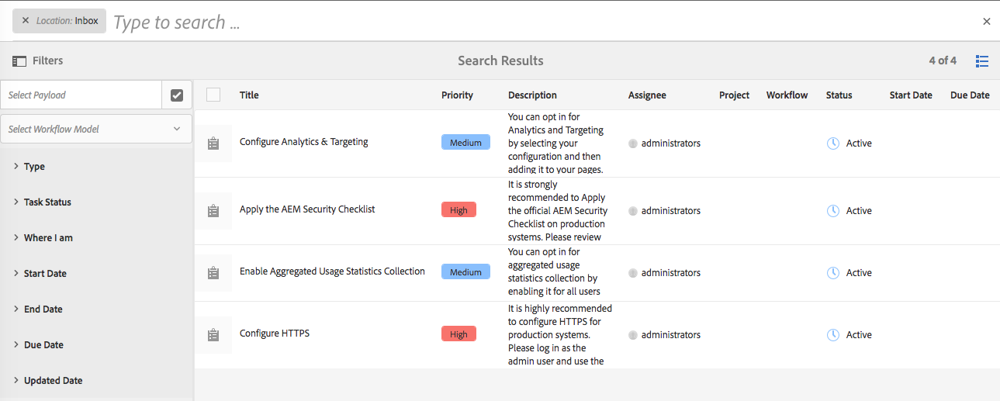

# Din inkorg{#your-inbox}

Du kan få meddelanden från olika AEM, inklusive arbetsflöden och projekt, t.ex. om:

* Uppgifter:

   * dessa kan också skapas vid olika punkter i AEM, t.ex. under **Projekt**,
   * kan vara produkten av ett arbetsflöde **Skapa uppgift** eller **Skapa projektuppgift** steg.

* Arbetsflöden:

   * Arbetsobjekt som representerar åtgärder som du måste utföra på sidinnehåll.

      * det här är produkten av arbetsflöde **Deltagare** steg

   * felobjekt, så att administratörer kan försöka utföra det misslyckade steget igen.

Du får dessa meddelanden i din egen Inkorg där du kan visa dem och vidta åtgärder.

>[!NOTE]
>
>AEM levereras förinläst med administrativa uppgifter som tilldelats administratörsanvändargruppen. Se [Administrativa arbetsmoment som inte går att köra](#out-of-the-box-administrative-tasks) för mer information.

>[!NOTE]
>
>Mer information om objekttyperna finns även i:
>
>* [Projekt](/help/sites-authoring/touch-ui-managing-projects.md)
>* [Projekt - arbeta med uppgifter](/help/sites-authoring/task-content.md)
>* [Arbetsflöden](/help/sites-authoring/workflows.md)
>* [Forms](/help/forms/using/introduction-aem-forms.md)
>

## Inkorgen i sidhuvudet {#inbox-in-the-header}

Från någon av konsolerna visas det aktuella antalet objekt i din inkorg i sidhuvudet. Indikatorn kan också öppnas för att ge snabb åtkomst till sidor som kräver åtgärder eller åtkomst till inkorgen:

>[!NOTE]
>
>Vissa åtgärder visas också i [kortvy över lämplig resurs](/help/sites-authoring/basic-handling.md#card-view).

## Administrativa arbetsmoment som inte går att köra  {#out-of-the-box-administrative-tasks}

Färdiga AEM levereras förinläst med fyra uppgifter tilldelade till administratörsanvändargruppen.

* [Konfigurera analys och målanpassning](/help/sites-administering/opt-in.md)
* [Använd AEM checklista](/help/sites-administering/security-checklist.md)
* Aktivera insamling av aggregerad användningsstatistik
* [Konfigurera HTTPS](/help/sites-administering/ssl-by-default.md)

## Öppna Inkorgen {#opening-the-inbox}

Så här öppnar du AEM inkorg:

1. Klicka på indikatorn i verktygsfältet.

1. Välj **Visa alla**. The **AEM** öppnas. I inkorgen visas objekt från arbetsflöden, projekt och uppgifter.
1. Standardvyn är [Listvy](#inbox-list-view), men du kan även växla till [Kalendervy](#inbox-calendar-view). Detta görs med vyväljaren (verktygsfält, överst till höger).

   För båda vyerna kan du även definiera [Visa inställningar](#inbox-view-settings); de tillgängliga alternativen beror på den aktuella vyn.

   

>[!NOTE]
>
>Inkorgen fungerar som en konsol, och du kan använda [Global navigering](/help/sites-authoring/basic-handling.md#global-navigation) eller [Sök](/help/sites-authoring/search.md) för att navigera till en annan plats när du är klar.

### Inkorg - listvy {#inbox-list-view}

I den här vyn visas alla objekt tillsammans med viktig relevant information:

### Inkorg - kalendervy {#inbox-calendar-view}

I den här vyn visas objekt efter deras placering i kalendern och den exakta vyn som du har valt:

Du kan:

* välja en specifik vy, **Tidslinje**, **Kolumn**, **Lista**

* ange vilka uppgifter som ska visas enligt **Schema**; **Alla**, **Planerad**, **Pågår**, **Förfaller snart**, **Förfallodatum**

* detaljgranska för mer detaljerad information om ett objekt
* markera ett datumintervall som vyn ska fokuseras i:

### Inkorg - Inställningar {#inbox-view-settings}

För båda vyerna (List och Calendar) kan du definiera inställningar:

* **Kalendervy**

  För **Kalendervy** du kan konfigurera:

   * **Gruppera efter**
   * **Schema** eller **Ingen**
   * **Kortstorlek**

  

* **Listvy**

  För **Listvy** du kan konfigurera sorteringsmekanismen:

   * **Sorteringsfält**
   * **Sorteringsordning**

  

### Inkorg - Administratörskontroll {#inbox-admin-control}

Med alternativet Admin Control kan administratörer:

* Anpassa kolumnerna AEM Inkorgen

* Anpassa rubriktext och logotyp

* Styra visningen av navigeringslänkar i sidhuvudet

Alternativet Admin Control är bara synligt för medlemmarna i `administrators` eller `workflow-administrators` grupp.

* **Kolumnanpassning**: Anpassa en AEM Inkorg om du vill ändra standardrubriken för en kolumn, ändra ordning på positionen för en kolumn och visa ytterligare kolumner baserat på data i ett arbetsflöde.
   * **Lägg till kolumn**: Välj en kolumn som ska läggas till AEM Inkorgen.
   * **Redigera kolumn**: Håll muspekaren över kolumnrubriken och markera  om du vill ange ett kolumnvisningsnamn.
   * **Ta bort kolumn**: Välj  om du vill ta bort kolumnen från AEM.
   * **Flytta kolumn**: Dra  om du vill flytta en kolumn till en ny plats i AEM Inkorg.

  

* **Anpassning av varumärkesprofilering**

   * **Anpassa rubriktext:** Ange den text som ska visas i sidhuvudet som ska ersätta standardtexten **Adobe Experience Manager** text.

   * **Anpassa logotyp:** Ange bilden som ska visas i sidhuvudet som logotyp. Överför en bild i DAM (Digital Asset Management) och hänvisa till den bilden i fältet.

* **Användarnavigering**
   * **Dölj navigeringsalternativ:** Välj det här alternativet om du vill dölja navigeringsalternativ som är tillgängliga i sidhuvudet. Navigeringsalternativen inkluderar länkar till andra lösningar, hjälplänkar och de redigeringsalternativ som finns när man trycker på Adobe Experience Manager logotyp eller text.
* **Spara:** Klicka på det här alternativet om du vill spara inställningarna.

## Vidta åtgärder för ett objekt {#taking-action-on-an-item}

>[!NOTE]
>
>Även om det går att markera mer än ett objekt, kan åtgärder bara vidtas för ett objekt i taget.

1. Om du vill utföra en åtgärd för ett objekt markerar du miniatyrbilden för det aktuella objektet. Ikoner för de åtgärder som gäller för det objektet visas i verktygsfältet:

   

   Åtgärderna är lämpliga för objektet och omfattar:

   * **Complete** åtgärd, till exempel en uppgift eller ett arbetsflödesobjekt.
   * **Tilldela igen**/**Delegera** ett objekt.
   * **Öppna** ett objekt. Beroende på objekttypen kan den här åtgärden:

      * visa objektegenskaperna
      * öppna en lämplig kontrollpanel eller guide för ytterligare åtgärder
      * öppna relaterad dokumentation

   * **Gå bakåt** till ett föregående steg.
   * Visa nyttolasten för ett arbetsflöde.
   * Skapa ett projekt från objektet.

   >[!NOTE]
   >
   >Mer information finns i:
   >
   >* Arbetsflödesartiklar - [Delta i arbetsflöden](/help/sites-authoring/workflows-participating.md)

1. Beroende på vilket objekt som är markerat startas en åtgärd, till exempel:

   * en dialogruta som är lämplig för åtgärden öppnas.
   * en åtgärdsguide startas.
   * en dokumentationssida öppnas.

   Till exempel: **Tilldela igen** öppnar en dialogruta:

   

   Beroende på om en dialogruta, guide, dokumentationssida har öppnats kan du:

   * Bekräfta lämplig åtgärd, till exempel Tilldela igen.
   * Avbryt åtgärden.
   * Bakåtpilen. Om en åtgärdsguide eller dokumentationssida har öppnats kan du gå tillbaka till Inkorgen.

## Skapa en uppgift {#creating-a-task}

I inkorgen kan du skapa uppgifter:

1. Välj **Skapa** sedan **Uppgift**.
1. Fyll i de nödvändiga fälten i **Grundläggande** och **Avancerat** tabbar; endast **Titel** är obligatoriskt, alla andra är valfria:

   * **Grundläggande**:

      * **Titel**
      * **Projekt**
      * **Tilldelad**
      * **Innehåll**; liknar Nyttolast är detta en referens från aktiviteten till en plats i databasen
      * **Beskrivning**
      * **Aktivitetsprioritet**
      * **Startdatum**
      * **Förfallodatum**

   

   * **Avancerat**

      * **Namn**: den används för att skapa URL:en. Om den är tom kommer den att baseras på **Titel**.

   

1. Välj **Skicka**.

## Skapa ett projekt {#creating-a-project}

För vissa uppgifter kan du skapa en [Projekt](/help/sites-authoring/projects.md) baserat på den uppgiften:

1. Välj lämplig åtgärd genom att trycka/klicka på miniatyrbilden.

   >[!NOTE]
   >
   >Endast uppgifter som skapats med **Skapa** alternativ för **Inkorg** kan användas för att skapa ett projekt.
   >
   >Arbetsobjekt (från ett arbetsflöde) kan inte användas för att skapa ett projekt.

1. Välj **Skapa projekt** i verktygsfältet för att öppna guiden.
1. Välj lämplig mall och sedan **Nästa**.
1. Ange de nödvändiga egenskaperna:

   * **Grundläggande**

      * **Titel**
      * **Beskrivning**
      * **Startdatum**
      * **Förfallodatum**
      * **Användare** och roll

   * **Avancerat**

      * **Namn**

   >[!NOTE]
   >
   >Se [Skapa ett projekt](/help/sites-authoring/touch-ui-managing-projects.md#creating-a-project) för fullständig information.

1. Välj **Skapa** för att bekräfta åtgärden.

## Filtrera objekt i AEM Inkorg {#filtering-items-in-the-aem-inbox}

Du kan filtrera objekten i listan:

1. Öppna **AEM**.

1. Öppna filterväljaren:

   

1. Du kan filtrera de listade objekten enligt ett intervall av villkor, som många kan förfinas. Exempel:

   

   >[!NOTE]
   >
   >Med [Visa inställningar](#inbox-view-settings) Du kan också konfigurera sorteringsordningen när du använder [Listvy](#inbox-list-view).
