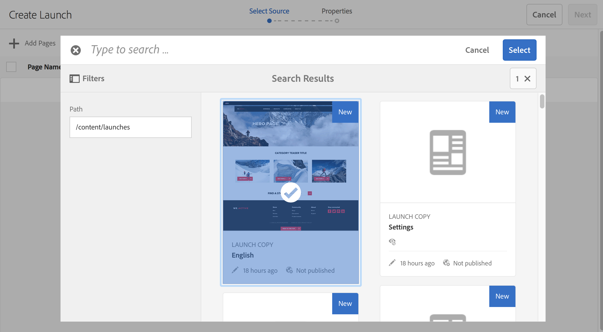

# Skapa starter{#creating-launches}

Skapa en startsida för att möjliggöra uppdatering av en ny version av befintliga webbsidor för framtida aktivering. När du skapar en Launch anger du en titel och källsidan:

* Titeln visas i fältet [Referenser](/help/sites-authoring/author-environment-tools.md#references), där författare kan komma åt dem för att arbeta med dem.
* Källsidans underordnade sidor inkluderas som standard i starten. Du kan bara använda källsidan om du vill.
* Som standard uppdaterar [Live Copy](/help/sites-administering/msm.md) startsidorna automatiskt när källsidorna ändras. Du kan ange att en statisk kopia ska skapas för att förhindra automatiska ändringar.

Du kan också ange **startdatum** (och starttid) för att definiera när startsidorna ska befordras och aktiveras. **Startdatumet** fungerar dock endast i kombination med flaggan **Produktionsklar** (se [Redigera en startkonfiguration](/help/sites-authoring/launches-editing.md#editing-a-launch-configuration)). För att åtgärderna ska köras automatiskt måste båda anges.

## Skapa en Launch {#creating-a-launch}

Du kan skapa en start från Sites- eller Launches-konsolen:

1. Öppna konsolen **Platser** eller **Startar**.

   >[!NOTE]
   >
   >När du använder konsolen **Platser** brukar du navigera till källsidans plats, men det är inte obligatoriskt eftersom du kan navigera när du väljer **Starta Source** i guiden.

1. Beroende på vilken konsol du använder:

   * **Startar**:

      1. Välj **Skapa start** i verktygsfältet för att öppna guiden.

   * **Webbplatser**:

      1. Välj **Skapa** i verktygsfältet för att öppna markeringsrutan.
      1. Välj **Skapa start** för att öppna guiden.

   >[!NOTE]
   >
   >I **Sites**-konsolen kan du även använda [markeringsläget](/help/sites-authoring/basic-handling.md#viewing-and-selecting-resources) för att välja en sida innan du väljer **Skapa**.
   >
   >Då används den valda sidan som den ursprungliga källsidan.

1. I steget **Välj Source** måste du **lägga till sidor**. Du kan markera flera sidor och ange sökvägen för varje sida:

   * Navigera till önskad plats.
   * Markera källsidorna och bekräfta.

   Upprepa efter behov.

   

   >[!NOTE]
   >
   >Om du vill lägga till sidor och/eller grenar i en programstart måste de finnas på en plats, det vill säga under en gemensam toppnivårot.
   >
   >Om en webbplats innehåller språkrötter under den översta nivån måste sidorna och grenarna för en start ligga under en gemensam språkrot.
   >
   >Om du försöker skapa en start med en överordnad eller underordnad sida i källsökvägen misslyckas den och returnerar felet&quot;Målet finns redan på :path till sidan.&quot;

1. För varje tävlingsbidrag kan du ange om du vill:

   * **Inkludera undersidor**:

      * Ange om du vill skapa starten med eller utan de underordnade sidorna.  Som standard inkluderas de här undersidorna.

   Fortsätt med **Nästa**.

   

1. I steget **Egenskaper** i guiden kan du ange:

   * **Starttitel**: Namnet på starten. Namnet ska vara meningsfullt för författare.
   * **med befintligt innehåll**: det ursprungliga innehållet används för att skapa starten.
   * **använd en ny mall för att ersätta sidan**: Mer information finns i [Skapa start med ny mall](#create-launch-with-new-template).
   * **Ärv källsidans livedata**: Välj det här alternativet om du automatiskt vill uppdatera innehållet på startsidor när källsidorna ändras. Det här alternativet uppnår detta genom att göra starten till en [live-kopia](/help/sites-administering/msm.md).

     Som standard är det här alternativet markerat.

   * **Startdatum**: Det datum och den tidpunkt då startkopian ska aktiveras (beroende på flaggan **Produktionsklar**; se [Startar - ordning för händelser](/help/sites-authoring/launches.md#launches-the-order-of-events)).

   

1. Använd **Skapa** för att slutföra processen och skapa en ny start. I bekräftelsedialogrutan får du frågan om du vill öppna starten direkt.

   Om du returnerar konsolen (med **Klar**) kan du se (och få tillgång till) din start från antingen:

   * [**Startar** console](/help/sites-authoring/launches.md#the-launches-console)
   * [**Referenser** i konsolen **Platser**](/help/sites-authoring/launches.md#launches-in-references-sites-console)

### Skapa start med ny mall {#create-launch-with-new-template}

När du [skapar en start](/help/sites-authoring/launches-creating.md#create-launch-with-new-template) kan du välja om du vill använda en ny mall med alternativet: **använda en ny mall för att ersätta sidan**

>[!CAUTION]
>
>Det här alternativet är endast tillgängligt när du skapar en start från konsolen **Platser**. Det är inte tillgängligt när du skapar en start från konsolen **Startar**.

Om du väljer det här alternativet kommer det att:

* uppdatera övriga tillgängliga alternativ,
* innehåller ett nytt steg där du kan välja önskad mall.

>[!CAUTION]
>
>Om du använder en annan mall kommer den nya sidan att vara tom. På grund av den annorlunda sidstrukturen kopieras inget innehåll.
>
>Den här mekanismen kan användas för att ändra mallen för en [befintlig sida](/help/sites-authoring/managing-pages.md#creating-a-new-page) - även om innehållsförlusten måste beaktas.

### Skapa en kapslad start {#creating-a-nested-launch}

Genom att skapa en kapslad programstart (starta vid en programstart) kan du skapa en programstart från en befintlig programstart så att författarna kan utnyttja redan gjorda ändringar i stället för att behöva göra samma ändringar flera gånger för varje programstart.

>[!NOTE]
>
>Se även [Befordra en kapslad start](/help/sites-authoring/launches-promoting.md#promoting-a-nested-launch).

#### Skapa en kapslad start - Startar konsolen {#creating-a-nested-launch-launches-console}

Att skapa en kapslad start från konsolen **Launches** är i princip detsamma som att skapa någon annan typ av start, med undantag för att du måste navigera till startgrenen `/content/launches`:

1. I konsolen **Startar** väljer du **Skapa**.
1. Välj **Lägg till sidor** och navigera sedan till startgrenen genom att ange `/content/launches` i filtret. Välj önskad start och bekräfta med **Välj**:

   

1. Fortsätt med **Nästa** och fyll i **Egenskaper** som vid andra starter.

   

#### Skapa en kapslad start - platskonsol {#creating-a-nested-launch-sites-console}

Så här skapar du en kapslad start från konsolen **Platser** - baserat på en befintlig start:

1. Gå till [Starta från referenser (Sites-konsolen)](/help/sites-authoring/launches.md#launches-in-references-sites-console) för att visa tillgängliga åtgärder.
1. Välj **Skapa start** för att öppna guiden (eftersom källan redan har valts hoppas steget **Välj källa** över).

1. Ange **Starttitel** och annan nödvändig information (som vid normal start).

1. Använd **Skapa** för att slutföra processen och skapa en ny start. I bekräftelsedialogrutan får du frågan om du vill öppna starten direkt.

   Om du väljer **Klar** återgår du till rutan **Referenser** i **Sites**-konsolen och om du väljer rätt sida visas den nya startsidan.

### Klona en start {#cloning-a-launch}

Du kan klona en start från [startkonsolen](/help/sites-authoring/launches.md#the-launches-console):

* Välj start genom att trycka på/klicka på miniatyrbilden.
* Verktygsfältet visas. Välj Klona.
   * Klonen skapas och visas i konsolen.
   * **Starttitel** anger att det är en klon. Du kan uppdatera titeln genom att redigera [Starta konfigurationen](/help/sites-authoring/launches-editing.md#editing-a-launch-configuration) (**Egenskaper**).

## Ta bort en start {#deleting-a-launch}

Du kan ta bort en start från [startkonsolen](/help/sites-authoring/launches.md#the-launches-console):

* Välj start genom att trycka på/klicka på miniatyrbilden.
* Verktygsfältet visas. Välj Ta bort.
* Bekräfta åtgärden.

>[!CAUTION]
>
>Om du tar bort en programstart tas själva programstarten och alla underordnade kapslade programstarter bort.
