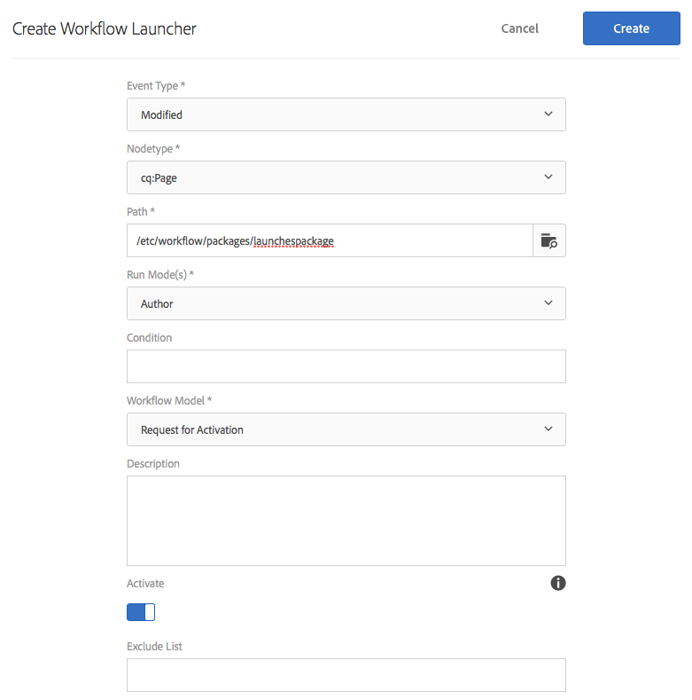

# Befordra lanseringar{#promoting-launches}

Du måste befordra startsidor för att kunna flytta tillbaka innehållet till källan (produktionen) innan du publicerar. När en startsida befordras ersätts motsvarande sida på källsidorna med innehållet på den befordrade sidan. Följande alternativ är tillgängliga när du befordrar en startsida:

* Anger om bara den aktuella sidan eller hela programstarten ska befordras.
* Anger om underordnade sidor för den aktuella sidan ska befordras.
* Anger om en fullständig start ska erbjudas eller endast sidor som har ändrats.
* Anger om starten ska tas bort efter att den har befordrats.

>[!NOTE]
>
>När du har befordrat startsidorna till målet (**Produktion**) kan du aktivera **Produktion** -sidorna som en entitet (så att processen går snabbare). Lägg till sidorna i ett arbetsflödespaket och använd det som nyttolast för ett arbetsflöde som aktiverar ett sidpaket. Du måste skapa arbetsflödespaketet innan du befordrar starten. Se [Bearbeta befordrade sidor med AEM ](#processing-promoted-pages-using-aem-workflow).

>[!CAUTION]
>
>En enstaka programstart kan inte befordras samtidigt. Detta innebär att två befordra åtgärder vid samma start samtidigt kan resultera i ett fel - `Launch could not be promoted` (tillsammans med konfliktfel i loggen).

>[!CAUTION]
>
>När du befordrar starter för *ändrade* sidor beaktas ändringar i både käll- och startgrenarna.

## Marknadsför startsidor {#promoting-launch-pages}

>[!NOTE]
>
>Detta omfattar den manuella åtgärden att marknadsföra startsidor när det bara finns en startnivå. Se:
>
>* [Befordrar en kapslad start](#promoting-a-nested-launch) när det finns mer än en start i strukturen.
>* [Startar - ordning på händelser](/help/sites-authoring/launches.md#launches-the-order-of-events) om du vill ha mer information om automatisk befordran och publicering.
>

Du kan befordra starter från konsolen **Platser** eller konsolen **Startar**:

1. Öppna:

   * konsolen **Platser**:

      1. Öppna [referenslinjen](/help/sites-authoring/author-environment-tools.md#showingpagereferences) och välj den önskade källsidan med [markeringsläget](/help/sites-authoring/basic-handling.md) (eller markera och öppna referenslinjen, ordningen är inte viktig). Alla referenser visas.

      1. Välj **Startar** (till exempel Launches (1))) om du vill visa en lista över specifika starter.
      1. Välj den specifika starten för att visa tillgängliga åtgärder.
      1. Välj **Befordra start** för att öppna guiden.

   * **Startar**-konsolen:

      1. Välj start (klicka på miniatyrbilden).
      1. Välj **Befordra**.

1. I det första steget kan du ange:

   * **Mål**

      * **Ta bort start efter befordran**

   * **Omfång**

      * **Befordra fullständig start**
      * **Befordra ändrade sidor**
      * **Höj upp aktuell sida**
      * **Höj upp aktuell sida och underordnade sidor**

   Om du t.ex. väljer att bara befordra ändrade sidor:

   

   >[!NOTE]
   >
   >Detta omfattar en enstaka start, om du har kapslade starter, se [Befordra en kapslad start](#promoting-a-nested-launch).

1. Välj **Nästa** för att fortsätta.
1. Du kan granska de sidor som ska befordras, vilket beror på vilket sidintervall du har valt:

   

1. Välj **Befordra**.

## Befordra startsidor vid redigering {#promoting-launch-pages-when-editing}

När du redigerar en startsida är åtgärden **Befordra start** också tillgänglig från **Sidinformation**. Guiden öppnas och samlar in den information som behövs.

>[!NOTE]
>
>Detta är tillgängligt för enstaka och [kapslade starter](#promoting-a-nested-launch).

## Befordra en kapslad start {#promoting-a-nested-launch}

När du har skapat en kapslad programstart kan du befordra den tillbaka till någon av källorna, inklusive rotkällan (produktionen).

1. Precis som med [Skapa en kapslad start](#creatinganestedlaunchlaunchwithinalaunch) navigerar du till och väljer den nödvändiga starten i konsolen **Startar** eller i fältet **Referenser**.
1. Välj **Befordra start** för att öppna guiden.

1. Ange nödvändig information:

   * **Mål**

      * **Erbjudandemål**
Du kan göra reklam för alla källor.

      * **Ta bort start efter befordran**
När du har befordrat den valda starten och alla starter som är kapslade i den tas de bort.

   * **Omfång**
Här kan du välja om du vill befordra hela starten eller bara sidor som faktiskt har redigerats. Om det är det senare alternativet kan du välja att ta med/exkludera underordnade sidor. Standardkonfigurationen är att endast befordra sidändringar för den aktuella sidan:

      * **Befordra fullständig start**
      * **Befordra ändrade sidor**
      * **Höj upp aktuell sida**
      * **Höj upp aktuell sida och underordnade sidor**

   

1. Välj **Nästa**.
1. Granska kampanjinformationen innan du väljer **Befordra**:

   

   >[!NOTE]
   >
   >Vilka sidor som visas beror på vilket **omfång** som har definierats och eventuellt på vilka sidor som har redigerats.

1. Ändringarna kommer att befordras och återspeglas i **startkonsolen**:

   

## Bearbeta befordrade sidor med AEM arbetsflöde {#processing-promoted-pages-using-aem-workflow}

Använd arbetsflödesmodeller för att utföra massbearbetning av befordrade startsidor:

1. Skapa ett arbetsflödespaket.
1. När författare befordrar startsidor lagrar de dem i arbetsflödespaketet.
1. Starta en arbetsflödesmodell med paketet som nyttolast.

Om du vill starta ett arbetsflöde automatiskt när sidor befordras, [konfigurerar du en arbetsflödeslungare](/help/sites-administering/workflows-starting.md#workflows-launchers) för paketnoden.

Du kan t.ex. automatiskt generera begäranden om sidaktivering när författare befordrar startsidor. Konfigurera en startfunktion för arbetsflödet för aktivering av begäran när paketnoden ändras.

