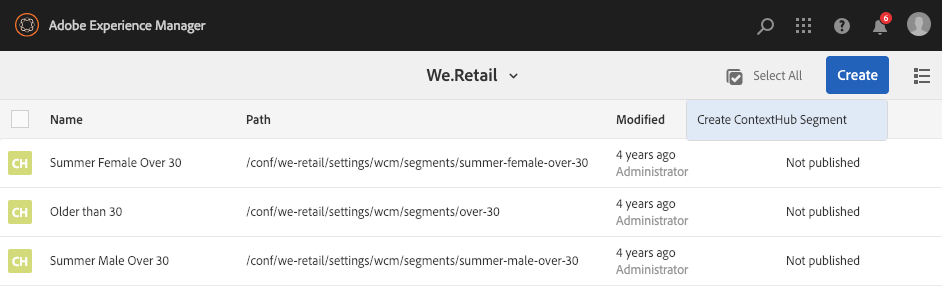

# Hantera målgrupper{#managing-audiences}

Med Audiences-konsolen kan du skapa, ordna och hantera målgrupper för ditt Adobe Target-konto eller hantera segment för ContextHub eller Client Context:

* Lägg till målgrupper - antingen Adobe Target eller ContextHub-segment.
* Hantera målgrupper.

En Audience, som kallas *segment* i ContextHub och Client Context, är en grupp besökare som definieras av specifika kriterier, som sedan avgör vem som ser en riktad aktivitet. När du riktar in dig på en aktivitet kan du antingen välja målgrupper direkt i målprocessen eller skapa nya i publikkonsolen.

I Audiences Console är målgrupperna ordnade efter varumärke.

Målgrupper är tillgängliga i målinriktningsläge för [utveckling av riktat innehåll](/help/sites-authoring/content-targeting-touch.md), där du också kan skapa målgrupper (men du måste skapa målgrupper i Adobe Target i publikkonsolen). Publiker som du skapar i målläge visas i publikkonsolen.

Publiken visas med en etikett som beskriver vilken typ av publik som definieras:

* CH - ContextHub-segment
* CC - kontextsegment
* AT - Adobe Target

## Skapa ett ContextHub-segment i publikkonsolen {#creating-a-contexthub-segment-in-the-audiences-console}

Du kan skapa ett ContextHub-segment antingen i publikkonsolen eller under målinriktningsprocessen.

Så här skapar du ett ContextHub-segment i publikkonsolen:

1. In the Navigation console, click or tap **Personalization**. Klicka eller tryck på **Publiker**.
1. Tryck eller klicka på **Skapa ContextHub-segment**.

   

1. Ange en titel i dialogrutan **Nytt ContextHub-segment** , justera förstärkningen och klicka på **Skapa**. Ditt nya ContextHub-segment visas i målgruppslistan.

   >[!NOTE]
   >
   >Du kan sortera den ändrade listan genom att trycka eller klicka på **Ändrad** och sortera i fallande ordning för att se alla nya målgrupper.

Mer information om hur du skapar segment med ContextHub finns i dokumentationen [Configuring Segmentation with ContextHub](/help/sites-administering/segmentation.md) .

## Skapa en Adobe Target-publik med hjälp av Audience Console {#creating-an-adobe-target-audience-using-the-audience-console}

Du kan skapa målgrupper i Adobe Target direkt i AEM med hjälp av publikkonsolen.

Målgrupper definieras av regler som bestämmer vem som ingår i en målaktivitet. En målgruppsdefinition kan innehålla flera regler och varje regel kan innehålla flera parametrar.

När du använder mer än en regel kombineras dessa regler av operatorn AND, vilket innebär att alla potentiella målgruppsmedlemmar måste uppfylla alla definierade villkor som ska inkluderas i aktiviteten. Om du till exempel definierar en OS-regel OCH en webbläsarregel inkluderas endast besökare som använder både det definierade operativsystemet OCH den definierade webbläsaren i aktiviteten.

>[!NOTE]
>
>If you do not see **Create Target Audience **in the **Create** menu, you do not have the necessary permissions to create an audience. You need write permissions under **/etc/segmentation** to be able to create audiences. Gruppens innehållsförfattare har skrivbehörighet som standard.

Så här skapar du en Adobe Target-målgrupp:

1. In the Navigation console, click or tap **Personalization**. Klicka eller tryck på **Publiker**.

   

1. I publikkonsolen: tryck eller klicka på **Create** (Skapa) och sedan** Create Target Audience**.

   

1. I dialogrutan **Adobe Target-konfiguration** markerar du målkonfigurationen och trycker eller klickar på **OK**.
1. I området Regel#1 trycker eller klickar du på attributtypen och anger eventuell attributinformation i fälten som är tillgängliga. När du är klar markerar du kryssrutan till höger om attributet för att spara det. Mer information om alla attribut finns i [Attribut och deras alternativ](#attributes-and-their-options) .
1. Klicka på **Lägg till regel** för att lägga till en regel. Ange så många regler som behövs. Reglerna kombineras med den booleska operatorn AND, vilket innebär att målgruppen måste uppfylla alla krav i alla regler för att kunna delta i en aktivitet.
1. Tryck eller klicka på **Nästa**.
1. Ange ett namn för målgruppen och tryck eller klicka på **Spara**.
1. Tryck eller klicka på **Spara**. Din publik listas i målgruppslistan.

### Attribut och deras alternativ {#attributes-and-their-options}

Du kan skapa målregler för följande attribut:

| **Attribut** | **Beskrivning** | **Mer information** |
|---|---|---|
| **Mobil** | Target mobila enheter baserade på parametrar som mobil enhet, typ av enhet, enhetsleverantör, skärmdimensioner (i pixlar) med mera. | Se [Mobile-dokumentation](https://docs.adobe.com/content/help/en/target/using/audiences/create-audiences/categories-audiences/mobile.html) på Adobe Target. |
| **Anpassat** | Egna parametrar är mbox-parametrar. Om du skickar några mbox-parametrar till mboxes, eller använder funktionen targetPageParams, visas de parametrarna här för användning i målgrupper. | Mer information finns i dokumentationen [för](https://docs.adobe.com/content/help/en/target/using/audiences/create-audiences/categories-audiences/custom-parameters.html) anpassade parametrar på Adobe Target. |
| **OS** | Du kan rikta in dig på besökare som använder ett visst operativsystem. | Target-användare som använder Linux, Macintosh eller Windows. |
| **Webbplatssidor** | Target besökare som befinner sig på en viss sida eller har en viss mbox-parameter. | Mer information finns i [dokumentationen](https://docs.adobe.com/content/help/en/target/using/audiences/create-audiences/categories-audiences/site-pages.html) för webbplatssidor på Adobe Target. |
| **Webbläsare** | Du kan rikta in dig på användare som använder en viss webbläsare eller särskilda webbläsaralternativ när de besöker sidan. | Se [Dokumentation](https://docs.adobe.com/help/en/target/using/audiences/create-audiences/categories-audiences/browser.html)för webbläsaralternativ i Adobe Target. |
| **Besökarprofil** | Target besökare som uppfyller specifika profilparametrar. | Mer information finns i [dokumentationen](https://docs.adobe.com/content/help/en/target/using/audiences/visitor-profiles/visitor-profile.html) om besökarprofiler på Adobe Target. |
| **Trafikkällor** | Target besökare baseras på den sökmotor eller landningssida som hänvisar dem till er webbplats. | Se dokumentationen [för](https://docs.adobe.com/content/help/en/target/using/audiences/create-audiences/categories-audiences/traffic-sources.html) trafiklösningar på Adobe Target. |

## Ändra en publik i publikkonsolen {#modifying-an-audience-in-the-audiences-console}

>[!NOTE]
>
>Du kan bara redigera Adobe Target-målgrupper som har skapats i samma AEM-instans som du redigerar. Det går inte att redigera Target-målgrupper som skapats i olika AEM-miljöer.

Du kan redigera alla ContextHub- och Client Context-målgrupper från publikkonsolen. Du kan även redigera Adobe Target-målgrupper, men bara de som har skapats i AEM:

1. In the Navigation console, click or tap **Personalization**. Klicka eller tryck på **Publiker**.
1. Tryck eller klicka på ikonen bredvid det ContextHub- eller Client Context-segment som du vill redigera och tryck eller klicka på **Redigera**.
1. Gör eventuella redigeringar i segmentredigeraren. Se [Client Context](/help/sites-administering/campaign-segmentation.md) eller [ContextHub](/help/sites-administering/contexthub-config.md) -dokumentation.
