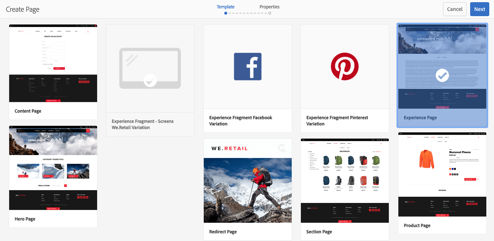
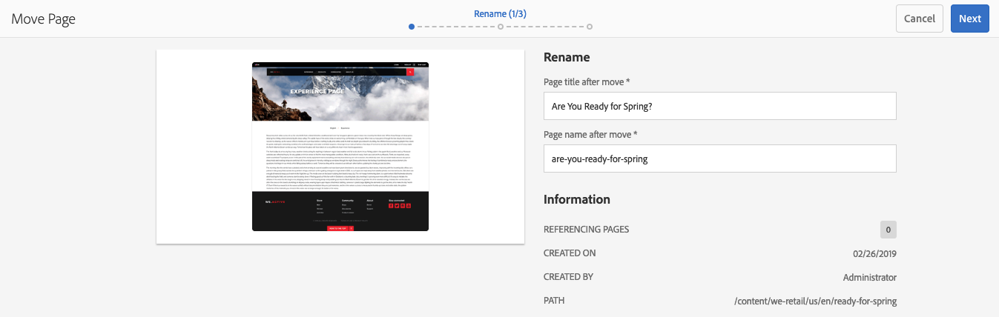

# Skapa och ordna sidor{#creating-and-organizing-pages}

I det här avsnittet beskrivs hur du skapar och hanterar sidor med Adobe Experience Manager (AEM) så att du sedan kan [skapa innehåll](/help/sites-authoring/editing-content.md) på dessa sidor.

>[!NOTE]
>
>Ditt konto behöver [rätt åtkomsträttigheter](/help/sites-administering/security.md) och [behörigheter](/help/sites-administering/security.md#permissions) för att kunna utföra åtgärder på sidor som skapa, kopiera, flytta, redigera och ta bort.
>
>Om du råkar ut för problem rekommenderar vi att du kontaktar systemadministratören.

>[!NOTE]
>
>Det finns ett antal [kortkommandon](/help/sites-authoring/keyboard-shortcuts.md) som du kan använda från webbplatskonsolen som gör att du kan ordna dina sidor mer effektivt.

## Organisera din webbplats {#organizing-your-website}

Som författare måste du ordna din webbplats i AEM. Detta innebär att du skapar och namnger innehållssidorna så att:

* Du kan enkelt hitta dem i redigeringsmiljön
* Besökare på webbplatsen kan enkelt hitta dem i publiceringsmiljön

Du kan också använda [mappar](#creating-a-new-folder) för att ordna innehållet.

Strukturen på en webbplats kan ses som en trädstruktur som innehåller dina innehållssidor. Namnen på dessa innehållssidor används för att skapa URL-adresserna, medan titeln visas när sidinnehållet visas.

I följande exempel visas ett exempel från webbplatsen We.Retail, där du kan komma åt en vandrande kortsida ( `desert-sky-shorts`):

* Författarmiljö
   `https://localhost:4502/editor.html/content/we-retail/us/en/products/equipment/hiking/desert-sky-shorts.html`

* Publiceringsmiljö
   `https://localhost:4503/content/we-retail/us/en/products/equipment/hiking/desert-sky-shorts.html`

Beroende på instansens konfiguration kan det vara valfritt `/content` att använda den i publiceringsmiljön.

```xml
 /content
 /we-retail
  /us
   /en
    /products
     /equipment
      /hiking
       /desert-sky-shorts
       /hiking-poles
       /...
      /running...
      /surfing...
      /...
     /seasonal...
     /...
    /about-us
    /experience
    /...
   /es...
  /de...
  /fr...
  /...
 /...
```

Den här strukturen kan visas i **webbplatskonsolen** , där du kan [navigera bland webbplatsens](/help/sites-authoring/basic-handling.md#navigating) sidor och utföra åtgärder på sidorna. Du kan också skapa nya webbplatser och [nya sidor](#creating-a-new-page).

Du kan se grenen uppåt från vägbeskrivningar i sidhuvudsfältet:


### Konventioner för sidnamngivning {#page-naming-conventions}

När du skapar en ny sida finns det två nyckelfält:

* **[Titel](#title)**:

   * Detta visas för användaren i konsolen och visas överst i sidinnehållet när det redigeras.
   * Detta fält är obligatoriskt.

* **[Namn](#name)**:

   * Detta används för att generera URI:n.
   * Användarindata för det här fältet är valfria. Om inget anges hämtas namnet från titeln. Mer information finns i följande avsnitt [Sidnamnsbegränsningar och Bästa metoder](/help/sites-authoring/managing-pages.md#page-name-restrictions-and-best-practices) .

#### Begränsningar för sidnamn och bästa praxis {#page-name-restrictions-and-best-practices}

Sidans **titel** och **namn** kan skapas separat men är relaterade:

* När du skapar en sida är endast fältet **Titel** obligatoriskt. Om inget **namn** anges när sidan skapas genererar AEM ett namn från de 64 första tecknen i titeln (med den validering som anges nedan). Endast de första 64 tecknen används för att ge stöd åt de bästa sätten att använda korta sidnamn.

* Om ett sidnamn anges manuellt av författaren gäller inte gränsen på 64 tecken, men andra tekniska begränsningar på sidnamnets längd kan förekomma.

>[!NOTE]
>
>När du definierar ett sidnamn är en bra tumregel att hålla sidnamnet så kort, men så uttrycksfullt och minnesvärt som möjligt så att det blir lätt att förstå för läsaren. Mer information finns i [W3C-formatguiden](https://www.w3.org/Provider/Style/TITLE.html) för `title` elementet.

>Tänk också på att vissa webbläsare (t.ex. äldre versioner av IE) bara kan acceptera URL:er med en viss längd, så det finns också tekniska skäl att hålla sidnamnen korta.
>
När du skapar en ny sida [validerar AEM sidnamnet enligt de konventioner](/help/sites-developing/naming-conventions.md) som AEM och JCR har infört.

Minsta tillåtna tecken är:

* &#39;a&#39; till &#39;z&#39;
* A till Z
* 0 till 9
* `_` (understreck)
* `-` (minus/bindestreck)

Fullständig information om alla tillåtna tecken finns i [namnkonventionen](/help/sites-developing/naming-conventions.md).

>[!NOTE]
Om AEM körs på en [MongoMK persistence Manager-distribution](/help/sites-deploying/recommended-deploys.md)är sidnamnen begränsade till 150 tecken.

#### Titel {#title}

Om du bara anger en **sidrubrik** när du skapar en ny sida, kommer AEM att härleda sidans **namn** från den här strängen och [validera namnet i enlighet med konventionerna](/help/sites-developing/naming-conventions.md) från AEM och JCR. Ett **titelfält** som innehåller ogiltiga tecken accepteras, men det härledda namnet har de ogiltiga tecknen som stöds. Exempel:

| Titel | Härlett namn |
|---|---|
| Schön | school.html |
| SC%&amp;*ç+ | sc—c-.html |

#### Namn {#name}

När du anger ett **sidnamn** när du skapar en ny sida, [validerar AEM namnet enligt konventionerna](/help/sites-developing/naming-conventions.md) från AEM och JCR. Du kan inte skicka ogiltiga tecken i fältet **Namn** . När AEM identifierar ogiltiga tecken markeras fältet med en förklaring.


>[!NOTE]
Du bör undvika att använda en kod med två bokstäver enligt ISO-639-1 som sidnamn, såvida det inte är en språkrot.
See [Preparing Content for Translation](/help/sites-administering/tc-prep.md) for more information.

### Templates {#templates}

I AEM anger en mall en speciell typ av sida. En mall kommer att användas som bas för alla nya sidor som skapas.

Mallen definierar strukturen för en sida, inklusive en miniatyrbild och andra egenskaper. Du kan till exempel ha separata mallar för produktsidor, platskartor och kontaktinformation. Mallar består av [komponenter](#components).

AEM innehåller flera färdiga mallar. Vilka mallar som är tillgängliga beror på den enskilda webbplatsen. Nyckelfälten är:

* **Titel** Titeln som visas på den slutliga webbsidan.

* **Namn** som används när sidan namnges.

* **Mall** En lista med mallar som är tillgängliga för att användas när den nya sidan genereras.

>[!NOTE]
Om mallskapare konfigureras på din instans kan [de skapa mallar med mallredigeraren](/help/sites-authoring/templates.md).

### Komponenter {#components}

Komponenterna är de element som tillhandahålls av AEM så att du kan lägga till specifika typer av innehåll. AEM har en rad [färdiga komponenter](/help/sites-authoring/default-components-console.md) med omfattande funktionalitet. Bland dessa finns:

* Text
* Bild
* Bildspel
* Video
* Och många fler

När du har skapat och öppnat en sida kan du [lägga till innehåll med komponenterna](/help/sites-authoring/editing-content.md#insertinganewparagraph), som är tillgängliga från [komponentwebbläsaren](/help/sites-authoring/author-environment-tools.md#componentbrowser).

>[!NOTE]
Med [komponentkonsolen](/help/sites-authoring/default-components-console.md) får du en översikt över komponenterna i din instans.

## Hantera sidor {#managing-pages}

### Skapa en ny sida {#creating-a-new-page}

Om du inte har skapat alla sidor åt dig i förväg måste du skapa en sida innan du kan börja skapa innehåll:

1. Öppna konsolen Platser (till exempel [https://localhost:4502/sites.html/content](https://localhost:4502/sites.html/content)).
1. Navigera till den plats där du vill skapa den nya sidan.
1. Öppna den nedrullningsbara listrutan med **Skapa** i verktygsfältet och välj sedan **Sida** i listan:

   

1. Från det första steget i guiden kan du antingen:

   * Välj den mall som du vill använda för att skapa den nya sidan och klicka/tryck sedan på **Nästa** för att fortsätta.

   * **Avbryt** om du vill avbryta processen.
   

1. Från det sista steget i guiden kan du antingen:

   * Använd de tre flikarna för att ange de [sidegenskaper](/help/sites-authoring/editing-page-properties.md) som du vill tilldela den nya sidan och klicka/tryck sedan på **Skapa** för att skapa sidan.

   * Använd **Bakåt** för att återgå till mallval.
   Nyckelfält är:

   * **Titel**:

      * Detta visas för användaren och är obligatoriskt.
   * **Namn**:

      * Detta används för att generera URI:n. Om inget anges hämtas namnet från titeln.
      * Om du anger ett **sidnamn** när du skapar en ny sida, [validerar AEM namnet enligt de konventioner](/help/sites-developing/naming-conventions.md) som AEM och JCR har infört.

      * Du **kan inte skicka ogiltiga tecken** i **namnfältet** . När AEM identifierar ogiltiga tecken markeras fältet och en förklaring visas som anger vilka tecken som behöver tas bort/ersättas.
   >[!NOTE]
   Se [Namnkonventioner](#page-naming-conventions)för sidor.

   Minimiinformationen som krävs för att skapa en ny sida är **Titel**.

   

1. Använd **Skapa** för att slutföra processen och skapa en ny sida. I bekräftelsedialogrutan får du frågan om du vill **öppna** sidan direkt eller återgå till konsolen (**Klar**):

   

   >[!NOTE]
   Om du skapar en sida med ett namn som redan finns på den platsen, genereras automatiskt en variant av namnet genom att en siffra läggs till. Om det till exempel `winter` redan finns en ny sida blir den `winter0`.

1. Om du återgår till konsolen ser du den nya sidan:

   

>[!CAUTION]
När en sida har skapats kan dess mall inte ändras - såvida du inte [skapar en startsida med en ny mall](/help/sites-authoring/launches-creating.md#create-launch-with-new-template), men innehåll som redan finns går förlorat.

### Öppna en sida för redigering {#opening-a-page-for-editing}

När du har skapat en sida eller navigerat till en befintlig sida (i konsolen) kan du öppna den för redigering:

1. Öppna konsolen **Platser** .
1. Navigera tills du hittar sidan som du vill redigera.
1. Välj sida genom att använda något av följande:

   * [Snabbåtgärder](/help/sites-authoring/basic-handling.md#quick-actions)
   * [Markeringsläget](/help/sites-authoring/basic-handling.md#navigatingandselectionmode) och verktygsfältet
   Välj sedan ikonen **Redigera** :

   

1. Sidan öppnas och du kan [redigera sidan](/help/sites-authoring/editing-content.md#touchoptimizedui) efter behov.

>[!NOTE]
Du kan bara navigera till andra sidor från sidredigeraren i förhandsgranskningsläget eftersom länkarna inte är aktiva i redigeringsläget.

### Kopiera och klistra in en sida {#copying-and-pasting-a-page}

Du kan kopiera en sida och alla dess underordnade sidor till en ny plats:

1. Navigera i **webbplatskonsolen** tills du hittar sidan som du vill kopiera.
1. Välj sida med någon av följande metoder:

   * [Snabbåtgärder](/help/sites-authoring/basic-handling.md#quick-actions)
   * [Markeringsläget](/help/sites-authoring/basic-handling.md#navigatingandselectionmode) och verktygsfältet
   Sedan ikonen **Kopiera** :

   

   >[!NOTE]
   Om du är i markeringsläge avslutas detta automatiskt så snart sidan kopieras.

1. Navigera till platsen för den nya kopian av sidan.
1. Använd ikonen **Klistra in** sida:

   

   En kopia av originalsidan och eventuella underordnade sidor skapas på den här platsen.

   >[!NOTE]
   Om du kopierar sidan till en plats där det redan finns en sida med samma namn som originalet, kommer systemet automatiskt att generera en variant av namnet genom att lägga till en siffra. Om det till exempel `winter` redan finns `winter` blir det `winter1`.

### Flytta eller byta namn på en sida {#moving-or-renaming-a-page}

>[!NOTE]
Om du byter namn på en sida gäller även [Sidnamngivningskonventioner](#page-naming-conventions) när du anger det nya sidnamnet.

>[!NOTE]
En sida kan bara flyttas till en plats där mallen som sidan baseras på tillåts. Mer information finns i [Malltillgänglighet](/help/sites-developing/templates.md#template-availability) .

Proceduren för att flytta eller byta namn på en sida är i princip densamma och hanteras av samma guide. Med den här guiden kan du:

* Byt namn på en sida utan att flytta den.
* Flytta sidan utan att byta namn på den.
* Flytta och byt namn samtidigt.

Med AEM kan du uppdatera interna länkar som refererar till sidan som byter namn/flyttas. Detta kan göras sida för sida för att ge full flexibilitet.

1. Navigera tills du hittar sidan som du vill flytta.
1. Välj sida med någon av följande metoder:

   * [Snabbåtgärder](/help/sites-authoring/basic-handling.md#quick-actions)
   * [Markeringsläget](/help/sites-authoring/basic-handling.md#navigatingandselectionmode) och verktygsfältet
   Välj sedan ikonen **Flytta** sida:

   

   Guiden Flytta sida öppnas.

1. Under **Byt namn** på guiden kan du antingen:

   * Ange det namn du vill att sidan ska ha när den har flyttats och klicka/tryck sedan på **Nästa** för att fortsätta.

   * **Avbryt** om du vill avbryta processen.
   

   Sidnamnet kan vara detsamma om du bara flyttar sidan.

   >[!NOTE]
   Om du flyttar en sida till en plats där det redan finns en sida med samma namn, kommer systemet automatiskt att generera en variant av namnet genom att lägga till en siffra. Om det till exempel `winter` redan finns `winter` blir det `winter1`.

1. I **fasen Välj mål** i guiden kan du antingen:

   * Använd [kolumnvyn](/help/sites-authoring/basic-handling.md#column-view) för att navigera till sidans nya plats:

      * Markera målet genom att klicka på målets miniatyrbild.
      * Klicka på **Nästa** för att fortsätta.
   * Använd **Bakåt** för att återgå till sidnamnsspecifikationen.
   >[!NOTE]
   Som standard väljs den överordnade sidan för sidan som du flyttar/byter namn på som mål.

   

   >[!NOTE]
   Om du flyttar en sida till en plats där det redan finns en sida med samma namn, kommer systemet automatiskt att generera en variant av namnet genom att lägga till en siffra. Om det till exempel `winter` redan finns `winter` blir det `winter1`.

1. Om sidan är länkad till eller refererad, eller har publicerats, visas informationen i steget **Justera/Publicera** igen.

   Du kan ange vilka som ska justeras och/eller publiceras på nytt efter behov.

   >[!NOTE]
   Om sidan varken är länkad till eller refererad är det här steget inte tillgängligt.

   

1. Om du väljer **Flytta** slutförs processen och du kan flytta/ändra namn på sidan efter behov.

>[!NOTE]
Om sidan redan har publicerats avpubliceras den automatiskt när du flyttar den. Som standard publiceras den om när flytten är klar, men detta kan ändras genom att avmarkera fältet **Publicera** igen i steget **Justera/Publicera** igen.

>[!NOTE]
Om det inte finns någon referens till sidan på något sätt hoppas steget **Justera/Publicera** om över.

### Ta bort en sida {#deleting-a-page}

1. Navigera tills du ser sidan som du vill ta bort.
1. Använd [markeringsläget](/help/sites-authoring/basic-handling.md#viewing-and-selecting-resources) för att markera önskad sida och använd sedan **Ta bort** från verktygsfältet:

   

   >[!NOTE]
   Som en säkerhetsåtgärd är **ikonen Ta bort** inte tillgänglig som en snabbåtgärd.

1. En dialogruta öppnas där du uppmanas att bekräfta. Använd:

   * **Avbryt** om du vill avbryta åtgärden
   * **Ta bort** för att bekräfta åtgärden:

      * Om sidan inte har några referenser tas sidan bort.
      * Om sidan innehåller referenser visas ett meddelande om att det finns referenser till **en eller flera sidor.** Du kan välja **Tvinga borttagning** eller **Avbryt**.

>[!NOTE]
Om en sida redan har publicerats avpubliceras den automatiskt innan den tas bort.

### Låsa en sida {#locking-a-page}

Du kan [låsa/låsa upp en sida](/help/sites-authoring/editing-content.md#locking-a-page) från en konsol eller när du redigerar en enskild sida. Information om huruvida en sida är låst visas också på båda platserna.

 

### Skapa en ny mapp {#creating-a-new-folder}

Du kan skapa mappar som hjälper dig att ordna dina filer och sidor.

>[!NOTE]
Mappar lyder även under [Sidnamngivningskonventioner](#page-naming-conventions) när du anger det nya mappnamnet.

>[!CAUTION]
* Mappar kan bara skapas direkt under **Platser** eller under andra mappar. De kan inte skapas under en sida.
* Standardåtgärderna för att flytta, kopiera, klistra in, ta bort, publicera, avpublicera och visa/redigera egenskaper kan utföras på en mapp.
* Det går inte att välja mappar i en live-kopia.


1. Öppna **webbplatskonsolen** och navigera till önskad plats.
1. Om du vill öppna alternativlistan väljer du **Skapa** i verktygsfältet
1. Öppna dialogrutan genom att välja **Mapp** . Här anger du **namn** och **titel**:

   

1. Skapa mappen genom att välja **Skapa** .
