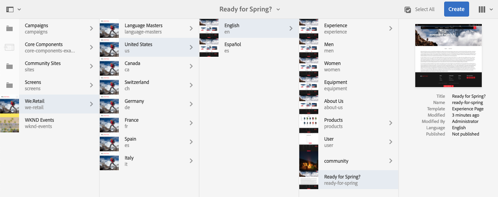
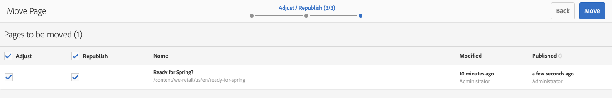

# Skapa och ordna sidor {#creating-and-organizing-pages}

I det här avsnittet beskrivs hur du skapar och hanterar sidor med Adobe Experience Manager (AEM) så att du sedan kan [skapa innehåll](/help/sites-authoring/editing-content.md) på de sidorna.

>[!NOTE]
>
>Ditt konto behöver [lämpliga åtkomsträttigheter](/help/sites-administering/security.md) och [behörigheter](/help/sites-administering/security.md#permissions) om du vill utföra åtgärder på sidor som att skapa, kopiera, flytta, redigera och ta bort.
>
>Om du råkar ut för problem rekommenderar vi att du kontaktar systemadministratören.

>[!NOTE]
>
>Det finns ett antal [kortkommandon](/help/sites-authoring/keyboard-shortcuts.md) som du kan använda från webbplatskonsolen som gör det enklare att ordna sidorna.

## Organisera din webbplats {#organizing-your-website}

Som författare måste du ordna din webbplats inom AEM. Detta innebär att du skapar och namnger innehållssidorna så att:

* Du kan enkelt hitta dem i redigeringsmiljön
* Besökare på webbplatsen kan enkelt hitta dem i publiceringsmiljön

Du kan också använda [mappar](#creating-a-new-folder) för att ordna innehållet.

Strukturen på en webbplats kan ses som en trädstruktur som innehåller dina innehållssidor. Namnen på dessa innehållssidor används för att skapa URL-adresserna, medan titeln visas när sidinnehållet visas.

Följande visar ett exempel från webbplatsen We.Retail, där en sida med vandrande kortkommandon ( `desert-sky-shorts`) används:

* Författarmiljö
   `https://localhost:4502/editor.html/content/we-retail/us/en/products/equipment/hiking/desert-sky-shorts.html`

* Publiceringsmiljö
   `https://localhost:4503/content/we-retail/us/en/products/equipment/hiking/desert-sky-shorts.html`

Beroende på instansens konfiguration kan du använda `/content` kan vara valfritt i publiceringsmiljön.

```xml
 /content
 /we-retail
  /us
   /en
    /products
     /equipment
      /hiking
       /desert-sky-shorts
       /hiking-poles
       /...
      /running...
      /surfing...
      /...
     /seasonal...
     /...
    /about-us
    /experience
    /...
   /es...
  /de...
  /fr...
  /...
 /...
```

Den här strukturen kan visas på **Webbplatser** konsol, där du kan [navigera bland sidorna på webbplatsen](/help/sites-authoring/basic-handling.md#navigating) och utför åtgärder på sidorna. Du kan också skapa nya webbplatser och [nya sidor](#creating-a-new-page).

Du kan se grenen uppåt från vägbeskrivningar i sidhuvudsfältet:


### Konventioner för sidnamngivning {#page-naming-conventions}

När du skapar en ny sida finns det två nyckelfält:

* **[Titel](#title)**:

   * Detta visas för användaren i konsolen och visas överst i sidinnehållet när det redigeras.
   * Detta fält är obligatoriskt.

* **[Namn](#name)**:

   * Detta används för att generera URI:n.
   * Användarindata för det här fältet är valfria. Om inget anges hämtas namnet från titeln. Se följande avsnitt [Begränsningar för sidnamn och bästa praxis](/help/sites-authoring/managing-pages.md#page-name-restrictions-and-best-practices) för mer information.

#### Begränsningar för sidnamn och bästa praxis {#page-name-restrictions-and-best-practices}

Sidans **titel** och **namn** kan skapas separat men hänger ihop:

* När du skapar en sida är det bara **Titel** fältet är obligatoriskt. Om nej **Namn** anges när sidan skapas, kommer AEM att generera ett namn från de 64 första tecknen i titeln (med den validering som anges nedan). Endast de första 64 tecknen används för att ge stöd åt de bästa sätten att använda korta sidnamn.

* Om ett sidnamn anges manuellt av författaren gäller inte gränsen på 64 tecken, men andra tekniska begränsningar på sidnamnets längd kan förekomma.

>[!NOTE]
>
>När du definierar ett sidnamn är en bra tumregel att hålla sidnamnet så kort, men så uttrycksfullt och minnesvärt som möjligt så att det blir lätt att förstå för läsaren. Se [Stödlinje för W3C-format](https://www.w3.org/Provider/Style/TITLE.html) för `title` för mer information.
>
>Tänk också på att vissa webbläsare (t.ex. äldre versioner av IE) bara kan acceptera URL:er med en viss längd, så det finns också tekniska skäl att hålla sidnamnen korta.

AEM skapar en ny sida [validera sidnamnet enligt konventionerna](/help/sites-developing/naming-conventions.md) AEM och JCR.

Minsta tillåtna tecken är:

* &#39;a&#39; till &#39;z&#39;
* A till Z
* 0 till 9
* `_` (understreck)
* `-` (minus/bindestreck)

Fullständig information om alla tillåtna tecken finns i [namnkonventioner](/help/sites-developing/naming-conventions.md).

>[!NOTE]
>
>Om AEM körs på en [Distribution av Persistence Manager för MongoMK](/help/sites-deploying/recommended-deploys.md), får sidnamnen inte innehålla fler än 150 tecken.

#### Titel {#title}

Om du bara anger en **sidtitel** när du skapar en ny sida härleds sidans **namn**[ i AEM från den här strängen och namnet valideras enligt konventionerna i AEM och JCR. ](/help/sites-developing/naming-conventions.md) A **Titel** fält som innehåller ogiltiga tecken accepteras, men det härledda namnet kommer att ha de ogiltiga tecknen ersatta. Till exempel:

| Titel | Härlett namn |
|---|---|
| Schön | schoen.html |
| SC%&amp;&#42;ç+ | sc---c-.html |

#### Namn {#name}

När du anger en sida **Namn** när du skapar en ny sida AEM [validera namnet enligt konventionerna](/help/sites-developing/naming-conventions.md) som ålagts av AEM och JCR. Du kan inte skicka ogiltiga tecken i **Namn** fält. När AEM upptäcker ogiltiga tecken markeras fältet med en förklaring.


>[!NOTE]
>
>Du bör undvika att använda en kod med två bokstäver enligt ISO-639-1 som sidnamn, såvida det inte är en språkrot.
>
>Se [Förbereder innehåll för översättning](/help/sites-administering/tc-prep.md) för mer information.

### Mallar {#templates}

I AEM anger en mall en speciell typ av sida. En mall kommer att användas som bas för alla nya sidor som skapas.

Mallen definierar strukturen för en sida, inklusive en miniatyrbild och andra egenskaper. Du kan till exempel ha separata mallar för produktsidor, platskartor och kontaktinformation. Mallar består av [komponenter](#components).

AEM innehåller flera färdiga mallar. Vilka mallar som är tillgängliga beror på den enskilda webbplatsen. Nyckelfälten är:

* **Titel**
Titeln som visas på den slutliga webbsidan.

* **Namn**
Används när sidan namnges.

* **Mall**
En lista med mallar som är tillgängliga för att användas när den nya sidan genereras.

>[!NOTE]
>
>Om den är konfigurerad på din instans [mallskapare kan skapa mallar med mallredigeraren](/help/sites-authoring/templates.md).

### Komponenter {#components}

Komponenterna är de element som AEM tillhandahåller så att du kan lägga till specifika typer av innehåll. AEM har en rad [färdiga komponenter](/help/sites-authoring/default-components-console.md) som har omfattande funktionalitet. Bland dessa finns:

* Text
* Bild
* Bildspel
* Video
* Och många fler

När du har skapat och öppnat en sida kan du [lägga till innehåll med komponenterna](/help/sites-authoring/editing-content.md#insertinganewparagraph)som är tillgängliga från [komponentwebbläsare](/help/sites-authoring/author-environment-tools.md#componentbrowser).

>[!NOTE]
>
>The [Komponentkonsol](/help/sites-authoring/default-components-console.md) ge en översikt över komponenterna i instansen.

## Hantera sidor {#managing-pages}

### Skapa en ny sida {#creating-a-new-page}

Om du inte har skapat alla sidor åt dig i förväg måste du skapa en sida innan du kan börja skapa innehåll:

1. Öppna Sites-konsolen (till exempel [https://localhost:4502/sites.html/content](https://localhost:4502/sites.html/content)).
1. Navigera till den plats där du vill skapa den nya sidan.
1. Öppna listrutan med **Skapa** i verktygsfältet och välj sedan **Sida** i listan:

   

1. Från det första steget i guiden kan du antingen:

   * Välj den mall som du vill använda för att skapa den nya sidan och klicka/tryck sedan på **Nästa** för att fortsätta.

   * **Avbryt** för att avbryta processen.

   

1. Från det sista steget i guiden kan du antingen:

   * Använd de tre flikarna för att ange [sidegenskaper](/help/sites-authoring/editing-page-properties.md) du vill tilldela till den nya sidan och sedan klicka/tryck **Skapa** för att skapa sidan.

   * Använd **Bakåt** för att återgå till mallval.

   Nyckelfält är:

   * **Titel**:

      * Detta visas för användaren och är obligatoriskt.
   * **Namn**:

      * Detta används för att generera URI:n. Om inget anges hämtas namnet från titeln.
      * Om du anger en sida **Namn** när du skapar en ny sida AEM [validera namnet enligt konventionerna](/help/sites-developing/naming-conventions.md) som ålagts av AEM och JCR.

      * Du **det går inte att skicka ogiltiga tecken** i **Namn** fält. När AEM upptäcker ogiltiga tecken markeras fältet och en förklaring visas som anger vilka tecken som behöver tas bort/ersättas.
   >[!NOTE]
   >
   >Se [Konventioner för sidnamngivning](#page-naming-conventions).

   Den information som krävs för att skapa en ny sida är **Titel**.

   

1. Använd **Skapa** för att slutföra processen och skapa en ny sida. Bekräftelsedialogrutan frågar om du vill **Öppna** sidan omedelbart eller återgå till konsolen (**Klar**):

   

   >[!NOTE]
   >
   >Om du skapar en sida med ett namn som redan finns på den platsen, genereras automatiskt en variant av namnet genom att en siffra läggs till. Exempel: `winter` finns redan en ny sida `winter0`.

1. Om du återgår till konsolen ser du den nya sidan:

   

>[!CAUTION]
>
>När en sida har skapats kan dess mall inte ändras - såvida du inte [skapa en startsida med en ny mall](/help/sites-authoring/launches-creating.md#create-launch-with-new-template), men allt innehåll som redan finns kommer att gå förlorat.

### Öppna en sida för redigering {#opening-a-page-for-editing}

När du har skapat en sida eller navigerat till en befintlig sida (i konsolen) kan du öppna den för redigering:

1. Öppna **Webbplatser** konsol.
1. Navigera tills du hittar sidan som du vill redigera.
1. Välj sida genom att använda något av följande:

   * [Snabbåtgärder](/help/sites-authoring/basic-handling.md#quick-actions)
   * [Markeringsläge](/help/sites-authoring/basic-handling.md#navigatingandselectionmode) och verktygsfältet

   Välj sedan **Redigera** ikon:

   

1. Sidan öppnas och du kan [redigera sidan](/help/sites-authoring/editing-content.md#touchoptimizedui) efter behov.

>[!NOTE]
>
>Du kan bara navigera till andra sidor från sidredigeraren i förhandsgranskningsläget eftersom länkarna inte är aktiva i redigeringsläget.

### Kopiera och klistra in en sida {#copying-and-pasting-a-page}

Du kan kopiera en sida och alla dess underordnade sidor till en ny plats:

1. I **Webbplatser** navigera tills du hittar sidan du vill kopiera.
1. Välj sida med någon av följande metoder:

   * [Snabbåtgärder](/help/sites-authoring/basic-handling.md#quick-actions)
   * [Markeringsläge](/help/sites-authoring/basic-handling.md#navigatingandselectionmode) och verktygsfältet

   Och sedan **Kopiera** sidikon:

   

   >[!NOTE]
   >
   >Om du är i markeringsläge avslutas detta automatiskt så snart sidan kopieras.

1. Navigera till platsen för den nya kopian av sidan.
1. The **Klistra in** ikonen finns med en nedåtpil direkt till höger:

   

   Du kan antingen:
   * Välj **Klistra in** själva sidikonen: En kopia av originalsidan och eventuella underordnade sidor skapas på den här platsen.
   * Markera listrutepilen för att visa **Klistra in utan underordnade** alternativ. En kopia av originalsidan kommer att skapas på denna plats. underordnade sidor kopieras inte.

   >[!NOTE]
   >
   >Om du kopierar sidan till en plats där det redan finns en sida med samma namn som originalet, kommer systemet automatiskt att generera en variant av namnet genom att lägga till en siffra. Exempel: `winter` finns redan `winter` kommer `winter1`.

### Flytta eller byta namn på en sida {#moving-or-renaming-a-page}

>[!NOTE]
>
>Om du byter namn på en sida gäller även [Konventioner för sidnamngivning](#page-naming-conventions) när du anger det nya sidnamnet.

>[!NOTE]
>
>En sida kan bara flyttas till en plats där mallen som sidan baseras på tillåts. Se [Malltillgänglighet](/help/sites-developing/templates.md#template-availability) för mer information.

Proceduren för att flytta eller byta namn på en sida är i princip densamma och hanteras av samma guide. Med den här guiden kan du:

* Byt namn på en sida utan att flytta den.
* Flytta sidan utan att byta namn på den.
* Flytta och byt namn samtidigt.

I AEM finns funktioner för att uppdatera interna länkar som refererar till sidan som byter namn/flyttas. Detta kan göras sida för sida för att ge full flexibilitet.

1. Navigera tills du hittar sidan som du vill flytta.
1. Välj sida med någon av följande metoder:

   * [Snabbåtgärder](/help/sites-authoring/basic-handling.md#quick-actions)
   * [Markeringsläge](/help/sites-authoring/basic-handling.md#navigatingandselectionmode) och verktygsfältet

   Välj sedan **Flytta** sidikon:

   

   Guiden Flytta sida öppnas.

1. Från **Byt namn** steg i guiden som du kan antingen:

   * Ange det namn du vill att sidan ska ha efter att den har flyttats och klicka/tryck sedan på **Nästa** för att fortsätta.

   * **Avbryt** för att avbryta processen.

   

   Sidnamnet kan vara detsamma om du bara flyttar sidan.

   >[!NOTE]
   >
   >Om du flyttar en sida till en plats där det redan finns en sida med samma namn, kommer systemet automatiskt att generera en variant av namnet genom att lägga till en siffra. Exempel: `winter` finns redan `winter` kommer `winter1`.

1. Från **Välj mål** steg i guiden som du kan antingen:

   * Använd [kolumnvy](/help/sites-authoring/basic-handling.md#column-view) för att navigera till sidans nya plats:

      * Markera målet genom att klicka på målets miniatyrbild.
      * Klicka **Nästa** för att fortsätta.
   * Använd **Bakåt** för att återgå till sidnamnsspecifikationen.

   >[!NOTE]
   >
   >Som standard väljs den överordnade sidan för sidan som du flyttar/byter namn på som mål.

   

   >[!NOTE]
   >
   >Om du flyttar en sida till en plats där det redan finns en sida med samma namn, kommer systemet automatiskt att generera en variant av namnet genom att lägga till en siffra. Exempel: `winter` finns redan `winter` kommer `winter1`.

1. Om sidan är länkad till eller refererad, eller har publicerats, listas informationen i **Justera/publicera igen** steg.

   Du kan ange vilka som ska justeras och/eller publiceras på nytt efter behov.

   >[!NOTE]
   >
   >Om sidan varken är länkad till eller refererad är det här steget inte tillgängligt.

   

1. Markera **Flytta** kommer att slutföra processen och flytta/byta namn på sidan efter behov.

>[!NOTE]
>
>Om sidan redan har publicerats avpubliceras den automatiskt när du flyttar den. Som standard publiceras den om när flytten är klar, men detta kan ändras genom att avmarkera **Publicera igen** i **Justera/publicera igen** steg.

>[!NOTE]
>
>Om det inte finns någon referens till sidan på något sätt visas **Justera/publicera igen** kommer att hoppas över.

#### Asynkrona åtgärder {#asynchronous-actions}

Vanligtvis utförs en åtgärd för att flytta eller byta namn på en sida direkt. Detta betraktas som synkron bearbetning och ytterligare åtgärder i gränssnittet blockeras tills åtgärden är klar.

Om antalet sidor som påverkas ligger över en angiven gräns, kommer åtgärden att bearbetas asynkront, vilket gör att användaren kan fortsätta att redigera i gränssnittet utan att detta hindras av åtgärden för att flytta sidan eller byta namn.

* När du klickar **Flytta** AEM i det sista steget ovan kontrollerar den konfigurerade gränsen.
* Om antalet sidor som påverkas ligger under gränsen utförs en synkron åtgärd.
* Om antalet sidor som påverkas ligger över gränsen utförs en asynkron åtgärd.
   * Användaren måste definiera när den asynkrona åtgärden ska utföras
      * **Nu** kör det asynkrona jobbet omedelbart.
      * **Senare** låter användaren definiera när det asynkrona jobbet ska starta.

         

Status för asynkrona jobb kan kontrolleras i [**Status för asynkrona jobb** kontrollpanel](/help/sites-administering/asynchronous-jobs.md#monitor-the-status-of-asynchronous-operations) på **Global navigering** -> **verktyg** -> **Operationer** -> **Jobb**

>[!NOTE]
>
>Mer information om asynkron jobbbearbetning och hur du konfigurerar gränsen för åtgärder för att flytta/byta namn på sidor finns i [Asynkrona jobb](/help/sites-administering/asynchronous-jobs.md) -dokument i administrationshandboken.

>[!NOTE]
>
>Asynkron bearbetning av sidflyttning kräver AEM 6.5.3.0 eller senare.

### Ta bort en sida {#deleting-a-page}

1. Navigera tills du ser sidan som du vill ta bort.
1. Använd [markeringsläge](/help/sites-authoring/basic-handling.md#viewing-and-selecting-resources) för att välja önskad sida och sedan använda **Ta bort** från verktygsfältet:

   

   >[!NOTE]
   >
   >Som en säkerhetsåtgärd är ikonen **Ta bort** inte tillgänglig som en snabbåtgärd.

1. En dialogruta öppnas där du uppmanas att bekräfta. Använd:

   * **Avbryt** för att avbryta åtgärden
   * **Ta bort** för att bekräfta åtgärden:

      * Om sidan inte har några referenser tas sidan bort.
      * Om sidan innehåller referenser visas en meddelanderuta om att **En eller flera sidor refereras.** Du kan välja **Tvinga borttagning** eller **Avbryt**.

>[!NOTE]
>
>Om en sida redan har publicerats avpubliceras den automatiskt innan den tas bort.

### Låsa en sida {#locking-a-page}

Du kan [låsa/låsa upp en sida](/help/sites-authoring/editing-content.md#locking-a-page) från en konsol eller när du redigerar en enskild sida. Information om huruvida en sida är låst visas också på båda platserna.

 

### Skapa en ny mapp {#creating-a-new-folder}

Du kan skapa mappar som hjälper dig att ordna dina filer och sidor.

>[!NOTE]
>
>Mappar kan även användas i [Konventioner för sidnamngivning](#page-naming-conventions) när du anger det nya mappnamnet.

>[!CAUTION]
>
>* Mappar kan bara skapas direkt under **Webbplatser** eller under andra mappar. De kan inte skapas under en sida.
>* Standardåtgärderna för att flytta, kopiera, klistra in, ta bort, publicera, avpublicera och visa/redigera egenskaper kan utföras på en mapp.
>* Det går inte att välja mappar i en live-kopia.
>


1. Öppna **Webbplatser** och navigera till önskad plats.
1. Om du vill öppna alternativlistan väljer du **Skapa** från verktygsfältet
1. Välj **Mapp** för att öppna dialogrutan. Här anger du **Namn** och **Titel**:

   

1. Välj **Skapa** för att skapa mappen.
