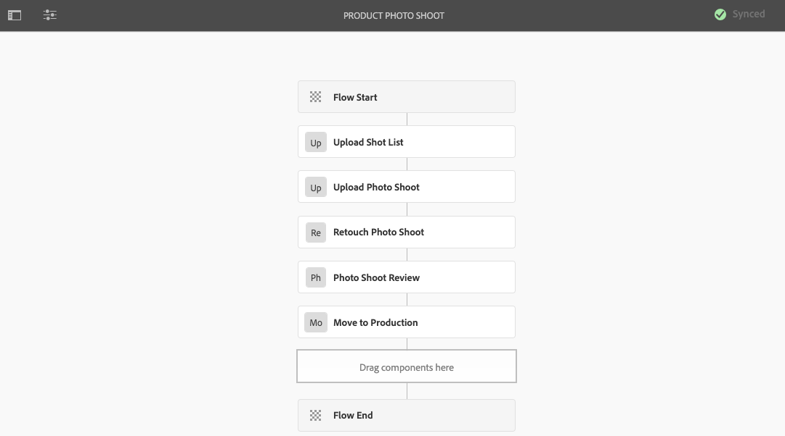
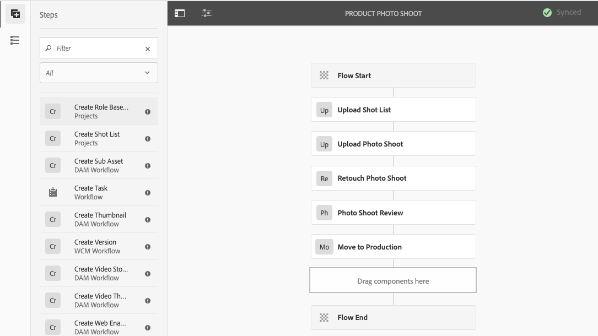

# Kreativt projekt- och PIM-integrering {#creative-project-and-pim-integration}

Om du är marknadsförare eller kreatör kan du använda verktygen i Adobe Experience Manager (AEM) för att hantera e-handelsrelaterade produktfotografier och tillhörande kreativa processer inom organisationen.

Du kan använda Creative Project för att effektivisera följande uppgifter i arbetsflödet för fotografering:

* Generera en begäran om fotofotografering
* Överföra en fototagning
* Samarbeta i en fototagning
* Paketera godkända resurser

>[!NOTE]
>
>Se [Projektanvändarroller för information](/help/sites-authoring/projects.md#user-roles-in-a-project) om hur du tilldelar användarroller och arbetsflöden till vissa typer av användare.

## Fotofotograferingsarbetsflöden  {#exploring-product-photo-shoot-workflows}

Creative Project innehåller olika projektmallar som uppfyller olika projektkrav. Mallen **Produktfotoprojekt** är tillgänglig direkt. Den här mallen innehåller arbetsflöden för fotoplåtning där du kan initiera och hantera begäranden om produktfotografering. Det innehåller även en rad uppgifter som gör att du kan få digitala bilder för produkter genom lämpliga gransknings- och godkännandeprocesser.

## Skapa ett produktfotoprojekt {#create-a-product-photo-shoot-project}

1. Klicka på **Skapa** i konsolen **Projekt** och välj sedan **Skapa projekt** i listan.

   

1. På sidan **Skapa projekt** väljer du mallen **Projekt för produktfototagning** och klickar på **Nästa**.

   

1. Ange projektinformation, inklusive titel, beskrivning och förfallodatum. Lägg till användare och tilldela dem olika roller. Du kan också lägga till en miniatyrbild för projektet.

   

1. Klicka på **Skapa**. Ett bekräftelsemeddelande meddelar att projektet har skapats.
1. Klicka på **Klar** för att återgå till konsolen **Projekt**. Du kan också klicka på **Öppna** för att visa resurserna i projektet.

## Starta arbete i ett produktfotoprojekt {#starting-work-in-a-product-photo-shoot-project}

Starta ett arbetsflöde genom att klicka på ett projekt och sedan på **Lägg till arbete** på sidan med projektinformation om du vill starta en fotoplåtning.


Ett **produktfotoprojekt** innehåller följande färdiga arbetsflöden:

* **Arbetsflöde för produktfototagning (Commerce Integration)**: Det här arbetsflödet använder handelsintegrering med PIM-systemet (Product Information Management) för att automatiskt generera en tagningslista för de valda produkterna (hierarki). Du kan visa produktdata som en del av resursmetadata när arbetsflödet är klart.
* **Arbetsflöde för produktfoto**: Med det här arbetsflödet kan du skapa en lista i stället för att använda den beroende på e-handelsintegrering. Den mappar de överförda bilderna till en CSV-fil i projektresursmappen.

Använd arbetsflödet **Produktfototagning (Commerce-integrering)** för att mappa bildresurser med produkterna i AEM. Det här arbetsflödet använder handelsintegrering för att länka de godkända bilderna till befintliga produktdata på platsen `/etc/commerce`.

Arbetsflödet för **produktfototagning (Commerce-integrering)** innehåller följande uppgifter:

* Skapa lista över bilder
* Överför fototagning
* Retuschera fototagning
* Granska och godkänn
* Flytta till produktionsuppgift

Om produktinformation inte är tillgänglig i AEM kan du använda arbetsflödet **Produktfototagning** för att mappa bildresurser med produkterna baserat på den information som du överför i en CSV-fil. CSV-filen måste innehålla grundläggande produktinformation, t.ex. produkt-ID, kategori och beskrivning. Arbetsflödet hämtar godkända resurser för produkterna.

Det här arbetsflödet innehåller följande uppgifter:

* Överför bildlista
* Överför fototagning
* Retuschera fototagning
* Granska och godkänn
* Flytta till produktionsuppgift

Du kan anpassa det här arbetsflödet med hjälp av alternativet för arbetsflödeskonfigurationer.

Båda arbetsflödena innehåller steg för att länka produkter till deras godkända resurser. Varje arbetsflöde innehåller följande steg:

* Arbetsflödeskonfiguration: Beskriver alternativen för att anpassa arbetsflödet
* Starta ett projektarbetsflöde: Beskriver hur du startar en produktfotografering
* Information om arbetsflödesuppgifter: Tillhandahåller information om tillgängliga uppgifter i arbetsflödet

## Spåra projektförlopp {#tracking-project-progress}

Du kan följa förloppet för ett projekt genom att övervaka de aktiva/slutförda uppgifterna i ett projekt.

Använd följande för att övervaka förloppet för ett projekt:

* Uppgiftskort
* Uppgiftslista

Uppgiftskortet visar projektets övergripande förlopp. Det visas bara på projektinformationssidan om projektet har några relaterade uppgifter. Uppgiftskortet visar projektets aktuella slutförandestatus baserat på antalet slutförda uppgifter. Det omfattar inte framtida uppgifter.

Uppgiftskortet innehåller följande information:

* Procent av aktiva uppgifter
* Procent slutförda uppgifter


Uppgiftslistan innehåller detaljerad information om den aktuella arbetsflödesaktiviteten för projektet. Klicka på aktivitetskortet om du vill visa listan. Uppgiftslistan innehåller även metadata som startdatum, förfallodatum, tilldelad, prioritet och status för uppgiften.


## Arbetsflödeskonfiguration {#workflow-configuration}

Den här uppgiften innebär att tilldela användare arbetsflödessteg baserat på deras roller.

Så här konfigurerar du arbetsflödet för **produktfototagning**:

1. Navigera till **Verktyg** > **Arbetsflöden** och markera sedan rutan **Modeller** för att öppna sidan **Arbetsflödesmodeller**.
1. Välj arbetsflödet för **produktfototagning** och välj ikonen **Redigera** i verktygsfältet för att öppna den i redigeringsläge.

   

1. Öppna en projektaktivitet på sidan **Produkt - fotoarbetsflöde**. Öppna t.ex. aktiviteten **Överför fotolista**.

   

1. Klicka på fliken **Aktivitet** för att konfigurera följande:

   * Namn på uppgiften
   * Standardanvändare (roll) som tar emot uppgiften
   * Uppgiftens standardprioritet, som visas i användarens uppgiftslista
   * Uppgiftsbeskrivning som ska visas när den som tilldelas öppnar uppgiften
   * Förfallodatum för en aktivitet, som beräknas baserat på den tid som aktiviteten startades

1. Klicka på **OK** om du vill spara konfigurationsinställningarna.

Du kan konfigurera ytterligare uppgifter för arbetsflödet **Produktfototagning** på ett liknande sätt.

Utför samma steg för att konfigurera åtgärderna i arbetsflödet för **produktfototagning (Commerce Integration)**.

## Starta ett projektarbetsflöde {#starting-a-project-workflow}

I det här avsnittet beskrivs hur du integrerar produktinformationshantering med ditt kreativa projekt.

1. Navigera till ett produktfotoprojekt och klicka på ikonen **Lägg till arbete** på kortet **Arbetsflöden** .
1. Välj arbetsflödeskortet för **produktfototagning (Commerce-integrering)** om du vill starta arbetsflödet för **produktfototagning (Commerce-integrering)**. Om produktinformationen inte är tillgänglig under `/etc/commerce` väljer du arbetsflödet **Produktfototagning** och startar arbetsflödet **Produktfototagning**.

   

1. Klicka på **Nästa** för att initiera arbetsflödet i projektet.
1. Ange arbetsflödesinformation på nästa sida.

   

1. Klicka på **Skicka** för att starta arbetsflödet för fototagning. Sidan med projektinformation för fotoprojektet visas.

   

### Information om arbetsflödesuppgifter {#workflow-tasks-details}

Arbetsflödet för fotografering omfattar flera uppgifter. Varje uppgift tilldelas till en användargrupp baserat på den konfiguration som har definierats för uppgiften.

#### Skapa aktivitet för lista över bilder {#create-shot-list-task}

Aktiviteten **Skapa lista över scenbilder** gör det möjligt för projektägaren att välja produkter för vilka bilder krävs. Baserat på det alternativ som användaren valt skapas en CSV-fil som innehåller grundläggande produktinformation.

1. Klicka på ellipsknappen längst ned till höger på [aktivitetskortet](#tracking-project-progress) i projektmappen för att visa uppgiftsobjektet i arbetsflödet.

   

1. Välj aktiviteten **Skapa lista med bilder** och klicka sedan på ikonen **Öppna** i verktygsfältet.

   

1. Granska aktivitetsinformationen och klicka sedan på knappen **Skapa lista för fotografering** .

   

1. Välj produkter för vilka det finns produktdata utan kopplade bilder.

   

1. Klicka på knappen **Lägg till i lista över bilder** om du vill skapa en CSV-fil som innehåller en lista över alla sådana produkter. Ett meddelande bekräftar att tagningslistan har skapats för de valda produkterna. Klicka på **Stäng** för att slutföra arbetsflödet.

1. När du har skapat en tagningslista visas länken **Visa lista**. Om du vill lägga till fler produkter i tagningslistan klickar du på **Lägg till i tagningslistan**. I det här fallet läggs data till i den ursprungligen skapade tagningslistan.

   

1. Klicka på **Visa lista över tagningar** för att visa den nya listan.

   

   Om du vill redigera befintliga data eller lägga till nya data klickar du på **Redigera** i verktygsfältet. Endast fälten **Product &#x200B;** och **Description** kan redigeras.

   

   När du har uppdaterat filen klickar du på **Spara** i verktygsfältet för att spara filen.

1. När du har lagt till produkterna klickar du på ikonen **Slutför** på sidan med aktivitetsinformation för **Skapa lista för foto** för att markera uppgiften som slutförd. Du kan lägga till en valfri kommentar.

När aktiviteten har slutförts introduceras följande ändringar i projektet:

* Assets som motsvarar produkthierarkin skapas i en mapp med samma namn som arbetsflödets rubrik.
* Metadata för resurserna kan redigeras med Assets-konsolen, även innan fotografen visar bilderna.
* En mapp för fotografering skapas som lagrar bilderna som fotografen tillhandahåller. Fotomappen innehåller undermappar för varje produktpost i tagningslistan.

### Uppgift för överföring av lista över bilder {#upload-shot-list-task}

Den här uppgiften ingår i arbetsflödet för produktfotografering. Du utför den här uppgiften om produktinformation inte är tillgänglig i AEM. I det här fallet överför du en lista över produkter i en CSV-fil för vilka bildresurser krävs. Baserat på informationen i CSV-filen kan du mappa bildobjekt till produkterna. Filen måste vara en CSV-fil med namnet `shotlist.csv`.

Använd länken **Visa lista över foton** under projektkortet i föregående procedur för att hämta en CSV-exempelfil. Granska exempelfilen för att ta reda på det vanliga innehållet i en CSV-fil.

Produktlistan eller CSV-filen kan innehålla fält, till exempel **Kategori, Produkt, ID, Beskrivning** och **Sökväg**. Fältet **Id** är obligatoriskt och innehåller produkt-ID:t. De andra fälten är valfria.

En produkt kan tillhöra en viss kategori. Produktkategorin kan listas i CSV-filen under kolumnen **Kategori**. Fältet **Produkt** innehåller namnet på produkten. I fältet **Beskrivning** anger du produktbeskrivningen eller instruktionerna för fotografen.

1. Klicka på ellipsknappen längst ned till höger på [aktivitetskortet](#tracking-project-progress) i projektmappen för att visa listan över uppgifter i arbetsflödet.
1. Välj aktiviteten **Överför lista över bilder** och klicka sedan på ikonen **Öppna** i verktygsfältet.

   

1. Granska uppgiftsinformationen och klicka sedan på knappen **Överför lista över bilder** .

   

1. Klicka på knappen **Ladda upp lista** för att ladda upp CSV-filen. Arbetsflödet identifierar den här filen som en källa som kan användas för att extrahera produktdata för nästa uppgift.
1. Överför en CSV-fil som innehåller produktinformation i lämpligt format. Länken **Visa överförda Assets** visas under kortet när CSV-filen har överförts.

   

   Klicka på ikonen **Slutför** för att slutföra uppgiften.

1. Klicka på ikonen **Slutför** för att slutföra uppgiften.

### Ladda upp fototagningsaktivitet {#upload-photo-shoot-task}

Om du är redigerare kan du överföra tagningar för de produkter som listas i filen **short.csv** som skapades eller överfördes i föregående uppgift.

Namnet på de bilder som ska överföras måste börja med `<ProductId_>` där `ProductId` refereras från fältet **Id** i filen `shotlist.csv`. För en produkt i tagningslistan med till exempel **Id** `397122` laddar du upp filer med namnen `397122_highcontrast.jpg`, `397122_lowlight.png` osv.

Du kan antingen överföra bilderna direkt eller överföra en ZIP-fil som innehåller bilderna. Baserat på deras namn placeras bilderna i respektive produktmapp i fotograferingsmappen.

1. Klicka på ellipsknappen längst ned till höger på [aktivitetskortet](#tracking-project-progress) under projektmappen för att visa uppgiftsobjektet i arbetsflödet.
1. Välj aktiviteten **Överför fototagning** och klicka sedan på ikonen **Öppna** i verktygsfältet.

   

1. Klicka på **Överför fototagning** och överför fotofotografierna.
1. Klicka på ikonen **Slutför** i verktygsfältet för att slutföra åtgärden.

### Retuschera fototagningsaktivitet {#retouch-photo-shoot-task}

Om du har redigeringsbehörighet utför du uppgiften **Retuschera fototagning** för att redigera bilderna som överförts till fotofotograferingsmappen.

1. Klicka på ellipsknappen längst ned till höger på [aktivitetskortet](#tracking-project-progress) under projektmappen för att visa uppgiftsobjektet i arbetsflödet.
1. Välj åtgärden **Retuschera fototagning** och klicka sedan på ikonen **Öppna** i verktygsfältet.

   

1. Klicka på länken **Visa överförda Assets** på sidan **Retuschera fototagning** för att bläddra bland de överförda bilderna.

   

   Om det behövs kan du redigera bilderna i ett Adobe Creative Cloud-program.

   

1. Klicka på ikonen **Slutför** i verktygsfältet för att slutföra åtgärden.

### Granska och godkänn uppgift {#review-and-approve-task}

I det här fallet granskar du fotot som överförts av en fotograf och markerar bilderna som godkända för användning.

1. Klicka på ellipsknappen längst ned till höger på [aktivitetskortet](#tracking-project-progress) under projektmappen för att visa uppgiftsobjektet i arbetsflödet.
1. Välj åtgärden **Granska och godkänn** och klicka sedan på ikonen **Öppna** i verktygsfältet.

   

1. På sidan **Granska och godkänn** tilldelar du granskningsaktiviteten till en roll och klickar sedan på **Granska** för att börja granska de överförda produktbilderna.

   

1. Välj en produktbild och klicka på ikonen **Godkänn** i verktygsfältet för att markera den som godkänd. När du har godkänt en bild visas en godkänd banderoll över den.

   

1. Klicka på **Slutför**. De godkända bilderna länkas till de tomma resurserna som skapades.

Du kan utelämna vissa produkter utan någon bild. Senare kan du göra om uppgiften och markera den som slutförd när den är klar.

Du kan navigera till projektresurser med Assets-gränssnittet och verifiera godkända bilder.

Klicka på nästa nivå om du vill visa produkter enligt din produktdatahierarki.

Creative Project associerar godkända resurser med den refererade produkten. Metadata för resursen uppdateras med produktreferensen och grundläggande information på fliken **Produktdata** under resursegenskaper som visas i avsnittet AEM.

>[!NOTE]
>
>I arbetsflödet för **produktfototagning** (utan e-handelsintegrering) har de godkända bilderna ingen koppling till produkter.

### Flytta till produktionsuppgift {#move-to-production-task}

Den här aktiviteten flyttar de godkända resurserna till den produktionsklara mappen så att de blir tillgängliga för användning.

1. Klicka på ellipsknappen längst ned till höger på [aktivitetskortet](#tracking-project-progress) under projektmappen för att visa uppgiftsobjektet i arbetsflödet.
1. Välj aktiviteten **Flytta till produktion** och klicka sedan på ikonen **Öppna** i verktygsfältet.

   

1. Om du vill visa godkända resurser för fototagningen innan du flyttar dem till produktionsklar mapp klickar du på länken **Visa godkänd Assets** under miniatyrbilden av projektet på aktivitetssidan **Flytta till produktion** .

   

1. Ange sökvägen till den produktionsklara mappen i fältet **Flytta till**.

   

1. Klicka på **Flytta till produktion**. Stäng bekräftelsemeddelandet. Resurserna flyttas till den angivna sökvägen och en snurruppsättning skapas automatiskt för de godkända resurserna för varje produkt baserat på mapphierarkin.

1. Klicka på ikonen **Fullständig** i verktygsfältet. Arbetsflödet slutförs när det sista steget markeras som slutfört.

## Visa DAM-resursmetadata {#viewing-dam-asset-metadata}

När du har godkänt mediefilerna länkas de till motsvarande produkter. På sidan [Egenskaper](/help/assets/manage-assets.md#editing-properties) för de godkända resurserna finns nu ytterligare en **produktdatafliken** (länkad produktinformation). På den här fliken visas produktinformation, SKU-nummer och annan produktrelaterad information som länkar resursen. Klicka på ikonen **Redigera** för att uppdatera en resursegenskap. Produktrelaterad information förblir skrivskyddad.

Klicka på länken som visas för att navigera till respektive produktinformationssida i produktkonsolen som resursen är associerad med.

## Anpassa arbetsflödena för projektfototagning {#customizing-the-project-photo-shoot-workflows}

Du kan anpassa arbetsflödena för **Project Photo Shoot** utifrån dina behov. Detta är en valfri rollbaserad uppgift som du utför för att ange värdet för en variabel i projektet. Senare kan du använda det konfigurerade värdet för att komma fram till ett beslut.

1. Klicka på AEM logotyp och navigera sedan till **Verktyg** > **Arbetsflöde** > **Modeller** för att öppna sidan **Arbetsflödesmodeller**.
1. Välj arbetsflödet för **produktfototagning (Commerce-integrering)** eller arbetsflödet för **produktfototagning** och klicka på **Redigera** i verktygsfältet för att öppna arbetsflödet i redigeringsläge.
1. Öppna sidopanelen och leta upp steget **Skapa rollbaserad projektuppgift** och dra det till arbetsflödet.

   

1. Öppna steget **Rollbaserad aktivitet**.
1. Ange ett namn för uppgiften som ska visas i uppgiftslistan på fliken **Aktivitet**. Du kan också tilldela en roll uppgiften, ange standardprioritet, ange en beskrivning och ange en tidpunkt när uppgiften förfaller.

   

1. Ange aktivitetens åtgärder på fliken **Routning**. Om du vill lägga till flera åtgärder klickar du på länken **Lägg till objekt** .

   

1. När du har lagt till alternativen klickar du på **OK** för att lägga till ändringarna i steget.

1. I fönstret **Arbetsflödesmodell** klickar du på **Synkronisera** för att spara ändringarna i hela arbetsflödet. Om du trycker eller klickar på **OK** för steget sparas inte ändringarna i arbetsflödet. Om du vill spara ändringarna i arbetsflödet klickar du på **Synkronisera**.

1. Öppna sidopanelen och leta upp arbetsflödet **Gå till steg** och dra det till arbetsflödet.

1. Öppna **Gå till**-aktiviteten och klicka på fliken **Process**.

1. Välj **målsteget** att gå till och ange att **routningsuttrycket** är ECMA-skript. Ange sedan följande kod i fältet **Script**:

   ```javascript
   function check() {
   
   if (workflowData.getMetaDataMap().get("lastTaskAction","") == "Reject All") {
   
   return true
   
   }
   
   // set copywriter user in metadata
   
   var previousId = workflowData.getMetaDataMap().get("lastTaskCompletedBy", "");
   
   workflowData.getMetaDataMap().put("copywriter", previousId);
   
   return false;
   
   }
   ```

   >[!TIP]
   >
   >Mer information om skript i arbetsflödessteg finns i [Definiera en regel för en OR-delning](/help/sites-developing/workflows-models.md).

   

1. Klicka på **OK**.

1. Klicka på **Synkronisera** för att spara arbetsflödet.

En ny aktivitet visas nu när [Flytta till produktion](#move-to-production-task) har slutförts och tilldelats ägaren.

Användaren i rollen **Ägare** kan slutföra uppgiften och välja en åtgärd (från listan med åtgärder som lagts till i arbetsflödesstegskonfigurationerna) i listan i kommentarspopup-fönstret.

>[!NOTE]
>
>När du startar en server cachelagrar uppgiftslistservern mappningarna mellan uppgiftstyper och URL:er som definieras under `/libs/cq/core/content/projects/tasktypes`. Du kan sedan utföra den vanliga övertäckningen och lägga till anpassade uppgiftstyper genom att placera dem under `/apps/cq/core/content/projects/tasktypes`.
