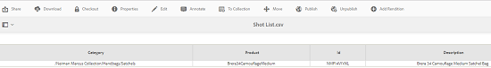
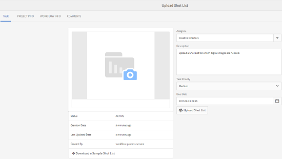
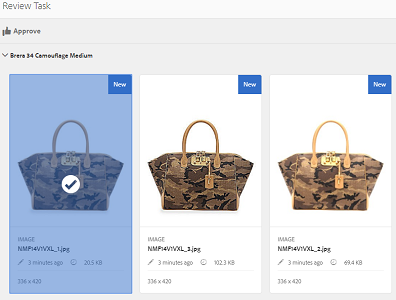

# Kreativt projekt- och PIM-integrering{#creative-project-and-pim-integration}

Om du är marknadsförare eller kreatör kan du använda verktygen i Adobe Experience Manager (AEM) för att hantera e-handelsrelaterade produktfotografier och tillhörande kreativa processer inom organisationen.

Du kan särskilt använda Creative Project för att effektivisera följande uppgifter i arbetsflödet för fotografering:

* Generera en begäran om fotografering
* Överföra en fototagning
* Samarbeta i en fototagning
* Paketera godkända resurser

>[!NOTE]
>
>Mer information [om hur du tilldelar användarroller och arbetsflöden till vissa typer av användare finns i](/help/sites-authoring/projects.md#user-roles-in-a-project) Projektanvändarroller.

## Utforska arbetsflöden för produktfotografering {#exploring-product-photo-shoot-workflows}

Creative Project innehåller olika projektmallar som uppfyller olika projektkrav. Mallen **Produktfotoprojekt** är tillgänglig direkt. Den här mallen innehåller arbetsflöden för fotoplåtning där du kan initiera och hantera begäranden om produktfotografering. Det innehåller även en rad uppgifter som gör att du kan få digitala bilder för produkter genom lämpliga gransknings- och godkännandeprocesser.

Mallen innehåller följande arbetsflöden:

* **Arbetsflöde** för produktfotografering (e-handelsintegrering): Det här arbetsflödet utnyttjar handelsintegrering med PIM-systemet (product information management) för att automatiskt generera en tagningslista för de valda produkterna (hierarki). Du kan visa produktdata som en del av resursmetadata när arbetsflödet är klart.
* **Arbetsflöde** för fotografering: Med det här arbetsflödet kan du ange en tagningslista i stället för att vara beroende av handelsintegrering. Den mappar de överförda bilderna till en CSV-fil i projektresursmappen.

>[!NOTE]
>
>Den CSV-fil som överförs i listan Upload Shot i arbetsflödet Product Photo Shoot bör ha filnamnet shortList.csv.

## Skapa ett produktfotoprojekt {#create-a-product-photo-shoot-project}

1. I **projektkonsolen** trycker/klickar du på **Skapa** och väljer sedan **Skapa projekt** i listan.

   

1. På sidan **Skapa projekt** väljer du mallen för fotoprojekt och trycker/klickar på **Nästa**.

   

1. Ange projektinformation, inklusive titel, beskrivning och förfallodatum. Lägg till användare och tilldela dem olika roller. Du kan också lägga till en miniatyrbild för projektet.

   

1. Tryck/klicka på **Skapa**. Ett bekräftelsemeddelande meddelar att projektet har skapats.
1. Tryck/klicka på **Klar** för att återgå till **projektkonsolen** . Du kan också trycka/klicka på **Öppna** för att visa resurserna i fotoprojektet.

## Starta arbete i ett produktfotoprojekt {#starting-work-in-a-product-photo-shoot-project}

Starta ett arbetsflöde genom att trycka eller klicka på ett projekt och sedan på/klicka på **Lägg till arbete** på sidan med projektinformation.


Ett produktfotoprojekt innehåller följande färdiga arbetsflöden:

* Arbetsflöde för produktfototagning (Commerce Integration)
* Fotofotografering

Använd arbetsflödet för produktfototagning (Commerce Integration) för att mappa bildresurser till produkterna i AEM. Det här arbetsflödet utnyttjar Commerce Integration för att länka de godkända bilderna till befintliga produktdata på platsen */etc/commerce*.

Arbetsflödet för produktfototagning (Commerce Integration) innehåller följande uppgifter:

* Skapa lista över bilder
* Överför fototagning
* Retuschera fototagning
* Granska och godkänn
* Flytta till produktionsuppgift

Om produktinformation inte är tillgänglig i AEM kan du använda arbetsflödet för produktfototagning för att mappa bildresurser med produkterna baserat på den information som du överför i en CSV-fil. CSV-filen måste innehålla grundläggande produktinformation, t.ex. produkt-ID, kategori och beskrivning. Arbetsflödet hämtar godkända resurser för produkterna.

Det här arbetsflödet innehåller följande uppgifter:

* Ladda upp lista över bilder
* Överför fototagning
* Retuschera fototagning
* Granska och godkänn
* Flytta till produktionsuppgift

Du kan anpassa det här arbetsflödet med hjälp av alternativet för arbetsflödeskonfigurationer.

Båda arbetsflödena innehåller steg för att länka produkter till deras godkända resurser. Varje arbetsflöde innehåller följande steg:

* Arbetsflödeskonfiguration: Beskriver alternativen för att anpassa arbetsflödet
* Starta ett projektarbetsflöde: Beskriver hur du startar en produktfototagning
* Information om arbetsflödesuppgifter: Visar information om uppgifter som är tillgängliga i arbetsflödet

## Spåra projektförlopp {#tracking-project-progress}

Du kan följa förloppet för ett projekt genom att övervaka de aktiva/slutförda uppgifterna i ett projekt.

Använd följande för att övervaka förloppet för ett projekt:

* **Uppgiftskort**

* **Uppgiftslista**

Uppgiftskortet visar projektets övergripande förlopp. Det visas bara på sidan Projektinformation om projektet har några relaterade uppgifter. Uppgiftskortet visar projektets aktuella slutförandestatus baserat på antalet slutförda uppgifter. Det omfattar inte framtida uppgifter.

Uppgiftskortet innehåller följande information:

* Procent av aktiva uppgifter
* Procent slutförda uppgifter


Uppgiftslistan innehåller detaljerad information om den aktuella arbetsflödesaktiviteten för projektet. Visa listan genom att trycka/klicka på aktivitetskortet. I uppgiftslistan visas även metadata som startdatum, förfallodatum, tilldelad, prioritet och status för uppgiften.


## Arbetsflödeskonfiguration {#workflow-configuration}

Den här uppgiften innebär att tilldela användare arbetsflödessteg baserat på deras roller.

Så här konfigurerar du arbetsflödet för **produktfotografering** :

1. Gå till **Verktyg** > **Arbetsflöden** och tryck sedan på **modellpanelen** för att öppna sidan **Arbetsflödesmodeller** .
1. Välj arbetsflödet för **produktfototagning** och tryck på ikonen **Redigera** i verktygsfältet för att öppna det i redigeringsläge.

   

1. Öppna en projektuppgift på sidan **Produktfotoarbetsflöde** . Du kan till exempel öppna aktiviteten **Överför lista** över bilder.

   

1. Klicka på fliken **Uppgift** för att konfigurera följande:

   * Namn på uppgiften
   * Standardanvändare (roll) som tar emot uppgiften
   * Uppgiftens standardprioritet, som visas i användarens uppgiftslista
   * Uppgiftsbeskrivning som ska visas när den som tilldelas öppnar uppgiften
   * Förfallodatum för en aktivitet, som beräknas baserat på den tid som aktiviteten startades

1. Klicka på **OK** för att spara konfigurationsinställningarna.

   På samma sätt kan du konfigurera följande åtgärder för arbetsflödet **Produktfoto** :

   * Överför fototagning
   * Retuschera produktfoto
   * Fotofotograferingsgranskning
   * Flytta till produktion
   Utför en liknande procedur för att konfigurera uppgifter i arbetsflödet **för** produktfototagning (Commerce Integration).

I det här avsnittet beskrivs hur du integrerar produktinformationshantering med ditt kreativa projekt.

## Starta ett projektarbetsflöde {#starting-a-project-workflow}

1. Navigera till ett produktfotoprojekt och tryck/klicka på ikonen **Lägg till arbete** på **arbetsflödeskortet** .
1. Välj arbetsflödeskortet för **produktfototagning (Commerce Integration)** för att starta arbetsflödet för produktfototagning (Commerce Integration). Om produktinformationen inte är tillgänglig under /etc/commerce väljer du **Product Photo Shoot** och startar arbetsflödet Product Photo Shoot.

   

1. Tryck/klicka på **Nästa** för att starta arbetsflödet i projektet.
1. Ange arbetsflödesinformation på nästa sida.

   

   Klicka på **Skicka** för att starta arbetsflödet. Sidan med projektinformation för fotoprojektet visas.

   

### Information om arbetsflödesuppgifter {#workflow-tasks-details}

Arbetsflödet för fotografering omfattar flera uppgifter. Varje uppgift tilldelas till en användargrupp baserat på den konfiguration som har definierats för uppgiften.

#### Skapa aktivitet för lista över bilder {#create-shot-list-task}

Med aktiviteten **Skapa lista** över bilder kan projektägaren välja de produkter för vilka bilder krävs. Baserat på det alternativ som användaren valt skapas en CSV-fil som innehåller grundläggande produktinformation.

1. Tryck/klicka på ellipserna i [aktivitetskortet](#tracking-project-progress) i projektmappen för att visa uppgiftsobjektet i arbetsflödet.

   

1. Välj aktiviteten **Skapa lista** med bilder och tryck/klicka sedan på ikonen **Öppna** i verktygsfältet.

   

1. Granska uppgiftsinformationen och tryck/klicka sedan på knappen **Skapa lista** med bilder.

   

1. Välj produkter för vilka det finns produktdata utan kopplade bilder.

   

1. Tryck/klicka på ikonen **Lägg till i scenlista** för att skapa en CSV-fil som innehåller en lista över alla sådana produkter. Ett meddelande bekräftar att tagningslistan har skapats för de valda produkterna. Klicka på **Stäng** för att slutföra arbetsflödet.
1. När du har skapat en tagningslista visas länken **Visa lista över** tagningar. Om du vill lägga till fler produkter i fotolistan trycker/klickar du på **Lägg till i fotolista**. I det här fallet läggs data till i den ursprungligen skapade tagningslistan.

   

1. Tryck/klicka på **Visa lista** för att visa den nya listan.

   

   Om du vill redigera befintliga data eller lägga till nya data trycker/klickar du på **Redigera** i verktygsfältet. Endast fälten **Product **och **Description** kan redigeras.

   

   När du har uppdaterat filen kan du spara filen genom att trycka/klicka på **Spara** i verktygsfältet.

1. När du har lagt till produkterna: tryck/klicka på ikonen **Slutför** på sidan **Skapa lista för aktivitet **för att markera uppgiften som slutförd. Du kan lägga till en valfri kommentar.

   När aktiviteten har slutförts introduceras följande ändringar i projektet:

   * Resurser som motsvarar produkthierarkin skapas i en mapp med samma namn som arbetsflödets rubrik.
   * Metadata för resurserna kan redigeras med Assets-konsolen, även innan fotografen visar bilderna.
   * En fotofotomapp skapas som lagrar de bilder som fotografen tillhandahåller. Mappen Fototagning innehåller undermappar för varje produktpost i listan Fototagning.
   För arbetsflödet för produktfototagning (utan integration med andra program) är Upload Shot List den första uppgiften. Tryck/klicka på **Överför scenlista** för att överföra en **fillista.csv** -fil. CSV-filen ska innehålla produkt-ID:t. De andra fälten är valfria. Du kan använda dem för att mappa resurser till produkter.

### Uppgift för överföring av lista över bilder {#upload-shot-list-task}

Den här uppgiften ingår i arbetsflödet för produktfotografering. Du utför den här uppgiften om produktinformation inte är tillgänglig i AEM. I det här fallet överför du en lista över produkter i en CSV-fil för vilka bildresurser krävs. Baserat på informationen i CSV-filen kan du mappa bildobjekt till produkterna.

Använd länken **Visa lista över** tagningar under projektkortet i föregående procedur för att hämta en CSV-exempelfil. Granska exempelfilen för att ta reda på det vanliga innehållet i en CSV-fil.

Produktlistan eller CSV-filen kan innehålla fält som **kategori, produkt, ID, beskrivning** och **sökväg**. Fältet **ID** är obligatoriskt och innehåller produkt-ID:t. De andra fälten är valfria.

En produkt kan tillhöra en viss kategori. Produktkategorin kan listas i CSV-filen under kolumnen **Kategori** . Fältet **Produkt** innehåller namnet på produkten. I fältet **Beskrivning** anger du produktbeskrivningen eller instruktionerna för fotografen.

>[!NOTE]
>
>Namnet på de bilder som ska överföras ska börja med &quot;**&lt;ProductId>_&quot;** där produkt-ID refereras från fältet **Id** i *filen short.csv* . Om du till exempel har en produkt i listan över foton med **ID 397122** kan du överföra filer med namnen **397122_highcontrast.jpg**, **397122_lowlight.png** och så vidare.

1. Tryck/klicka på ellipserna i [aktivitetskortet](#tracking-project-progress) i projektmappen för att visa listan med uppgifter i arbetsflödet.
1. Välj aktiviteten **Överför lista** med bilder och tryck/klicka sedan på ikonen **Öppna** i verktygsfältet.

   

1. Granska uppgiftsinformationen och tryck/klicka sedan på knappen **Överför lista** över bilder.

   

1. Tryck/klicka på knappen **Överför lista** över bilder om du vill överföra CSV-filen med filnamnet short.csv. Arbetsflödet identifierar den här filen som en källa som kan användas för att extrahera produktdata för nästa uppgift.
1. Överför en CSV-fil som innehåller produktinformation i lämpligt format. Länken **Visa överförda resurser** visas under kortet efter att CSV-filen har överförts.

   

   Klicka på ikonen **Slutför** för att slutföra uppgiften.

1. Tryck/klicka på ikonen **Slutför** för att slutföra uppgiften.

### Ladda upp fototagningsaktivitet {#upload-photo-shoot-task}

Om du är redigerare kan du överföra tagningar för de produkter som listas i **fillistan.csv** som skapades eller överfördes i föregående uppgift.

Namnet på de bilder som ska överföras ska börja med **&quot;&lt;productId>_&quot;** där produkt-ID refereras från fältet **Id** i **filen short.csv** . För en produkt med **ID 397122** i tagningslistan kan du till exempel överföra filer med namnen **397122_highcontrast.jpg**, **397122_lowlight.png** och så vidare.

Du kan antingen överföra bilderna direkt eller överföra en ZIP-fil som innehåller bilderna. Baserat på deras namn placeras bilderna i respektive produktmapp i mappen **Fototagning** .

1. Tryck/klicka på ellipserna i [aktivitetskortet](#tracking-project-progress) under projektmappen för att visa uppgiftsobjektet i arbetsflödet.
1. Välj åtgärden **Överför fototagning** och tryck/klicka sedan på ikonen **Öppna** i verktygsfältet.

   

1. Tryck/klicka på **Överför fototagning** och överför fototagningsbilderna.
1. Tryck/klicka på ikonen **Slutför** i verktygsfältet för att slutföra uppgiften.

### Retuschera fototagningsaktivitet {#retouch-photo-shoot-task}

Om du har redigeringsbehörighet utför du åtgärden Retuschera fototagning för att redigera de bilder som överförts till mappen Fototagning.

1. Tryck/klicka på ellipserna i [aktivitetskortet](#tracking-project-progress) under projektmappen för att visa uppgiftsobjektet i arbetsflödet.
1. Välj åtgärden **Retuschera fototagning** och tryck/klicka sedan på ikonen **Öppna** i verktygsfältet.

   

1. Tryck/klicka på länken **Visa överförda resurser** på sidan **Retuschera fototagning** för att bläddra bland de överförda bilderna.

   

   Om det behövs kan du redigera bilderna med ett Adobe Creative Cloud-program.

   

1. Tryck/klicka på ikonen **Slutför** i verktygsfältet för att slutföra uppgiften.

### Granska och godkänn uppgift {#review-and-approve-task}

I det här fallet granskar du fotot som överförts av en fotograf och markerar bilderna som godkända för användning.

1. Tryck/klicka på ellipserna i [aktivitetskortet](#tracking-project-progress) under projektmappen för att visa uppgiftsobjektet i arbetsflödet.
1. Välj åtgärden **Granska och godkänn** och tryck/klicka sedan på ikonen **Öppna** i verktygsfältet.

   

1. På sidan **Granska och godkänn** tilldelar du granskningsaktiviteten till roll, t.ex. Granskare, och trycker sedan på/klickar på **Granska **för att börja granska de överförda produktbilderna.

   

1. Välj en produktbild och tryck/klicka på ikonen Godkänn i verktygsfältet för att markera den som godkänd.

   

   När du har godkänt en bild visas en godkänd banderoll över den.

   >[!NOTE]
   Du kan utelämna vissa produkter utan någon bild. Senare kan du göra om uppgiften och markera den som slutförd när den är klar.

1. Tryck/klicka på **Slutför**. De godkända bilderna länkas till de tomma resurserna som skapades.

Du kan navigera till projektresurser med resursgränssnittet och verifiera godkända bilder.

Tryck/klicka på nästa nivå om du vill visa produkter enligt din produktdatahierarki.

Creative Project associerar godkända resurser med den refererade produkten. Metadata för resursen uppdateras med produktreferens och grundläggande information på fliken **Produktdata** under de resursegenskaper som de visas i avsnittet AEM-tillgångsmetadata.

>[!NOTE]
De godkända bilderna är inte kopplade till produkterna i arbetsflödet för produktfotografering (utan integrering med e-handel).

### Flytta till produktionsuppgift {#move-to-production-task}

Den här aktiviteten flyttar de godkända resurserna till den produktionsklara mappen så att de blir tillgängliga för användning.

1. Tryck/klicka på ellipserna i [aktivitetskortet](#tracking-project-progress) under projektmappen för att visa uppgiftsobjektet i arbetsflödet.
1. Välj aktiviteten **Flytta till produktion** och tryck/klicka sedan på ikonen **Öppna** i verktygsfältet.

   

1. Om du vill visa godkända resurser för fototagningen innan du flyttar dem till produktionsklar mapp klickar du på länken **Visa godkända resurser** under miniatyrbilden av projektet på sidan **Flytta till produktion** .

   

1. Ange sökvägen till den produktionsklara mappen i fältet **Flytta till** .

   

   Tryck/klicka på **Flytta till produktion**. Stäng bekräftelsemeddelandet. Resurserna flyttas till den angivna sökvägen och en snurruppsättning skapas automatiskt för de godkända resurserna för varje produkt baserat på mapphierarkin.

1. Tryck/klicka på ikonen **Slutför** i verktygsfältet. Arbetsflödet slutförs när det sista steget markeras som slutfört.

## Visa DAM-resursmetadata {#viewing-dam-asset-metadata}

När du har godkänt mediefilerna länkas de till motsvarande produkter. På [egenskapssidan](/help/assets/managing-assets-touch-ui.md#editing-properties) för de godkända resurserna finns nu en extra flik för **produktdata** (länkad produktinformation). På den här fliken visas produktinformation, SKU-nummer och annan produktrelaterad information som länkar resursen. Tryck/klicka på ikonen **Redigera** för att uppdatera en resursegenskap. Produktrelaterad information förblir skrivskyddad.

Tryck/klicka på länken som visas för att navigera till respektive produktinformationssida i produktkonsolen som resursen är associerad med.

## Anpassa arbetsflödena för projektfototagning {#customizing-the-project-photo-shoot-workflows}

Du kan anpassa arbetsflödena för projektfototagning baserat på behov. Detta är en valfri rollbaserad uppgift som du utför för att ange värdet för en variabel i projektet. Senare kan du använda det konfigurerade värdet för att komma fram till ett beslut.

1. Klicka på/tryck på AEM-logotypen och gå sedan till **Verktyg** > **Arbetsflöde** > **Modeller** för att öppna sidan Arbetsflödesmodeller.
1. Välj arbetsflödet **Produktfototagning (Commerce Integration)** eller **Produktfototagning** och klicka/tryck på **Redigera** i verktygsfältet för att öppna arbetsflödet i redigeringsläge.
1. Öppna **projektaktiviteterna** och dra steget **Skapa rollbaserad projektuppgift** till arbetsflödet.

   

1. Öppna steget **Rollbaserad uppgift** .
1. På fliken **Uppgift** anger du ett namn för uppgiften som ska visas i **Uppgiftslistan** . Du kan också tilldela en roll uppgiften, ange standardprioritet, ange en beskrivning och ange en tidpunkt när uppgiften förfaller.

   

1. Ange åtgärder för uppgiften på fliken **Routning** . Om du vill lägga till flera åtgärder trycker/klickar du på länken **Lägg till objekt **.

   

1. När du har lagt till alternativen klickar du på **OK** för att lägga till ändringarna i steget.

   >[!NOTE]
   Om du trycker/klickar på **OK** sparas inte ändringarna i arbetsflödet. Om du vill spara ändringarna i arbetsflödet trycker/klickar du på **Spara**.

1. Öppna **arbetsflödesuppgifterna** från sidokickningen och lägg till en **Goto** -uppgift.
1. Öppna uppgiften **Gå till** och tryck/klicka på fliken **Process** .
1. Ange följande kod i **skriptrutan** :

```
   function check() {

   if (workflowData.getMetaDataMap().get("lastTaskAction","") == "Reject All") {

   return true

   }

   // set copywriter user in metadata

   var previousId = workflowData.getMetaDataMap().get("lastTaskCompletedBy", "");

   workflowData.getMetaDataMap().put("copywriter", previousId);

   return false;

   }
```

>[!NOTE]
Mer information om skript i arbetsflödessteg finns i [Definiera en regel för en OR-delning](/help/sites-developing/workflows-models.md).


1. Tryck/klicka på **OK**.

1. Tryck/klicka på **Spara** för att spara arbetsflödet.

   

1. En ny accepterande uppgift för projektägare visas nu när aktiviteten [](#move-to-production-task) Flytta till produktion har slutförts och tilldelats ägaren.

   Användaren i rollen Ägare kan slutföra uppgiften och välja en åtgärd (från listan med åtgärder som lagts till i arbetsflödesstegskonfigurationerna) i listan i kommentarspopup-fönstret.

   

   Välj lämpligt alternativ och klicka på **Slutför** för att köra **Gå till steg** i arbetsflödet.

>[!NOTE]
När du startar en server cachelagras mappningarna mellan uppgiftstyper och URL:er som definieras under `/libs/cq/core/content/projects/tasktypes`. Du kan sedan utföra den vanliga övertäckningen och lägga till anpassade uppgiftstyper genom att placera dem under `/apps/cq/core/content/projects/tasktypes`.

