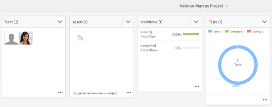

# Kreativt projekt- och PIM-integrering {#creative-project-and-pim-integration}

Om du är marknadsförare eller kreatör kan du använda verktygen i Adobe Experience Manager (AEM) för att hantera e-handelsrelaterade produktfotografier och tillhörande kreativa processer inom organisationen.

Du kan använda Creative Project för att effektivisera följande uppgifter i arbetsflödet för fotografering:

* Generera en begäran om fotofotografering
* Överföra en fototagning
* Samarbeta i en fototagning
* Paketera godkända resurser

>[!NOTE]
>
>Se [Användarroller för projekt för information](/help/sites-authoring/projects.md#user-roles-in-a-project) om tilldelning av användarroller och arbetsflöden till vissa typer av användare.

## Fotofotograferingsarbetsflöden  {#exploring-product-photo-shoot-workflows}

Creative Project innehåller olika projektmallar som uppfyller olika projektkrav. The **Fotoprojekt för produkt** mallen är tillgänglig direkt. Den här mallen innehåller arbetsflöden för fotoplåtning där du kan initiera och hantera begäranden om produktfotografering. Det innehåller även en rad uppgifter som gör att du kan få digitala bilder för produkter genom lämpliga gransknings- och godkännandeprocesser.

## Skapa ett produktfotoprojekt {#create-a-product-photo-shoot-project}

1. I **Projekt** konsol, tryck eller klicka **Skapa** välj **Skapa projekt** från listan.

   

1. I **Skapa projekt** väljer du **Fotoprojekt för produkt** mall och tryck eller klicka **Nästa**.

   

1. Ange projektinformation, inklusive titel, beskrivning och förfallodatum. Lägg till användare och tilldela dem olika roller. Du kan också lägga till en miniatyrbild för projektet.

   

1. Tryck eller klicka **Skapa**. Ett bekräftelsemeddelande meddelar att projektet har skapats.
1. Tryck eller klicka **Klar** för att gå tillbaka till **Projekt** konsol. Du kan också trycka eller klicka **Öppna** för att visa resurserna i projektet.

## Starta arbete i ett produktfotoprojekt {#starting-work-in-a-product-photo-shoot-project}

Om du vill starta en bildinspelningsförfrågan trycker eller klickar du på ett projekt och sedan trycker eller klickar du **Lägg till arbete** på sidan med projektinformation för att starta ett arbetsflöde.


A **Fotoprojekt för produkt** innehåller följande färdiga arbetsflöden:

* **Arbetsflöde för produktfototagning (Commerce Integration)**: Det här arbetsflödet använder handelsintegrering med PIM-systemet (Product Information Management) för att automatiskt generera en lista över de valda produkterna (hierarki). Du kan visa produktdata som en del av resursmetadata när arbetsflödet är klart.
* **Fotofotografering**: Med det här arbetsflödet kan du skapa en lista i stället för att vara beroende av e-handelsintegrering. Den mappar de överförda bilderna till en CSV-fil i projektresursmappen.

Använd **Fotofoto (Commerce Integration)** arbetsflöde för att mappa bildobjekt med produkterna i AEM. Det här arbetsflödet använder handelsintegrering för att länka de godkända bilderna till befintliga produktdata på platsen `/etc/commerce`.

The **Fotofoto (Commerce Integration)** arbetsflödet innehåller följande uppgifter:

* Skapa lista över bilder
* Överför fototagning
* Retuschera fototagning
* Granska och godkänn
* Flytta till produktionsuppgift

Om produktinformationen inte är tillgänglig i AEM använder du **Fotofotografering** arbetsflöde för att mappa bildresurser med produkterna baserat på den information du överför i en CSV-fil. CSV-filen måste innehålla grundläggande produktinformation, t.ex. produkt-ID, kategori och beskrivning. Arbetsflödet hämtar godkända resurser för produkterna.

Det här arbetsflödet innehåller följande uppgifter:

* Överför bildlista
* Överför fototagning
* Retuschera fototagning
* Granska och godkänn
* Flytta till produktionsuppgift

Du kan anpassa det här arbetsflödet med hjälp av alternativet för arbetsflödeskonfigurationer.

Båda arbetsflödena innehåller steg för att länka produkter till deras godkända resurser. Varje arbetsflöde innehåller följande steg:

* Arbetsflödeskonfiguration: Beskriver alternativen för att anpassa arbetsflödet
* Starta ett projektarbetsflöde: Beskriver hur du startar en produktfotografering
* Information om arbetsflödesuppgifter: Tillhandahåller information om tillgängliga uppgifter i arbetsflödet

## Spåra projektförlopp {#tracking-project-progress}

Du kan följa förloppet för ett projekt genom att övervaka de aktiva/slutförda uppgifterna i ett projekt.

Använd följande för att övervaka förloppet för ett projekt:

* Uppgiftskort
* Uppgiftslista

Uppgiftskortet visar projektets övergripande förlopp. Det visas bara på projektinformationssidan om projektet har några relaterade uppgifter. Uppgiftskortet visar projektets aktuella slutförandestatus baserat på antalet slutförda uppgifter. Det omfattar inte framtida uppgifter.

Uppgiftskortet innehåller följande information:

* Procent av aktiva uppgifter
* Procent slutförda uppgifter


Uppgiftslistan innehåller detaljerad information om den aktuella arbetsflödesaktiviteten för projektet. Visa listan genom att trycka eller klicka på aktivitetskortet. Uppgiftslistan innehåller även metadata som startdatum, förfallodatum, tilldelad, prioritet och status för uppgiften.


## Arbetsflödeskonfiguration {#workflow-configuration}

Den här uppgiften innebär att tilldela användare arbetsflödessteg baserat på deras roller.

Konfigurera **Fotofotografering** arbetsflöde:

1. Navigera till **verktyg** > **Arbetsflöden** och sedan på **Models** för att öppna **Arbetsflödesmodeller** sida.
1. Välj **Fotofotografering** arbetsflöde och tryck på **Redigera** i verktygsfältet för att öppna det i redigeringsläge.

   

1. I **Fotofotografering** öppnar du en projektuppgift. Öppna till exempel **Överför bildlista** uppgift.

   

1. Tryck eller klicka på **Uppgift** för att konfigurera följande:

   * Namn på uppgiften
   * Standardanvändare (roll) som tar emot uppgiften
   * Uppgiftens standardprioritet, som visas i användarens uppgiftslista
   * Uppgiftsbeskrivning som ska visas när den som tilldelas öppnar uppgiften
   * Förfallodatum för en aktivitet, som beräknas baserat på den tid som aktiviteten startades

1. Klicka **OK** för att spara konfigurationsinställningarna.

Du kan konfigurera ytterligare uppgifter för **Fotofotografering** arbetsflöde på ett liknande sätt.

Utför samma steg för att konfigurera uppgifterna i **Arbetsflöde för produktfototagning (Commerce Integration)**.

## Starta ett projektarbetsflöde {#starting-a-project-workflow}

I det här avsnittet beskrivs hur du integrerar produktinformationshantering med ditt kreativa projekt.

1. Navigera till ett produktfotoprojekt och tryck eller klicka på **Lägg till arbete** ikonen på **Arbetsflöden** kort.
1. Välj **Fotofoto (Commerce Integration)** arbetsflödeskort för att starta **Fotofoto (Commerce Integration)** arbetsflöde. Om produktinformationen inte är tillgänglig under `/etc/commerce`väljer du **Fotofotografering** arbetsflöde och starta **Fotofotografering** arbetsflöde.

   

1. Tryck eller klicka **Nästa** för att initiera arbetsflödet i projektet.
1. Ange arbetsflödesinformation på nästa sida.

   

1. Tryck eller klicka **Skicka** för att starta arbetsflödet för fotografering. Sidan med projektinformation för fotoprojektet visas.

   

### Information om arbetsflödesuppgifter {#workflow-tasks-details}

Arbetsflödet för fotografering omfattar flera uppgifter. Varje uppgift tilldelas till en användargrupp baserat på den konfiguration som har definierats för uppgiften.

#### Skapa aktivitet för lista över bilder {#create-shot-list-task}

The **Skapa lista över bilder** gör att projektägaren kan välja produkter för vilka bilder krävs. Baserat på det alternativ som användaren valt skapas en CSV-fil som innehåller grundläggande produktinformation.

1. Tryck eller klicka på ellipsknappen längst ned till höger i projektmappen [Aktivitetskort](#tracking-project-progress) om du vill visa uppgiftsobjektet i arbetsflödet.

   

1. Välj **Skapa lista över bilder** och sedan trycka/klicka på **Öppna** -ikonen i verktygsfältet.

   

1. Granska uppgiftsinformationen och tryck/klicka sedan på **Skapa lista över bilder** -knappen.

   

1. Välj produkter för vilka det finns produktdata utan kopplade bilder.

   

1. Tryck eller klicka på **Lägg till i lista över bilder** om du vill skapa en CSV-fil som innehåller en lista över alla sådana produkter. Ett meddelande bekräftar att tagningslistan har skapats för de valda produkterna. Klicka **Stäng** för att slutföra arbetsflödet.

1. När du har skapat en tagningslista visas **Visa lista över bilder** visas. Om du vill lägga till fler produkter i fotolistan trycker du eller klickar på **Lägg till i lista över bilder**. I det här fallet läggs data till i den ursprungligen skapade tagningslistan.

   

1. Tryck eller klicka **Visa lista över bilder** för att visa den nya tagningslistan.

   

   Om du vill redigera befintliga data eller lägga till nya data trycker/klickar du **Redigera** i verktygsfältet. Endast **Product **och **Beskrivning** fält kan redigeras.

   

   När du har uppdaterat filen trycker eller klickar du **Spara** i verktygsfältet för att spara filen.

1. Tryck eller klicka på **Complete** ikonen på **Skapa lista över bilder** uppgiftsinformationssida för att markera uppgiften som slutförd. Du kan lägga till en valfri kommentar.

När aktiviteten har slutförts introduceras följande ändringar i projektet:

* Resurser som motsvarar produkthierarkin skapas i en mapp med samma namn som arbetsflödets rubrik.
* Metadata för resurserna kan redigeras med Assets-konsolen, även innan fotografen visar bilderna.
* En mapp för fotografering skapas som lagrar bilderna som fotografen tillhandahåller. Fotomappen innehåller undermappar för varje produktpost i tagningslistan.

### Uppgift för överföring av lista över bilder {#upload-shot-list-task}

Den här uppgiften ingår i arbetsflödet för produktfotografering. Du utför den här uppgiften om produktinformation inte är tillgänglig i AEM. I det här fallet överför du en lista över produkter i en CSV-fil för vilka bildresurser krävs. Baserat på informationen i CSV-filen kan du mappa bildobjekt till produkterna. Filen måste vara en CSV-fil med namnet `shotlist.csv`.

Använd **Visa lista över bilder** under projektkortet i föregående procedur för att hämta en CSV-exempelfil. Granska exempelfilen för att ta reda på det vanliga innehållet i en CSV-fil.

Produktlistan eller CSV-filen kan innehålla fält, till exempel **Kategori, produkt, ID, beskrivning** och **Bana**. The **ID** fältet är obligatoriskt och innehåller produkt-id:t. De andra fälten är valfria.

En produkt kan tillhöra en viss kategori. Produktkategorin kan listas i CSV-filen under **Kategori** kolumn. The **Produkt** -fältet innehåller namnet på produkten. I **Beskrivning** anger du produktbeskrivningen eller instruktionerna för fotografen.

1. Tryck eller klicka på ellipsknappen längst ned till höger i projektmappen [Aktivitetskort](#tracking-project-progress) om du vill visa en lista med uppgifter i arbetsflödet.
1. Välj **Överför bildlista** och sedan trycka eller klicka på **Öppna** -ikonen i verktygsfältet.

   

1. Granska uppgiftsinformationen och tryck eller klicka sedan på **Överför bildlista** -knappen.

   

1. Tryck eller klicka på **Överför bildlista** för att överföra CSV-filen. Arbetsflödet identifierar den här filen som en källa som kan användas för att extrahera produktdata för nästa uppgift.
1. Överför en CSV-fil som innehåller produktinformation i lämpligt format. The **Visa överförda resurser** -länken visas under kortet när CSV-filen har överförts.

   

   Klicka på **Complete** -ikonen för att slutföra uppgiften.

1. Tryck/klicka på **Complete** -ikonen för att slutföra uppgiften.

### Ladda upp fototagningsaktivitet {#upload-photo-shoot-task}

Om du är redigerare kan du överföra bilder för de produkter som listas i **fillista.csv** som skapades eller överfördes i föregående uppgift.

Namnet på de bilder som ska överföras måste börja med `<ProductId_>` där `ProductId` refereras från **ID** fältet i `shotlist.csv` -fil. Exempel: för en produkt i bildlistan med **ID** `397122`laddar du upp filer med namn `397122_highcontrast.jpg`, `397122_lowlight.png`och så vidare.

Du kan antingen överföra bilderna direkt eller överföra en ZIP-fil som innehåller bilderna. Baserat på deras namn placeras bilderna i respektive produktmapp i fotograferingsmappen.

1. Under projektmappen trycker du på eller klickar på knappen för ellipser längst ned till höger på [Aktivitetskort](#tracking-project-progress) om du vill visa uppgiftsobjektet i arbetsflödet.
1. Välj **Överför fototagning** och sedan trycka eller klicka på **Öppna** -ikonen i verktygsfältet.

   

1. Tryck eller klicka **Överför fototagning** och ladda upp fotobilderna.
1. Tryck eller klicka på **Complete** -ikonen i verktygsfältet för att slutföra uppgiften.

### Retuschera fototagningsaktivitet {#retouch-photo-shoot-task}

Om du har redigeringsbehörighet utför du **Retuschera fototagning** redigera bilderna som överförts till fotomappen.

1. Under projektmappen trycker du på eller klickar på knappen för ellipser längst ned till höger i [Aktivitetskort](#tracking-project-progress) om du vill visa uppgiftsobjektet i arbetsflödet.
1. Välj **Retuschera fototagning** och sedan trycka/klicka på **Öppna** -ikonen i verktygsfältet.

   

1. Tryck eller klicka på **Visa överförda resurser** i **Retuschera fototagning** bläddra bland de överförda bilderna.

   

   Om det behövs kan du redigera bilderna i ett Adobe Creative Cloud-program.

   

1. Tryck eller klicka på **Complete** -ikonen i verktygsfältet för att slutföra uppgiften.

### Granska och godkänn uppgift {#review-and-approve-task}

I det här fallet granskar du fotot som överförts av en fotograf och markerar bilderna som godkända för användning.

1. Under projektmappen trycker du på eller klickar på knappen för ellipser längst ned till höger på [Aktivitetskort](#tracking-project-progress) om du vill visa uppgiftsobjektet i arbetsflödet.
1. Välj **Granska och godkänn** och sedan trycka eller klicka på **Öppna** -ikonen i verktygsfältet.

   

1. I **Granska och godkänn** tilldelar du en roll till granskningsaktiviteten och trycker eller klickar på **Granska** för att börja granska överförda produktbilder.

   

1. Välj en produktbild och tryck eller klicka på **Godkänn** i verktygsfältet för att markera det som godkänt. När du har godkänt en bild visas en godkänd banderoll över den.

   

1. Tryck eller klicka **Complete**. De godkända bilderna länkas till de tomma resurserna som skapades.

Du kan utelämna vissa produkter utan någon bild. Senare kan du göra om uppgiften och markera den som slutförd när den är klar.

Du kan navigera till projektresurser med resursgränssnittet och verifiera godkända bilder.

Tryck eller klicka på nästa nivå om du vill visa produkter enligt din produktdatahierarki.

Creative Project associerar godkända resurser med den refererade produkten. Metadata för resursen uppdateras med produktreferens och grundläggande information i **Produktdata** under resursegenskaper visas de i avsnittet AEM tillgångsmetadata.

>[!NOTE]
>
>I **Arbetsflöde för fotografering** (utan handelsintegrering) har de godkända bilderna ingen koppling till produkterna.

### Flytta till produktionsuppgift {#move-to-production-task}

Den här aktiviteten flyttar de godkända resurserna till den produktionsklara mappen så att de blir tillgängliga för användning.

1. Under projektmappen trycker du på eller klickar på knappen för ellipser längst ned till höger på [Aktivitetskort](#tracking-project-progress) om du vill visa uppgiftsobjektet i arbetsflödet.
1. Välj **Flytta till produktion** och sedan trycka eller klicka på **Öppna** -ikonen i verktygsfältet.

   

1. Om du vill visa godkända resurser för fototagningen innan du flyttar dem till produktionsklar mapp klickar du på knappen **Visa godkända resurser** länk under projektets miniatyrbild på sidan **Flytta till produktion** aktivitetssida.

   

1. Ange sökvägen till den produktionsklara mappen i **Flytta till** fält.

   

1. Tryck eller klicka **Flytta till produktion**. Stäng bekräftelsemeddelandet. Resurserna flyttas till den angivna sökvägen och en snurruppsättning skapas automatiskt för de godkända resurserna för varje produkt baserat på mapphierarkin.

1. Tryck/klicka på **Complete** -ikonen i verktygsfältet. Arbetsflödet slutförs när det sista steget markeras som slutfört.

## Visa DAM-resursmetadata {#viewing-dam-asset-metadata}

När du har godkänt mediefilerna länkas de till motsvarande produkter. The [Egenskaper](/help/assets/manage-assets.md#editing-properties) av de godkända tillgångarna har nu ytterligare **Produktdata** (länkad produktinformation). På den här fliken visas produktinformation, SKU-nummer och annan produktrelaterad information som länkar resursen. Tryck eller klicka på **Redigera** om du vill uppdatera en resursegenskap. Produktrelaterad information förblir skrivskyddad.

Tryck eller klicka på länken som visas för att navigera till respektive produktinformationssida i produktkonsolen som resursen är associerad med.

## Anpassa arbetsflödena för projektfototagning {#customizing-the-project-photo-shoot-workflows}

Du kan anpassa **Fototagning av projekt** arbetsflöden som bygger på era behov. Detta är en valfri rollbaserad uppgift som du utför för att ange värdet för en variabel i projektet. Senare kan du använda det konfigurerade värdet för att komma fram till ett beslut.

1. Klicka på eller tryck på AEM logotyp och navigera sedan till **verktyg** > **Arbetsflöde** > **Models** för att öppna **Arbetsflödesmodeller** sida.
1. Välj **Fotofoto (Commerce Integration)** arbetsflöde eller **Fotofotografering** arbetsflöde och klickning **Redigera** i verktygsfältet för att öppna arbetsflödet i redigeringsläge.
1. Öppna sidopanelen och leta upp **Skapa rollbaserad projektaktivitet** och dra det till arbetsflödet.

   

1. Öppna **Rollbaserad aktivitet** steg.
1. På **Uppgift** anger du ett namn för uppgiften som ska visas i uppgiftslistan. Du kan också tilldela en roll uppgiften, ange standardprioritet, ange en beskrivning och ange en tidpunkt när uppgiften förfaller.

   

1. På **Routning** anger du åtgärderna för uppgiften. Om du vill lägga till flera åtgärder trycker eller klickar du på **Lägg till objekt** länk.

   

1. När du har lagt till alternativen klickar du **OK** om du vill lägga till ändringarna i steget.

1. Tillbaka i **Arbetsflödesmodell** fönstertrycka eller klicka **Synkronisera** om du vill spara ändringarna i hela arbetsflödet. Tryck eller klicka **OK** för steget sparas inte ändringarna i arbetsflödet. Om du vill spara ändringarna i arbetsflödet trycker du eller klickar **Synkronisera**.

1. Öppna sidopanelen och leta upp **Gå till steg** arbetsflöde och dra det till arbetsflödet.

1. Öppna **Gå** och trycka eller klicka på **Process** -fliken.

1. Välj **Målsteg** går till och anger att **Routningsuttryck** är ECMA-skript. Ange sedan följande kod i **Skript** fält:

   ```javascript
   function check() {
   
   if (workflowData.getMetaDataMap().get("lastTaskAction","") == "Reject All") {
   
   return true
   
   }
   
   // set copywriter user in metadata
   
   var previousId = workflowData.getMetaDataMap().get("lastTaskCompletedBy", "");
   
   workflowData.getMetaDataMap().put("copywriter", previousId);
   
   return false;
   
   }
   ```

   >[!TIP]
   >
   >Mer information om skript i arbetsflödessteg finns i [Definiera en regel för en OR-delning](/help/sites-developing/workflows-models.md).

   

1. Tryck eller klicka **OK**.

1. Tryck eller klicka **Synkronisera** för att spara arbetsflödet.

En ny uppgift visas nu efter [Flytta till produktionsuppgift](#move-to-production-task) har slutförts och tilldelats ägaren.

Användaren i **Ägare** kan slutföra uppgiften och välja en åtgärd (från listan med åtgärder som lagts till i arbetsflödesstegskonfigurationerna) i listan i kommentarspopup-fönstret.

>[!NOTE]
>
>När du startar en server cachelagrar uppgiftslistservleten mappningarna mellan uppgiftstyper och URL:er som definieras under `/libs/cq/core/content/projects/tasktypes`. Sedan kan du utföra den vanliga övertäckningen och lägga till egna uppgiftstyper genom att placera dem under `/apps/cq/core/content/projects/tasktypes`.
