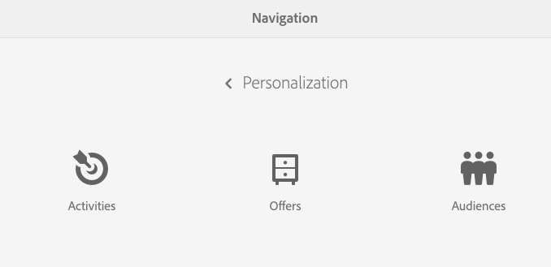
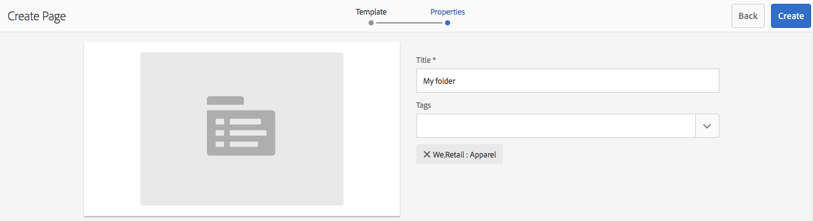
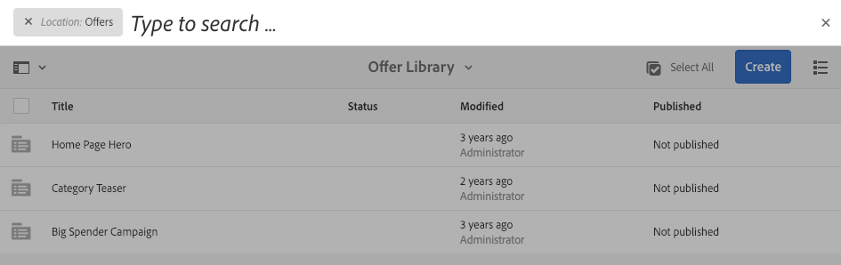

# Skapa och hantera erbjudanden{#creating-and-managing-offers}

Använd offertkonsolen för att skapa erbjudanden som du kan [använda i aktivitetsupplevelser](/help/sites-authoring/content-targeting-touch.md). Genom att skapa erbjudanden i offertkonsolen sparar du tid när flera upplevelser kräver samma erbjudande:

* Skapa erbjudandet en gång i biblioteket och använd det i olika upplevelser av ert varumärke.
* Ändra erbjudandet i biblioteket och ändringen påverkar alla upplevelser som använder det.

Erbjudandekonsolen organiserar erbjudanden efter varumärke. Varje varumärke innehåller ett bibliotek med erbjudanden som kan användas i ett varumärkes upplevelser. Använd mappar för att definiera en hierarkisk struktur för att ordna erbjudanden i varje bibliotek. Med en logisk mappstruktur kan man enkelt hitta erbjudanden genom att bläddra. Med taggnings- och sökverktygen kan författare också hitta erbjudanden.

## Lägg till ett varumärke med hjälp av offertkonsolen {#add-a-brand-using-the-offers-console}

Skapa ett varumärke som era erbjudanden är kopplade till. Öppna ett varumärke i Offers-konsolen för att komma åt dess erbjudandebibliotek där du kan skapa mappar och erbjudanden.

När du skapar ett varumärke med hjälp av konsolen Erbjudanden visas det också i [aktivitetskonsolen](/help/sites-authoring/activitylib.md) där du kan lägga till och administrera aktiviteter för varumärket.

1. Klicka på **Personalization** > **Erbjudanden** i navigeringskonsolen.

   

1. Klicka på **Skapa** och sedan på **Skapa** **varumärke**.
1. Markera varumärkesmallen och klicka på **Nästa**.
1. Skriv en rubrik för varumärket som du vill att det ska visas i konsolerna för erbjudanden och aktiviteter. Du kan också ange eller markera en eller flera taggar som ska kopplas till varumärket.
1. Klicka på **Skapa**.

## Lägg till en mapp i ett offertbibliotek {#add-a-folder-to-an-offer-library}

Lägg till en mapp i erbjudandebiblioteket för ett varumärke för att ordna och lagra erbjudanden. Du kan skapa en mapp under varumärket eller under andra mappar.

1. Öppna den plats där du vill skapa mappen i konsolen Erbjudanden. Öppna till exempel varumärket för att skapa en mapp på den översta nivån eller öppna en annan mapp i biblioteket.
1. Klicka på **Skapa** > **Skapa mapp eller erbjudande**.

   

1. Välj **Mapp** och klicka på **Nästa**.
1. Skriv en rubrik för mappen som du vill att den ska visas i erbjudandebiblioteket och skriv eller välj taggar.

   

1. Klicka på **Skapa**.

## Lägg till ett erbjudande i ett erbjudandebibliotek {#add-an-offer-to-an-offer-library}

Lägg till ett erbjudande i ett varumärkes erbjudandebibliotek så att det kan läggas till i varumärkesupplevelsen. När du lägger till ett erbjudande anger du en titel. Du kan även koppla erbjudandet till en eller flera taggar för att förbättra sökbarheten.

När du har skapat erbjudandet kan du öppna det och redigera innehållet.

1. I konsolen Erbjudanden öppnar du den plats där du vill skapa erbjudandet. Öppna till exempel varumärket för att skapa ett erbjudande på högsta nivå eller öppna en mapp i biblioteket.
1. Klicka på **Skapa** > **Skapa mapp eller erbjudande**.

   

1. Välj mallen **Erbjudandesida** och klicka sedan på **Nästa**.
1. Ange en titel för erbjudandet och välj eller skriv en eller flera taggar som du vill associera med erbjudandet. Klicka sedan på **Skapa**.
1. Öppna erbjudandet för redigering i bekräftelsedialogrutan genom att klicka på **Öppna sida**.

## Redigera ett erbjudande {#editing-an-offer}

Öppna ett erbjudande och redigera innehållet som du vill att det ska visas i upplevelserna som använder det. När ni redigerar ett erbjudande som används i alla upplevelser visas era ändringar i upplevelserna.

Du kan öppna ett erbjudande från en mapp i ett erbjudandebibliotek eller från sökresultat. Du kan också öppna ett erbjudande från en upplevelse som använder erbjudandet.

1. Klicka på ikonen bredvid erbjudandet i konsolen Erbjudanden och klicka på **Redigera**.
1. Lägg till komponenter i erbjudandet och redigera komponentinnehållet som vanligt.

## Ta bort ett erbjudande {#deleting-an-offer}

Ta bort ett erbjudande när det inte längre behövs. När du försöker ta bort ett erbjudande som används i en upplevelse uppmanas du att bekräfta borttagningen. Bekräftelse tar bort erbjudandet och tar bort det från upplevelserna.

Du kan ta bort ett erbjudande när du visar antingen mappinnehåll i ett erbjudandebibliotek eller sökresultat.

1. Klicka på ikonen bredvid erbjudandet i konsolen Erbjudanden och klicka på **Ta bort**.

   Markera erbjudandet och klicka på **Ta bort**.

1. Klicka på **Ta bort** i dialogrutan som visas för att bekräfta borttagningen.
1. Om erbjudandet används i en eller flera upplevelser visas en dialogruta som anger att det hänvisas till erbjudandet:

   * Om du vill ta bort erbjudandet och ta bort det från upplevelserna klickar du på **Tvinga borttagning**.
   * Om du vill behålla erbjudandet klickar du på **Avbryt**.

## Söker efter erbjudanden {#searching-for-offers}

Sök efter erbjudanden för alla varumärken med hjälp av nyckelord för att matcha titeln.

De aktuella sökvillkoren visas bredvid sökresultaten. Du kan också sortera resultaten efter kolumn i stigande eller fallande ordning. Du kan söka i vilken mapp som helst i ett bibliotek. Sökresultaten är desamma oavsett aktuell mapp.

Så här söker du efter erbjudanden:

1. Klicka på förstoringsglasikonen längst upp på Offers-konsolen. Som standard är sökningen begränsad till erbjudanden.
1. Ange ditt nyckelord om du vill söka efter erbjudanden. Välj bland resultaten.
