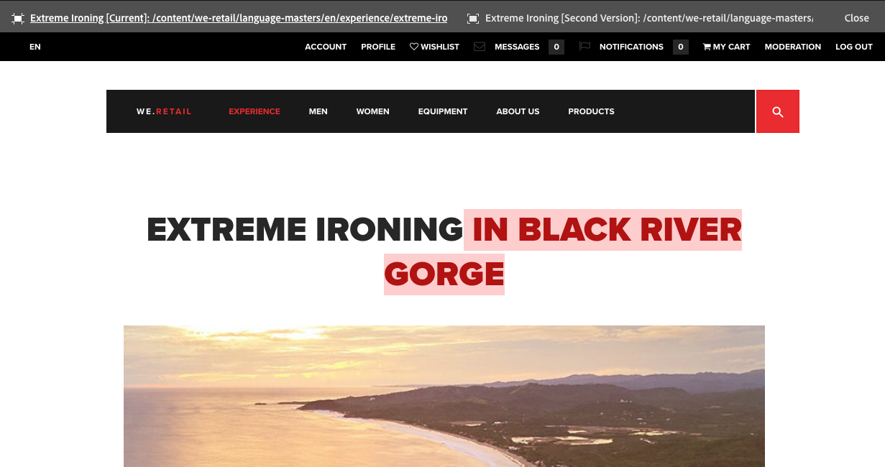

# Sidskillnader{#page-diff}

## Introduktion {#introduction}

Att skapa innehåll är en repetitiv process. Effektiv redigering kräver att man kan se vad som har ändrats från en iteration till en annan. Om du visar den ena sidversionen och den andra är ineffektiv och felbenägen kan uppstå. En författare vill enkelt kunna jämföra den aktuella sidan sida vid sida med en annan version.

Med funktionen för sidskillnader kan du enkelt jämföra två sidor sida vid sida med skillnaderna markerade.

>[!CAUTION]
>
>Användaren måste ha behörigheten **Ändra/Skapa/Ta bort** på noden `/content/versionhistory` för att kunna använda funktionen.
>
>Mer teknisk information om den här funktionen finns i [Developing and Page Diff](/help/sites-developing/pagediff.md#operation-details) .

## Use {#use}

Diff:en sida vid sida kan jämföra:

* [Versioner](/help/sites-authoring/working-with-page-versions.md#comparing-a-version-with-current-page) - Tidigare version av en sida med det aktuella läget
* [Live-kopior](/help/sites-administering/msm-livecopy.md#comparing-a-live-copy-page-with-a-blueprint-page) - Live-kopia med utkast
* [Startar](/help/sites-authoring/launches-editing.md#comparing-a-launch-page-to-its-source-page) - Starta med dess källa
* [Språkkopior](/help/sites-administering/tc-manage.md#comparing-language-copies) - En sida före och efter (re-)översättning

Läs respektive avsnitt om hur du påbörjar skillnaderna i dessa sammanhang.

### Presentation av skillnader {#presentation-of-differences}

Oberoende av vilket innehåll som jämförs, förblir presentationen av skillnaderna densamma.

* Det innehåll som valdes när du startade differensen visas till vänster (diff-startpunkten).
* Jämförelseinnehållet visas till höger (vad det markerade innehållet jämförs med).

Om du till exempel jämför versioner visas den aktuella versionen till vänster och den föregående versionen till höger.

Källan för båda sidorna visas tydligt i sidhuvudsfältet högst upp i webbläsarfönstret.

Skillnaden identifierar ändringar på komponentnivå och HTML-nivå. Objekt som har ändrats markeras med olika färger.

**Komponentändringar**

* Ljusgrön - komponent tillagd
* Rosa - komponent borttagen
* Blå - komponenten ändrad
* Blå - komponenten har flyttats

Observera att färgerna Ändrad och Flyttad är desamma.

**HTML-ändringar**

* Mörkgrön - HTML tillagd
* Röd - HTML borttagen

>[!NOTE]
>
>När du jämför språkkopior inaktiveras markering, eftersom i en översättning ändras allt och markering inte har någon fördel.

### Helskärm och avslutande {#fullscreen-and-exiting}

Om du vill fokusera på ett visst innehåll kan du klicka på helskärmsikonen för endera&quot;sidan&quot; av diff:n för att förstora den till hela webbläsarfönstret.

Den markerade sidan fyller hela fönstret, men fältet förblir överst så att du kan växla mellan de två sidorna.

Du kan också stänga helskärmsläget genom att klicka på ikonen för att avsluta helskärmsläget.

Du kan när som helst stänga diff sida vid sida genom att klicka på stängningsknappen i sidhuvudet.

## Begränsningar {#limitations}

I vissa situationer kan det hända att sidskillnader inte identifierar någon skillnad som förväntat.

* När olika versioner och starter används inte dynamiska komponenter som vägbeskrivningar, menyer, produktlistor eller logotyper (komponenter som är beroende av webbplatsstrukturen för att återge sitt innehåll).
* För versioner återskapar inte diff åtkomstkontrollprincipen och Live copy-relationen.
* Om du ändrar något i en bild, t.ex. attributen alt, title eller src, markeras den i blått som ändrad. I vissa fall har bilden emellertid en Base64-representation av src-attributet och även om båda bilderna ser likadana ut markeras de med diff som olika på grund av de olika src-attributen.
* Skillnaden kan inte identifiera bildrotation.
* Om en sida flyttas kan du inte längre göra några skillnader med versioner som gjorts före flyttningen.

   * Om du får problem med en skillnad kontrollerar du om sidan har flyttats i [tidslinjen](/help/sites-authoring/basic-handling.md#timeline) .

>[!NOTE]
>
>Versioner kan inte jämföras med varandra. Endast den aktuella versionen kan jämföras med andra versioner av sidan. Den aktuella versionen är alltid den version som markeras med ändringar.

>[!NOTE]
>
>Mer information om hur sidskillnader fungerar samt om begränsningar som kan påverka sidskillnader finns i [utvecklardokumentationen](/help/sites-developing/pagediff.md) för den här funktionen.
