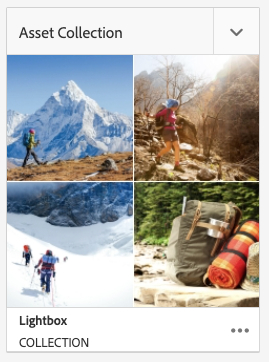
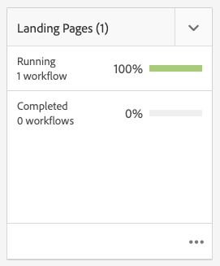

# Projekt {#projects}

Med projekt kan du gruppera resurser i en enhet. En gemensam, delad miljö gör det enkelt att hantera projekt. De typer av resurser som du kan associera med ett projekt kallas plattor i AEM. Rutorna kan innehålla projekt- och teaminformation, resurser, arbetsflöden och andra typer av information, vilket beskrivs i detalj i [Projektrutor.](#project-tiles)

Som användare kan du:

* Skapa och ta bort projekt
* Koppla innehåll- och resursmappar till ett projekt
* Ta bort innehållslänkar från projekt

## Åtkomstkrav {#access-requirements}

Projicerar en standardfunktion i AEM och kräver ingen ytterligare konfiguration.

För användare i projekt som vill se andra användare/grupper medan de använder projekt, till exempel när de skapar projekt, skapar uppgifter/arbetsflöden eller visar och hanterar teamet, måste dessa användare ha läsåtkomst på `/home/users` och `/home/groups`.

Det enklaste sättet att göra detta är att ge gruppen **projects-users** läsåtkomst till `/home/users` och `/home/groups`.

## Projektkonsol {#projects-console}

Projektkonsolen är där du kommer åt och hanterar dina projekt i AEM.

Projektkonsolen liknar andra konsoler i AEM, tillåter flera åtgärder i enskilda projekt och justerar visningen av projekten.

### Växla läge {#modes}

Du kan använda spårväljaren för att ändra mellan konsollägen.

#### Endast innehåll {#content-only}

Endast innehåll är standardläge när konsolen öppnas. Den visar alla dina projekt.

#### Tidslinje {#timeline}

I tidslinjevyn kan du välja ett enskilt projekt och visa aktiviteten på det. Använd spårväljaren eller snabbtangenten `alt+1` för att ändra till den här vyn.

### Växla vy {#views}

Du kan använda vyväljaren för att ändra mellan att visa projekt som stora rutor (standard), för att visa dem som en lista eller i en kalender.

### Filtrera din vy {#filter}

Du kan använda filtret för att växla mellan alla projekt och endast de som är aktiva.

### Välja och visa projekt {#selecting}

Välj ett projekt genom att hålla muspekaren över projektrutan och klicka på bockmarkeringen.

Visa detaljerna för ett projekt genom att klicka på det för att detaljgranska det.

### Skapa nya projekt {#creating}

Klicka på **Skapa** om du vill lägga till ett nytt projekt.

## Projektpaneler {#project-tiles}

Projekt består av olika typer av information som du vill hantera tillsammans. Den här informationen representeras av olika **plattor**.

Du kan associera följande rutor med ditt projekt.

* [Assets](#assets)
* [Resurssamlingar](#asset-collections)
* [Erfarenheter](#experiences)
* [Länkar](#links)
* [Projektinformation](#project-info)
* [Team](#team)
* [Landningssidor](#landing-pages)
* [E-post](#emails)
* [Arbetsflöden](#workflows)
* [Launches](#launches)
* [Uppgifter](#tasks)

Klicka på den nedrullningsbara menyn i det övre högra hörnet av en ruta för att lägga till mer data i rutan.

Klicka på ellipsknappen längst ned till höger i en ruta för att öppna rutans data i dess associerade konsol.

### Assets {#assets}

I rutan **Assets** kan du samla alla resurser som du använder för ett visst projekt.

Du överför resurser direkt i rutan.

### Resurssamlingar {#asset-collections}

På liknande sätt som resurser kan du lägga till [resurssamlingar](/help/assets/manage-collections.md) direkt i ditt projekt. Du definierar samlingar i Assets.

Lägg till en samling genom att klicka på **Lägg till samling** och välja önskad samling i listan.

### Erfarenheter {#experiences}

Med panelen **Erfarenheter** kan du lägga till en mobilapp, en webbplats eller en publikation i projektet.

Ikonerna anger vilken typ av upplevelse som visas.

* Webbplats
* Mobilapplikation

### Länkar {#links}

Med rutan **Länkar** kan du koppla externa länkar till ditt projekt.

Du kan namnge länken med ett lättkänt namn och ändra miniatyrbilden.

### Projektinformation {#project-info}

Panelen **Projektinformation** innehåller allmän information om projektet, inklusive en beskrivning, projektstatus (inaktiv eller aktiv), ett förfallodatum och medlemmar. Dessutom kan du lägga till en projektminiatyr, som visas på huvudprojektsidan.

### Översättningsjobb {#translation-job}

Under **Översättningsjobb** startar du en översättning och du ser även status för dina översättningar.

Information om hur du konfigurerar översättningen finns i dokumentet [Skapa översättningsprojekt.](/help/assets/translation-projects.md)

### Team {#team}

I den här rutan kan du ange medlemmarna i projektteamet. När du redigerar kan du ange namnet på teammedlemmen och tilldela användarrollen.

Du kan lägga till och ta bort teammedlemmar från teamet. Dessutom kan du redigera den [användarroll](#userroles) som tilldelats teammedlemmen.

### Landningssidor {#landing-pages}

Med plattan **Landningssidor** kan du begära en ny landningssida.

Det här arbetsflödet beskrivs i dokumentet[Skapa en startsida.](/help/sites-authoring/projects-with-workflows.md#request-landing-page-workflow)

### E-post {#emails}

Med rutan **E-post** kan du hantera e-postbegäranden. Arbetsflödet **Begär e-post** startas.

Mer information beskrivs i arbetsflödet [Begär e-post.](/help/sites-authoring/projects-with-workflows.md#request-email-workflow)

### Arbetsflöden {#workflows}

Du kan starta arbetsflöden för ditt projekt. Om några arbetsflöden körs visas deras status i rutan **Arbetsflöden**.

Beroende på vilket projekt du skapar finns det olika arbetsflöden tillgängliga.

Dessa beskrivs i [Arbeta med projektarbetsflöden.](/help/sites-authoring/projects-with-workflows.md)

### Launches {#launches}

I rutan **Startar** visas alla starter som har begärts med ett [begäranstartsarbetsflöde.](/help/sites-authoring/projects-with-workflows.md)

### Uppgifter {#tasks}

Med uppgifter kan du övervaka status för projektrelaterade uppgifter, inklusive arbetsflöden. Uppgifter beskrivs mer ingående i [Arbeta med uppgifter](/help/sites-authoring/task-content.md).

## Projektmallar {#project-templates}

Mallar är grunden för ditt projekt. AEM tillhandahåller dessa standardprojektmallar.

* **Medieprojekt** - Detta är ett referensexempelprojekt för medierelaterade aktiviteter. Den innehåller flera medierelaterade projektroller och innehåller även arbetsflöden för medieinnehåll.
* **[Produktfotoprojekt](/help/sites-authoring/managing-product-information.md)** - Detta är ett referensexempel för hantering av produktfotografi i eCommerce.
* **[Översättningsprojekt](/help/sites-administering/translation.md)** - Detta är ett referensexempel för hantering av översättningsrelaterade aktiviteter. Det innehåller grundläggande roller och arbetsflöden för hantering av översättning.
* **Enkelt projekt** - Detta är ett referensexempel för projekt som inte passar in i andra kategorier. Det innehåller tre grundläggande roller och fyra allmänna AEM-arbetsflöden.

Beroende på vilken mall du väljer kan du välja mellan olika alternativ i projektet, t.ex. användarroller och arbetsflöden.

## Användarroller i ett projekt {#user-roles-in-a-project}

De olika användarrollerna definieras i projektmallen och används av två primära orsaker:

1. Behörigheter: Användarrollerna tillhör en av de tre kategorier som visas: observatör, redigerare, ägare. En fotograf eller copywriter har till exempel samma behörighet som en redigerare. Behörigheterna avgör vad en användare kan göra med innehållet i ett projekt.
1. Arbetsflöden: Arbetsflödena avgör vem som tilldelas uppgifter i ett projekt. Uppgifterna kan associeras med en projektroll. En uppgift kan t.ex. tilldelas fotografer så att alla gruppmedlemmar som har rollen fotograf får uppgiften.

Alla projekt har stöd för följande standardroller så att du kan administrera säkerhets- och kontrollbehörigheter.

| Roll | Beskrivning | Behörigheter | Gruppmedlemskap |
|---|---|---|---|
| Observer | En användare i den här rollen kan visa projektinformation, inklusive projektstatus. | Skrivskyddade behörigheter i ett projekt | `workflow-users` grupp |
| Redigerare | En användare med den här rollen kan överföra och redigera innehållet i ett projekt. | Läs- och skrivbehörighet för ett projekt, associerade metadata och relaterade resurser Behörigheter att överföra en tagningslista, fotografera och granska och godkänna resurser Skrivbehörighet för `/etc/commerce` Ändra behörighet för ett specifikt projekt | `workflow-users` grupp |
| Ägare | En användare med den här rollen kan skapa ett projekt, initiera arbete i ett projekt och flytta godkända resurser till produktionsmappen. Alla andra uppgifter i projektet kan också visas och utföras av ägaren. | Skrivbehörighet för `/etc/commerce` | `dam-users`-grupp för att kunna skapa ett projekt `projects-administrators`-grupp för att kunna skapa ett projekt och flytta resurser |

För kreativa projekt finns även andra roller, som fotografer. Du kan använda de här rollerna för att skapa anpassade roller för ett visst projekt.

### Skapa grupp automatiskt {#auto-group-creation}

När du skapar projektet och lägger till användare till de olika rollerna skapas grupper som är kopplade till projektet automatiskt för att hantera associerade behörigheter.

Ett projekt med namnet Myproject skulle till exempel ha tre grupper, **MyProject Owners**, **MyProject Editors**, **MyProject Observers**.

Om projektet tas bort tas dessa grupper endast bort om du väljer lämpligt alternativ [&#x200B; när du tar bort projektet.](/help/sites-authoring/touch-ui-managing-projects.md#deleting-a-project) En administratör kan även ta bort grupper manuellt i **Verktyg** > **Dokumentskydd** > **Grupper**.

## Ytterligare resurser {#additional-resources}

Mer information om hur du använder projekt finns i följande ytterligare dokument:

* [Hantera projekt](/help/sites-authoring/touch-ui-managing-projects.md)
* [Arbeta med uppgifter](/help/sites-authoring/task-content.md)
* [Arbeta med projektarbetsflöden](/help/sites-authoring/projects-with-workflows.md)
* [Integrering av Creative Project och PIM](/help/sites-authoring/managing-product-information.md)
