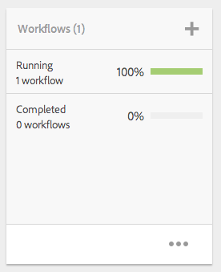

# Projekt{#projects}

Med projekt kan du gruppera resurser i en enhet. En gemensam, delad miljö gör det enkelt att hantera projekt. De typer av resurser som du kan associera med ett projekt kallas i AEM för plattor. Rutorna kan innehålla projekt- och teaminformation, resurser, arbetsflöden och andra typer av information, vilket beskrivs i detalj i [Projektrutor.](#project-tiles)

>[!CAUTION]
>
>För användare i projekt som vill se andra användare/grupper när de använder projektfunktioner som att skapa projekt, skapa uppgifter/arbetsflöden, se och hantera team, måste dessa användare ha läsåtkomst på **/hem/användare** och **/hem/grupper**. Det enklaste sättet att implementera detta är att ge **projekt-användare** -gruppen läsåtkomst till **/hem/användare** och**/hem/grupper**.

Som användare kan du göra följande:

* Skapa projekt
* Koppla innehåll- och resursmappar till ett projekt
* Ta bort projekt
* Ta bort innehållslänkar från projekt

Se följande ytterligare ämnen:

* [Hantera projekt
   ](/help/sites-authoring/touch-ui-managing-projects.md)
* [Arbeta med uppgifter](/help/sites-authoring/task-content.md)
* [Arbeta med projektarbetsflöden](/help/sites-authoring/projects-with-workflows.md)
* [Kreativt projekt- och PIM-integrering](/help/sites-authoring/managing-product-information.md)

## Projektkonsol {#projects-console}

Projektkonsolen är där du får åtkomst till och hanterar dina projekt i AEM.

* Välj **Tidslinje** och sedan ett projekt för att visa tidslinjen.
* Klicka/tryck på **Välj** för att öppna markeringsläget.
* Klicka på **Skapa** för att lägga till projekt.
* **Med Växla aktiva projekt** kan du växla mellan alla projekt och endast de som är aktiva.
* **Med Visa statistikvy** kan du visa projektstatistik för slutförda uppgifter.

## Projektpaneler {#project-tiles}

Med Projekt kan du koppla olika typer av information till dina projekt. Dessa kallas **plattor**. Var och en av plattorna och vilken typ av information de innehåller beskrivs i detta avsnitt.

Du kan associera följande rutor med ditt projekt. Var och en av dem beskrivs i följande avsnitt:

* Resurser och tillgångssamlingar
* Erfarenheter
* Länkar
* Projektinformation
* Team
* Landningssidor
* E-post
* Arbetsflöden
* Startar
* Uppgifter

### Resurser {#assets}

I **resurspanelen** kan du samla alla resurser som du använder för ett visst projekt.

Du överför resurser direkt i rutan. Du kan dessutom skapa bilduppsättningar, snurpuppsättningar eller blandade medieuppsättningar om du har tilläggsprogrammet Dynamiska media.

### Resurssamlingar {#asset-collections}

Precis som resurser kan du lägga till [resurssamlingar](/help/assets/managing-collections-touch-ui.md) direkt i projektet. Du definierar samlingar i Resurser.

Lägg till en samling genom att klicka på **Lägg till samling** och välja önskad samling i listan.

### Erfarenheter {#experiences}

I **panelen Erfarenheter** kan du lägga till en mobilapp, en webbplats eller en publikation i projektet.

Ikonerna anger vilken typ av upplevelse som visas: webbplats, mobilapplikation eller publikation. Lägg till upplevelser genom att klicka på plustecknet eller klicka på **Lägg till upplevelse** och välja typ av upplevelse.

Välj sökväg för miniatyrbilderna och ändra miniatyrbilden för upplevelsen om det är tillämpligt. Erfarenheter grupperas tillsammans i **panelen Erfarenheter** .

### Länkar {#links}

På länkpanelen kan du koppla externa länkar till ditt projekt.

Du kan namnge länken med ett lättkänt namn och ändra miniatyrbilden.

### Projektinformation {#project-info}

Panelen Projektinformation innehåller allmän information om projektet, inklusive en beskrivning, projektstatus (inaktiv eller aktiv), ett förfallodatum och medlemmar. Dessutom kan du lägga till en projektminiatyr, som visas på huvudprojektsidan.

Teammedlemmar kan tilldelas och tas bort från den här panelen (eller få sina roller ändrade) samt teampanelen.

### Översättningsjobb {#translation-job}

Översättningsjobbrutan är där du startar en översättning och även där du ser statusen för dina översättningar. Mer information om hur du konfigurerar översättningen finns i [Skapa översättningsprojekt](/help/assets/translation-projects.md).

Klicka på ellipsen längst ned på **översättningsjobbkortet** för att visa resurserna i översättningsarbetsflödet. I översättningsjobblistan visas även poster för metadata och taggar för resurser. Dessa poster anger att metadata och taggar för resurserna också översätts.

### Team {#team}

I den här rutan kan du ange medlemmarna i projektteamet. När du redigerar kan du ange namnet på teammedlemmen och tilldela användarrollen.

Du kan lägga till och ta bort teammedlemmar från teamet. Dessutom kan du redigera den [användarroll](#userroles) som tilldelats teammedlemmen.

### Landningssidor {#landing-pages}

Med plattan **Landningssidor** kan du begära en ny landningssida.

Det här arbetsflödet beskrivs i [Skapa en startsida](/help/sites-authoring/projects-with-workflows.md#request-landing-page-workflow).

### E-post {#emails}

Med rutan **E-post** kan du hantera e-postbegäranden. Det startar arbetsflödet Begär e-post.

Mer information finns i arbetsflödet [Begär e-post.](/help/sites-authoring/projects-with-workflows.md#request-email-workflow)

### Arbetsflöden {#workflows}

Du kan tilldela ditt projekt för att följa vissa arbetsflöden. Om något arbetsflöde körs visas deras status på panelen **Arbetsflöden** i Projekt.

Du kan tilldela ditt projekt för att följa vissa arbetsflöden. Beroende på vilket projekt du väljer finns olika arbetsflöden tillgängliga.

Dessa beskrivs i [Arbeta med projektarbetsflöden.](/help/sites-authoring/projects-with-workflows.md)

### Startar {#launches}

I rutan Launches (Starta) visas alla starter som har begärts i ett arbetsflöde för att starta en [begäran.](/help/sites-authoring/projects-with-workflows.md)

### Uppgifter {#tasks}

Med uppgifter kan du övervaka status för projektrelaterade uppgifter, inklusive arbetsflöden. Uppgifter beskrivs i detalj i [Arbeta med uppgifter](/help/sites-authoring/task-content.md).

## Projektmallar {#project-templates}

AEM levereras med tre olika mallar:

* Ett enkelt projekt - Ett referensexempel för projekt som inte passar in i andra kategorier (en&quot;catch-all&quot;). Det innehåller tre grundläggande roller (ägare, redigerare och observatörer) och fyra arbetsflöden (projektgodkännande, begäranstart, begäranstartsida och e-postbegäran).
* Ett medieprojekt - Ett referensexempelprojekt för medierelaterade aktiviteter. Det innehåller flera medierelaterade projektroller (fotografer, redigerare, copywriters, designers, Owners och Observers). Det innehåller även två arbetsflöden för medieinnehåll - Begär kopia (för att begära och granska text) och Produktfoto (för hantering av produktrelaterade foton)
* [Product Photo Shoot Project](/help/sites-authoring/managing-product-information.md) - Ett referensexempel för hantering av e-handelsrelaterade produktfotografier. Det innehåller roller för fotografer, redigerare, fotoretuscherare, ägare, creative directors, marknadsförare i sociala medier, marknadschefer, granskare och observatörer.
* [Ett översättningsprojekt](/help/sites-administering/translation.md) - Ett referensexempel för hantering av översättningsrelaterade aktiviteter. Det innehåller tre grundläggande roller (ägare, redigerare och observatörer). Det innehåller två arbetsflöden som du kommer åt i användargränssnittet för arbetsflöden.

Beroende på vilken mall du väljer har du olika alternativ tillgängliga, särskilt när det gäller användarroller och arbetsflöden.

## Användarroller i ett projekt {#user-roles-in-a-project}

De olika användarrollerna anges i en projektmall och används av två primära orsaker:

1. Behörigheter. Användarrollerna tillhör en av de tre kategorier som visas: Observer, Editor, Owner. En fotograf eller en copywriter har till exempel samma behörighet som en redigerare. Behörigheterna avgör vad en användare kan göra med innehållet i ett projekt.
1. Arbetsflöden. Arbetsflödena avgör vem som tilldelas uppgifter i ett projekt. Uppgifterna kan kopplas till en projektroll. En uppgift kan till exempel tilldelas fotografer så att alla gruppmedlemmar som har rollen fotograf får uppgiften.

Alla projekt har stöd för följande standardroller så att du kan administrera säkerhet och kontrollbehörigheter:

<table>
 <tbody>
  <tr>
   <td>
<strong>Roll</strong>
 </td>
   <td>
<strong>Beskrivning</strong>
 </td>
   <td>
<strong>Behörigheter</strong>
 </td>
   <td>
<strong>Gruppmedlemskap</strong>
 </td>
  </tr>
  <tr>
   <td>
Observer
 </td>
   <td>
En användare i den här rollen kan visa projektinformation, inklusive projektstatus.
 </td>
   <td>
Skrivskyddade behörigheter i ett projekt
 </td>
   <td>
grupp för arbetsflöden-användare
 </td>
  </tr>
  <tr>
   <td>
Redigerare
 </td>
   <td>
En användare med den här rollen kan överföra och redigera innehållet i ett projekt.
 
 
 </td>
   <td>
    <ul>
     <li>Läs- och skrivåtkomst för ett projekt, associerade metadata och relaterade resurser.</li>
     <li>Behörigheter att ladda upp en tagningslista, fotografera samt granska och godkänna material</li>
     <li>Skriv behörighet på /etc/commerce</li>
     <li>Ändra behörigheter för ett specifikt projekt</li>
    </ul> </td>
   <td>
grupp för arbetsflöden-användare
 </td>
  </tr>
  <tr>
   <td>
Ägare
 </td>
   <td>
En användare med den här rollen kan initiera ett projekt. En ägare kan skapa ett projekt, starta arbete i ett projekt och även flytta godkända resurser till produktionsmappen. Även om alla andra uppgifter i projektet kan visas och utföras av ägaren.
 </td>
   <td>
    <ul>
     <li>Skriv behörighet på /etc/commerce</li>
    </ul> </td>
   <td>
    <ul>
     <li>DAM-användargrupp (för att kunna skapa ett projekt)</li>
     <li>projektadministratörsgrupp (för att kunna flytta resurser)</li>
    </ul> </td>
  </tr>
 </tbody>
</table>

För kreativa projekt finns även andra roller - till exempel fotografer -. Du kan använda de här rollerna för att skapa anpassade roller för ett visst projekt.

>[!NOTE]
>
>När du skapar projektet och lägger till användare till de olika rollerna skapas grupper som är kopplade till projektet automatiskt för att hantera associerade behörigheter. Ett projekt med namnet Myproject skulle till exempel ha tre grupper, **Myproject Owners**, **Myproject Editors**, **Myproject Observers**. Om projektet däremot tas bort tas de grupperna inte bort automatiskt. En administratör måste ta bort grupperna manuellt i **Verktyg** > **Dokumentskydd** > **Grupper**.
