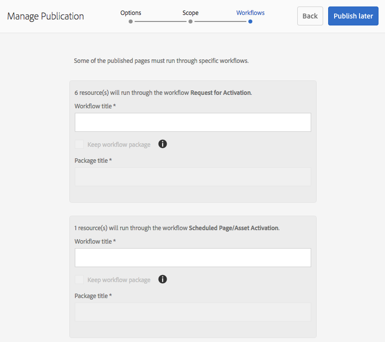

# Publicera sidor {#publishing-pages}

När du har skapat och granskat ditt innehåll i författarmiljön är målet att [göra det tillgängligt på din offentliga webbplats](/help/sites-authoring/author.md#concept-of-authoring-and-publishing) (din publiceringsmiljö).

Detta kallas att publicera en sida. När du vill ta bort en sida från publiceringsmiljön kallas det för att avpublicera. När sidan publiceras och avpubliceras är den fortfarande tillgänglig i redigeringsmiljön för ytterligare ändringar tills du tar bort den.

Du kan även publicera/avpublicera en sida direkt eller vid ett fördefinierat datum/tid i framtiden.

>[!NOTE]
>
>Vissa termer om publicering kan vara förvirrade:
>
>* **Publicera/avpublicera**
   >  Detta är de primära villkoren för de åtgärder som gör innehållet tillgängligt för allmänheten i publiceringsmiljön (eller inte).
   >
   >
* **Aktivera/inaktivera**
   >  Dessa termer är synonyma med publicera/avpublicera.
   >
   >
* **Replikering/replikering**
   >  Detta är de tekniska termer som beskriver hur data (t.ex. sidinnehåll, filer, kod, användarkommentarer) flyttas från en miljö till en annan, t.ex. vid publicering eller omvänd replikering av användarkommentarer.
>

>[!NOTE]
>
>Om du inte har behörighet att publicera en viss sida:
>
>* Ett arbetsflöde kommer att utlösas för att meddela lämplig person om din begäran om publicering.
>* Det här [arbetsflödet kan ha anpassats](/help/sites-developing/workflows-models.md#main-pars-procedure-6fe6) av ditt utvecklingsteam.
>* Ett meddelande visas kort för att meddela dig att arbetsflödet har utlösts.
>

## Publicera sidor {#publishing-pages-1}

Beroende på var du befinner dig kan du publicera:

* [Från sidredigeraren](/help/sites-authoring/publishing-pages.md#publishing-from-the-editor)
* [Från webbplatskonsolen](/help/sites-authoring/publishing-pages.md#publishing-from-the-console)

### Publicera från Redigeraren {#publishing-from-the-editor}

Om du redigerar en sida kan den publiceras direkt från redigeraren.

1. Välj ikonen **Sidinformation** för att öppna menyn och sedan alternativet **Publicera sida** .

   

1. Beroende på om sidan har referenser som behöver publiceras:

   * Sidan publiceras direkt om det inte finns några referenser att publicera.
   * Om sidan innehåller referenser som behöver publiceras visas dessa i **publiceringsguiden** där du kan antingen:

      * Ange vilket av resurserna/taggarna/etc. du vill publicera tillsammans med sidan och sedan använda **Publicera** för att slutföra processen.

      * Använd **Avbryt** om du vill avbryta åtgärden.
   

1. Om du väljer **Publicera** kommer sidan att replikeras till publiceringsmiljön. I sidredigeraren visas en informationsbanderoll som bekräftar publiceringsåtgärden.

   

   När du visar samma sida i konsolen visas den uppdaterade publiceringsstatusen.

   

>[!NOTE]
>
>Publicering från redigeraren är en ytlig publicering, dvs endast den valda sidan/de markerade sidorna publiceras och inga underordnade sidor publiceras.

### Publicera från konsolen {#publishing-from-the-console}

I platskonsolen finns det två alternativ för publicering:

* [Snabbpublicering](/help/sites-authoring/publishing-pages.md#quick-publish)
* [Hantera publikation](/help/sites-authoring/publishing-pages.md#manage-publication)

#### Snabbpublicering {#quick-publish}

**Snabbpublicering** är avsett för enkla ärenden och publicerar de markerade sidorna direkt utan ytterligare interaktion. Därför kommer alla icke-publicerade referenser också att publiceras automatiskt.

Så här publicerar du en sida med Snabbpublicering:

1. Markera sidan eller sidorna i webbplatskonsolen och klicka på knappen **Snabbpublicering** .

   

1. I dialogrutan Snabbpublicering bekräftar du publikationen genom att klicka på **Publicera** eller Avbryt genom att klicka på **Avbryt**. Kom ihåg att alla opublicerade referenser också publiceras automatiskt.

   

1. När sidan publiceras visas en varning som bekräftar publiceringen.

>[!NOTE]
>
>Snabbpublicering är en grund publicering, d.v.s. endast den valda sidan/de markerade sidorna publiceras och inga underordnade sidor publiceras.

#### Hantera publikation {#manage-publication}

**Med Hantera publikation** får du fler alternativ än Snabbpublicering, så att du kan inkludera underordnade sidor, anpassa referenserna och starta tillämpliga arbetsflöden samt erbjuda möjlighet att publicera vid ett senare tillfälle.

Så här publicerar eller avpublicerar du en sida med Hantera publikation:

1. Markera sidan eller sidorna i webbplatskonsolen och klicka på knappen **Hantera publikation** .

   

1. Guiden **Hantera publikation** startar. I det första steget, **Alternativ**, kan du:

   * Välj om du vill publicera eller avpublicera de markerade sidorna.
   * Välj om du vill utföra åtgärden nu eller vid ett senare datum.
   När du publicerar senare startas ett arbetsflöde för publicering av den eller de valda sidorna vid den angivna tidpunkten. Om du inte publicerar senare startas ett arbetsflöde för att avpublicera den eller de valda sidorna vid en viss tidpunkt.

   Om du vill avbryta en publicering/avpublicering senare går du till [arbetsflödeskonsolen](/help/sites-administering/workflows.md) och avslutar motsvarande arbetsflöde.

   

   Klicka på **Nästa** för att fortsätta.

1. I nästa steg i guiden Hantera publikation, **Omfång**, kan du definiera omfattningen för publikationen/borttagningen, till exempel att inkludera underordnade sidor och/eller inkludera referenser.

   

   Du kan använda knappen **Lägg till innehåll** för att lägga till ytterligare sidor i listan över sidor som ska publiceras om du inte har valt någon sida innan du startar guiden Hantera publikation.

   När du klickar på knappen Lägg till innehåll startas [sökvägsläsaren](/help/sites-authoring/author-environment-tools.md#path-browser) så att du kan välja innehåll.

   Markera önskade sidor och klicka sedan på **Välj** för att lägga till innehållet i guiden eller **Avbryt **för att avbryta valet och återgå till guiden.

   I guiden kan du markera ett objekt i listan för att konfigurera ytterligare alternativ, till exempel:

   * Inkludera dess underordnade.
   * Ta bort den från markeringen.
   * Hantera dess publicerade referenser.
   

   När du klickar på **Inkludera underordnade** öppnas en dialogruta där du kan:

   * Inkludera endast omedelbara barn.
   * Inkludera endast ändrade sidor.
   * Inkludera endast redan publicerade sidor.
   Klicka på **Lägg** till för att lägga till underordnade sidor i listan över sidor som ska publiceras eller avpubliceras baserat på de valda alternativen. Klicka på **Avbryt** om du vill avbryta markeringen och återgå till guiden.

   

   När du återgår till guiden visas de sidor som lagts till baserat på dina val i dialogrutan Inkludera underordnade.

   Du kan visa och ändra referenserna som ska publiceras eller avpubliceras för en sida genom att markera den och sedan klicka på knappen **Publicerade referenser** .

   

   I dialogrutan **Publicerade referenser** visas referenser för det markerade innehållet. Som standard är alla markerade och publiceras/avpubliceras, men du kan avmarkera dem så att de inte tas med i funktionsmakrot.

   Klicka på **Klar** för att spara ändringarna eller **Avbryt** för att avbryta markeringen och återgå till guiden.

   I guiden uppdateras kolumnen **Referenser** så att den återspeglar ditt val av referenser som ska publiceras eller avpubliceras.

   

1. Klicka på **Publicera** för att slutföra.

   I webbplatskonsolen bekräftar ett meddelande publikationen.

1. Om de publicerade sidorna är kopplade till arbetsflöden kan de visas i ett **arbetsflödessteg** i publikationsguiden.

   >[!NOTE]
   >
   >Steget **Arbetsflöden** visas baserat på vilka rättigheter användaren har eller inte har. Mer information finns i den [föregående kommentaren på den här sidan](/help/sites-authoring/publishing-pages.md#main-pars-note-0-ejsjqg-refd) om publiceringsrättigheter samt [Hantera åtkomst till arbetsflöden](/help/sites-administering/workflows-managing.md) och [Använda arbetsflöden på sidor](/help/sites-authoring/workflows-applying.md#main-pars-text-5-bvhbkh-refd) .

   Resurserna grupperas efter de arbetsflöden som utlöses och de olika alternativen:

   * Definiera arbetsflödets rubrik.
   * Behåll arbetsflödespaketet, förutsatt att arbetsflödet har [stöd](/help/sites-developing/workflows-models.md#configuring-a-workflow-for-multi-resource-support)för flera resurser.
   * Definiera en titel på arbetsflödespaketet om alternativet att behålla arbetsflödespaketet har valts.
   Klicka på **Publicera** eller **Publicera senare** för att slutföra publikationen.

   

## Avpublicerar sidor {#unpublishing-pages}

Om du avpublicerar en sida tas den bort från publiceringsmiljön så att den inte längre är tillgänglig för läsarna.

På ett [sätt som liknar publicering](/help/sites-authoring/publishing-pages.md#publishing-pages)kan en eller flera sidor avpubliceras:

* [Från sidredigeraren](/help/sites-authoring/publishing-pages.md#unpublishing-from-the-editor)
* [Från webbplatskonsolen](/help/sites-authoring/publishing-pages.md#unpublishing-from-the-console)

### Avpublicera från redigeraren {#unpublishing-from-the-editor}

När du redigerar en sida och vill avpublicera den väljer du **Avpublicera sida** på menyn **Sidinformation** , på samma sätt som du skulle [publicera sidan](/help/sites-authoring/publishing-pages.md#publishing-from-the-editor).

### Avpublicera från konsolen {#unpublishing-from-the-console}

På samma sätt som du [använder alternativet Hantera publikation för att publicera](/help/sites-authoring/publishing-pages.md#manage-publication)kan du även använda det för att avpublicera.

1. Markera sidan eller sidorna i webbplatskonsolen och klicka på knappen **Hantera publikation** .
1. Guiden **Hantera publikation** startar. I det första steget **Alternativ** väljer du **Avpublicera** i stället för standardalternativet **Publicera**.

   

   På samma sätt som publiceringen senare startar ett arbetsflöde för att publicera den här versionen av sidan vid den angivna tidpunkten, startar inaktiveringen senare ett arbetsflöde för att avpublicera den valda sidan eller de valda sidorna vid en viss tidpunkt.

   Om du vill avbryta en publicering/avpublicering senare går du till [arbetsflödeskonsolen](/help/sites-administering/workflows.md) och avslutar motsvarande arbetsflöde.

1. Om du vill slutföra borttagningen fortsätter du med guiden på samma sätt som du [publicerar sidan](/help/sites-authoring/publishing-pages.md#manage-publication).

## Publicera och avpublicera ett träd {#publishing-and-unpublishing-a-tree}

När du har angett eller uppdaterat ett stort antal innehållssidor, som alla finns på samma rotsida, kan det vara enklare att publicera hela trädet i en åtgärd.

Du kan använda alternativet [Hantera publikation](/help/sites-authoring/publishing-pages.md#manage-publication) på webbplatskonsolen för att göra detta.

1. I webbplatskonsolen väljer du rotsidan för det träd som du vill publicera eller avpublicera och väljer **Hantera publikation**.
1. Guiden **Hantera publikation** startar. Välj om du vill publicera eller avpublicera och när det ska ske och välj **Nästa** för att fortsätta.
1. Markera rotsidan i **omfångssteget** och välj **Inkludera underordnade**.

   

1. Avmarkera alternativen i dialogrutan **Inkludera underordnade** :

   * Inkludera endast omedelbart underordnade
   * Inkludera endast redan publicerade sidor
   Dessa alternativ är markerade som standard, så du måste komma ihåg att avmarkera dem. Klicka på **Lägg till** för att bekräfta och lägga till innehållet i publikationen/avpublikationen.

   

1. Guiden **Hantera publikation** visar innehållet i trädet för granskning. Du kan anpassa markeringen ytterligare genom att lägga till ytterligare sidor eller ta bort de markerade sidorna.

   

   Kom ihåg att du även kan granska referenser som ska publiceras via alternativet **Publicerade referenser** .

1. [Fortsätt med guiden Hantera publikation som vanligt](#manage-publication) för att slutföra publikationen eller avpublikationen av trädet.

## Bestämmer publiceringsstatus {#determining-publication-status}

Du kan ange en sidas publiceringsstatus:

* I [resursöversiktsinformationen på platskonsolen](/help/sites-authoring/basic-handling.md#viewing-and-selecting-resources)

   

   Publiceringsstatusen visas i [kort](/help/sites-authoring/basic-handling.md#card-view)-, [kolumn](/help/sites-authoring/basic-handling.md#column-view)- och [listvyer](/help/sites-authoring/basic-handling.md#list-view) i webbplatskonsolen.

* På [tidslinjen](/help/sites-authoring/basic-handling.md#timeline)

   

* På menyn  Sidinformation när du redigerar en sida

   
