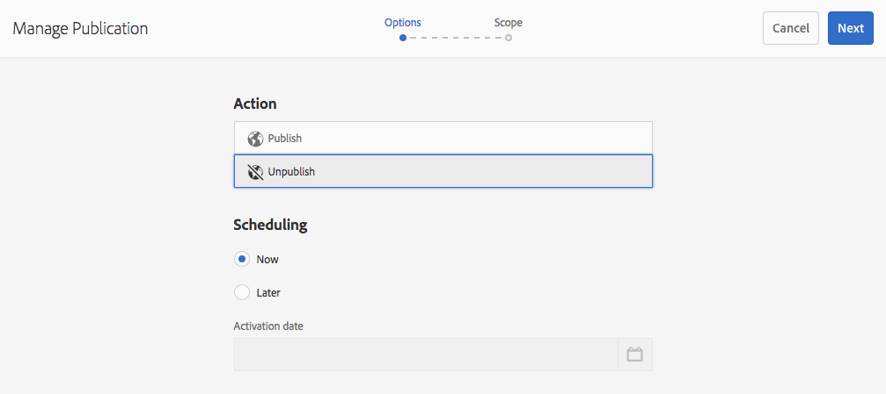
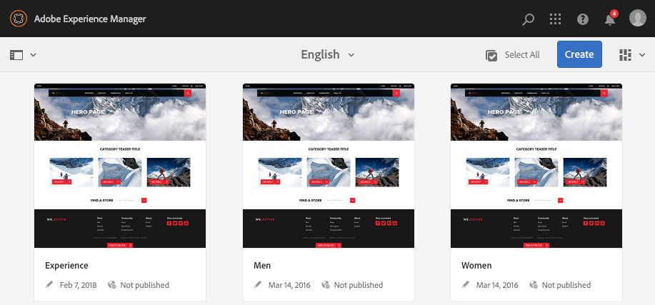

# Publicera sidor {#publishing-pages}

När du har skapat och granskat ditt innehåll i författarmiljön är målet att [göra den tillgänglig på din offentliga webbplats](/help/sites-authoring/author.md#concept-of-authoring-and-publishing) (publiceringsmiljön).

Detta kallas att publicera en sida. När du vill ta bort en sida från publiceringsmiljön kallas det för att avpublicera. När sidan publiceras och avpubliceras är den fortfarande tillgänglig i redigeringsmiljön för ytterligare ändringar tills du tar bort den.

Du kan även publicera/avpublicera en sida direkt eller vid ett fördefinierat datum/tid i framtiden.

>[!NOTE]
>
>Vissa termer om publicering kan vara förvirrade:
>
>* **Publicera/avpublicera**
   >  Detta är de primära villkoren för de åtgärder som gör innehållet tillgängligt för allmänheten i publiceringsmiljön (eller inte).
>
>* **Aktivera/inaktivera**
   >  Dessa termer är synonyma med publicera/avpublicera.
>
>* **Replikering/replikering**
   >  Detta är de tekniska termer som beskriver hur data (t.ex. sidinnehåll, filer, kod, användarkommentarer) flyttas från en miljö till en annan, t.ex. vid publicering eller omvänd replikering av användarkommentarer.
>

>[!NOTE]
>
>Om du inte har behörighet att publicera en viss sida:
>
>* Ett arbetsflöde kommer att utlösas för att meddela lämplig person om din begäran om publicering.
>* Detta [arbetsflödet kan ha anpassats](/help/sites-developing/workflows-models.md#main-pars-procedure-6fe6) av ditt utvecklingsteam.
>* Ett meddelande visas kort för att meddela dig att arbetsflödet har utlösts.
>

## Publicera sidor {#publishing-pages-1}

Beroende på var du befinner dig kan du publicera:

* [Från sidredigeraren](/help/sites-authoring/publishing-pages.md#publishing-from-the-editor)
* [Från webbplatskonsolen](/help/sites-authoring/publishing-pages.md#publishing-from-the-console)

### Publicera från Redigeraren {#publishing-from-the-editor}

Om du redigerar en sida kan den publiceras direkt från redigeraren.

1. Välj **Sidinformation** -ikonen för att öppna menyn och sedan **Publicera sida** alternativ.

   

1. Beroende på om sidan har referenser som behöver publiceras:

   * Sidan publiceras direkt om det inte finns några referenser att publicera.
   * Om sidan innehåller referenser som behöver publiceras visas dessa i **Publicera** guide, där du kan antingen:

      * Ange vilket av resurserna/taggarna/etc. du vill publicera tillsammans med sidan och sedan använda **Publicera** för att slutföra processen.

      * Använd **Avbryt** om du vill avbryta åtgärden.

   

1. Markera **Publicera** kommer att replikera sidan till publiceringsmiljön. I sidredigeraren visas en informationsbanderoll som bekräftar publiceringsåtgärden.

   

   När du visar samma sida i konsolen visas den uppdaterade publiceringsstatusen.

   

>[!NOTE]
>
>Publicering från redigeraren är en ytlig publicering, dvs endast den valda sidan/de markerade sidorna publiceras och inga underordnade sidor publiceras.

>[!NOTE]
>
>Sidor som används av [alias](/help/sites-authoring/editing-page-properties.md#advanced) i redigeraren kan inte publiceras. Publiceringsalternativen i redigeraren är bara tillgängliga för sidor som du kommer åt via de faktiska sökvägarna.

### Publicera från konsolen {#publishing-from-the-console}

I platskonsolen finns det två alternativ för publicering:

* [Snabbpublicering](/help/sites-authoring/publishing-pages.md#quick-publish)
* [Hantera publikation](/help/sites-authoring/publishing-pages.md#manage-publication)

#### Snabbpublicering {#quick-publish}

**Snabbpublicering** är för enkla fall och publicerar den eller de markerade sidorna omedelbart utan ytterligare interaktion. Därför kommer alla icke-publicerade referenser också att publiceras automatiskt.

Så här publicerar du en sida med Snabbpublicering:

1. Markera sidan eller sidorna i webbplatskonsolen och klicka på **Snabbpublicering** -knappen.

   

1. Bekräfta publikationen genom att klicka på **Publicera** eller avbryta genom att klicka på **Avbryt**. Kom ihåg att alla opublicerade referenser också publiceras automatiskt.

   

1. När sidan publiceras visas en varning som bekräftar publiceringen.

>[!NOTE]
>
>Snabbpublicering är en grund publicering, d.v.s. endast den valda sidan/de markerade sidorna publiceras och inga underordnade sidor publiceras.

#### Hantera publikation {#manage-publication}

**Hantera publikation** erbjuder fler alternativ än Snabbpublicering, så att underordnade sidor kan inkluderas, referenser anpassas och tillämpliga arbetsflöden startas samt möjlighet att publicera vid ett senare datum.

Så här publicerar eller avpublicerar du en sida med Hantera publikation:

1. Markera sidan eller sidorna i webbplatskonsolen och klicka på **Hantera publikation** -knappen.

   

1. Guiden **Hantera publikation** startar. Det första steget, **Alternativ** kan du:

   * Välj om du vill publicera eller avpublicera de markerade sidorna.
   * Välj om du vill utföra åtgärden nu eller vid ett senare datum.

   När du publicerar senare startas ett arbetsflöde för publicering av den eller de valda sidorna vid den angivna tidpunkten. Om du inte publicerar senare startas ett arbetsflöde för att avpublicera den eller de valda sidorna vid en viss tidpunkt.

   Om du vill avbryta en publicering/avpublicering senare går du till [Arbetsflödeskonsol](/help/sites-administering/workflows.md) för att avsluta motsvarande arbetsflöde.

   

   Klicka **Nästa** för att fortsätta.

1. I nästa steg i guiden Hantera publikation **Omfång** kan du definiera omfattningen för publikationen/avpublikationen, t.ex. inkludera underordnade sidor och/eller inkludera referenser.

   

   Du kan använda knappen **Lägg till innehåll** för att lägga till ytterligare sidor i listan över sidor som ska publiceras, om du inte valde någon innan du startade guiden Hantera publikation.

   När du klickar på knappen Lägg till innehåll startas [sökvägsläsare](/help/sites-authoring/author-environment-tools.md#path-browser) för att tillåta innehållsval.

   Markera önskade sidor och klicka sedan på **Välj** om du vill lägga till innehållet i guiden eller **Avbryt **om du vill avbryta valet och återgå till guiden.

   I guiden kan du markera ett objekt i listan för att konfigurera ytterligare alternativ, till exempel:

   * Inkludera dess underordnade.
   * Ta bort den från markeringen.
   * Hantera dess publicerade referenser.

   

   Klicka **Inkludera underordnade** öppnar en dialogruta där du kan:

   * Inkludera endast omedelbara barn.
   * Inkludera endast ändrade sidor.
   * Inkludera endast redan publicerade sidor.

   Klicka **Lägg till** om du vill lägga till de underordnade sidorna i listan med sidor som ska publiceras eller avpubliceras baserat på markeringsalternativen. Klicka **Avbryt** om du vill avbryta markeringen och återgå till guiden.

   

   När du återgår till guiden visas de sidor som lagts till baserat på dina val i dialogrutan Inkludera underordnade.

   Du kan visa och ändra referenserna som ska publiceras eller inte publiceras för en sida genom att markera den och sedan klicka på **Publicerade referenser** -knappen.

   

   The **Publicerade referenser** visas referenserna för det markerade innehållet. Som standard är alla markerade och publiceras/avpubliceras, men du kan avmarkera dem så att de inte tas med i funktionsmakrot.

   Klicka **Klar** för att spara dina ändringar eller **Avbryt** om du vill avbryta markeringen och återgå till guiden.

   Tillbaka i guiden **Referenser** kolumnen uppdateras för att återspegla ditt val av referenser som ska publiceras eller inte publiceras.

   

1. Klicka **Publicera** för att slutföra.

   I webbplatskonsolen bekräftar ett meddelande publikationen.

1. Om de publicerade sidorna är kopplade till arbetsflöden kan de visas i en **Arbetsflöden** steg i publikationsguiden.

   >[!NOTE]
   >
   >The **Arbetsflöden** visas baserat på vilka rättigheter din användare har eller inte har. Se [föregående anteckning på denna sida](/help/sites-authoring/publishing-pages.md#main-pars-note-0-ejsjqg-refd) om publiceringsrättigheter och [Hantera åtkomst till arbetsflöden](/help/sites-administering/workflows-managing.md) och [Använda arbetsflöden på sidor](/help/sites-authoring/workflows-applying.md#main-pars-text-5-bvhbkh-refd) för mer information.

   Resurserna grupperas efter de arbetsflöden som utlöses och de olika alternativen:

   * Definiera arbetsflödets rubrik.
   * Behåll arbetsflödespaketet, förutsatt att arbetsflödet har [stöd för flera resurser](/help/sites-developing/workflows-models.md#configuring-a-workflow-for-multi-resource-support).
   * Definiera en titel på arbetsflödespaketet om alternativet att behålla arbetsflödespaketet har valts.

   Klicka på **Publicera** eller **Publicera senare** för att slutföra publiceringen.

   

## Avpublicerar sidor {#unpublishing-pages}

Om du avpublicerar en sida tas den bort från publiceringsmiljön så att den inte längre är tillgänglig för läsarna.

I en [liknande publiceringssätt](/help/sites-authoring/publishing-pages.md#publishing-pages), en eller flera sidor kan avpubliceras:

* [Från sidredigeraren](/help/sites-authoring/publishing-pages.md#unpublishing-from-the-editor)
* [Från webbplatskonsolen](/help/sites-authoring/publishing-pages.md#unpublishing-from-the-console)

### Avpublicera från redigeraren {#unpublishing-from-the-editor}

Om du vill avpublicera en sida när du redigerar den väljer du **Avpublicera sida** i **Sidinformation** meny, som du skulle [publicera sidan](/help/sites-authoring/publishing-pages.md#publishing-from-the-editor).

>[!NOTE]
>
>Sidor som används av [alias](/help/sites-authoring/editing-page-properties.md#advanced) i redigeraren kan inte avpubliceras. Publiceringsalternativen i redigeraren är bara tillgängliga för sidor som du kommer åt via de faktiska sökvägarna.

### Avpublicera från konsolen {#unpublishing-from-the-console}

Precis som du [publicera med alternativet Hantera publikation](/help/sites-authoring/publishing-pages.md#manage-publication)kan du också använda den för att avpublicera.

1. Markera sidan eller sidorna i webbplatskonsolen och klicka på **Hantera publikation** -knappen.
1. Guiden **Hantera publikation** startar. I det första steget **Alternativ** väljer du **Avpublicera** i stället för standardalternativet **Publicera**.

   

   På samma sätt som publiceringen senare startar ett arbetsflöde för att publicera den här versionen av sidan vid den angivna tidpunkten, startar inaktiveringen senare ett arbetsflöde för att avpublicera den valda sidan eller de valda sidorna vid en viss tidpunkt.

   Om du vill avbryta en publicering/avpublicering senare går du till [Arbetsflödeskonsol](/help/sites-administering/workflows.md) för att avsluta motsvarande arbetsflöde.

1. Slutför borttagningen genom att fortsätta med guiden på samma sätt som du gör [publicera sidan](/help/sites-authoring/publishing-pages.md#manage-publication).

## Publicera och avpublicera ett träd {#publishing-and-unpublishing-a-tree}

När du har angett eller uppdaterat ett stort antal innehållssidor, som alla finns på samma rotsida, kan det vara enklare att publicera hela trädet i en åtgärd.

Du kan använda [Hantera publikation](/help/sites-authoring/publishing-pages.md#manage-publication) på webbplatskonsolen för att göra detta.

1. I webbplatskonsolen väljer du rotsidan för trädet som du vill publicera eller avpublicera och väljer **Hantera publikation**.
1. Guiden **Hantera publikation** startar. Välj om du vill publicera eller avpublicera och när det ska ske och välj **Nästa** för att fortsätta.
1. I **Omfång** markerar du rotsidan och väljer **Inkludera underordnade**.

   

1. I **Inkludera underordnade** avmarkera alternativen:

   * Inkludera endast omedelbart underordnade
   * Inkludera endast redan publicerade sidor

   Dessa alternativ är markerade som standard, så du måste komma ihåg att avmarkera dem. Klicka **Lägg till** för att bekräfta och lägga till innehållet i publikationen/avpublikationen.

   

1. The **Hantera publikation** guiden listar innehållet i trädet för granskning. Du kan anpassa markeringen ytterligare genom att lägga till ytterligare sidor eller ta bort de markerade sidorna.

   

   Kom ihåg att du även kan granska referenser som ska publiceras via **Publicerade referenser** alternativ.

1. [Fortsätt med guiden Hantera publikation som vanligt](#manage-publication) för att slutföra publiceringen eller avpubliceringen av trädet.

## Bestämmer publiceringsstatus {#determining-publication-status}

Du kan ange en sidas publiceringsstatus:

* I [resursöversiktsinformation på webbplatskonsolen](/help/sites-authoring/basic-handling.md#viewing-and-selecting-resources)

   

   Publikationsstatusen visas i [kort](/help/sites-authoring/basic-handling.md#card-view)-, [kolumn](/help/sites-authoring/basic-handling.md#column-view)- och [list](/help/sites-authoring/basic-handling.md#list-view)vyerna i Sites-konsolen.

* I [tidslinje](/help/sites-authoring/basic-handling.md#timeline)

   

* I [Sidinformation-menyn](/help/sites-authoring/author-environment-tools.md#page-information) när du redigerar en sida

   
