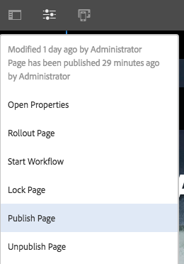
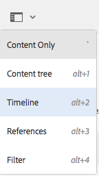

# Snabbguide till framtagning av sidor{#quick-guide-to-authoring-pages}

Dessa procedurer är avsedda som en snabbguide (på hög nivå) till de viktigaste åtgärderna vid framtagning av sidinnehåll i AEM.

De ska:

* Är inte avsedda som omfattande täckning.
* Ange länkar till den detaljerade dokumentationen.

Mer information om redigering med AEM finns i:

* [Steg 1 för författare](/help/sites-authoring/first-steps.md)
* [Redigeringssidor](/help/sites-authoring/page-authoring.md)

## Några snabba tips {#a-few-quick-hints}

Innan du ger en översikt över specifika detaljer finns det en liten samling allmänna tips och tips som du bör tänka på.

### Webbplatskonsol {#sites-console}

* **Skapa**

   * Den här knappen är tillgänglig i många konsoler - de alternativ som visas är sammanhangsberoende så att de kan variera beroende på scenario.

* Ändra ordning på sidor i en mapp

   * Detta kan du göra i [listvyn](/help/sites-authoring/basic-handling.md#list-view). Ändringarna används och visas i andra vyer.

#### Sidredigering {#page-authoring}

* Navigera i länkar

   * ***Länkar är inte tillgängliga för navigering*** när du är i läget **Redigera**. Om du vill navigera med länkar måste du [förhandsgranska sidan](/help/sites-authoring/editing-content.md#previewing-pages) med något av följande:

      * [Förhandsgranskningsläge](/help/sites-authoring/editing-content.md#preview-mode)
      * [Visa som publicerad](/help/sites-authoring/editing-content.md#view-as-published)

* Versioner startas/skapas inte från sidredigeraren. Detta görs nu från webbplatskonsolen (via **Skapa** eller [Tidslinje](/help/sites-authoring/basic-handling.md#timeline) för en vald resurs).

>[!NOTE]
>
>Det finns flera kortkommandon som kan underlätta redigeringen.
>
>* [Kortkommandon vid sidredigering](/help/sites-authoring/page-authoring-keyboard-shortcuts.md)
>* [Kortkommandon för konsoler](/help/sites-authoring/keyboard-shortcuts.md)
>

### Hitta din sida {#finding-your-page}

Det finns olika aspekter av att hitta en sida. Du kan navigera och/eller söka efter:

1. Öppna konsolen **Platser** (med alternativet **Platser** i [Global navigering](/help/sites-authoring/basic-handling.md#global-navigation)) - den utlöses (nedrullningsbar) när du väljer länken Adobe Experience Manager (överst till vänster).

1. Navigera nedåt i trädet genom att trycka/klicka på lämplig sida. Hur sidresurserna visas beror på vilken vy du använder - [Kort, Lista eller Kolumn](/help/sites-authoring/basic-handling.md#viewing-and-selecting-resources):

   

1. Navigera uppåt i trädet med hjälp av [den synliga sökvägen i huvudet](/help/sites-authoring/basic-handling.md#theheaderwithbreadcrumbs), som gör att du kan gå tillbaka till den valda platsen:

   

1. Du kan också [söka](/help/sites-authoring/search.md) efter en sida. Du kan välja din sida bland de resultat som visas.

   

### Skapa en ny sida {#creating-a-new-page}

Så här [skapar du en sida](/help/sites-authoring/managing-pages.md#creating-a-new-page):

1. [Navigera till platsen](#finding-your-page) där du vill skapa sidan.
1. Använd ikonen **Skapa** och välj sedan **Sida** i listan:

   

1. Guiden som vägleder dig genom att samla in den information som behövs när [du skapar den nya sidan](/help/sites-authoring/managing-pages.md#creating-a-new-page) öppnas. Följ instruktionerna på skärmen.

### Välja sida för ytterligare åtgärd {#selecting-your-page-for-further-action}

Du kan markera en sida så att du kan utföra en åtgärd på den. När du väljer en sida uppdateras verktygsfältet automatiskt så att de åtgärder som är relevanta för resursen visas.

Hur du väljer en sida beror på vilken vy du använder i konsolen:

1. Kolumnvy:

   * Klicka på miniatyrbilden för resursen - miniatyrbilden visas med en bock som visar att den har markerats.

1. Listvy:

   * Klicka på miniatyrbilden för resursen - miniatyrbilden visas med en bock som visar att den har markerats.

1. Kortvy:

   * Ange markeringsläge genom att [välja den nödvändiga resursen](/help/sites-authoring/basic-handling.md#viewingandselectingyourresources) med:

      * Mobil enhet: markera och hålla kvar
      * Skrivbord: [snabbåtgärden](/help/sites-authoring/basic-handling.md#quick-actions) - skalningsikonen:

   

   * Kortet kommer att förses med en bock som visar att sidan har valts.

   >[!NOTE]
   >
   >I markeringsläge ändras ikonen **Markera** (en bock) till ikonen **Avmarkera** (ett kryss).

### Snabbåtgärder (endast kortvyn/skrivbordet) {#quick-actions-card-view-desktop-only}

[Snabbåtgärder](/help/sites-authoring/basic-handling.md#quick-actions) är tillgängliga:

1. [Navigera till sidan ](#finding-your-page) som du vill vidta åtgärder på.
1. Håll muspekaren över kortet som representerar den resurs du behöver. Snabbåtgärderna visas:

   

### Redigera sidinnehåll {#editing-your-page-content}

1. [Navigera till sidan](#finding-your-page) som du vill redigera.
1. [Öppna sidan för redigering](/help/sites-authoring/managing-pages.md#opening-a-page-for-editing) med ikonen Redigera (penna):

   

   Du kan komma åt detta från antingen:

   * [Snabbåtgärder (endast kortvyn/skrivbordet)](#quick-actions-card-view-desktop-only) för lämplig resurs.
   * Verktygsfältet när [sidan har valts](#selectiingyourpageforfurtheraction).

1. När redigeraren öppnas kan du:

   * [Lägg till en ny komponent på sidan](/help/sites-authoring/editing-content.md#inserting-a-component) genom att:

      * öppna sidopanelen
      * välja fliken Komponenter ([komponentwebbläsaren](/help/sites-authoring/author-environment-tools.md#components-browser))
      * dra den nödvändiga komponenten till sidan.

     Sidpanelen kan öppnas (och stängas) med:

     

   * [Redigera innehållet i en befintlig komponent](/help/sites-authoring/editing-content.md#edit-configure-copy-cut-delete-paste) på sidan:

      * Öppna komponentens verktygsfält med ett klick. Använd ikonen **Redigera** (penna) för att öppna dialogrutan.
      * Öppna komponentens in-place-redigerare genom att markera och hålla ned eller dubbelklicka. De tillgängliga åtgärderna visas (för vissa komponenter är det ett begränsat urval).
      * Om du vill visa alla tillgängliga åtgärder går du till helskärmsläge med:

     

   * [Konfigurera egenskaperna för en befintlig komponent](/help/sites-authoring/editing-content.md#component-edit-dialog)

      * Öppna komponentens verktygsfält med ett klick. Använd ikonen **Konfigurera** (skiftnyckel) för att öppna dialogrutan.

   * [Flytta en komponent](/help/sites-authoring/editing-content.md#moving-a-component) antingen:

      * Dra den önskade komponenten till dess nya plats.
      * Öppna komponentens verktygsfält med ett klick. Använd ikonerna **Klipp ut** och **Klistra in** där det behövs.

   * [Kopiera (och klistra in)](/help/sites-authoring/editing-content.md#edit-configure-copy-cut-delete-paste) en komponent:

      * Öppna komponentens verktygsfält med ett klick. Använd ikonerna **Kopiera** och sedan **Klistra in** efter behov.

   >[!NOTE]
   >
   >Du kan **klistra in** komponenter på samma sida eller på en annan sida. Om du klistrar in på en annan sida som redan var öppen före klipp ut/kopiera-åtgärden, måste sidan uppdateras.

   * [Ta bort](/help/sites-authoring/editing-content.md#edit-configure-copy-cut-delete-paste) en komponent:

      * Öppna komponentens verktygsfält med ett klick och använd sedan ikonen **Ta bort** .

   * [Lägg till anteckningar](/help/sites-authoring/annotations.md#annotations) på sidan:

      * Välj läget **Anteckning** (ikonen för pratbubbla). Lägg till anteckningar med ikonen **Lägg till anteckning** (plus). Avsluta anteckningsläget med X överst till höger.

     

   * [Förhandsgranska en sida](/help/sites-authoring/editing-content.md#preview-mode) (för att se hur den kommer att se ut i publiceringsmiljön)

      * Välj **Förhandsgranska** i verktygsfältet.

   * Återgå till redigeringsläget (eller välj ett annat läge) med den nedrullningsbara väljaren **Redigera**.

   >[!NOTE]
   >
   >Om du vill navigera med hjälp av länkar i innehållet måste du använda [förhandsgranskningsläget](/help/sites-authoring/editing-content.md#preview-mode).

### Redigera sidegenskaperna {#editing-the-page-properties}

Det finns två (huvudmetoder) metoder för att [redigera sidegenskaper](/help/sites-authoring/editing-page-properties.md):

* Från konsolen **Platser**:

   1. [Navigera till sidan](#finding-your-page) som du vill publicera.
   1. Välj ikonen **Egenskaper** från antingen:

      * [Snabbåtgärder (endast kortvyn/skrivbordet)](#quick-actions-card-view-desktop-only) för lämplig resurs.
      * Verktygsfältet när [sidan har valts](#selectiingyourpageforfurtheraction).

  

   1. Sidegenskaperna visas. Du kan göra nödvändiga uppdateringar och sedan använda Spara för att behålla dessa

* När du [redigerar sidan](#editing-your-page-content):

   1. Öppna menyn **Sidinformation**.
   1. Välj **Öppna egenskaper** för att öppna dialogrutan för redigering av egenskaperna.

  

### Publicera din sida (eller avpublicera) {#publishing-your-page-or-unpublishing}

Det finns två huvudmetoder för att [publicera sidan](/help/sites-authoring/publishing-pages.md) (och även för att avpublicera):

* Från konsolen **Platser**:

   1. [Navigera till sidan](#finding-your-page) som du vill publicera.
   1. Välj ikonen **Snabbpublicering** på något av följande sätt:

      * [Snabbåtgärder (endast kortvyn/skrivbordet)](#quick-actions-card-view-desktop-only) för lämplig resurs.
      * Verktygsfältet när [sidan har valts](#selectiingyourpageforfurtheraction) (ger även åtkomst till [Publicera senare](/help/sites-authoring/publishing-pages.md#main-pars-title-12)).

  

* När du [redigerar sidan](#editing-your-page-content):

   1. Öppna menyn **Sidinformation**.
   1. Välj **Publicera sida**.

  

* Du kan bara avpublicera en sida från konsolen via alternativet **Hantera publikation**, som bara är tillgängligt i verktygsfältet (inte via snabbåtgärderna).

  Alternativet **Avpublicera sida** är fortfarande tillgängligt via menyn **Sidinformation** i redigeraren.

  

  Mer information finns i [Publicera sidor](/help/sites-authoring/publishing-pages.md#unpublishing-pages).

### Flytta, kopiera och klistra in eller ta bort sidan {#move-copy-and-paste-or-delete-your-page}

Alla dessa åtgärder kan utlösas av:

1. [Navigera till sidan](#finding-your-page) som du vill flytta, kopiera och klistra in eller ta bort.
1. Välj ikonen för kopiera (och sedan klistra in), flytta eller ta bort efter behov på något av följande sätt:

   * [Snabbåtgärder (endast kortvyn/skrivbordet)](#quick-actions-card-view-desktop-only) för den nödvändiga resursen.
   * Verktygsfältet när [sidan har valts](#selecting-your-page-for-further-action).

   Sedan, beroende på vad du gör:

   * Copy:

      * Navigera till den nya platsen och klistra in.

   * Flytta:

      * Guiden öppnas och samlar in den information som behövs för att flytta sidan. Följ instruktionerna på skärmen.

   * Ta bort:

      * Du ombeds bekräfta åtgärden.

   >[!NOTE]
   >
   >Borttagning är inte tillgängligt som snabbåtgärd.

### Låser sidan (låser upp) {#locking-your-page-then-unlocking}

[När du låser en sida](/help/sites-authoring/editing-content.md#locking-a-page) kan andra författare inte arbeta med den. Ikonen/knappen Lås (och Lås upp) finns:

* Verktygsfältet när [sidan har valts](#selecting-your-page-for-further-action).
* Listrutan [Sidinformation](#editing-the-page-properties) när du redigerar en sida.
* Sidans verktygsfält när du redigerar en sida (när sidan är låst)

Låsikonen ser till exempel ut så här:

### Åtkomst till sidreferenser {#accessing-page-references}

[Snabb åtkomst till referenser](/help/sites-authoring/author-environment-tools.md#references) till en sida eller från en sida finns i Reference Rail.

1. Välj **Referenser** med verktygsfältsikonen (antingen före eller efter [att du har valt sidan](#selecting-your-page-for-further-action)):

   

   En lista över referenstyper visas:

   

1. Klicka på önskad referenstyp för att visa mer information och (vid behov) vidta ytterligare åtgärder.

### Skapa en version av din sida {#creating-a-version-of-your-page}

Så här skapar du en [version](/help/sites-authoring/working-with-page-versions.md) av sidan:

1. Om du vill öppna tidslinjen väljer du **[Tidslinje](/help/sites-authoring/basic-handling.md#timeline)** med verktygsfältsikonen (antingen före eller efter [att du har valt sidan](#selecting-your-page-for-further-action)):

   

1. Klicka på uppåtpilen längst ned till höger i tidslinjen för att visa extra knappar, inklusive **Spara som version**.

   

1. Välj **Spara som version** och sedan **Skapa**.

### Återställa/jämföra en version av sidan {#restoring-comparing-a-version-of-your-page}

Samma grundläggande funktion används när du återställer och/eller jämför versioner av sidan:

1. Välj **[Tidslinje](/help/sites-authoring/basic-handling.md#timeline)** med verktygsfältsikonen (antingen före eller efter [att du har valt sidan](#selecting-your-page-for-further-action)):

   

   Om en version av sidan redan har sparats visas den på tidslinjen.

1. Klicka på den version som du vill återställa. Då visas ytterligare åtgärdsknappar:

   * **Återgå till den här versionen**

      * Versionen har återställts.

   * **Visa skillnader**

      * Sidan öppnas med skillnader (mellan de två versionerna) markerade.
