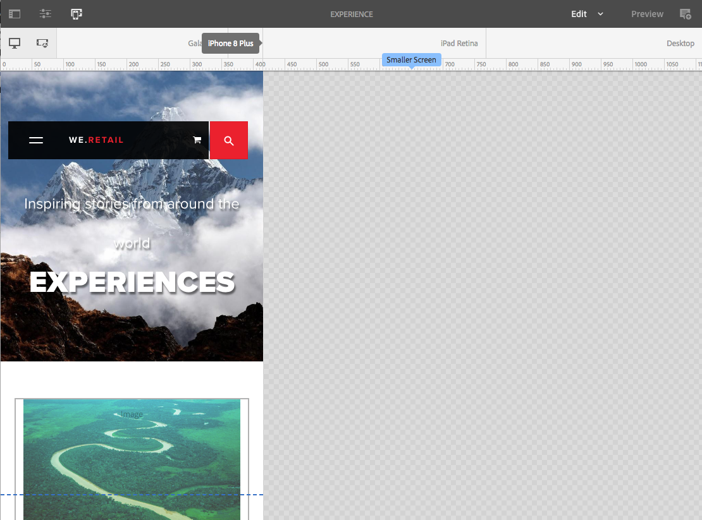
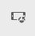
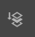

# Responsiv layout{#responsive-layout}

Med Adobe Experience Manager kan du realisera en responsiv layout för dina sidor med komponenten **Layoutbehållare**.

>[!TIP]
>
>Det här dokumentet innehåller en översikt över de funktioner i layoutbehållaren som är tillgängliga för innehållsförfattare.
>
>Information om hur du konfigurerar layoutbehållaren för dina platser för webbplatsadministratörer och utvecklare finns i dokumentet [Konfigurera layoutbehållaren och layoutläget.](/help/sites-authoring/responsive-layout.md)

## Ökning {#overview}

Komponenten **Layoutbehållare** innehåller ett styckesystem där du kan placera komponenter i ett responsivt rutnät. Rutnätet kan ändra layouten beroende på enhetens/fönstrets storlek och format. Komponenten används tillsammans med [**layoutläget**](/help/sites-authoring/responsive-layout.md#defining-layouts-layout-mode) som gör att du kan skapa och redigera den responsiva layouten beroende på enhet.

Layoutbehållaren:

* Tillhandahåller vågrät fäst mot rutnät, tillsammans med möjligheten att placera komponenter i rutnätet sida vid sida och definiera när de ska komprimeras/omformas.
* Använder fördefinierade brytpunkter (till exempel för telefon, surfplatta och så vidare) för att du ska kunna definiera önskat beteende för innehåll för relaterade enheter/orientering.

   * Du kan till exempel anpassa komponentstorleken eller om komponenten kan visas på särskilda enheter.

* Kan kapslas så att kolumnkontroll tillåts.

Användaren kan sedan se hur innehållet återges för specifika enheter med emulatorn.

>[!CAUTION]
>
>Även om Layout Container-komponenten är tillgänglig i det klassiska användargränssnittet är dess fullständiga funktioner bara tillgängliga och stöds i det beröringsaktiverade användargränssnittet.

AEM implementerar en responsiv layout för dina sidor med en kombination av mekanismer:

* [**Layoutbehållare**](#adding-a-layout-container-and-its-content-edit-mode)-komponent

  Den här komponenten är tillgänglig i [komponentwebbläsaren](/help/sites-authoring/author-environment-tools.md#components-browser) och innehåller ett rutnätsstyckesystem där du kan lägga till och placera komponenter i ett responsivt rutnät. Den kan också anges som standardstyckesystem på sidan.

* [**Layoutläge**](/help/sites-authoring/responsive-layout.md#defining-layouts-layout-mode)

  När layoutbehållaren har placerats på sidan kan du använda läget **Layout** för att placera innehåll i det responsiva rutnätet.

* [**Emulator**](#selecting-a-device-to-emulate)
På så sätt kan du skapa och redigera responsiva webbplatser som ändrar layouten beroende på enhetens/fönstrets storlek genom att ändra komponenternas storlek interaktivt. Användaren kan sedan se hur innehållet återges med emulatorn.

Med dessa responsiva rutnätsmekanismer kan du:

* Använd brytpunkter för att definiera olika innehållslayouter baserat på enhetens bredd (relaterat till enhetstyp och orientering).
* Använd samma brytpunkter och innehållslayouter för att se till att innehållet är anpassat till storleken på webbläsarfönstret på skrivbordet.
* Använd vågrät fäst mot rutnät för att placera komponenter i rutnätet, ändra storlek efter behov och definiera när de ska komprimeras/omformas så att de ligger sida vid sida eller ovanför/nedanför.
* Dölj komponenter för specifika enhetslayouter.
* Uppnå kolumnkontroll.

Beroende på vilket projekt du arbetar med kan Layoutbehållaren användas som standardstyckesystem för sidorna eller som en komponent som kan läggas till på sidan via komponentwebbläsaren (eller båda).

>[!NOTE]
>
>Adobe tillhandahåller [GitHub-dokumentation](https://adobe-marketing-cloud.github.io/aem-responsivegrid/) för den responsiva layouten som en referens som kan ges till gränssnittsutvecklare så att de kan använda AEM-rutnätet utanför AEM, till exempel när de skapar statiska HTML-modeller för en framtida AEM-webbplats.

>[!NOTE]
>
>Användningen av ovanstående mekanismer aktiveras av mallens konfiguration. Mer information finns i [Konfigurera responsiv layout](/help/sites-administering/configuring-responsive-layout.md).

## Layoutdefinitioner, enhetsemulering och brytpunkter {#layout-definitions-device-emulation-and-breakpoints}

När du skapar webbplatsinnehåll vill du se till att innehållet visas på rätt sätt för den enhet som används för att visa det.

Med AEM kan du definiera layouter beroende på enhetens bredd:

* Med emulatorn kan du emulera dessa layouter på en mängd olika enheter. Förutom enhetstypen kan orienteringen, som valts med alternativet **Rotera enhet** , påverka den brytpunkt som valts när bredden ändras.
* Brytpunkter är de punkter som skiljer layoutdefinitionerna åt.

   * De definierar effektivt den maximala bredden (i pixlar) för alla enheter med en viss layout.
   * Brytpunkterna är vanligtvis giltiga för ett urval enheter, beroende på vilken bredd de visas på.
   * Intervallet för en brytpunkt sträcker sig åt vänster till nästa brytpunkt.
   * Du kan inte markera brytpunkten specifikt. Om du väljer en enhet och orientering väljs automatiskt rätt brytpunkt.

Enheten **Skrivbord**, som inte har någon specifik bredd, är relaterad till standardbrytpunkten (d.v.s. allt ovanför den senast konfigurerade brytpunkten).

>[!NOTE]
>
>Det skulle vara möjligt att definiera brytpunkter för varje enskild enhet, men detta skulle drastiskt öka den insats som krävs för att definiera och underhålla layout.

När du använder emulatorn väljer du en specifik enhet för emulerings- och layoutdefinition och den relaterade brytpunkten markeras också. Alla layoutändringar du gör gäller för andra enheter som brytpunkten gäller för, det vill säga alla enheter som är placerade till vänster om den aktiva brytpunktsmarkören, men före nästa brytpunktsmarkör.

När du t.ex. väljer enheten **iPhone 6 Plus** (definierad med en bredd på 540 pixlar) för emulering och layout aktiveras även brytpunkten **Telefon** (definierad som 768 pixlar). Alla layoutändringar du gör för **iPhone 6** gäller för andra enheter under brytpunkten **Telefoner**, till exempel **iPhone 5** (definierad som 320 pixlar).

## Välja en enhet som ska emuleras {#selecting-a-device-to-emulate}

1. Öppna den sida du vill redigera. Till exempel:

   `http://localhost:4502/editor.html/content/we-retail/us/en/experience.html`

1. Välj ikonen **Emulator** i det övre verktygsfältet:

   

1. Emulatorverktygsfältet öppnas.

   

   Emulatorverktygsfältet innehåller ytterligare layoutalternativ:

   * **Rotera enhet** - Rotera en enhet från lodrät (stående) orientering till vågrät (liggande) orientering och omvänt.

      

   * **Välj enhet** - Definiera en specifik enhet som ska emuleras från en lista (mer information finns i nästa steg)

     

1. Om du vill välja en specifik enhet som ska emuleras kan du antingen:

   * Använd ikonen Välj enhet och välj i en nedrullningsbar väljare.
   * Klicka på enhetsindikatorn i emulatorns verktygsfält.

   

1. När en viss enhet har valts kan du:

   * Se den aktiva markören för den valda enheten, till exempel **iPad.**
   * Se den aktiva markören för rätt [brytpunkt](/help/sites-authoring/responsive-layout.md#layout-definitions-device-emulation-and-breakpoints), t.ex. **Surfplatta.**

   

   * Den blå prickade linjen representerar *veck* för den valda enheten (här en **iPhone 6**).

   

   * Flödet kan också betraktas som sidradbrytningen (ska inte blandas ihop med [brytpunkterna](/help/sites-authoring/responsive-layout.md#layout-definitions-device-emulation-and-breakpoints)) för innehållet. Detta visas för att underlätta för användaren att visa vilken del av innehållet som kommer att visas på enheten före rullning.
   * Flödets linje visas inte om höjden på den enhet som emuleras är högre än skärmstorleken.
   * Flödet visas för författarens bekvämlighet och visas inte på den publicerade sidan.

## Lägga till en layoutbehållare och dess innehåll (redigeringsläget) {#adding-a-layout-container-and-its-content-edit-mode}

En **layoutbehållare** är ett styckesystem som:

* Innehåller andra komponenter.
* Definierar layouten.
* Svar på ändringar.

>[!NOTE]
>
>Om den inte redan är tillgänglig måste **layoutbehållaren** uttryckligen [aktiveras för ett styckesystem/en sida](/help/sites-administering/configuring-responsive-layout.md) (till exempel med [**designläge**](/help/sites-authoring/default-components-designmode.md)).

1. **Layoutbehållaren** är tillgänglig som en standardkomponent i [komponentläsaren](/help/sites-authoring/author-environment-tools.md#components-browser). Härifrån kan du dra den till önskad plats på sidan och sedan ser du platshållaren **Dra komponenter hit**.
1. Du kan sedan lägga till komponenter i layoutbehållaren. De här komponenterna innehåller det faktiska innehållet:

   

## Markera och vidta åtgärder på en layoutbehållare (redigeringsläge) {#selecting-and-taking-action-on-a-layout-container-edit-mode}

Precis som med andra komponenter kan du markera och sedan vidta åtgärder för (klippa ut, kopiera, ta bort) en layoutbehållare (i läget **Redigera**):

>[!CAUTION]
>
>När en layoutbehållare är ett styckesystem tas både layoutstödrastret och alla komponenter (och deras innehåll) som finns i behållaren bort om komponenten tas bort.

1. Om du för musen över eller väljer platshållaren för stödrastret visas åtgärdsmenyn.

   

   Du måste välja alternativet **Överordnad**.

   

1. Om layoutkomponenten är kapslad och du väljer alternativet **Överordnad** visas en listruta där du kan välja den kapslade layoutbehållaren eller dess överordnade behållare.

   När du för musen över behållarnamnen i listrutan visas deras konturer på sidan.

   * Den lägsta kapslade layoutbehållaren kontureras i svart.
   * Den näst lägsta kapslade layoutbehållaren kommer att vara i mörkgrått.
   * Varje efterföljande behållare blir en ljusare nyans av grått.

   

1. Då markeras hela stödrastret med dess innehåll. Åtgärdsverktygsfältet visas, där du kan välja en åtgärd som **Ta bort.**

   

## Definiera layouter (layoutläget) {#defining-layouts-layout-mode}

>[!NOTE]
>
>Du kan definiera en separat layout för varje [brytpunkt](#layout-definitions-device-emulation-and-breakpoints) (utifrån emulerad enhetstyp och orientering).

Om du vill konfigurera layouten för ett responsivt rutnät som implementeras med layoutbehållaren måste du använda läget **Layout**.

**Layout**-läget kan startas på två sätt.

* Genom att använda [lägesmenyn i verktygsfältet](/help/sites-authoring/author-environment-tools.md#page-modes) och välja **layoutläget**

   * Välj **layoutläget** på samma sätt som du växlar till **redigeringsläget** eller **målinriktningsläget**.
   * **Layoutläget** är beständigt och du lämnar inte **layoutläget** förrän du väljer ett annat läge med lägesväljaren.

* När [redigerar en enskild komponent.](/help/sites-authoring/editing-content.md#edit-component-layout)

   * Genom att använda alternativet **Layout** i snabbåtgärdsmenyn för komponenten kan du växla till **Layout** -läget.
   * Läget **Layout** kvarstår när komponenten redigeras och återgår till läget **Redigera** när fokus har ändrats till en annan komponent.

I layoutläget kan du utföra olika åtgärder på ett rutnät:

* Ändra storlek på innehållskomponenterna med de blå punkterna. Storleksändring fästs alltid mot stödrastret. När du ändrar storlek visas bakgrundsstödrastret som stöd för justering:

  

  >[!NOTE]
  >
  >Proportioner och proportioner bevaras när komponenterna som **Bilder** storleksändras.

* Klicka på en innehållskomponent så kan du göra följande i verktygsfältet:

   * **Överordnad**

     Gör att du kan markera hela layoutbehållarkomponenten för att utföra en åtgärd i sin helhet.

   * **Flyt till ny rad**

     Komponenten flyttas till en ny rad, beroende på vilket utrymme som är tillgängligt i rutnätet.

   * **Dölj komponent**

     Komponenten blir osynlig (den kan återställas från verktygsfältet i layoutbehållaren).

  

* I **layoutläget** kan du klicka på **Dra komponenter hit** för att markera hela komponenten. Då visas verktygsfältet för det här läget.

  Verktygsfältet har olika alternativ beroende på layoutkomponentens läge och vilka komponenter som hör till det. Till exempel:

   * **Överordnad** - Välj den överordnade komponenten.

     

   * **Visa dolda komponenter** - Visa alla eller enskilda komponenter. Siffran visar hur många dolda komponenter det finns för närvarande. Räknaren visar hur många komponenter som är dolda.

     

   * **Återställ brytpunktslayout** - Återgå till standardlayout. Det innebär att ingen anpassad layout kommer att användas.

     

   * **Flyt till ny rad** - Flytta komponenten uppåt en position om avstånd tillåter.

     

   * **Dölj komponent** - Dölj den aktuella komponenten.

     

     >[!NOTE]
     >
     >I exemplet ovan är åtgärderna float och hide tillgängliga eftersom den här layoutbehållaren är kapslad i en överordnad layoutbehållare.

   * **Visa komponenter**
Markera de överordnade komponenterna om du vill visa åtgärdsverktygsfältet med alternativet **Visa dolda komponenter** . I det här exemplet är två komponenter dolda.

     

  Om du väljer alternativet **Visa dolda komponenter** visas de dolda komponenterna i blått i sina ursprungliga positioner.

  

  Om du väljer **Återställ alla** visas alla dolda komponenter.
