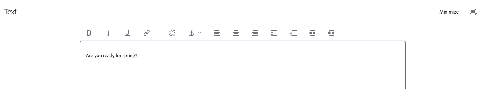

# Använda RTF-redigeraren för att skapa innehåll {#use-rich-text-editor-to-author-content}

RTE (Rich Text Editor) är en grundläggande byggsten för att infoga textinnehåll i AEM. Den utgör grunden för olika komponenter, bland annat följande:

* Text
* Textbild
* Tabell

## Direktredigering {#in-place-editing}

Om du markerar en textbaserad komponent med ett enda tryck eller klick visas [komponentverktygsfältet](/help/sites-authoring/editing-content.md#edit-configure-copy-cut-delete-paste) som med alla komponenter.

Om du trycker/klickar igen eller först markerar komponenten med en långsam dubbelknacka/klick öppnas redigering på plats, som har ett eget verktygsfält. Här kan du redigera innehållet och göra grundläggande formateringsändringar.

Det här verktygsfältet innehåller följande alternativ:

* **Format**: Du kan då välja Fet, Kursiv och Understruken.
* **Listor**: Med detta kan du skapa punktlistor eller numrerade listor eller ange indrag.
* **Hyperlänk**
* **Bryt länk**
* **Helskärm**
* **Stäng**
* **Spara**

## Helskärmsredigering {#full-screen-editing}

Tryck på helskärmsläget i verktygsfältet för textbaserade komponenter  öppnar RTF-redigeraren och döljer resten av sidinnehållet.

I helskärmsläge visas alla konfigurerade alternativ som du kan använda för att skapa. Tillgängligheten är alternativ [beror på konfigurationen](/help/sites-administering/rich-text-editor.md).

Fler alternativ för textredigering:

* **Ankarpunkt**: Skapa en ankarpunkt i texten som du senare kan länka till/referera till.
* **Vänsterjustera text**
* **Centrera text**
* **Högerjustera text**

Stäng helskärmsläget genom att klicka på minimeringsikonen.

>[!NOTE]
>
>Om du kopierar kapslade listor från Microsoft Word till textredigeraren kan det ge inkonsekventa resultat och du kan behöva justera texten manuellt efter att du har klistrat in texten i textredigeraren.
