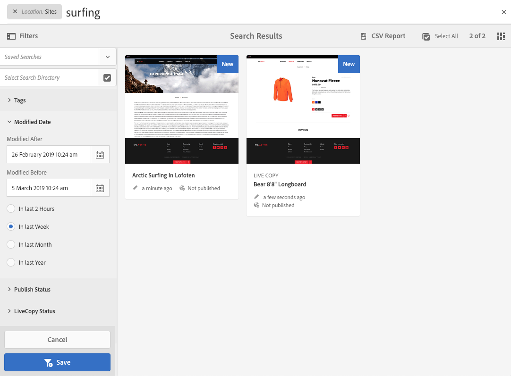
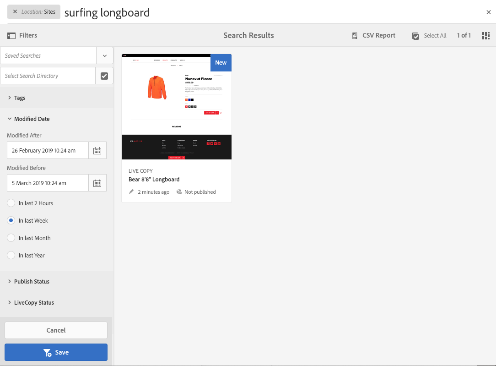
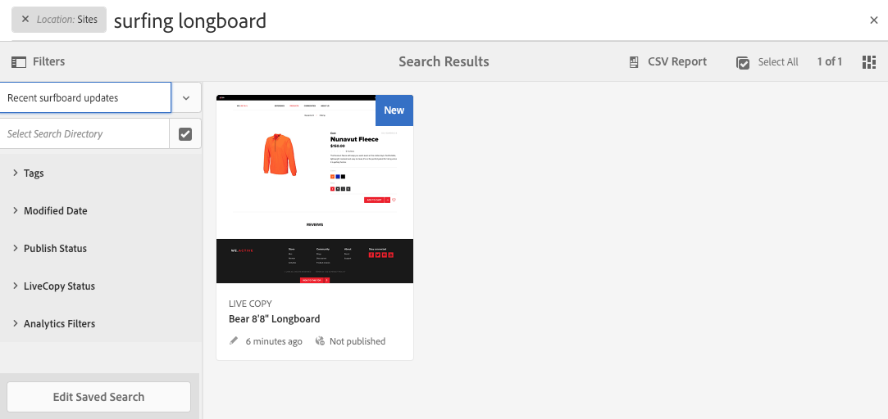

# Sök{#searching}

I AEM redigeringsmiljö finns olika metoder för att söka efter innehåll, beroende på resurstypen.

>[!NOTE]
>
>Utanför författarmiljön finns det även andra funktioner som kan användas för sökning, till exempel [Query Builder](/help/sites-developing/querybuilder-api.md) och [CRXDE Lite](/help/sites-developing/developing-with-crxde-lite.md).

## Grunderna i sökning {#search-basics}

Sökfunktionen finns i det övre verktygsfältet:

Med sökfältet kan du:

* Sök efter ett specifikt nyckelord, en viss sökväg eller en viss tagg.
* Filtrera enligt resursspecifika kriterier som ändrade datum, sidstatus, filstorlek osv.
* Definiera och använd en [sparad sökning](#saved-searches) baserat på ovanstående villkor.

>[!NOTE]
>
>Sökningen kan också anropas med snabbtangenten `/` (snedstreck) när sökfältet är synligt.

## Sök och filtrera {#search-and-filter}

Så här söker och filtrerar du resurser:

1. Öppna **Sök** (med förstoringsglaset i verktygsfältet) och ange söktermen. Förslag kommer att göras och kan väljas:

   

   Som standard begränsas sökresultaten till din aktuella plats (d.v.s. konsol och relaterad resurstyp):

   

1. Om det behövs kan du ta bort platsfiltret (markera **X** på filtret som du vill ta bort) för att söka i alla konsoler/resurstyper.
1. Resultaten visas, grupperade efter konsol och relaterad resurstyp.

   Du kan antingen välja en specifik resurs (för ytterligare åtgärd) eller fördjupa dig genom att välja den resurstyp som krävs, till exempel **Visa alla platser**:

   

1. Om du vill gå vidare väljer du skensymbolen (längst upp till vänster) för att öppna sidopanelen **Filter och alternativ**.

   

   I enlighet med resurstypen Sök visas ett fördefinierat urval av söknings-/filtervillkor.

   På sidopanelen kan du välja:

   * Sparade sökningar
   * Sökkatalog
   * Taggar
   * Sökvillkor, till exempel Ändrade datum, Publiceringsstatus, LiveCopy-status.

   >[!NOTE]
   >
   >Sökvillkoren kan variera:
   >
   >
   >
   >    * Beroende på vilken resurstyp du har valt, t.ex. är Assets- och Communities-kriterierna förståeligt specialiserade.
   >    * Instansen som [Sök i Forms](/help/sites-administering/search-forms.md) kan anpassas (lämplig för platsen i AEM).
   >
   >

   

1. Du kan även lägga till ytterligare söktermer:

   

1. Stäng **sökningen** med **X** (överst till höger).

>[!NOTE]
>
>Sökvillkoren sparas när du väljer ett objekt i sökresultatet.
>
>När du markerar ett objekt på sökresultatsidan och återgår till söksidan efter att du har använt knappen för att återställa webbläsaren, kvarstår sökvillkoren.

## Sparade sökningar {#saved-searches}

Förutom att söka efter en mängd olika aspekter kan du även spara en viss sökkonfiguration för hämtning och användning i ett senare skede:

1. Definiera sökvillkoren och välj **Spara**.

   

1. Tilldela ett namn och använd sedan **Spara** för att bekräfta:

   

1. Din sparade sökning är tillgänglig från väljaren nästa gång du öppnar sökpanelen:

   

1. När du har sparat kan du:

   * Använd **x** (mot namnet på den sparade sökningen) för att starta en ny fråga (den sparade sökningen tas inte bort).
   * **Redigera sparad sökning**, ändra sökvillkoren och **Spara** igen.

Du kan ändra sparade sökningar genom att markera den sparade sökningen och klicka på **Redigera sparad sökning** längst ned på sökpanelen.

