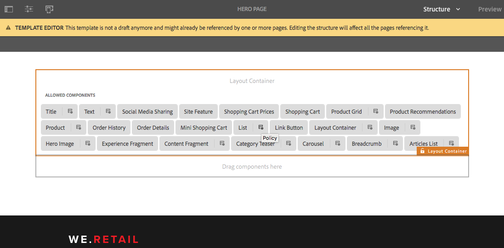

# Formatsystem{#style-system}

Med Style System kan mallskapare definiera formatklasser i en komponents innehållsprincip så att en innehållsförfattare kan markera dem när komponenten på en sida redigeras. Dessa format kan vara alternativa visuella varianter av en komponent, vilket gör den mer flexibel.

På så sätt elimineras behovet av att utveckla en anpassad komponent för varje format eller att anpassa komponentdialogrutan för att aktivera sådana formatfunktioner. Det leder till mer återanvändbara komponenter som snabbt och enkelt kan anpassas till innehållsförfattarnas behov utan någon AEM-backend-utveckling.

## Användningsfall {#use-case}

Mallförfattare behöver inte bara kunna konfigurera hur komponenterna fungerar för innehållsförfattarna, utan även konfigurera ett antal alternativa visuella varianter av en komponent.

På samma sätt behöver innehållsförfattare inte bara kunna strukturera och ordna sitt innehåll, utan också kunna välja hur det ska presenteras visuellt.

Stilsystemet ger en enhetlig lösning för både mallskaparens och innehållsförfattarens krav:

* Mallförfattare kan definiera formatklasser i komponenternas innehållsprincip.
* Innehållsförfattare kan sedan välja dessa klasser i en listruta när de redigerar komponenten på en sida för att tillämpa motsvarande format.

Klassen style infogas sedan i elementet dekoration wrapper i komponenten så att komponentutvecklaren inte behöver bekymra sig om att hantera formaten utöver att tillhandahålla sina CSS-regler.

## Översikt {#overview}

Följande formulär används vanligtvis när du använder formatsystemet.

1. Webbdesignern skapar olika visuella variationer av en komponent.

1. HTML-utvecklaren får HTML-utdata från komponenterna och de visuella variationer som ska implementeras.

1. HTML-utvecklaren definierar CSS-klasserna som motsvarar varje visuell variation och som ska infogas i elementet som omsluter komponenterna.

1. HTML-utvecklaren implementerar motsvarande CSS-kod (och eventuellt JS-kod) för var och en av de visuella variationerna så att de ser ut som de definierats.

1. AEM-utvecklaren placerar angiven CSS (och valfri JS) i ett [klientbibliotek](/help/sites-developing/clientlibs.md) och distribuerar den.

1. AEM-utvecklaren eller mallskaparen konfigurerar sidmallarna och redigerar principen för varje formaterad komponent, lägger till definierade CSS-klasser, ger användarvänliga namn för varje format och anger vilka format som kan kombineras.

1. Författaren av AEM-sidan kan sedan välja formaten i sidredigeraren via formatmenyn i komponentens verktygsfält.

Observera att endast de tre sista stegen faktiskt utförs i AEM. Detta innebär att all utveckling av nödvändig CSS och Javascript kan göras utan AEM.

För att kunna implementera formaten behöver du bara distribuera dem på AEM och välja dem bland komponenterna i de önskade mallarna.

I följande diagram visas formatsystemets arkitektur.

## Use {#use}

För att demonstrera funktionen måste format skapas för en komponent. Med [We.Retail](/help/sites-developing/we-retail.md)’s implementation of the core component&#39;s [list component](https://helpx.adobe.com/experience-manager/core-components/using/list.html) as a base, kan du installera det bifogade paketet som innehåller stilar för att utforska funktionens funktionalitet.

Ladda ned [systemdemopaketet](assets/package_-_style_systemdemo.zip)

>[!NOTE]
>
>Demopaketet är avsett att visa hur formatsystemet kan användas av författare, i stället för som referens för hur det ska implementeras på bästa sätt.
>
>Det här paketet behövs bara tills We.Retail tillhandahåller ett inbyggt exempel och en implementering av bästa praxis.

I följande avsnitt [Som innehållsförfattare](/help/sites-authoring/style-system.md#as-a-content-author) och [som mallskapare](/help/sites-authoring/style-system.md#as-a-template-author) beskrivs hur du testar funktionaliteten i formatsystemet med hjälp av demopaketet style system på webben.Retail.

Om du vill använda formatsystemet för dina egna komponenter gör du följande:

1. Installera CSS som klientbibliotek så som beskrivs i avsnittet [Översikt](/help/sites-authoring/style-system.md#overview).
1. Konfigurera de CSS-klasser som du vill göra tillgängliga för innehållsförfattarna enligt beskrivningen i avsnittet [Som mallförfattare](/help/sites-authoring/style-system.md#as-a-template-author).
1. Innehållsförfattare kan sedan använda de format som beskrivs i avsnittet [som innehållsförfattare](/help/sites-authoring/style-system.md#as-a-content-author).

### Som innehållsförfattare {#as-a-content-author}

1. När du har installerat demonstrationspaketet för style system går du till Web.Retail&#39;s English language master home page på `http://localhost:4502/sites.html/content/we-retail/language-masters/en` och redigerar sidan.
1. Markera **List** -komponenten längst ned eller högst upp i parsytorna. Blanda inte ihop det med **artikellistkomponenten** .

   

1. Tryck eller klicka på knappen **Stilar** i verktygsfältet i **List** -komponenten för att öppna stilmenyn och ändra komponentens utseende.

   

   >[!NOTE]
   >
   >I det här exemplet utesluter **layoutformaten** (**Block** och **Grid**) varandra, medan **visningsalternativen** (**Bild** **** eller¥Date) kan kombineras. Detta kan [konfigureras i mallen som mallskapare](/help/sites-authoring/style-system.md#as-a-template-author).

### Som mallskapare {#as-a-template-author}

1. När du redigerar Web.Retail&#39;s English language master home page `http://localhost:4502/sites.html/content/we-retail/language-masters/en`redigerar du sidans mall via **Page Information -> Edit Template**.

   

1. Redigera principen för **List** -komponenten genom att trycka på eller klicka på **Policy** -knappen för komponenten. Blanda inte ihop detta med **artikellistkomponenten** .

   

1. På fliken Format i egenskaperna kan du se hur formaten har konfigurerats.

   

   * **** Gruppnamn: Format kan grupperas tillsammans på den formatmeny som innehållsförfattaren ska se när komponentens format konfigureras.
   * **** Du kan kombinera format: Tillåter att flera format i den gruppen markeras samtidigt.
   * **** Formatnamn: Beskrivningen av det format som ska visas för innehållsförfattaren när komponentens format konfigureras.
   * **** CSS-klasser: Det faktiska namnet på CSS-klassen som är associerad med formatet.
   Använd draghandtagen för att ordna gruppernas och gruppernas inbördes ordning. Använd ikonerna för att lägga till eller ta bort för att lägga till eller ta bort grupper eller format i grupper.

>[!CAUTION]
>
>CSS-klasserna (och eventuella nödvändiga JavaScript) som konfigurerats som formategenskaper för en komponents policy måste distribueras som [klientbibliotek](/help/sites-developing/clientlibs.md) för att fungera.

## Inställningar {#setup}

>[!NOTE]
>
>Version 2 av kärnkomponenterna är helt aktiverade för att kunna utnyttja stilsystemet och kräver ingen ytterligare konfiguration.
>
>Följ de följande stegen för att aktivera formatsystemet för dina egna anpassade komponenter eller för att utöka grundkomponenterna i version 1 för att använda funktionen.

För att en komponent ska kunna fungera med AEM:s formatsystem och visa formatfliken i designdialogrutan måste komponentutvecklaren inkludera den fliken från produkten med följande inställningar för komponenten:

* `path = "/mnt/overlay/cq/gui/components/authoring/dialog/style/tab_design/styletab"`
* `sling:resourceType = "granite/ui/components/coral/foundation/include"`

När komponenten är konfigurerad infogas de format som har konfigurerats av sidförfattarna automatiskt av AEM i det dekorationselement som AEM automatiskt omsluter runt varje redigerbar komponent. Själva komponenten behöver inte göra något annat för att detta ska hända.

### Format med elementnamn {#styles-with-element-names}

En utvecklare kan också konfigurera en lista med tillåtna elementnamn för format i komponenten med egenskapen för `cq:styleElements` strängmatris. På fliken Format i profilen i designdialogrutan kan mallskaparen också välja ett elementnamn som ska anges för varje format. Då anges elementnamnet för elementet wrapper.

Den här egenskapen ställs in på `cq:Component` noden. Exempel:

* `/apps/weretail/components/content/list@cq:styleElements=[div,section,span]`

>[!CAUTION]
>
>Undvik att definiera elementnamn för format som kan kombineras. När flera elementnamn definieras är prioritetsordningen:
>
>1. HTML har företräde framför allt: `data-sly-resource="${'path/to/resource' @ decorationTagName='span'}`
>1. Sedan används det första formatet i listan med format som är konfigurerade i komponentens profil bland flera aktiva format.
>1. Slutligen betraktas komponentens `cq:htmlTag`/ `cq:tagName` som ett reservvärde.
>

Den här möjligheten att definiera formatnamn är användbar för mycket generiska komponenter, som Layoutbehållaren eller komponenten Innehållsfragment, för att ge dem ytterligare innebörd.

Den tillåter till exempel att en Layout Container får semantik som `<main>`, `<aside>`, `<nav>`osv.
