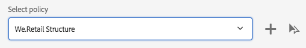
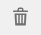
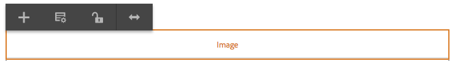
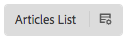

# Skapa sidmallar{#creating-page-templates}

När du skapar en sida måste du välja en mall som ska användas som bas för att skapa den nya sidan. Mallen definierar strukturen för den resulterande sidan, allt ursprungligt innehåll och de komponenter som kan användas.

Med **mallredigeraren**&#x200B;är det inte längre bara utvecklare som skapar och underhåller mallar. En typ av avancerade användare, som kallas **mallskapare**, kan också involveras. Utvecklare måste fortfarande installera miljön, skapa klientbibliotek och skapa komponenter som ska användas, men när dessa grunder väl är på plats kan mallskaparen **** skapa och konfigurera mallar utan ett utvecklingsprojekt.

Med **mallkonsolen** kan mallskapare:

* Skapa en ny mall eller kopiera en befintlig mall.
* Hantera mallens livscykel.

Med **mallredigeraren** kan mallförfattare:

* Lägg till komponenter i mallen och placera dem i ett responsivt rutnät.
* Förkonfigurera komponenterna.
* Definiera vilka komponenter som kan redigeras på sidor som skapas med mallen.

Det här dokumentet förklarar hur en **mallskapare** kan använda mallkonsolen och redigeraren för att skapa och hantera redigerbara mallar.

Mer information om hur redigerbara mallar fungerar på teknisk nivå finns i utvecklardokumentet [Sidmallar - redigerbart](/help/sites-developing/page-templates-editable.md) .

>[!NOTE]
>
>Mallredigeraren **** har inte stöd för direkt målinriktning på mallnivå. Sidor som skapas baserat på en redigerbar mall kan ha som mål, men det går inte att använda själva mallarna.

>[!CAUTION]
>
>Sidor och mallar som skapats med **mallkonsolen** är inte avsedda att användas med det klassiska användargränssnittet och sådan användning stöds inte.

## Before You Start {#before-you-start}

>[!NOTE]
>
>En administratör måste konfigurera en mallmapp i **Konfigurationsläsaren** och tillämpa rätt behörigheter innan en mallskapare kan skapa en mall i den mappen.

Följande punkter är viktiga att tänka på innan du börjar:

* Att skapa en ny mall kräver samarbete. Därför anges [rollen](#roles) för varje uppgift.

* Beroende på hur din instans är konfigurerad kan det vara bra att vara medveten om att AEM nu tillhandahåller [två grundläggande typer av mallar](/help/sites-authoring/templates.md#editable-and-static-templates). Detta påverkar inte hur du faktiskt [använder en mall för att skapa en sida](#using-a-template-to-create-a-page), men det påverkar den typ av mall du kan skapa och hur en sida relaterar till dess mall.

### Roller {#roles}

Om du vill skapa en ny mall med hjälp av **mallkonsolen** och **mallredigeraren** måste du samarbeta mellan följande roller:

* **Administratör**:

   * Skapar en ny mapp för mallar som kräver `admin` rättigheter.

   * Sådana uppgifter kan ofta även utföras av en utvecklare

* **Utvecklare**:

   * Koncentrerar sig på tekniska/interna detaljer
   * Kräver erfarenhet av utvecklingsmiljön.
   * Förser mallskaparen med nödvändig information.

* **Mallförfattare**:

   * Detta är en specifik författare som är medlem i gruppen `template-authors`

      * Detta tilldelar de behörigheter och behörigheter som krävs.
   * Kan konfigurera användning av komponenter och annan högnivåinformation som kräver:

      * Vissa tekniska kunskaper

         * Du kan till exempel använda mönster när du definierar banor.
      * Teknisk information från utvecklaren.

På grund av egenskaperna hos vissa uppgifter, som att skapa en mapp, behövs en utvecklingsmiljö som kräver kunskap/erfarenhet.

De uppgifter som beskrivs i det här dokumentet listas med den roll som ansvarar för att utföra dem.

### Redigerbara och statiska mallar {#editable-and-static-templates}

AEM erbjuder nu två grundläggande typer av mallar:

* [Redigerbara mallar](/help/sites-authoring/templates.md#creatingandmanagingnewtemplates)

   * Kan [skapas](#creatinganewtemplate) och [redigeras](#editingatemplate) av mallförfattare med **mallkonsolen** och redigeraren. Konsolen **Mall** finns i avsnittet **Allmänt** i **verktygskonsolen** .

   * När den nya sidan har skapats upprätthålls en dynamisk anslutning mellan sidan och mallen. Det innebär att ändringar i mallstrukturen och/eller det låsta innehållet återspeglas på alla sidor som skapas med mallen. Ändringar i det olåsta (dvs. initialt) innehållet kommer inte att återspeglas.
   * Använd innehållsprofiler, som du kan definiera från mallredigeraren, för att behålla designegenskaperna. Designläget i sidredigeraren används inte längre för redigerbara mallar.

* Statiska mallar

   * Statiska mallar har varit tillgängliga för flera versioner av AEM.
   * De [tillhandahålls av utvecklarna](/help/sites-developing/page-templates-static.md), så de kan inte skapas eller redigeras av författare.
   * Kopieras för att skapa den nya sidan, men det finns ingen dynamisk anslutning efter detta (även om mallnamnet är registrerat för information).
   * Använd [designläget](/help/sites-authoring/default-components-designmode.md) för att behålla designegenskaperna.
   * Eftersom det bara är utvecklarens uppgift att redigera statiska mallar finns mer information i [utvecklardokumentet Sidmallar - statisk](/help/sites-developing/page-templates-static.md) .

I mallkonsolen och mallredigeraren går det bara att skapa och redigera redigerbara mallar. Därför fokuserar det här dokumentet enbart på redigerbara mallar.

### Använda en mall för att skapa en sida {#using-a-template-to-create-a-page}

När du använder en mall för att [skapa en ny sida](/help/sites-authoring/managing-pages.md#creating-a-new-page) finns det ingen synlig skillnad och ingen indikation mellan statiska och redigerbara mallar. För sidförfattaren är processen genomskinlig.

## Creating and Managing Templates {#creating-and-managing-templates}

När du skapar en ny redigerbar mall:

* Använd **mallkonsolen** . Detta finns i avsnittet **Allmänt** i **verktygskonsolen** .

   * Eller direkt på: [https://localhost:4502/libs/wcm/core/content/sites/templates.html/conf](https://localhost:4502/libs/wcm/core/content/sites/templates.html/conf)

* Kan [skapa en mapp för mallarna](#creating-a-template-folder-admin) vid behov
* [Skapa en ny mall](#creatinganewtemplateauthor)som till att börja med är tom 

* [Definiera ytterligare egenskaper](#definingtemplatepropertiesauthor) för mallen om det behövs
* [Redigera mallen](#editingtemplates) för att definiera:

   * [Struktur](#editingatemplatestructureauthor) - Fördefinierat innehåll som inte kan ändras på sidor som skapas med mallen.
   * [Ursprungligt innehåll](#editing-a-template-initial-content-author) - fördefinierat innehåll som kan ändras på sidor som skapas med mallen.
   * [Layout](#editingatemplatelayoutauthor) - för en rad olika enheter.
   * [Format](/help/sites-authoring/style-system.md) - Definiera de format som ska användas med mallen och dess komponenter.

* [Aktivera mallen](#enablingatemplateauthor) för användning när du skapar en sida
* [Tillåt mallen](#allowing-a-template-author) för den begärda sidan eller grenen på din webbplats
* [Publicera mallen](#publishingatemplateauthor) så att den blir tillgänglig i publiceringsmiljön

>[!NOTE]
>
>De **tillåtna mallarna** är ofta fördefinierade när webbplatsen är konfigurerad.

>[!CAUTION]
>
>Ange aldrig någon information som behöver [internationaliseras](/help/sites-developing/i18n.md) i en mall.

### Skapa en mallmapp - administratör {#creating-a-template-folder-admin}

Du bör skapa en mallmapp för ditt projekt för dina projektspecifika mallar. Detta är en administratörsåtgärd och beskrivs i dokumentet [Sidmallar - redigerbart](/help/sites-developing/page-templates-editable.md#template-folders).

### Skapa en ny mall - mallskapare {#creating-a-new-template-template-author}

1. Öppna **mallkonsolen** (via **Verktyg ->** **Allmänt**) och navigera sedan till önskad mapp.

   >[!NOTE]
   >
   >I en standard-AEM-instans finns den **globala** mappen redan i mallkonsolen. Detta innehåller standardmallar och fungerar som reserv om inga principer och/eller malltyper hittas i den aktuella mappen.
   >
   >
   >Vi rekommenderar att du använder en [mallmapp som skapats för ditt projekt](/help/sites-developing/page-templates-editable.md#template-folders).

1. Välj **Skapa**, följt av **Skapa mall** för att öppna guiden.

1. Välj en **malltyp** och välj sedan **Nästa**.

   >[!NOTE]
   >
   >Malltyper är fördefinierade malllayouter och kan ses som mallar för en mall. Dessa är fördefinierade av utvecklare eller systemadministratören. Mer information finns i utvecklardokumentet [Sidmallar - Redigerbar](/help/sites-developing/page-templates-editable.md#template-type).

1. Fyll i **mallinformation**:

   * **Mallnamn**
   * **Beskrivning**

1. Välj **Skapa**. En bekräftelse visas. Välj **Öppna** för att börja [redigera mallen](#editingatemplate) eller **Klar** för att återgå till mallkonsolen.

   >[!NOTE]
   >
   >När en ny mall skapas markeras den som **Utkast** i konsolen innebär det att den inte är tillgänglig för sidförfattare än.

### Definiera mallegenskaper - mallförfattare {#defining-template-properties-template-author}

En mall kan ha följande egenskaper:

* Bild

   * Bild som ska användas som [miniatyrbild av mallen](/help/sites-authoring/templates.md#template-thumbnail-image) för att underlätta val, t.ex. i guiden Skapa sida.

      * Kan överföras
      * Kan genereras baserat på mallinnehållet

* Titel

   * En titel som används för att identifiera mallen, t.ex. i guiden **Skapa sida** .

* Beskrivning

   * En valfri beskrivning som ger mer information om mallen och hur den används, och som kan visas i t.ex. guiden **Skapa sida** .

Så här visar och/eller redigerar du egenskaperna:

1. Välj mallen på **mallkonsolen**.
1. Välj **Visa egenskaper** i verktygsfältet eller snabbalternativ för att öppna dialogrutan.
1. Nu kan du visa eller redigera mallegenskaperna.

>[!NOTE]
>
>Status för en mall (utkast, aktiverad eller inaktiverad) visas i konsolen.

#### Miniatyrbild för mall {#template-thumbnail-image}

Så här definierar du mallminiatyrbilden:

1. Redigera mallegenskaperna.
1. Välj om du vill överföra en miniatyrbild eller låta den genereras från mallinnehållet.

   * Om du vill överföra en miniatyrbild klickar du på eller trycker på **Överför bild**
   * Om du vill generera en miniatyrbild klickar eller trycker du på **Generera förhandsvisning**

1. För båda metoderna visas en förhandsvisning av miniatyrbilden.

   Om det inte är tillräckligt klickar eller trycker du på **Radera** för att överföra en annan bild eller generera miniatyrbilden igen.

1. När du är nöjd med miniatyrbilden klickar eller trycker du på **Spara och stäng**.

### Aktivera och tillåta en mall - mallförfattare {#enabling-and-allowing-a-template-template-author}

För att kunna använda en mall när du skapar en sida måste du:

* [Aktivera mallen](#enablingatemplate) så att den blir tillgänglig för användning när du skapar sidor.
* [Tillåt mallen](#allowingatemplate) att ange de innehållsgrenar där mallen kan användas.

#### Aktivera en mall - mallförfattare {#enabling-a-template-template-author}

En mall kan aktiveras eller inaktiveras så att den blir tillgänglig eller otillgänglig i guiden **Skapa sida** .

>[!CAUTION]
>
>När en mall är aktiverad visas en varning när en mallskapare börjar uppdatera mallen ytterligare. Detta är till för att informera användaren om att mallen kan refereras, så eventuella ändringar kan påverka sidorna som refererar till mallen.

1. Välj mallen på **mallkonsolen**.
1. Välj **Aktivera** eller **Inaktivera** i verktygsfältet och sedan igen i bekräftelsedialogrutan.
1. Nu kan du använda mallen när du [skapar en ny sida](/help/sites-authoring/managing-pages.md#creating-a-new-page), men du vill antagligen [redigera mallen](#editingatemplate) enligt dina önskemål.

>[!NOTE]
>
>Status för en mall (utkast, aktiverad eller inaktiverad) visas i konsolen.

#### Tillåt en mall - Författare {#allowing-a-template-author}

En mall kan göras tillgänglig eller otillgänglig för vissa sidgrenar.

1. Öppna [Sidegenskaperna](/help/sites-authoring/editing-page-properties.md) för rotsidan i grenen där du vill att mallen ska vara tillgänglig.

1. Öppna fliken **Avancerat** .

1. Under **Mallinställningar** använder du fältet **** Lägg till för att ange sökvägen/sökvägarna till mallarna.

   Sökvägen kan vara explicit eller använda mönster. Exempel:

   `/conf/<your-folder>/settings/wcm/templates/.*`

   Sökvägsordningen är irrelevant, alla sökvägar skannas och alla mallar hämtas.

   >[!NOTE]
   >
   >Om listan **Tillåtna mallar** lämnas tom kommer trädet att ökas tills ett värde/en lista hittas.
   >
   >
   >Se [Malltillgänglighet](/help/sites-developing/templates.md#template-availability) - principerna för tillåtna mallar är desamma.

1. Klicka på **Spara** för att spara ändringarna i sidegenskaperna.

>[!NOTE]
>
>Tillåtna mallar är ofta fördefinierade för hela platsen när den konfigureras.

### Publicera en mall - mallförfattare {#publishing-a-template-template-author}

När det refereras till mallen när en sida återges måste den fullständigt konfigurerade mallen publiceras så att den är tillgänglig i publiceringsmiljön.

1. Välj mallen på **mallkonsolen**.
1. Välj **Publicera** i verktygsfältet för att öppna guiden.
1. Markera de **innehållsprinciper** som ska publiceras tillsammans.

1. Välj **Publicera** i verktygsfältet för att slutföra åtgärden.

## Redigera mallar - mallskapare {#editing-templates-template-authors}

När du skapar eller redigerar en mall finns det olika aspekter som du kan definiera. Att redigera mallar liknar att skapa sidor.

Följande aspekter av en mall kan redigeras:

* [Struktur](#editingatemplatestructure)

   Komponenter som läggs till här kan inte flyttas/tas bort från resultatsidor av sidförfattare. Om du vill att sidförfattare ska kunna lägga till och ta bort komponenter på resulterande sidor, måste du lägga till ett styckesystem i mallen.

   När komponenter är låsta kan du lägga till innehåll som inte kan redigeras av sidförfattare. Du kan låsa upp komponenter så att du kan definiera [ursprungligt innehåll](#editingatemplateinitialcontent).

   >[!NOTE]
   >
   >I strukturläge kan inte komponenter som är överordnade en olåst komponent flyttas, klippas ut eller tas bort.

* [Ursprungligt innehåll](#editingatemplateinitialcontent)

   När en komponent har låsts upp kan du definiera det ursprungliga innehåll som ska kopieras till den eller de resulterande sidorna som skapas från mallen. Dessa olåsta komponenter kan redigeras på den eller de slutliga sidorna.

   >[!NOTE]
   >
   >I **ursprungligt innehållsläge** samt på de resulterande sidorna kan alla olåsta komponenter som har en tillgänglig överordnad (dvs. komponenter i en layoutbehållare) tas bort.

* [Layout](#editingatemplatelayout)

   Här kan du fördefiniera mallayouten för de önskade enhetsformaten. **Layoutläget** för mallutveckling har samma funktioner som [**layoutläget **för sidredigering](/help/sites-authoring/responsive-layout.md#defining-layouts-layout-mode).

* [Sidprofiler](#editingatemplatepagepolicies)

   Under Sidprofiler kan du koppla fördefinierade sidprofiler till sidan. Dessa sidprofiler definierar de olika designkonfigurationerna.

* [Format](/help/sites-authoring/style-system.md)

   Med Style System kan mallskapare definiera formatklasser i en komponents innehållsprincip så att en innehållsförfattare kan markera dem när komponenten på en sida redigeras. Dessa format kan vara alternativa visuella varianter av en komponent, vilket gör den mer flexibel.

   Mer information finns i dokumentationen [för](/help/sites-authoring/style-system.md) formatsystemet.

Med **lägesväljaren** i verktygsfältet kan du markera och redigera rätt aspekt av mallen:

* [Struktur](#editingatemplatestructure)
* [Ursprungligt innehåll](#editingatemplateinitialcontent)
* [Layout](#editingatemplatelayout)

Med alternativet **Sidprofil** på menyn **Sidinformation** kan du [välja önskade sidprofiler](#editingatemplatepagepolicies):

>[!CAUTION]
>
>Om en författare börjar redigera en mall som redan har aktiverats visas en varning. Detta är till för att informera användaren om att mallen kan refereras, så eventuella ändringar kan påverka sidorna som refererar till mallen.

### Redigera en mall - Struktur - Mallförfattare {#editing-a-template-structure-template-author}

I **strukturläge** definierar du komponenter och innehåll för mallen och definierar en policy för mallen och dess komponenter.

* Komponenter som definieras i mallstrukturen kan inte flyttas till en resultatsida eller tas bort från eventuella resultatsidor.
* Om du vill att sidförfattare ska kunna lägga till och ta bort komponenter lägger du till ett styckesystem i mallen.
* Komponenter kan låsas upp och låsas igen så att du kan definiera [ursprungligt innehåll](#editingatemplateinitialcontent).

* Designprofilerna för komponenterna och sidan definieras.

I **strukturläget** i mallredigeraren:

* **Lägga till komponenter**

   Det finns flera sätt att lägga till komponenter i mallen:

   * Från **komponentwebbläsaren** på sidopanelen.
   * Genom att använda alternativet **Infoga komponent** (**+** ikon) som finns i verktygsfältet för komponenter som redan finns i mallen eller **Dra komponenter hit** .

   * Genom att dra en resurs (från **Assets** -webbläsaren på sidpanelen) direkt till mallen för att generera rätt komponent på plats.
   När de lagts till markeras varje komponent med:

   * En kant
   * En markör som visar komponenttypen
   * En markör som visas när komponenten har låsts upp
   >[!NOTE]
   >
   >När du lägger till en körklar **titelkomponent** i mallen kommer den att innehålla **standardtextstrukturen**.
   >
   >
   >Om du ändrar detta och lägger till egen text används den uppdaterade texten när en sida skapas från mallen.
   >
   >
   >Om du låter standardtexten (strukturen) vara kvar används namnet på efterföljande sida som standard.

   >[!NOTE]
   >
   >Även om det inte är identiskt har tillägg av komponenter och resurser i en mall många likheter med liknande åtgärder vid [sidredigering](/help/sites-authoring/editing-content.md).

* **Komponentåtgärder**

   Vidta åtgärder för komponenterna när de har lagts till i mallen. Varje enskild instans har ett verktygsfält som gör att du kan komma åt de tillgängliga åtgärderna. Verktygsfältet är beroende av komponenttypen.

   

   Den kan också vara beroende av åtgärder som vidtas, t.ex. när en profil har kopplats till komponenten, så blir ikonen för designkonfiguration tillgänglig.

* **Redigera och konfigurera**

   Med dessa två åtgärder kan du lägga till innehåll i komponenterna.

* **Kant som anger struktur**

   När du arbetar i **strukturläge** visas den markerade komponenten med en orange ram. En prickad linje anger även den överordnade komponenten.

   I skärmbilden nedanför komponenten **Text** markeras till exempel i en **layoutbehållare** (responsivegrid).

   

* **Policy &amp; Properties (General)**

   Innehållets (eller designens) profiler definierar en komponents designegenskaper. Till exempel de tillgängliga komponenterna eller minimi-/maximidimensionerna. Dessa gäller för mallen (och sidor som skapas med mallen).

   Skapa en innehållsprincip, eller välj en befintlig, för en komponent. På så sätt kan du definiera designdetaljerna.

    

   Konfigurationsfönstret är uppdelat i två delar.

   * Till vänster i dialogrutan under **Policy** kan du välja en befintlig profil eller en befintlig.
   * Till höger i dialogrutan under **Egenskaper** kan du ange egenskaper som är specifika för komponenttypen.
   Vilka egenskaper som är tillgängliga beror på den valda komponenten. För en textkomponent definierar till exempel egenskaperna alternativ för kopiera och klistra in, formatering och styckeformat bland annat.

   ***Policy***

   Innehållets (eller designens) profiler definierar en komponents designegenskaper. Till exempel de tillgängliga komponenterna eller minimi-/maximidimensionerna. Dessa gäller för mallen (och sidor som skapas med mallen).

   Under **Princip** kan du välja en befintlig princip som ska tillämpas på komponenten via listrutan.

   

   Du kan lägga till en ny profil genom att markera knappen Lägg till bredvid listrutan **Välj princip** . En ny titel ska sedan anges i fältet **Policytitel** .

   

   Den valda befintliga principen i listrutan **Välj princip** kan kopieras som en ny princip med kopieringsknappen bredvid listrutan. En ny titel ska sedan anges i fältet **Policytitel** . Som standard får den kopierade profilen namnet **Copy of X**, där X är den kopierade profilens namn.

   

   En beskrivning av profilen är valfri i fältet **Principbeskrivning** .

   I **Andra mallar som även använder den valda profilen** kan du enkelt se vilka andra mallar som använder den profil som valts i listrutan **Välj profil** .

   

   >[!NOTE]
   >
   >Om flera komponenter av samma typ läggs till som ursprungligt innehåll gäller samma princip för alla komponenter. Detta speglar samma begränsning i [**designläge **för statiska mallar](/help/sites-authoring/default-components-designmode.md).

   ***Egenskaper***

   Under rubriken **Egenskaper** kan du definiera komponentens inställningar. Rubriken har två flikar:

   * Huvud
   * Funktioner
   *Huvud*

   De viktigaste inställningarna för komponenten definieras på fliken **Main** .

   För en bildkomponent kan till exempel de tillåtna bredderna definieras tillsammans med aktivering av lazy loading.

   Om en inställning tillåter flera konfigurationer klickar eller trycker du på knappen **Lägg till** för att lägga till en annan konfiguration.

   

   Om du vill ta bort en konfiguration klickar du på eller trycker på knappen **Ta bort** till höger om konfigurationen.

   Om du vill ta bort en konfiguration klickar eller trycker du på knappen** Delete**.

   

   *Funktioner*

   På fliken **Funktioner** kan du aktivera eller inaktivera ytterligare funktioner för komponenten.

   För en bildkomponent kan du till exempel definiera beskärningsproportionerna, tillåtna bildorienteringar och om överföringar tillåts.

   

   >[!CAUTION]
   >
   >Observera att i AEM definieras beskärningsproportioner som **höjd/bredd**. Detta skiljer sig från den vanliga definitionen av bredd/höjd och görs av äldre kompatibilitetsskäl. Sidredigeringsanvändarna kommer inte att vara medvetna om några skillnader förutsatt att du definierar **namnet** tydligt eftersom det är det som visas i användargränssnittet.

   >[!NOTE]
   >
   >[Innehållspolicyer för komponenter som implementerar RTF-redigeraren](/help/sites-administering/rich-text-editor.md#main-pars-header-206036638) kan bara definieras för alternativ som är tillgängliga av RTE via dess gränssnittsinställningar.  

* **Princip och egenskaper (layoutbehållare)**

   Inställningarna för principer och egenskaper för en layoutbehållare liknar den allmänna användningen, men med vissa skillnader.

   >[!NOTE]
   >
   >Det är obligatoriskt att konfigurera en princip för behållarkomponenter eftersom det gör att du kan definiera komponenter som ska vara tillgängliga i behållaren.

   Konfigurationsfönstret är uppdelat i två delar, precis som i den allmänna användningen av fönstret.

   ***Policy***

   Innehållets (eller designens) profiler definierar en komponents designegenskaper. Till exempel de tillgängliga komponenterna eller minimi-/maximidimensionerna. Dessa gäller för mallen (och sidor som skapas med mallen).

   Under **Princip** kan du välja en befintlig princip som ska tillämpas på komponenten via listrutan. Detta fungerar på samma sätt som vid allmän användning av fönstret.

   ***Egenskaper***

   Under rubriken **Egenskaper** kan du välja vilka komponenter som är tillgängliga för layoutbehållaren och definiera deras inställningar. Rubriken har tre flikar:

   * Tillåtna komponenter
   * Standardkomponenter
   * Responsiva inställningar
   *Tillåtna komponenter*

   På fliken **Tillåtna komponenter** definierar du vilka komponenter som är tillgängliga för layoutbehållaren.

   * Komponenterna grupperas efter komponentgrupperna, som kan expanderas och komprimeras.
   * Du kan markera en hel grupp genom att markera gruppnamnet och avmarkera alla genom att avmarkera kryssrutan.
   * Ett minustecken representerar minst ett, men inte alla, objekt i en grupp markeras.
   * En sökning är tillgänglig för att filtrera efter en komponent efter namn.
   * Antalet som visas till höger om komponentgruppens namn representerar det totala antalet valda komponenter i dessa grupper oavsett filtret.
   

   *Standardkomponenter*

   På fliken **Standardkomponenter** definierar du vilka komponenter som automatiskt kopplas till de angivna medietyperna så att AEM vet vilken komponent som ska kopplas när en författare drar en resurs från resursläsaren. Observera att endast komponenter med släppzoner är tillgängliga för sådan konfiguration.

   Klicka eller tryck på **Lägg till mappning** för att lägga till en helt ny komponent och MIME-typmappning.

   Markera en komponent i listan och klicka eller tryck på **Lägg till typ** för att lägga till ytterligare en MIME-typ i en redan mappad komponent. Klicka på ikonen **Ta bort** för att ta bort en MIME-typ.

   

   *Responsiva inställningar*

   På fliken **Responsiva inställningar** kan du konfigurera antalet kolumner i det resulterande rutnätet i layoutbehållaren.

* **Lås upp/lås komponenter**

   Du låser upp/låser komponenter för att definiera om innehållet är tillgängligt för ändring i **ursprungligt innehåll** .

   När en komponent har låsts upp:

   * En öppen hänglåsindikator visas i kanten.
   * Komponentverktygsfältet justeras därefter.
   * Innehåll som redan har angetts visas inte längre i **strukturläge** .

      * Innehåll som redan har angetts betraktas som ursprungligt innehåll och visas bara i **ursprungligt innehåll** .
   * Det går inte att flytta, klippa ut eller ta bort överordnade för den olåsta komponenten.
   

   Detta inkluderar upplåsning av behållarkomponenter så att ytterligare komponenter kan läggas till, antingen i **ursprungligt innehåll** eller på resulterande sidor. Om du redan har lagt till komponenter/innehåll i behållaren innan du låser upp den visas dessa inte längre i **strukturläge** , men de visas i **ursprungligt innehåll** . I **strukturläge** visas bara behållarkomponenten med dess lista över **tillåtna komponenter**.

   

   För att spara utrymme växer inte layoutbehållaren så att den passar listan över tillåtna komponenter. Behållaren blir i stället en rullningsbar lista.

   Komponenter som kan konfigureras visas med en **principikon** , som du kan trycka på eller klicka på för att redigera principen och egenskaperna för den komponenten.

   

* **Relation till befintliga sidor**

   Om strukturen uppdateras efter att sidor som är baserade på mallen har skapats, kommer dessa sidor att återspegla ändringarna av mallen. En varning visas i verktygsfältet för att påminna dig om detta tillsammans med bekräftelsedialogrutor.

   

### Redigera en mall - Ursprungligt innehåll - Författare {#editing-a-template-initial-content-author}

**Läget Inledande innehåll** används för att definiera innehåll som ska visas när en sida skapas baserat på mallen. Det ursprungliga innehållet kan sedan redigeras av sidförfattare.

Även om allt innehåll som skapas i **strukturläget** visas i **ursprungligt innehåll**, kan bara komponenter som har låsts upp markeras och redigeras.

>[!NOTE]
>
>**Du kan använda det inledande innehållsläget** för redigeringsläge för sidor som skapas med den mallen. Därför definieras inte profiler i **läget Inledande innehåll** utan i [**strukturläget **](/help/sites-authoring/templates.md#editing-a-template-structure-template-author).

* Olåsta komponenter som är tillgängliga för redigering markeras. När de är markerade har de en blå kantlinje:

   

* Olåsta komponenter har ett verktygsfält där du kan redigera och konfigurera innehållet:

   

* Om en behållarkomponent har låsts upp (i **strukturläge** ) kan du lägga till nya komponenter i behållaren (i **ursprungligt innehåll** ). Komponenter som läggs till i **ursprungligt innehåll** kan flyttas till eller tas bort från resultatsidor.

   Du kan lägga till en komponent med hjälp av antingen **Dra komponenter här** eller alternativet **Infoga ny komponent** i verktygsfältet i lämplig behållare.

    

* Om mallens ursprungliga innehåll uppdateras efter att sidorna har skapats baserat på mallen påverkas inte dessa sidor av ändringarna av mallens ursprungliga innehåll.

>[!NOTE]
>
>Ursprungligt innehåll är avsett för att förbereda komponenter och den sidlayout som fungerar som en startpunkt för att skapa innehållet. Det är inte avsett att vara det faktiska innehåll som skulle förbli som det är. Därför går det inte att översätta det ursprungliga innehållet.
>
>Om du behöver inkludera översättningsbar text i mallen, t.ex. i sidhuvuden eller sidfötter, kan du använda [lokaliseringsfunktionerna i kärnkomponenterna](https://docs.adobe.com/content/help/en/experience-manager-core-components/using/get-started/localization.html).

### Redigera en mall - Layout - mallskapare {#editing-a-template-layout-template-author}

Du kan definiera mallayouten för ett antal olika enheter. [Responsiv layout](/help/sites-authoring/responsive-layout.md) för mallar fungerar på samma sätt för sidredigering.

>[!NOTE]
>
>Ändringar i layouten återspeglas i **ursprungligt innehåll** , men ingen ändring visas i **strukturläge** .

### Redigera en mall - Siddesign - Mallförfattare/utvecklare {#editing-a-template-page-design-template-author-developer}

Siddesignen med nödvändiga klientbibliotek och sidprofiler hanteras under alternativet **Siddesign** på menyn **Sidinformation** .

Så här öppnar du dialogrutan **Siddesign** :

1. I **mallredigeraren** väljer du **Sidinformation** i verktygsfältet och sedan **Siddesign** för att öppna dialogrutan.
1. Dialogrutan **Siddesign** öppnas och är uppdelad i två avsnitt:

   * Den vänstra halvan definierar [sidans profiler](/help/sites-authoring/templates.md#page-policies)
   * Den högra halvan definierar [sidegenskaperna](/help/sites-authoring/templates.md#page-properties)
   

#### Sidprofiler {#page-policies}

Du kan tillämpa en innehållsprincip på antingen mallen eller de resulterande sidorna. Detta definierar innehållsprincipen för huvudstyckesystemet på sidan.

* Du kan välja en befintlig profil för sidan i listrutan **Välj princip** .

   

   Du kan lägga till en ny profil genom att markera knappen Lägg till bredvid listrutan **Välj princip** . En ny titel ska sedan anges i fältet **Policytitel** .

   

   Den valda befintliga principen i listrutan **Välj princip** kan kopieras som en ny princip med kopieringsknappen bredvid listrutan. En ny titel ska sedan anges i fältet **Policytitel** . Som standard får den kopierade profilen namnet **Copy of X**, där X är den kopierade profilens namn.

   

* Definiera en rubrik för profilen i fältet **Policytitel** . En profil måste ha en titel så att den enkelt kan väljas i listrutan **Välj princip** .

   

* En beskrivning av profilen är valfri i fältet **Principbeskrivning** .
* I **Andra mallar som även använder den valda profilen** kan du enkelt se vilka andra mallar som använder den profil som valts i listrutan **Välj profil** .

   

#### Sidegenskaper {#page-properties}

Med hjälp av sidegenskaper kan du definiera nödvändiga klientbibliotek genom att använda dialogrutan **Siddesign** . Dessa klientbibliotek innehåller formatmallar och javascript som ska läsas in tillsammans med mallen och sidor som skapas med mallen.

* Ange de klientbibliotek som du vill använda på sidor som skapas med den här mallen. Ange namnet på ett bibliotek i textfältet i avsnittet **Klientbibliotek** .

   

* Om flera bibliotek behövs klickar du på knappen Lägg till för att lägga till ytterligare ett textfält för biblioteksnamnet.

   

   Lägg till så många textfält som behövs för klientbiblioteken.

   

* Definiera bibliotekets relativa position om det behövs genom att dra fälten med draghandtaget.

   

>[!NOTE]
>
>Mallförfattaren kan ange sidprincipen för mallen, men han eller hon måste få information om lämpliga klientbibliotek från utvecklaren.

### Redigera en mall - Inledande sidegenskaper - Författare {#editing-a-template-initial-page-properties-author}

Med alternativet **Inledande sidegenskaper** kan du definiera de inledande [sidegenskaperna](/help/sites-authoring/editing-page-properties.md) som ska användas när du skapar resulterande sidor.

1. I mallredigeraren väljer du **Sidinformation** i verktygsfältet och sedan **Inledande sidegenskaper** för att öppna dialogrutan.

1. I dialogrutan kan du definiera de egenskaper som du vill använda på sidor som skapas med den här mallen.

   

1. Bekräfta dina definitioner med **Klart**.

## Bästa praxis {#best-practices}

När du skapar mallar bör du tänka på följande:

1. Effekten av malländringar när sidor har skapats från den mallen.

   Här är en lista över de olika åtgärder som är möjliga för mallar tillsammans med hur de påverkar sidorna som skapas från dem:

   * Ändringar i strukturen:

      * De används omedelbart på de resulterande sidorna.
      * Det krävs fortfarande publicering av den ändrade mallen för att besökarna ska kunna se ändringarna.
   * Ändringar i innehållsprinciper och designkonfigurationer:

      * Dessa gäller omedelbart för de resulterande sidorna.
      * För att besökarna ska kunna se ändringarna måste ändringarna publiceras.
   * Ändringar av det ursprungliga innehållet:

      * Dessa gäller endast sidor som skapas efter malländringarna.
   * Ändringar i layouten beror på om den ändrade komponenten är en del av:

      * Endast struktur - används omedelbart
      * Innehåller ursprungligt innehåll - endast på sidor som skapats efter ändringen
   Var särskilt försiktig när du:

   * Låsa eller låsa upp komponenter på aktiverade mallar.
   * Detta kan ha biverkningar, eftersom befintliga sidor redan kan använda det. Vanligtvis:

      * Upplåsning av komponenter (som var låsta) saknas på befintliga sidor.
      * Om du låser komponenter (som var redigerbara) döljs innehållet så att det inte visas på sidorna.
   >[!NOTE]
   >
   >AEM ger explicita varningar när komponenternas låsstatus ändras i mallar som inte längre är utkast.

1. [Skapa egna mappar](#creatingatemplatefolderdeveloper) för webbplatsspecifika mallar.
1. [Publicera mallarna](#publishingatemplateauthor) från **mallkonsolen** .
