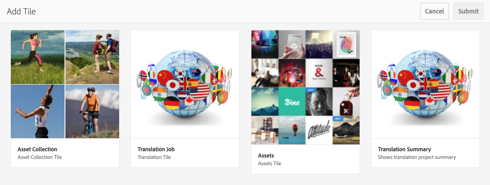
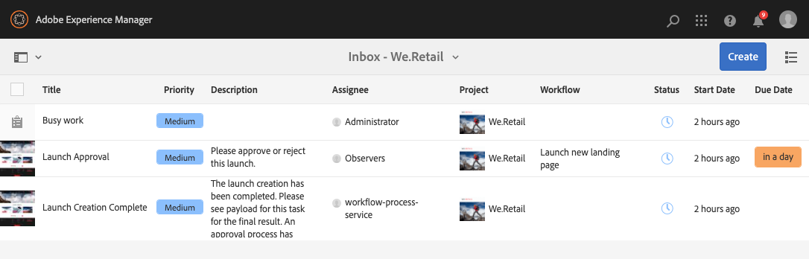

# Hantera projekt {#managing-projects}

I **Projekt** -konsolen får du tillgång till och kan hantera dina projekt.

Med konsolen kan du skapa ett projekt, associera resurser med projektet och även ta bort projekt- eller resurslänkar.

## Åtkomstkrav {#access-requirements}

Projicerar en AEM och kräver ingen ytterligare konfiguration.

Men för användare i projekt som vill se andra användare/grupper medan de använder projekt, till exempel när de skapar projekt, skapar uppgifter/arbetsflöden eller visar och hanterar teamet, måste de användarna ha läsåtkomst på `/home/users` och `/home/groups`.

Det enklaste sättet är att ge **projekt-användare** gruppläsåtkomst till `/home/users` och `/home/groups`.

## Skapa ett projekt {#creating-a-project}

Följ de här stegen för att skapa ett projekt.

1. I **Projekt** konsol, klicka **Skapa** för att öppna **Skapa projekt** guide.
1. Välj en mall och klicka på **Nästa**. Du kan läsa mer om standardprojektmallarna [här.](/help/sites-authoring/projects.md#project-templates)

   

1. Definiera **Titel** och **Beskrivning** och lägga till en **Miniatyrbild** bild om det behövs. Du kan också lägga till eller ta bort användare och vilken grupp de tillhör.

   

1. Klicka **Skapa**. Bekräftelsen frågar om du vill öppna det nya projektet eller gå tillbaka till konsolen.

Du skapar ett projekt på samma sätt för alla projektmallar. Skillnaden mellan de olika typerna av projekt relaterar till tillgängliga [användarroller](/help/sites-authoring/projects.md) och [arbetsflöden.](/help/sites-authoring/projects-with-workflows.md)

### Associera resurser med ditt projekt {#associating-resources-with-your-project}

Med projekt kan du gruppera resurser i en enhet för att hantera dem som helhet. Därför måste du koppla resurser till ditt projekt. Resurserna grupperas i projektet som **Plattor**. De typer av resurser du kan lägga till beskrivs i [Projektpaneler](/help/sites-authoring/projects.md#project-tiles).

Så här associerar du resurser med ditt projekt:

1. Öppna ditt projekt från **Projekt** konsol.
1. Klicka **Lägg till platta** och välj den platta som du vill länka till projektet. Du kan markera flera typer av rutor.

   

1. Klicka **Skapa**. Resursen är länkad till ditt projekt och från och med nu kan du komma åt den från ditt projekt.

### Lägga till objekt i en platta {#adding-items-to-a-tile}

I vissa rutor kanske du vill lägga till mer än ett objekt. Du kan till exempel ha flera arbetsflöden som körs samtidigt eller fler än en funktion.

Så här lägger du till objekt i en platta:

1. I **Projekt** navigerar du till projektet och klickar på nedåtvinklingsikonen längst upp till höger på den ruta där du vill lägga till ett objekt och väljer lämpligt alternativ.

   * Alternativet beror på plattans typ. Det kan till exempel vara **Skapa uppgift** för **Uppgifter** eller **Starta arbetsflöde** för **Arbetsflöden** platta.

   

1. Lägg till objektet i rutan på samma sätt som när du skapar en platta. Projektpaneler beskrivs [här.](/help/sites-authoring/projects.md#project-tiles)

## Visa projektinformation {#viewing-project-info}

Huvudsyftet med projekten är att gruppera tillhörande information på ett ställe så att den blir mer tillgänglig och kan hanteras. Du kan komma åt den här informationen på flera olika sätt.

### Öppna en platta {#opening-a-tile}

Du kanske vill se vilka objekt som ingår i en aktuell platta eller ändra eller ta bort objekt i plattan.

Så här öppnar du en platta så att du kan visa eller ändra objekt:

1. Klicka på ellipsikonen längst ned till höger i rutan.

   

1. AEM öppnar konsolen för de typer av objekt som är kopplade till plattan och filtrerar baserat på det valda projektet.

   

### Visa en projekttidslinje {#viewing-a-project-timeline}

Projektets tidslinje innehåller information om när resurser i projektet senast användes. Följ de här stegen för att visa projekttidslinjen.

1. I **Projekt** konsol, klicka **Tidslinje** i spårväljaren längst upp till vänster i konsolen.
   
2. I konsolen väljer du det projekt som du vill visa tidslinjen för.
   

Resurser visas i rälsen. Använd spårväljaren för att återgå till normal visning när du är klar.

### Visa inaktiva projekt {#viewing-active-inactive-projects}

För att växla mellan [inaktiva projekt,](#making-projects-inactive-or-active) i **Projekt** klickar du på **Växla aktiva projekt** i verktygsfältet.

Som standard visas aktiva projekt i konsolen. Klicka på **Växla aktiva projekt** en gång för att växla till att visa inaktiva projekt. Klicka igen för att växla tillbaka till aktiva projekt.

## Organisera projekt {#organizing-projects}

Det finns flera alternativ som hjälper dig att ordna dina projekt så att du kan behålla **Projekt** konsolen kan hanteras.

### Projektmappar {#project-folders}

Du kan skapa mappar i **Projekt** för att gruppera och organisera liknande projekt.

1. I **Projekt** konsolklickning **Skapa** och sedan **Skapa mapp**.

   

1. Ge mappen en titel och klicka **Skapa**.

1. Mappen läggs till i konsolen.

Nu kan du skapa projekt i mappen. Du kan skapa flera mappar och även kapsla mappar.

### Inaktiverar projekt {#making-projects-inactive-or-active}

Du kan markera ett projekt som inaktivt om det är färdigt men du vill behålla informationen om projektet. [Inaktiva projekt visas nu](#viewing-active-inactive-projects) som standard i **Projekt** konsol.

Följ de här stegen för att göra ett projekt inaktivt.

1. Öppna **Projektegenskaper** projektfönstret.
   * Du kan göra detta från konsolen genom att välja projektet eller från projektet via **Projektinformation** platta.
1. I **Projektegenskaper** fönster, ändra **Projektstatus** reglage från **Aktiv** till **Inaktiv**.

   

1. Klicka **Spara och stäng** för att spara ändringarna.

### Tar bort projekt {#deleting-a-project}

Så här tar du bort ett projekt.

1. Navigera till den översta nivån i **Projekt** konsol.
1. Välj projektet i konsolen.
1. Klicka **Ta bort** i verktygsfältet.
1. AEM kan ta bort/ändra associerade projektdata när projektet tas bort. Välj vilka alternativ du behöver i dialogrutan **Ta bort projekt** -dialogrutan.
   * Ta bort projektgrupper och roller
   * Ta bort projektresursmapp
   * Avsluta projektarbetsflöden

   
1. Klicka **Ta bort** om du vill ta bort projektet med de valda alternativen.

Mer information om grupper som skapats automatiskt av projekt finns i [Skapa grupp automatiskt](/help/sites-authoring/projects.md#auto-group-creation) för mer information.
