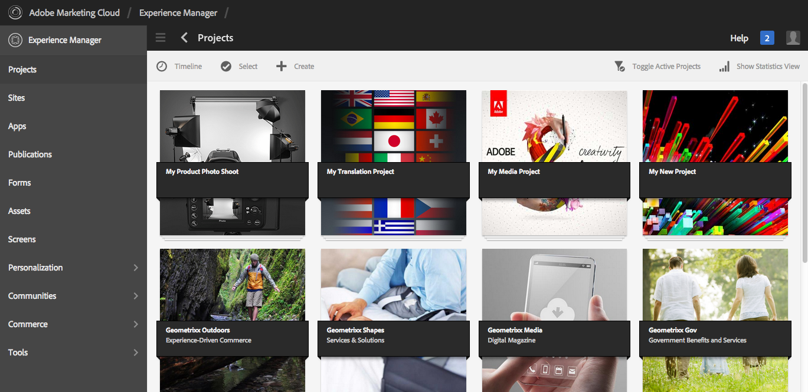
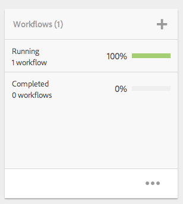

# Hantera projekt{#managing-projects}

Med projekt kan du ordna ditt projekt genom att gruppera resurser i en enhet.

I **projektkonsolen** får du tillgång till och kan vidta åtgärder för dina projekt:

I Projekt kan du skapa ett projekt, associera resurser med projektet och även ta bort en projekt- eller resurslänkar. Du kan öppna en platta om du vill visa dess innehåll och lägga till objekt i en platta. I det här avsnittet beskrivs dessa procedurer.

>[!NOTE]
>
>6.2 har gjort det möjligt att ordna projekt i mappar. På sidan Projekt kan du skapa ett projekt eller en mapp.
>
>Om en mapp skapas kommer användaren till den mappen där han/hon kan skapa en annan mapp eller ett projekt. Det hjälper dig att ordna projekt i mappar baserat på kategorier som produktkampanjer, plats, översättningsspråk och så vidare.
>
>Projekt och mappar kan visas i en listvy och även sökas igenom.

>[!CAUTION]
>
>För användare i projekt som vill se andra användare/grupper när de använder projektfunktioner som att skapa projekt, skapa uppgifter/arbetsflöden, se och hantera team, måste dessa användare ha läsåtkomst på **/hem/användare** och **/hem/grupper**. Det enklaste sättet att implementera detta är att ge **projekt-användare** -gruppen läsåtkomst till **/hem/användare** och **/hem/grupper**.

## Skapa ett projekt {#creating-a-project}

När du skapar ett projekt innehåller AEM följande mallar som du kan välja mellan:

* Enkelt projekt
* Medieprojekt
* Fotoprojekt för produkt
* Översättningsprojekt

Du skapar ett projekt på samma sätt, från projekt till projekt. Skillnaden mellan projekttyperna inkluderar tillgängliga [användarroller](/help/sites-authoring/projects.md) och [arbetsflöden](/help/sites-authoring/projects-with-workflows.md).  Så här skapar du ett nytt projekt:

1. I **Projekt**: tryck/klicka på **Skapa** för att öppna guiden **Skapa projekt** :
1. Välj en mall. Enkelt projekt, medieprojekt, [översättningsprojekt](/help/sites-administering/tc-manage.md)och fotoprodukter  finns tillgängliga i kartongen och klicka på **Nästa**.

   

1. Definiera **titel** och **beskrivning** och lägg till en **miniatyrbild** om det behövs. Du kan också lägga till eller ta bort användare och vilken grupp de tillhör. Klicka dessutom på **Avancerat** för att lägga till ett namn som används i URL:en.

   

1. Tryck/klicka på **Skapa**. Bekräftelsen frågar om du vill öppna det nya projektet eller gå tillbaka till konsolen.

### Associera resurser med ditt projekt {#associating-resources-with-your-project}

När du kan gruppera resurser i en enhet i projekt vill du koppla resurser till projektet. Resurserna kallas **plattor**. De typer av resurser du kan lägga till beskrivs i [Projektfiler](/help/sites-authoring/projects.md#project-tiles).

Så här associerar du resurser med ditt projekt:

1. Öppna projektet från **projektkonsolen** .
1. Tryck/klicka på **Lägg till platta** och välj den platta som du vill länka till projektet. Du kan markera flera typer av rutor.

   

   >[!NOTE]
   >
   >Projekttitlar som kan kopplas till ett projekt beskrivs i detalj i [Projekttitlar.](/help/sites-authoring/projects.md#project-tiles)

1. Tryck/klicka på **Skapa**. Resursen är länkad till ditt projekt och från och med nu kan du komma åt den från ditt projekt.

### Ta bort ett projekt eller en resurslänk {#deleting-a-project-or-resource-link}

Samma metod används för att ta bort ett projekt från konsolen eller en länkad resurs från ditt projekt:

1. Navigera till rätt plats:

   * Om du vill ta bort ett projekt går du till den översta nivån i **projektkonsolen** .
   * Om du vill ta bort en resurslänk i ett projekt öppnar du projektet i **projektkonsolen** .

1. Ange markeringsläge genom att klicka på **Välj** och välja projekt- eller resurslänken.
1. Tryck/klicka på **Ta bort**.

1. Du måste bekräfta borttagningen i en dialogruta. Om den bekräftas tas projekt- eller resurslänken bort. Tryck/klicka på **Avmarkera** för att avsluta markeringsläget.

>[!NOTE]
>
>När du skapar projektet och lägger till användare till de olika rollerna skapas grupper som är kopplade till projektet automatiskt för att hantera associerade behörigheter. Ett projekt med namnet Myproject skulle till exempel ha tre grupper, **Myproject Owners**, **Myproject Editors**, **Myproject Observers**. Om projektet däremot tas bort tas de grupperna inte bort automatiskt. En administratör måste ta bort grupperna manuellt i **Verktyg** > **Dokumentskydd** > **Grupper**.

### Lägga till objekt i en platta {#adding-items-to-a-tile}

I vissa rutor kanske du vill lägga till mer än ett objekt. Du kan till exempel ha flera arbetsflöden som körs samtidigt eller fler än en upplevelse.

Så här lägger du till objekt i en platta:

1. Gå till projektet i **Projekt** och klicka på ikonen Lägg till + på den ruta där du vill lägga till ett objekt.

   

1. Lägg till ett objekt i rutan på samma sätt som när du skapar en ny platta. Projektpaneler beskrivs [här](/help/sites-authoring/projects.md#project-tiles). I det här exemplet har ett annat arbetsflöde lagts till.

   

### Öppna en platta {#opening-a-tile}

Du kanske vill se vilka objekt som ingår i en aktuell platta eller ändra eller ta bort objekt i plattan.

Så här öppnar du en platta så att du kan visa eller ändra objekt:

1. Tryck/klicka på ellipserna (..) i projektkonsolen

   

1. AEM listar objekten i den rutan. Du kan gå in i markeringsläge för att ändra eller ta bort objekten.

   

## Visa projektstatistik {#viewing-project-statistics}

Om du vill visa projektstatistik går du till **projektkonsolen** och klickar på **Visa statistikvy**. Slutförandenivån för varje projekt visas. Klicka på **Visa statistikvy** igen för att gå till **projektkonsolen** .

### Visa en projekttidslinje {#viewing-a-project-timeline}

Projektets tidslinje innehåller information om när resurser i projektet senast användes. Om du vill visa projekttidslinjen klickar/trycker du på **tidslinjen**, anger ett markeringsläge och väljer projektet. Resurser visas i den vänstra rutan. Klicka/tryck på **Tidslinjen** för att gå tillbaka till **projektkonsolen** .

### Visa aktiva/inaktiva projekt {#viewing-active-inactive-projects}

Om du vill växla mellan dina aktiva och inaktiva projekt klickar du på **Växla aktiva projekt** i konsolen **Projekt**. Om ikonen har en bockmarkering visas de aktiva projekten.

Om ikonen har ett x bredvid visas de inaktiva projekten.

## Göra projekt inaktiva eller aktiva {#making-projects-inactive-or-active}

Du kanske vill göra ett projekt inaktivt om du har slutfört det men ändå vill behålla informationen om projektet.

Så här gör du ett projekt inaktivt (eller aktivt):

1. Öppna projektet i **projektkonsolen** och hitta sedan rutan **Projektinformation** .

   >[!NOTE]
   Du kan behöva lägga till den här panelen om den inte redan finns i ditt projekt. Se [Lägga till rutor](#adding-items-to-a-tile).

1. Tryck/klicka på **Redigera**.
1. Ändra väljaren från **Aktiv** till **Inaktiv** (eller tvärtom).

   

1. Tryck/klicka på **Klar** för att spara ändringarna.

