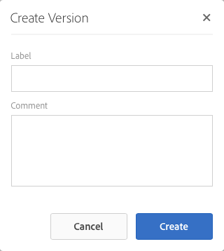
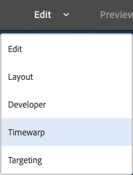

# Arbeta med sidversioner{#working-with-page-versions}

Versionshantering skapar en ögonblicksbild av en sida vid en viss tidpunkt. Med versionshantering kan du utföra följande åtgärder:

* Skapa en version av en sida.
* Återställ en sida till en tidigare version för att ångra en ändring som du har gjort på en sida, till exempel.
* Jämför den aktuella versionen av en sida med en tidigare version med skillnader i markerad text och bild.

## Skapa en ny version {#creating-a-new-version}

Du kan skapa en version av resursen från:

* tidslinjen i [rälen](#creating-a-new-version-timeline)
* alternativet [Skapa](#creating-a-new-version-create-with-a-selected-resource) (när en resurs har valts)

### Skapa en ny version - Tidslinje {#creating-a-new-version-timeline}

1. Navigera till sidan som du vill skapa en version för.
1. Markera sidan i [markeringsläge](/help/sites-authoring/basic-handling.md#viewing-and-selecting-resources).
1. Öppna kolumnen **Tidslinje** .
1. Klicka/tryck på pilen vid kommentarfältet för att visa alternativen:

   

1. Välj **Spara som version**.
1. Ange en **etikett** och **kommentar** om det behövs.

   

1. Bekräfta den nya versionen med **Skapa**.

   Informationen i tidslinjen uppdateras för att ange den nya versionen.

### Skapa en ny version - Skapa med en markerad resurs {#creating-a-new-version-create-with-a-selected-resource}

1. Navigera till sidan som du vill skapa en version för.
1. Markera sidan i [markeringsläge](/help/sites-authoring/basic-handling.md#viewing-and-selecting-resources).
1. Välj alternativet **Skapa** i verktygsfältet.
1. Dialogrutan öppnas. Du kan ange en **etikett** och en **kommentar** om det behövs:

   

1. Bekräfta den nya versionen med **Skapa**.

   Tidslinjen öppnas och informationen uppdateras för att ange den nya versionen.

## Återställa till en sidversion {#reverting-to-a-page-version}

När en version har skapats kan du vid behov återgå till den versionen.

>[!NOTE]
>
>När du återställer en sida blir den skapade versionen en del av en ny gren.
>
>Så här illustrerar du:

>1. Skapa versioner av valfri sida.
>1. De inledande etiketterna och versionsnodnamnen är 1.0, 1.1, 1.2 och så vidare.
1. Återställa den första versionen. dvs. 1.0.
1. Skapa nya versioner igen.
1. De genererade etiketterna och nodnamnen blir nu 1.0.0, 1.0.1, 1.0.2 osv.

Så här återgår du till en tidigare version:

1. Navigera till sidan som du vill återställa till en tidigare version.
1. Markera sidan i [markeringsläge](/help/sites-authoring/basic-handling.md#viewing-and-selecting-resources).
1. Öppna kolumnen **Tidslinje** och välj antingen **Visa alla** eller **Versioner**. Sidversionerna för den valda sidan visas.
1. Välj den version som du vill återställa till. Möjliga alternativ visas:

   

1. Välj **Återställ till den här versionen**. Den valda versionen återställs och informationen på tidslinjen uppdateras.

## Förhandsgranska en version {#previewing-a-version}

Du kan förhandsgranska en viss version:

1. Navigera till den sida som du vill jämföra.
1. Markera sidan i [markeringsläge](/help/sites-authoring/basic-handling.md#viewing-and-selecting-resources).
1. Öppna kolumnen **Tidslinje** och välj antingen **Visa alla** eller **Versioner**.
1. Sidversionerna visas. Markera den version som du vill förhandsgranska:

   

1. Välj **Förhandsgranska**. Sidan visas på en ny flik.

   >[!CAUTION]
   Om en sida har flyttats kan du inte längre förhandsgranska versioner som gjorts före flyttningen.
   * Om du får problem med en förhandsgranskning kan du kontrollera om sidan har flyttats i [tidslinjen](/help/sites-authoring/basic-handling.md#timeline) .

## Jämföra en version med den aktuella sidan {#comparing-a-version-with-current-page}

Så här jämför du en tidigare version med den aktuella sidan:

1. Navigera till den sida som du vill jämföra.
1. Markera sidan i [markeringsläge](/help/sites-authoring/basic-handling.md#viewing-and-selecting-resources).
1. Öppna kolumnen **Tidslinje** och välj antingen **Visa alla** eller **Versioner**.
1. Sidversionerna visas. Välj den version du vill jämföra:

   

1. Välj **Jämför med aktuell**. Skillnaden mellan [sidorna](/help/sites-authoring/page-diff.md) öppnas och visas.

## Timewarp {#timewarp}

Timewarp är en funktion som är utformad för att simulera en sidas *publicerade* läge vid en viss tidpunkt.

Eftersom framtagning av innehåll är en pågående och samarbetsorienterad process är syftet med Timewarp att tillåta författare att spåra den publicerade webbplatsen över tid för att förstå hur innehållet har ändrats. Den här funktionen använder sidversionerna för att avgöra publiceringsmiljöns tillstånd.

Så här gör du:

* Systemet söker efter den sidversion som var aktiv vid den valda tidpunkten.
* Det innebär att den visade versionen skapades/aktiverades *före* den tidpunkt som valdes i Timewarp.
* När du navigerar till en sida som har tagits bort återges den också, så länge som de gamla versionerna av sidan fortfarande är tillgängliga i databasen.
* Om ingen publicerad version hittas återgår Timewarp till sidans aktuella status i redigeringsmiljön (detta för att förhindra ett fel/404-sida, vilket skulle förhindra bläddring).

### Använda Timewarp {#using-timewarp}

Timewarp är ett [läge](/help/sites-authoring/author-environment-tools.md#page-modes) för sidredigeraren. Du startar det genom att helt enkelt växla det på samma sätt som andra lägen.

1. Starta redigeraren för sidan där du vill starta Timewarp och välj sedan **Timewarp** i lägesvalet.

   

1. Ange ett måldatum och en måltid i dialogrutan och klicka eller tryck på **Ange datum**. Om du inte väljer någon tid används den aktuella tiden som standard.

   

1. Sidan visas baserat på det angivna datumet. Timewarp-läget indikeras via det blå statusfältet högst upp i fönstret. Använd länkarna i statusfältet för att välja ett nytt måldatum eller avsluta Timewarp-läget.

   

### Begränsningar för tidsförvrängning {#timewarp-limitations}

Med Timewarp kan du göra ett bra försök att återskapa en sida vid en viss tidpunkt. På grund av komplexiteten i den kontinuerliga redigeringen av innehåll i AEM är detta dock inte alltid möjligt. Dessa begränsningar bör beaktas när du använder Timewarp.

* **Timewarp fungerar baserat på publicerade sidor** - Timewarp fungerar bara helt om du tidigare har publicerat sidan. I annat fall visas den aktuella sidan i författarmiljön.
* **Vid tidsförvrängning används sidversioner** - Om du navigerar till en sida som har tagits bort/tagits bort från databasen kommer den att återges korrekt om gamla versioner av sidan fortfarande är tillgängliga i databasen.
* **Borttagna versioner påverkar Timewarp** - Om versioner tas bort från databasen kan inte Timewarp visa rätt vy.

* **Timewarp är skrivskyddat** - du kan inte redigera den gamla versionen av sidan. Det är bara tillgängligt för visning. Om du vill återställa den äldre versionen måste du göra det manuellt med [återställning](#reverting-to-a-page-version).

* **Timewarp baseras bara på sidinnehåll** - Om element (som kod, css, resurser/bilder osv.) för återgivning av webbplatsen har ändrats skiljer sig vyn från den ursprungliga vyn, eftersom objekten inte har versionshanterats i databasen.

>[!CAUTION]
Timewarp är ett verktyg som hjälper författare att förstå och skapa sitt innehåll. Den är inte avsedd som en revisionslogg eller för juridiska ändamål.
