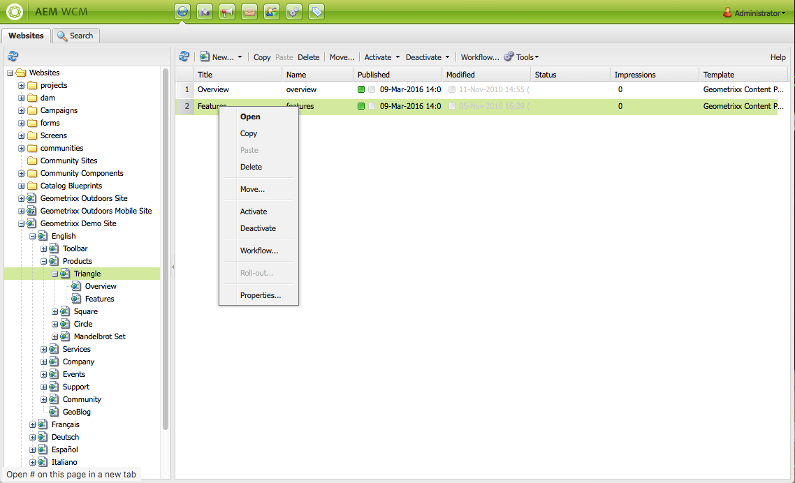

# Grundläggande hantering{#basic-handling}

>[!NOTE]
>
>* Den här sidan är utformad för att ge en översikt över grundläggande hantering när du använder AEM-redigeringsmiljön. Den använder **platskonsolen** som grund.
   >
   >
* Vissa funktioner är inte tillgängliga i alla konsoler och/eller så är ytterligare funktioner tillgängliga i vissa konsoler. Specifik information om de enskilda konsolerna och deras tillhörande funktioner beskrivs mer ingående på andra sidor.
>* Kortkommandon är tillgängliga i hela AEM. Särskilt när du [använder konsoler](/help/sites-classic-ui-authoring/author-env-keyboard-shortcuts.md) och [redigerar sidor](/help/sites-classic-ui-authoring/classic-page-author-keyboard-shortcuts.md).
>

## Välkomstskärmen {#the-welcome-screen}

Det klassiska användargränssnittet innehåller ett urval konsoler med välkända metoder för att navigera och initiera åtgärder, inklusive klickning, dubbelklickning och [snabbmenyer](#context-menus).

När du loggar in visas välkomstskärmen med en lista över länkar till konsoler och tjänster:

## Konsoler {#consoles}

Huvudkonsolerna är:

<table>
 <tbody>
  <tr>
   <td><strong>Konsol</strong></td>
   <td><strong>Syfte</strong></td>
  </tr>
  <tr>
   <td><strong>Välkommen</strong></td>
   <td>Ger en översikt och direkt åtkomst (via länkar) till huvudfunktionerna i AEM.</td>
  </tr>
  <tr>
   <td><strong>Digital Assets</strong>  </td>
   <td>Med dessa konsoler kan du importera och <a href="/help/sites-classic-ui-authoring/classicui-assets.md">hantera digitala resurser</a> som bilder, videor, dokument och ljudfiler. Dessa resurser kan sedan användas av alla webbplatser som körs på samma AEM-instans. </td>
  </tr>
  <tr>
   <td><strong>Startar</strong></td>
   <td>Detta hjälper dig att hantera dina <a href="/help/sites-classic-ui-authoring/classic-launches.md">starter</a>; Med dessa kan du utveckla innehåll för en framtida release av en eller flera aktiverade webbsidor.  <i>Obs! I det beröringskänsliga användargränssnittet finns mycket av samma funktioner i webbplatskonsolen tillsammans med referenslisten.</i> <i>Om det behövs kan konsolen nås från verktygskonsolen. välj Åtgärder och startar sedan.</i></td>
  </tr>
  <tr>
   <td><strong>Inkorg </strong></td>
   <td>I många fall är ett antal personer inblandade i ett arbetsflödes underuppgifter och varje person måste slutföra sitt steg innan han eller hon kan lämna jobbet till nästa person. I Inkorgen kan du se meddelanden som rör sådana uppgifter. Se <a href="/help/sites-administering/workflows.md">Arbeta med arbetsflöden</a>.   </td>
  </tr>
  <tr>
   <td><strong>Taggning</strong></td>
   <td>Med taggningskonsolerna kan du administrera taggar. Taggar är korta namn eller fraser som du kan använda för att klassificera och kommentera innehållsdelar, vilket gör det enklare att hitta och ordna dem. Mer information finns i <a href="/help/sites-classic-ui-authoring/classic-feature-tags.md">Använda och hantera taggar</a>.</td>
  </tr>
  <tr>
   <td><strong>Verktyg</strong></td>
   <td>Med <a href="/help/sites-administering/tools-consoles.md">verktygskonsolerna</a> får du tillgång till ett antal specialiserade verktyg och konsoler som du kan använda för att administrera webbplatser, digitala resurser och andra aspekter av innehållsdatabasen.</td>
  </tr>
  <tr>
   <td><strong>Användare</strong></td>
   <td>Med dessa konsoler kan du hantera åtkomsträttigheter för användare och grupper. Mer information finns i <a href="/help/sites-administering/security.md">Användaradministration och -säkerhet</a>.  </td>
  </tr>
  <tr>
   <td><strong>Webbplatser</strong></td>
   <td>Med konsolerna Webbplatser/Webbplatser kan du <a href="/help/sites-classic-ui-authoring/classic-page-author.md">skapa, visa och hantera webbplatser</a> som körs på din AEM-instans. Med dessa konsoler kan du skapa, kopiera, flytta och ta bort webbsidor, starta arbetsflöden och aktivera (publicera) sidor. Du kan också öppna en sida för redigering.  </td>
  </tr>
  <tr>
   <td><strong>Arbetsflöden</strong></td>
   <td>Ett arbetsflöde är en definierad serie steg som beskriver processen att slutföra en uppgift. I många fall är ett antal personer inblandade i en uppgift och varje person måste slutföra sitt steg innan han eller hon kan lämna jobbet till nästa person. Med arbetsflödeskonsolen kan du skapa arbetsflödesmodeller och hantera arbetsflödesinstanser som körs. Se <a href="/help/sites-administering/workflows.md">Arbeta med arbetsflöden</a>.  </td>
  </tr>
 </tbody>
</table>

Konsolen **Webbplatser** innehåller två rutor där du kan navigera och hantera dina sidor:

* Vänster ruta

   Här visas trädstrukturen för dina webbplatser och sidorna på dessa webbplatser.

   Här visas även information om andra aspekter av AEM, inklusive projekt, ritningar och resurser.

* Höger ruta

   Här visas sidorna (på den plats som är markerad i den vänstra rutan) och de kan användas för att utföra åtgärder.

Därifrån kan du [hantera sidorna](/help/sites-authoring/managing-pages.md) med hjälp av verktygsfältet, en snabbmeny eller genom att öppna en sida för ytterligare åtgärder.

>[!NOTE]
>
>Den grundläggande hanteringen är densamma i alla konsoler. Det här avsnittet fokuserar på **webbplatskonsolen** eftersom det är den primära konsolen som används vid utvecklingen.

## Få hjälp {#accessing-help}

På olika konsoler (t.ex. webbplatser) finns det även en **hjälpknapp** , som öppnar antingen paketresurs eller dokumentationswebbplatsen.

När du redigerar en sida har [sidosparken även en knapp för att komma åt hjälpen](/help/sites-classic-ui-authoring/classic-page-author-env-tools.md#accessing-help).

## Navigera med webbplatskonsolen {#navigating-with-the-websites-console}

I **webbplatskonsolen** visas sidorna i en trädstruktur (vänster ruta). För att underlätta navigeringen kan delar av trädstrukturen expanderas (+) eller komprimeras (-) efter behov:

* Ett enda klick på sidnamnet (i den vänstra rutan) gör att:

   * Lista de underordnade sidorna i den högra rutan
   * Utvidga även strukturen i den vänstra rutan.

      Av prestandaskäl är den här åtgärden beroende av antalet underordnade noder. Med en standardinstallation fungerar den här utbyggnadsmetoden när det finns `30` eller färre underordnade noder.

* Om du dubbelklickar på sidnamnet (den vänstra rutan) expanderas också trädet, även om den här effekten inte är så självklar när sidan öppnas samtidigt.

>[!NOTE]
>
>Det här standardvärdet ( `30`) kan ändras per konsol i dina programspecifika konfigurationer av webbplatsadmin-widgeten:
>
>På noden siteAdmin:
>
>Ange egenskapens värde:
>`treeAutoExpandMax`
>på:
>`/apps/wcm/core/content/siteadmin`
>
>Eller globalt i temat:
>Ange värdet för:
>`TREE_AUTOEXPAND_MAX`
>in:
>`/apps/cq/ui/widgets/themes/default/widgets/wcm/SiteAdmin.js`
>
>Mer information finns i [SiteAdmin i CQ Widget API](https://helpx.adobe.com/experience-manager/6-5/sites/developing/using/reference-materials/widgets-api/index.html?class=CQ.wcm.SiteAdmin) .

## Sidinformation på webbplatskonsolen {#page-information-on-the-websites-console}

Den högra rutan i **webbplatskonsolen** innehåller en listvy med information om sidor:

Följande finns tillgängliga: en delmängd av dessa fält visas som standard:

<table>
 <tbody>
  <tr>
   <td><strong>Kolumn</strong></td>
   <td><strong>Beskrivning</strong></td>
  </tr>
  <tr>
   <td>Miniatyrbild</td>
   <td>Visar en miniatyrbild för sidan.</td>
  </tr>
  <tr>
   <td>Titel</td>
   <td>Titeln som visas på sidan</td>
  </tr>
  <tr>
   <td>Namn</td>
   <td>Namnet AEM hänvisar till sidan</td>
  </tr>
  <tr>
   <td>Publicerad</td>
   <td>Anger om sidan har publicerats och anger publiceringsdatum och -tid.</td>
  </tr>
  <tr>
   <td>Ändrad</td>
   <td>Anger om sidan har ändrats och anger ändringsdatum och -tid. Om du vill spara ändringarna måste du aktivera sidan.</td>
  </tr>
  <tr>
   <td>Scene7 Publish</td>
   <td>Anger om sidan har publicerats till Scene7.  </td>
  </tr>
  <tr>
   <td>Status</td>
   <td>Anger sidans aktuella status, t.ex. om sidan är en del av ett arbetsflöde eller en livekopia, eller om en sida är låst.</td>
  </tr>
  <tr>
   <td>Impressions</td>
   <td>Visar aktiviteten på en sida i antal träffar.</td>
  </tr>
  <tr>
   <td>Mall</td>
   <td>Anger mallen som en sida baseras på.</td>
  </tr>
  <tr>
   <td>I arbetsflöde</td>
   <td>Anger när sidan är i ett arbetsflöde.</td>
  </tr>
  <tr>
   <td>Låst av</td>
   <td>Visar när en sida har låsts och användarkontot som har låst den.</td>
  </tr>
  <tr>
   <td>Live Copy</td>
   <td>Anger när sidan är en del av en live-kopia.</td>
  </tr>
 </tbody>
</table>

>[!NOTE]
>
>Om du vill markera kolumnerna som visas håller du musen över en kolumnrubrik. En nedrullningsbar meny visas där du kan använda alternativet **Kolumner** .

Färgerna bredvid sidorna i kolumnerna **Publicerad** och **Ändrad** anger publiceringsstatus:

| **Kolumn** | **Färg** | **Beskrivning** |
|---|---|---|
| Publicerad | Grön | Publiceringen lyckades. Innehåll publiceras. |
| Publicerad | Gul | Publicering väntar. Systemet har ännu inte bekräftat publiceringen. |
| Publicerad | Röd | Publiceringen misslyckades. Det finns ingen anslutning till publiceringsinstansen. Det kan också betyda att innehållet inaktiverades. |
| Publicerad | *blank* | Den här sidan har aldrig publicerats. |
| Ändrad | Blå | Sidan har ändrats sedan den senaste publikationen. |
| Ändrad | *blank* | Den här sidan har aldrig ändrats eller så har den inte ändrats sedan den senaste publikationen. |

## Snabbmenyer {#context-menus}

Det klassiska användargränssnittet använder välkända metoder för att navigera och initiera åtgärder, inklusive att klicka och dubbelklicka. Beroende på den aktuella situationen finns det även en rad snabbmenyer (som vanligtvis öppnas med höger musknapp):

