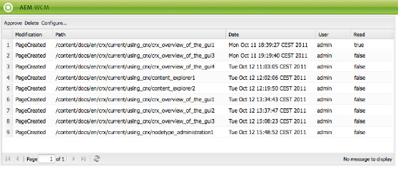

# Din inkorg{#your-inbox}

Du kan få meddelanden från olika AEM, till exempel meddelanden om arbetsobjekt eller uppgifter som representerar åtgärder som du måste utföra på sidinnehållet.

Du får dessa meddelanden i två inkorgar, som avgränsas med typen av meddelanden:

* En inkorg där du kan se meddelanden som du får som ett resultat av prenumerationer beskrivs i följande avsnitt.
* En särskild inkorg för arbetsflödesobjekt beskrivs i dokumentet [Delta i arbetsflöden](/help/sites-classic-ui-authoring/classic-workflows-participating.md).

## Visa meddelanden {#viewing-your-notifications}

Så här visar du dina meddelanden:

1. Öppna meddelandeinkorgen: i konsolen **Webbplatser** klickar du på användarknappen i det övre högra hörnet och väljer **Meddelandeinkorgen**.

   

   >[!NOTE]
   >
   >Du kan även komma åt konsolen direkt i webbläsaren, till exempel:
   >
   >
   >` https://<host>:<port>/libs/wcm/core/content/inbox.html`

1. Dina meddelanden visas. Du kan vidta åtgärder efter behov:

   * [Prenumerera på meddelanden](#subscribing-to-notifications)
   * [Bearbetar dina meddelanden](#processing-your-notifications)

   

## Prenumerera på meddelanden {#subscribing-to-notifications}

Så här prenumererar du på meddelanden:

1. Öppna meddelandeinkorgen: i konsolen **Webbplatser** klickar du på användarknappen i det övre högra hörnet och väljer **Meddelandeinkorgen**.

   

   >[!NOTE]
   >
   >Du kan även komma åt konsolen direkt i webbläsaren, till exempel:
   >
   >
   >`https://<host>:<port>/libs/wcm/core/content/inbox.html`

1. Klicka på **Konfigurera..** i det övre vänstra hörnet för att öppna konfigurationsdialogrutan.

   

1. Välj meddelandekanal:

   * **Inkorg**: meddelanden visas i AEM Inkorg.
   * **E-post**: aviseringar skickas via e-post till den e-postadress som definierats i din användarprofil.

   >[!NOTE]
   >
   >Ett fåtal inställningar måste konfigureras för att kunna meddelas via e-post. Det går också att anpassa e-postmallen eller lägga till en e-postmall för ett nytt språk. Se [Konfigurera e-postmeddelanden](/help/sites-administering/notification.md#configuringemailnotification) för att konfigurera e-postmeddelanden i AEM.

1. Välj de sidåtgärder som ska meddelas:

   * Aktiverad: när en sida har aktiverats.
   * Inaktiverad: när en sida har inaktiverats.
   * Borttagen (syndikering): När en sida har tagits bort-replikerats, d.v.s. när en borttagningsåtgärd som har utförts på en sida replikeras.
När en sida tas bort eller flyttas replikeras en borttagningsåtgärd automatiskt: sidan tas bort från källinstansen där borttagningsåtgärden utfördes och på målinstansen som definierats av replikeringsagenterna.

   * Ändrad: när en sida har ändrats.
   * Skapad: när en sida har skapats.
   * Borttagen: När en sida har tagits bort via sidborttagningsåtgärden.
   * Utrullad: när en sida har rullats ut.

1. Definiera sökvägarna för sidorna som du ska meddelas om:

   * Klicka på **Lägg till** om du vill lägga till en ny rad i tabellen.
   * Klicka på tabellcellen **Sökväg** och ange sökvägen, till exempel `/content/docs`.

   * Vill du få ett meddelande om alla sidor som tillhör underträdet anger du **Exakt?** till **Nej**.
Vill du bara få meddelanden om åtgärder på sidan som definieras av sökvägen, anger du **Exakt?** till **Ja**.

   * Om du vill tillåta regeln anger du **Regel** till **Tillåt**. Om värdet är **Neka** nekas regeln men den tas inte bort och kan tillåtas senare.

   Om du vill ta bort en definition markerar du raden genom att klicka på en tabellcell och klickar på **Ta bort**.

1. Klicka på **OK** för att spara konfigurationen.

## Bearbetar dina meddelanden {#processing-your-notifications}

Om du har valt att ta emot meddelanden i din AEM Inkorg fylls din inkorg i med meddelanden. Du kan [visa dina meddelanden](#viewing-your-notifications) och sedan välja de meddelanden som krävs för att:

* Acceptera det genom att klicka på **Godkänn**: värdet i kolumnen **Läs** är **true**.

* Ta bort den genom att klicka på **Ta bort**.

