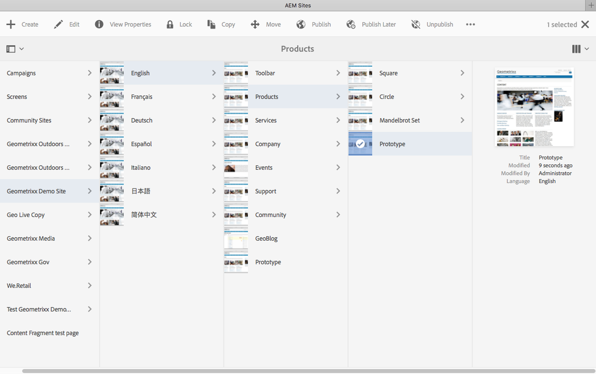

# Arbeta med författarmiljön{#working-with-the-author-environment}

>[!NOTE]
>
>Följande dokumentation fokuserar på det klassiska användargränssnittet. Mer information om redigering i det moderna, pekaktiverade användargränssnittet finns i [standarddokumentationen för redigering](/help/assets/assets.md).

I författarmiljön kan du utföra åtgärder som rör:

* [Redigering](/help/sites-authoring/author.md) (inklusive [sidredigering](/help/sites-authoring/qg-page-authoring.md) och [hantering av resurser](/help/assets/assets.md))

* [Administrera](/help/sites-administering/administer-best-practices.md) aktiviteter som du behöver när du genererar och underhåller innehåll på webbplatsen

Det finns två grafiska användargränssnitt som är tillgängliga via alla moderna webbläsare:

1. Klassiskt användargränssnitt

   * Det här gränssnittet har alltid varit tillgängligt på AEM i många år.
   * Den är främst grön.
   * Den har utformats för användning på stationära enheter.
   * Den underhålls inte längre.
   * Följande dokumentation fokuserar på det här klassiska användargränssnittet. Mer information om redigering i det moderna, pekbaserade användargränssnittet finns i [standarddokumentationen för redigering](/help/sites-authoring/author.md).

   

1. Pekaktiverat användargränssnitt

   * Det här är det moderna AEM.
   * Den är främst grå, med ett rent, platt gränssnitt.
   * Den är utformad för användning både på pekskärmar och på stationära enheter (optimerad för pekskärmar). Utseendet och känslan är densamma på alla enheter, men [när du visar och väljer dina resurser](/help/sites-authoring/basic-handling.md) skiljer sig åt något (tryck mot klick).
   * Se [standarddokumentationen för redigering](/help/sites-authoring/author.md) om du vill ha mer information om hur du skapar med det pekbaserade användargränssnittet. Följande dokumentation fokuserar på det klassiska användargränssnittet.

   * Skrivbord:

   

   * Tablet-enheter (eller stationära datorer med en bredd på mindre än 1 024 pixlar):

   
