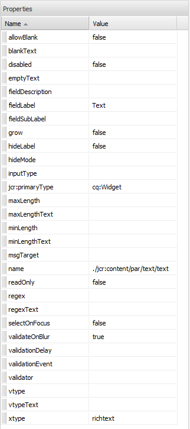

#  Ställning{#scaffolding}

Ibland kan du behöva skapa en stor uppsättning sidor som har samma struktur men olika innehåll. Med det vanliga AEM-gränssnittet måste du skapa varje sida, dra lämpliga komponenter till sidan och fylla i varje sida separat.

Med hjälp av ställningar kan du skapa ett formulär (en struktur) med fält som motsvarar den struktur du vill ha för sidorna och sedan använda det här formuläret för att enkelt skapa sidor som baseras på den strukturen.

>[!NOTE]
>
>Skällning (i det klassiska användargränssnittet) [respekterar MSM-arv](#scaffolding-with-msm-inheritance).

## Så fungerar Scaffolding {#how-scaffolding-works}

Scaffäler lagras i **verktygskonsolen** i webbplatsadministratören.

* Öppna **verktygskonsolen** och klicka på **Standardsidkodning**.
* Klicka på **geometrixx**.
* Under **geometrixx** hittar du en *struktursida* som kallas **News**. Dubbelklicka för att öppna den här sidan.

Stapeln består av ett formulär med ett fält för varje innehållspunkt som utgör den sida som ska skapas och fyra viktiga parametrar som du kommer åt via **Sidegenskaperna** på sidan.

Skolningssidans egenskaper är:

* **Titeltext**: Det här är namnet på själva byggnadssidan. I det här exemplet kallas det&quot;News&quot;.
* **Beskrivning**: Detta visas under rubriken på byggnadssidan.
* **Målmall**: Det här är mallen som används när den här strukturen skapar en ny sida. I det här exemplet är det en *mall för innehållssidan* Geometrixx.
* **Målsökväg**: Detta är sökvägen till den överordnade sidan under vilken det här skalet skapar nya sidor. I det här exemplet är sökvägen */content/geometrixx/en/news*.

Skaffets brödtext är formen. När en användare vill skapa en sida med hjälp av skalet fyller han i formuläret och klickar på *Skapa* längst ned. I **News** -exemplet ovan har formuläret följande fält:

* **Titel**: Det här är namnet på sidan som ska skapas. Det här fältet finns alltid på alla ställningar.
* **Text**: Det här fältet motsvarar en textkomponent på den slutliga sidan.
* **Bild**: Det här fältet motsvarar en bildkomponent på den slutliga sidan.
* **Bild/Avancerat**: **Titel**:Bildens titel.
* **Bild/Avancerat**: **Alt-text**: Alt-texten för bilden.
* **Bild/Avancerat**: **Beskrivning**: Beskrivning av bilden.
* **Bild/Avancerat**: **Storlek**: Bildens storlek.
* **Taggar/nyckelord**: Metadata som ska tilldelas den här sidan. Det här fältet finns alltid på alla ställningar.

### Skapa ett ställningar {#creating-a-scaffold}

Om du vill skapa ett nytt ställningar går du till **verktygskonsolen** , **Standardsidans** placering och skapar en ny sida. En malltyp för en sida är tillgänglig, *Stegningsmallen.*

Gå till den nya sidans **Sidegenskaper** och ange *Titeltext*, *Beskrivning*, *Målmall* och *Målsökväg* enligt beskrivningen ovan.

Därefter måste du definiera strukturen för sidan som det här skalet ska skapa. Det gör du genom att gå till **[designläge](/help/sites-authoring/page-authoring.md#sidekick)**på stödsidan. En länk visas där du kan redigera skalet i **dialogruteredigeraren**.

I dialogruteredigeraren anger du vilka egenskaper som ska skapas varje gång en ny sida skapas med det här skalet.

Dialogrutedefinitionen för ett ställningar fungerar på ungefär samma sätt som för en komponent (se [Komponenter](/help/sites-developing/components.md)). Det finns dock några viktiga skillnader:

* Komponentdialogrutans definitioner återges som vanliga dialogrutor (som i till exempel den mittersta rutan i dialogruteredigeraren) medan definitioner i dialogrutan ställningar, som visas som vanliga dialogrutor i dialogruteredigeraren, återges som ett ställningar på scensidan (som visas i **nyhetsskalet** ovan).
* Komponentdialogrutor innehåller endast fält för de värden som behövs för att definiera innehållet i en enskild specifik komponent. En strukturdialogruta måste innehålla fält för varje egenskap i varje stycke på sidan som ska skapas.
* När det gäller komponentdialogrutor är den komponent som används för att återge det angivna innehållet implicit och därför fylls styckets `sling:resourceType` -egenskap i automatiskt när stycket skapas. I ett schackmönster måste all information som definierar både innehållet och den tilldelade komponenten för ett visst stycke anges i själva dialogrutan. I schackold-dialogrutor måste den här informationen anges genom att använda *dolda* fält för att skicka informationen när sidan skapas.

Om du tittar på **News** scaffold-dialogen i dialogruteredigeraren kan du förklara hur det fungerar. Gå till designläge på scensidan och klicka på länken för dialogruteredigeraren.

Klicka nu på dialogrutan **Dialog > Tabb Panel > Text > Text**:

Egenskapslistan för det här fältet visas till höger i dialogruteredigeraren enligt följande:

Observera namnegenskapen för det här fältet. Det har värdet

`./jcr:content/par/text/text`

Det här är namnet på den egenskap som innehållet i det här fältet ska skrivas till när skalet används för att skapa en sida. Egenskapen anges som en relativ sökväg från noden som representerar sidan som ska skapas. Den anger egenskapstexten, under nodtexten, som är under nodparentesen, som i sin tur är underordnad noden jcr:content under sidnoden.

Detta definierar platsen för innehållslagringen för texten som ska infogas i det här fältet. Men vi måste också specificera ytterligare två egenskaper för detta innehåll:

* Det faktum att strängen som lagras här måste tolkas som *RTF*, och
* vilken komponent som ska användas för att återge innehållet till den resulterande sidan.

Observera att i en normal komponentdialogruta behöver du inte ange den här informationen eftersom den är implicit eftersom dialogrutan redan är bunden till en viss komponent.

Om du vill ange dessa två informationsdelar använder du dolda fält. Klicka på det första dolda fältet **Dialog > Tabb-panel > Text > Dold**, så här:

Egenskaperna för det här dolda fältet är följande:

Egenskapen name för det här dolda fältet är

`./jcr:content/par/text/textIsRich`

Det här är en boolesk egenskap som används för att tolka textsträngen som lagras i `./jcr:content/par/text/text`.

Eftersom vi vet att texten bör tolkas som en RTF-text anger vi egenskapen `value` för det här fältet som `true`.

>[!CAUTION]
>
>I dialogruteredigeraren kan användaren ändra värdena för *befintliga* egenskaper i dialogdefinitionen. Om du vill lägga till en ny egenskap måste användaren använda [CRXDE Lite](/help/sites-developing/developing-with-crxde-lite.md). När ett nytt dolt fält läggs till i en dialogrutedefinition med dialogruteredigeraren har det till exempel ingen *value* -egenskap (dvs. en egenskap med namnet &quot;value&quot;). Om det dolda fältet kräver att en *standardvärdeegenskap* ställs in, måste den här egenskapen läggas till manuellt med något av CRX-verktygen. Värdet kan inte läggas till med själva dialogruteredigeraren. Men när egenskapen finns kan dess värde redigeras med dialogruteredigeraren.

Det andra dolda fältet visas om du klickar på det så här:

Egenskaperna för det här dolda fältet är följande:

Egenskapen name för det här dolda fältet är

`./jcr:content/par/text/sling:resourceType`

och det fasta värde som anges för den här egenskapen är

`foundation/components/textimage`

Detta anger att komponenten som ska användas för att återge textinnehållet i det här stycket är *textbildskomponenten* . Med det booleska värde som anges i det andra dolda fältet kan komponenten återge den faktiska textsträng som lagras på `isRichText` `./jcr:content/par/text/text` det sätt som du vill.

### Skällning med MSM-arv {#scaffolding-with-msm-inheritance}

I det klassiska användargränssnittet är ställningar helt integrerade med MSM-arv (om tillämpligt).

När du öppnar en sida i **läget Scaffolding** (med ikonen längst ned i sidosparken) visas alla komponenter som är föremål för arv av:

* en låssymbol (för de flesta komponenter), t.ex. Text och rubrik)
* en mask med texten **Klicka för att avbryta arv** (för bildkomponenter)

Dessa visar att komponenten inte kan redigeras - förrän arvet avbryts.

>[!NOTE]
>
>Detta kan jämföras med [ärvda komponenter när du redigerar sidinnehåll](/help/sites-authoring/editing-content.md#inheritedcomponentsclassicui).

Om du klickar på låssymbolen eller bildikonen kan du bryta arvet:

* symbolen ändras till ett öppet hänglås.
* när innehållet är olåst kan du redigera det.

När du har låst upp kan du återställa arvet genom att klicka på den olåsta hänglåssymbolen. Då försvinner alla ändringar du har gjort.

>[!NOTE]
>
>Om arvet avbryts på sidnivå (från fliken Livecopy i Sidegenskaper) kan alla komponenter redigeras i **läget Scaffolding** (de visas i olåst läge).
