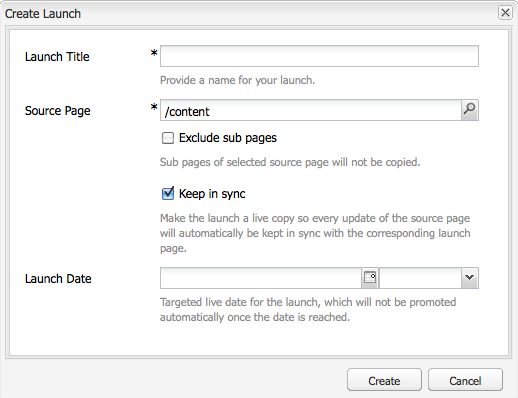

# Skapa startprogram{#creating-launches}

Skapa en startsida för att möjliggöra uppdatering av en ny version av befintliga webbsidor för framtida aktivering. När du skapar en Launch anger du en titel och källsidan:

* Titeln visas i **Sidekick**, där författarna kan arbeta med dem.
* Källsidans underordnade sidor inkluderas som standard i starten. Du kan bara använda källsidan om du vill.
* Som standard [Live Copy](/help/sites-administering/msm.md) uppdaterar startsidorna automatiskt när källsidorna ändras. Du kan ange att en statisk kopia ska skapas för att förhindra automatiska ändringar.

Du kan också ange **startdatum** (och starttid) för att definiera när startsidorna ska befordras och aktiveras. **Startdatumet** fungerar dock endast i kombination med flaggan **Produktionsklar** (se [Redigera en startkonfiguration](/help/sites-classic-ui-authoring/classic-launches-editing.md#editing-a-launch-configuration)). För att åtgärderna ska köras automatiskt måste båda anges.

## Skapa en Launch {#creating-a-launch}

Följande procedur skapar en start.

1. Öppna administrationssidan för webbplatsen ([http://localhost:4502/siteadmin](http://localhost:4502/siteadmin)).
1. Klicka **Nytt...** sedan **Ny start...**.
1. I **Skapa start** anger du värden för följande egenskaper:

   * **Starta titel**: Namnet på Launch. Namnet ska vara meningsfullt för författare.
   * **Källsida**: Sökvägen till sidan som starten ska skapas för. Som standard inkluderas alla underordnade sidor.
   * **Uteslut undersidor**: Välj det här alternativet om du bara vill skapa startsidan för källsidan och inte för de underordnade sidorna. Som standard är det här alternativet inte markerat.
   * **Synkronisera**: Välj det här alternativet om du automatiskt vill uppdatera innehållet på startsidor när källsidorna ändras. Detta uppnås genom att man gör lanseringen till [live copy](/help/sites-administering/msm.md).
   * **Startdatum**: Det datum och den tidpunkt då startkopian ska aktiveras (beroende på **Produktionsklar** flagga, se [Startar - ordningen för händelser](/help/sites-authoring/launches.md#launches-the-order-of-events)).

   

1. Klicka **Skapa**.

## Ta bort en start {#deleting-a-launch}

Du kan även ta bort en programstart.

1. I [startar konsolen](/help/sites-classic-ui-authoring/classic-launches.md)väljer du önskad start.
1. Klicka **Ta bort** - bekräftelse krävs:

   

   >[!CAUTION]
   >
   >När du tar bort kapslade starter bör du ta bort de lägre nivåerna först.
