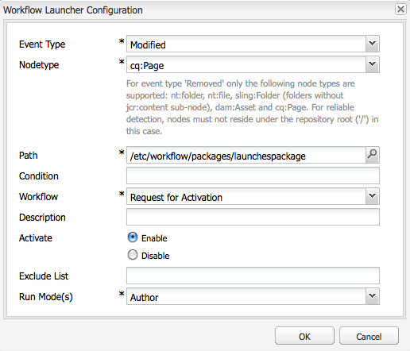

# Befordra lanseringar{#promoting-launches}

Du måste befordra startsidor för att kunna flytta tillbaka innehållet till källan (produktionen) innan du publicerar. När en startsida befordras ersätts motsvarande sida på källsidorna med innehållet på den befordrade sidan. Följande alternativ är tillgängliga när du befordrar en startsida:

* Anger om bara den aktuella sidan eller hela programstarten ska befordras.
* Anger om underordnade sidor för den aktuella sidan ska befordras.
* Anger om en fullständig start ska erbjudas eller endast sidor som har ändrats.

## Marknadsför startsidor {#promoting-launch-pages}

Om du vill befordra sidor utför du följande steg när du redigerar startsidan som du vill befordra:

1. På fliken **Sida** i Sidspark klickar du på **Promote Launch**.
1. Ange vilka sidor som ska befordras:

   * (Standard) Om du bara vill befordra den aktuella sidan väljer du **Befordra sidändringar till produktionsversion**.
   * Om du även vill befordra den aktuella sidans underordnade sidor markerar du **Inkludera underordnade sidor**.
   * Om du vill befordra alla sidor i starten väljer du **Befordra fullständig start till produktionsversion**.

1. Om du vill lägga till produktionssidorna i ett arbetsflödespaket väljer du **Lägg till i arbetsflödespaket** och sedan arbetsflödespaketet.
1. Klicka på **Befordra**.

## Bearbeta befordrade sidor med AEM Workflow {#processing-promoted-pages-using-aem-workflow}

Använd arbetsflödesmodeller för att utföra massbearbetning av befordrade startsidor:

1. Skapa ett arbetsflödespaket.
1. När författare befordrar startsidor lagrar de dem i arbetsflödespaketet.
1. Starta en arbetsflödesmodell med paketet som nyttolast.

Om du vill starta ett arbetsflöde automatiskt när sidor befordras [konfigurerar du en startfunktion](/help/sites-administering/workflows-starting.md#workflows-launchers) för arbetsflödet för paketnoden.

Du kan t.ex. automatiskt generera begäranden om sidaktivering när författare befordrar startsidor. Konfigurera en startfunktion för arbetsflödet för aktivering av begäran när paketnoden ändras.

