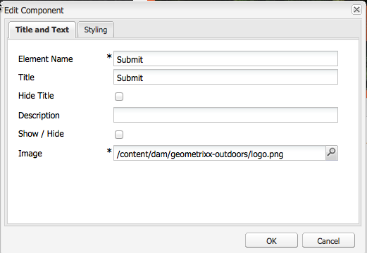

# Skapa hjälpmedelsanpassat innehåll (WCAG 2.0-överensstämmelse){#creating-accessible-content-wcag-conformance}

>[!CAUTION]
>
>Eftersom det klassiska användargränssnittet har tagits bort i AEM 6.4 har innehållet på den här sidan inte uppdaterats för WCAG 2.1.
>
>På följande sidor finns mer information om AEM och WCAG 2.1:
>
>* [AEM och riktlinjerna för webbtillgänglighet](/help/managing/web-accessibility.md)
>* [En snabbguide till WCAG 2.1](/help/managing/qg-wcag.md)
>* [Skapa tillgängligt innehåll (WCAG 2.1-överensstämmelse)](/help/sites-authoring/creating-accessible-content.md)

WCAG 2.0 består av en uppsättning teknikoberoende riktlinjer och framgångskriterier som gör webbinnehåll tillgängligt för och användbart för personer med funktionshinder.

>[!NOTE]
>
>Se även:
>
>* [Snabbguide till WCAG 2.0](/help/managing/qg-wcag.md)
>* [Konfigurera RTF-redigeraren för att skapa tillgängligt innehåll](/help/sites-administering/rte-accessible-content.md)
>

Riktlinjerna är indelade i tre överensstämmelsenivåer: Nivå A (lägsta), Nivå AA och Nivå AAA (högsta). Nivåerna definieras kortfattat enligt följande:

* **Nivå A:** Webbplatsen har en grundläggande, lägsta tillgänglighetsnivå. För att den här nivån ska uppnås måste alla kriterier på nivå A uppfyllas.
* **Nivå AA:** Den idealiska tillgänglighetsnivån som du kan eftersträva, där din webbplats når en högre tillgänglighetsnivå, så att den är tillgänglig för de flesta användare i de flesta situationer som använder de flesta tekniker. För att den här nivån ska uppnås måste alla kriterier nivå A och nivå AA uppfyllas.
* **Nivå AAA:** Webbplatsen har hög tillgänglighet. För att den här nivån ska uppnås måste alla kriterier på nivå A, nivå AA och nivå AAA uppfyllas.

När du skapar din webbplats bör du bestämma den övergripande nivån som du vill att din plats ska anpassas efter.

I följande avsnitt visas [WCAG 2.0-riktlinjerna](https://www.w3.org/TR/WCAG20/#guidelines) med relaterade kriterier för att lyckas med överensstämmelsenivåerna Nivå A och Nivå AA [&#128279;](https://www.w3.org/TR/UNDERSTANDING-WCAG20/conformance.html).

>[!NOTE]
>
>Eftersom det inte är möjligt att uppfylla alla kriterier för AAA-framgångar på nivå för vissa typer av innehåll, rekommenderas inte att den här efterlevnadsnivån krävs som en allmän princip.

>[!NOTE]
>
>I det här dokumentet används följande:
>
>* korta namn för [WCAG 2.0-riktlinjerna](https://www.w3.org/TR/WCAG20/#guidelines).
>* numreringen som används i [WCAG 2.0-riktlinjerna](https://www.w3.org/TR/WCAG20/#guidelines) för att underlätta korsreferering med WCAG-webbplatsen.
>

## Princip 1: Förutsägbar {#principle-perceivable}

[Princip 1: Perfekt - Information och användargränssnittskomponenter måste vara presenterbara för användarna på ett sätt som de kan uppfatta.](https://www.w3.org/TR/WCAG20/#perceivable)

### Textalternativ (1.1) {#text-alternatives}

[Riktlinje 1.1 Textalternativ: Ange textalternativ för allt icke-textinnehåll så att det kan ändras till andra formulär som användare behöver, till exempel stor utskrift, blindskrift, tal, symboler eller enklare språk.](https://www.w3.org/TR/WCAG20/#text-equiv)

### Innehåll som inte är text (1.1.1) {#non-text-content}

* Kriteriet 1.1.1 lyckades
* Nivå A
* Innehåll som inte är text: Allt innehåll som inte är text och som visas för användaren har ett textalternativ som har samma syfte, förutom de situationer som anges nedan.

#### Syfte - Innehåll som inte är text (1.1.1) {#purpose-non-text-content}

Information på en webbsida kan finnas i många olika format som inte är text, till exempel bilder, videor, animeringar, diagram och diagram. Personer som är blinda eller har svårt nedsatt syn kan inte se icke-textbaserat innehåll, men de kan få åtkomst till textinnehåll genom att låta det läsas av skärmläsaren eller presenteras i taktisk form av en blindskriftsvisningsenhet. Genom att tillhandahålla textalternativ för innehåll i grafiskt format kan alltså de som inte ser att grafiskt innehåll har tillgång till en motsvarande version av den information som innehållet ger.

En annan fördel är att textalternativ gör det möjligt att indexera icke-textinnehåll med sökmotorteknik.

#### Så här möts innehåll som inte är text (1.1.1) {#how-to-meet-non-text-content}

För statisk grafik är det grundläggande kravet att tillhandahålla ett motsvarande textalternativ för grafiken. Den här metoden utförs i fältet **Alt Text**:

>[!NOTE]
>
>I vissa färdiga komponenter, som **karuseller** och **bildspel**, går det inte att lägga till alternativa textbeskrivningar för bilder. När du implementerar versioner av de här komponenterna för din AEM ska utvecklingsteamet konfigurera sådana komponenter så att de stöder attributet `alt`. Detta säkerställer att författare kan lägga till det i innehållet (se [Lägga till stöd för ytterligare HTML-element och attribut](/help/sites-administering/rte-accessible-content.md#add-support-for-more-html-elements-and-attributes)).

Fältet **Alt-text** är tillgängligt på fliken **Avancerade** bildegenskaper i dialogrutan **Bild** :


AEM lägger till en **Alt-text** i dina bilder som standard. För det klassiska användargränssnittet finns det två olika scenarier för hur standardattributet skapas, men standardvärdet kanske inte är tillräckligt som ett alternativ och kan därför behöva redigeras på fliken **Avancerade** bildegenskaper:

* Fil:

  En bild överförs från användarens hårddisk. Om du lägger till en bildkomponent på en sida och sedan väljer en bild från hårddisken, eller en annan källa, är standardvärdet för **Alt-text** `file`. Värdet måste ändras på fliken **Avancerade** bildegenskaper. Det här värdet visas inte i fältet **Alt-text**, men när värdet ändras visas det nya värdet i fältet.

* Resurs:

  En bild läggs till från databasen med digitala resurser. Om du drar en bild från databasen med digitala resurser till en webbsida hämtas värdena **Titel** och **Alt-text** för den bilden från bildens metadata.

>[!NOTE]
>
>I båda dessa scenarier visas inte standardvärdet **Alt Text** på fliken **Avancerade bildegenskaper**. Om du vill ändra standardvärdet anger du ett nytt värde i fältet **Alt-text**.

>[!NOTE]
>
>Om bilden är helt dekorativ (se [Skapa bra textalternativ](#creating-good-text-alternatives)) kan du ange ett blanksteg i fältet **Alt-text** med hjälp av mellanslagstangenten. Om du gör det skapas ett tomt `alt`-attribut, som uppmanar en skärmläsare att ignorera bilden.

#### Skapa bra textalternativ {#creating-good-text-alternatives}

Det finns olika former av innehåll som inte är text, så textalternativets värde beror på vilken roll bilden spelar på webbsidan. Följande allmänna tumregler gäller:

* Textalternativen bör vara kortfattade men ändå tydligt återge den viktiga information som icke-textinnehållet ger.
* Långa beskrivningar (fler än 100 tecken) bör undvikas. Om ett textalternativ kräver mer information:

   * ge en kort beskrivning i den alternativa texten
   * och har en längre beskrivning i text på en annan plats på samma sida eller på en separat webbsida. Länka till den här separata beskrivningen genom att göra bilden till en länk eller genom att placera en textlänk bredvid bilden.

* Alternativ text ska inte återge innehåll som finns i textformulär i närheten på samma sida. Kom ihåg att många bilder är illustrationer av punkter som redan finns på en sida, så det kan redan finnas ett detaljerat textalternativ.
* Om innehållet som inte är text är en länk till en annan sida eller ett annat dokument och det inte finns någon annan text som ingår i samma länk, måste den alternativa texten för bilden ange länkens mål. Den får inte beskriva bilden.
* Om innehållet som inte är text finns i ett knappelement och det inte finns någon text som tillhör samma knapp, måste den alternativa texten i bilden ange knappens funktion, inte bilden.
* Det går bra att ge en bild tom (null), alternativ text, men bara om bilden inte har någon alternativ text. Det är till exempel en helt dekorativ bild. Eller om motsvarande text redan finns i sidtexten.

[W3C-utkastet: HTML5-tekniker för att tillhandahålla användbara textalternativ](https://html.spec.whatwg.org/multipage/images.html#alt) innehåller fler detaljer och exempel på lämplig alternativ textetablering för bilder av olika typer.

Specifika typer av icke-textinnehåll som kräver textalternativ kan vara:

* Illustrativa foton:

  Det här är bilder på människor, objekt eller platser. Tänk på fotots roll på sidan. En lämplig textmotsvarighet är troligen *Foto av [object]*, men kan bero på den omgivande texten.

* Ikoner:

  Små symboler (grafik) som förmedlar specifik information. De måste användas konsekvent på en sida och en webbplats. Alla förekomster av ikonen på en sida eller på en webbplats bör ha samma korta och koncisa textalternativ, såvida inte detta leder till onödig duplicering av intilliggande text.

* Diagram och diagram:

  Dessa representerar vanligtvis numeriska data. Ett alternativ för att tillhandahålla ett textalternativ kan vara att ta med en kort sammanfattning av huvudtrenderna som visas i diagrammet eller grafiken. Om det behövs kan du även ge en mer detaljerad beskrivning i texten med hjälp av fältet **Beskrivning** på fliken **Avancerade** bildegenskaper. Du kan även tillhandahålla källdata i tabellformat någon annanstans på sidan eller webbplatsen.

  

  Om du vill ange ett alternativ för det här exempeldiagrammet lägger du till en kortfattad `alt`-text i själva bilden och följer sedan bilden med ett fulltextalternativ.

  ```xml
  <p></p>
  <p> Figure 1. Distribution of Articles by Journal Category.
  Pie chart: Language=68%, Education=14% and Science=18%.</p>
  ```

  >[!NOTE]
  >
  >Ovanstående utdrag används bara för att illustrera ordningen. Använd komponenten **Bild** i stället för referensen `img src` som används ovan.

  I AEM kan du använda en kombination av fälten **Alt-text** och **Beskrivning** i bildens konfigurationsdialogruta - som i [Så här möts - Innehåll som inte är text (1.1.1)](#how-to-meet-non-text-content).

* Kartor, diagram, flödesscheman:

  För grafik som tillhandahåller rumsliga data (till exempel. om du vill ha stöd för att beskriva relationer mellan objekt eller en process) kontrollerar du att nyckelmeddelandet finns i textformat. För kartor är det troligtvis opraktiskt att ange en fullständig textmotsvarighet, men om kartan tillhandahålls som ett sätt att hjälpa människor att hitta rätt till en viss plats, kan den alternativa texten i mappningsbilden kortfattat visa *Karta över X* och sedan ge anvisningar till den platsen i text någon annanstans på sidan eller genom fältet **Beskrivning** på fliken **Avancerat** i komponenten **Bild** .

* CAPTCHA:

  En CAPTCHA är ett *Helt automatiserat offentligt kurstest för att skilja datorer och människor åt*. Det är en säkerhetskontroll som används på webbsidor för att skilja människor från skadliga program, men som kan orsaka tillgänglighetshinder. Det är bilder som kräver att användarna beskriver vad de ser för att klara ett säkerhetstest. Det går inte att ange ett textalternativ för bilden, så du måste istället överväga alternativa icke-grafiska lösningar.

  W3C ger flera förslag, till exempel följande. Var och en av dessa metoder har sina egna fördelar och nackdelar.

   * Logikpussel
   * Användning av ljudutdata i stället för bilder
   * Begränsade användningskonton och skräppostfilter.

* Bakgrundsbilder:

  De här bilderna skapas med CSS (Cascading Style Sheets) i stället för HTML. Det går inte att ange ett alternativt textvärde. Därför bör bakgrundsbilder inte innehålla viktig textinformation. Om de gör det måste den här informationen också anges i sidans text.

  Det är dock viktigt att en alternativ bakgrund visas när bilden inte kan visas.

  >[!NOTE]
  >
  >Det bör finnas en lämplig kontrastnivå mellan bakgrunden och förgrundstexten. Kontrasten beskrivs mer ingående i [Kontrast (minimal) (1.4.3)](#contrast-minimum).

#### Mer information - Innehåll som inte är text (1.1.1) {#more-information-non-text-content}

* [Förstå villkor 1.1.1](https://www.w3.org/TR/UNDERSTANDING-WCAG20/text-equiv-all.html)
* [Så här uppfyller du kriterierna 1.1.1](https://www.w3.org/WAI/WCAG21/quickref/?versions=2.0#text-alternatives)
* [W3C: HTML5-tekniker för användbara textalternativ](https://html.spec.whatwg.org/multipage/images.html#alt)
* [W3C-förklaring och alternativ till CAPTCHA](https://www.w3.org/TR/turingtest/)

### Tidsbaserade media (1.2) {#time-based-media}

[Riktlinje 1.2 Tidsbaserat media: Ange alternativ för tidsbaserade media.](https://www.w3.org/TR/WCAG20/#text-equiv)

Den här informationen behandlar webbinnehåll som är *tidsbaserat*. Detta omfattar innehåll som användaren kan spela upp (t.ex. video, ljud och animerat innehåll) och som kan vara förinspelat eller en liveström.

### Endast ljud och endast video (inspelat i förväg) (1.2.1) {#audio-only-and-video-only-pre-recorded}

* Kriteriet 1.2.1 lyckades
* Nivå A
* Endast ljud och endast video (inspelat i förväg): För förinspelat ljud och förinspelat video gäller följande, utom när ljud eller video är ett meditalternativ för text och är tydligt märkt som sådant:

   * Inspelat endast ljud i förväg: Ett alternativ för tidsbaserade media tillhandahålls som ger motsvarande information för förinspelat innehåll med endast ljud.
   * Inspelad video endast i förväg: Antingen finns det ett alternativ för tidsbaserade medier eller så finns det ett ljudspår som ger motsvarande information för förinspelat videomaterial.

#### Syfte - Endast ljud och endast video (inspelat i förväg) (1.2.1) {#purpose-audio-only-and-video-only-pre-recorded}

Hjälpmedelsproblem för video och ljud kan uppstå om:

* Personer med nedsatt syn när det inte finns något ljudspår eller ljudspåret inte är tillräckligt för att informera dem om vad som händer i videon eller animeringen.
* Personer med nedsatt hörsel eller som är döva och som inte kan höra ljudspåret.
* Personer som kan höra ljudspåret, men som inte förstår vad som talas (till exempel för att det är på ett språk som de inte förstår).

Video eller ljud kan också vara otillgängligt för personer som använder webbläsare eller enheter som inte har stöd för uppspelning av innehåll i vissa medieformat, till exempel Adobe Flash.

Om du anger den här informationen i ett annat format, till exempel text (eller ljud för video utan ljud), kan det göra den tillgänglig för personer som inte kan komma åt det ursprungliga innehållet.

#### Så här möts du - endast ljud och endast video (inspelat i förväg) (1.2.1) {#how-to-meet-audio-only-and-video-only-pre-recorded}

* Om innehållet är förinspelat ljud utan video (till exempel en poddsändning):

   * Ange en länk omedelbart före eller efter innehållet till en textavskrift av ljudinnehållet.

     Avskriften ska vara en HTML-sida med en textmotsvarighet till allt tal och viktigt icke-talat innehåll. Det ska även ange vem som talar, en beskrivning av inställningen, röstuttryck och en beskrivning av eventuellt annat viktigt ljud.

* Om innehållet är en animering eller förinspelad video utan ljud:

   * Tillhandahåll en länk omedelbart före eller efter innehållet till en motsvarande textbeskrivning av den information som videon ger
   * Eller en motsvarande ljudbeskrivning i ett vanligt ljudformat som MP3.

>[!NOTE]
>
>Om ljud- eller videoinnehållet tillhandahålls som ett alternativ till innehåll som finns i ett annat format på en webbsida behöver du inte uppfylla ovanstående krav. Om en video till exempel visar en lista med textinstruktioner behöver den här videon inget alternativ eftersom textinstruktionerna redan fungerar som ett alternativ till videon.

Att infoga multimedia, speciellt Flash, på dina AEM webbsidor liknar att infoga en . Men eftersom multimediainnehåll är mycket mer än en stillbild finns det olika inställningar och alternativ för att styra hur multimedia spelas upp.

>[!NOTE]
>
>När du använder multimedia med informativt innehåll måste du också skapa länkar till alternativ. Om du till exempel vill ta med en textutskrift skapar du en HTML-sida som visar utskriften och lägger sedan till en länk bredvid eller under ljudinnehållet.

#### Mer information - endast ljud och endast video (inspelat i förväg) (1.2.1) {#more-information-audio-only-and-video-only-pre-recorded}

* [Förstå villkor 1.2.1](https://www.w3.org/TR/UNDERSTANDING-WCAG20/media-equiv-av-only-alt.html)
* [Så här uppfyller du kriterierna 1.2.1](https://www.w3.org/WAI/WCAG21/quickref/?versions=2.0#time-based-media)

### Bildtexter (inspelade i förväg) (1.2.2) {#captions-pre-recorded}

* Kriteriet 1.2.2 lyckades
* Nivå A
* Bildtexter (inspelade i förväg): Bildtexter tillhandahålls för allt inspelat ljudinnehåll i synkroniserade medier, utom när mediet är ett mediaalternativ för text och är tydligt märkt som sådant.

#### Syfte - Textning (inspelad i förväg) (1.2.2) {#purpose-captions-pre-recorded}

Personer som är döva eller hörselskadade kan inte eller har stora svårigheter att komma åt ljudinnehållet. Bildtexter är textmotsvarigheter för tal och icke-tal ljud som visas på skärmen vid lämplig tidpunkt under videon. De gör det möjligt för personer som inte kan höra ljudet att förstå vad som händer.

>[!NOTE]
>
>Bildtexter krävs inte om lämplig text eller andra motsvarigheter (som ger direkt motsvarande information) finns tillgängliga på samma sida som videon eller animeringen.

#### Så här möts - bildtexter (inspelade i förväg) (1.2.2) {#how-to-meet-captions-pre-recorded}

Bildtexter kan antingen vara:

* Öppna: alltid synligt när videon spelas upp
* Stängd: bildtexterna kan aktiveras och inaktiveras av användaren

Använd undertextning där det är möjligt. Det ger användarna möjlighet att välja om de vill visa bildtexter eller inte.

För undertexter skapar och tillhandahåller du en synkroniserad bildtextfil i ett lämpligt format, till exempel [SMIL](https://www.w3.org/AudioVideo/), tillsammans med videofilen.

Se självstudiekurserna i [Mer information - Bildtexter (inspelade i förväg) (1.2.2)](#more-information-captions-pre-recorded). Se till att du anger en anteckning som talar om för användarna att bildtexter är tillgängliga för videon.

Om du måste använda öppna bildtexter bäddar du in texten i videospåret. Den här metoden uppnås med videoredigeringsprogram som tillåter att titlar läggs över i videon.

#### Mer information - bildtexter (inspelade i förväg) (1.2.2) {#more-information-captions-pre-recorded}

* [Förstå villkor 1.2.2](https://www.w3.org/TR/UNDERSTANDING-WCAG20/media-equiv-captions.html):
* [Så här uppfyller du kriterierna 1.2.2](https://www.w3.org/WAI/WCAG21/quickref/?versions=2.0#time-based-media)
* [W3C: Synkroniserad multimedia](https://www.w3.org/AudioVideo/)
* [Beskrivningar, transkript och ljudbeskrivningar - av WebAIM](https://webaim.org/techniques/captions/)

### Ljudbeskrivning eller mediaalternativ (inspelat i förväg) (1.2.3) {#audio-description-or-media-alternative-pre-recorded}

* Kriteriet 1.2.3 lyckades
* Nivå A
* Ljudbeskrivning eller mediaalternativ (inspelat i förväg): Ett alternativ för tidsbaserad media- eller ljudbeskrivning av det inspelade videoinnehållet tillhandahålls för synkroniserade media, utom när mediet är ett mediaalternativ för text och är tydligt märkt som ett sådant.

#### Syfte - Ljudbeskrivning eller mediealternativ (inspelat i förväg) (1.2.3) {#purpose-audio-description-or-media-alternative-pre-recorded}

Personer som är blinda eller har nedsatt syn upplever tillgänglighetshinder om informationen i en video eller animering endast tillhandahålls visuellt. Eller om ljudspåret inte ger tillräcklig information för att förstå vad som händer visuellt.

#### Så här möts - ljudbeskrivning eller mediaalternativ (inspelat i förväg) (1.2.3) {#how-to-meet-audio-description-or-media-alternative-pre-recorded}

Det finns två strategier som kan användas för att uppfylla detta kriterium. Båda är godtagbara:

1. Inkludera ytterligare ljudbeskrivning för videoinnehållet. Du kan slutföra den här metoden på något av tre sätt:

   * Under pauser i den befintliga dialogen, lämna information om förändringar i scenen som inte presenteras som en del av det befintliga ljudspåret.
   * Skapa ett nytt, extra och valfritt ljudspår som innehåller det ursprungliga ljudspåret, men även extra ljudinformation om ändringar i scenen.

      * Användare kan växla mellan det befintliga ljudspåret (som *inte* innehåller en ljudbeskrivning) och det nya ljudspåret (som *inte* innehåller en ljudbeskrivning).
      * Den här metoden förhindrar avbrott för användare som inte behöver ytterligare beskrivning.

   * Skapa en andra version av videoinnehållet som tillåter utökade ljudbeskrivningar. Om du gör det minskar du de svårigheter som är förknippade med att tillhandahålla detaljerade ljudbeskrivningar i mellanrummen mellan de befintliga dialogrutorna genom att tillfälligt pausa ljudet och videon vid lämpliga tidpunkter. Därför kan en mycket längre ljudbeskrivning ges innan åtgärden startar om. Precis som i föregående exempel är detta det bästa som finns som ett extra ljudspår för att förhindra avbrott för användare som inte behöver den extra beskrivningen.

1. Ange en textavskrift som är en lämplig textmotsvarighet till ljud- och visuella element i videon eller animeringen. Där så är lämpligt bör det finnas en uppgift om vem som talar, en beskrivning av inställningen, röstuttryck. Beroende på hur lång den är kan du placera utskriften på samma sida som videon eller animeringen, eller på en separat sida. Om du väljer det senare alternativet anger du en länk till utskriften bredvid videon eller animeringen.

Exakta detaljer om hur du skapar ljudbeskrivad video ligger utanför den här handbokens räckvidd. Det kan ta lång tid att skapa videoklipp och ljudbeskrivningar, men med andra Adobe-produkter kan du göra detta. Om du skapar innehåll i Adobe Flash Professional bör du också skapa ett skript som uppmanar användaren att hämta lämpligt plugin-program och tillhandahålla ett textalternativ via elementet `<noscript>`.

#### Mer information - Ljudbeskrivning eller mediealternativ (inspelat i förväg) (1.2.3) {#more-information-audio-description-or-media-alternative-pre-recorded}

* [Förstå villkor 1.2.3](https://www.w3.org/TR/UNDERSTANDING-WCAG20/media-equiv-audio-desc.html):
* [Så här uppfyller du kriterierna 1.2.3](https://www.w3.org/WAI/WCAG21/quickref/?versions=2.0#qr-media-equiv-audio-desc)
* [Adobe Encore CS5](https://helpx.adobe.com/premiere-pro/using/whats-new.html)

### Bildtexter (Live) (1.2.4)  {#captions-live}

* Kriteriet 1.2.4 lyckades
* Nivå AA
* Bildtexter (Live): Bildtexter finns för allt live-ljudinnehåll i synkroniserade media.

#### Syfte - Textning (live) (1.2.4) {#purpose-captions-live}

Detta kriterium är identiskt med [Bildtexter (inspelade i förväg)](#captions-pre-recorded) eftersom det åtgärdar tillgänglighetshinder som upplevs av personer som är döva eller hörselskadade, förutom att detta kriterium gäller live-presentationer som webbsändningar.

#### Så här fungerar det - bildtexter (Live) (1.2.4) {#how-to-meet-captions-live}

Följ anvisningarna för [Bildtexter (inspelade i förväg)](#captions-pre-recorded) ovan. På grund av mediernas aktiva natur måste dock bildtexter skapas så snabbt som möjligt och som svar på vad som händer. Därför bör du överväga att använda bildtexter i realtid eller tal-till-text-verktyg.

Detaljerade instruktioner ligger utanför det här dokumentets räckvidd, men med följande resurser får du användbar information:

* [WebAIM: Bildtext i realtid](https://webaim.org/techniques/captions/realtime)
* [AccessIT (University of Washington): Kan bildtexter genereras automatiskt med taligenkänning?](https://www.washington.edu/doit/programs/accessit?1209)

#### Mer information - Bildtexter (Live) (1.2.4) {#more-information-captions-live}

* [Förstå villkor 1.2.4](https://www.w3.org/TR/UNDERSTANDING-WCAG20/media-equiv-real-time-captions.html)
* [Så här uppfyller du kriterierna 1.2.4](https://www.w3.org/WAI/WCAG21/quickref/?versions=2.0#qr-media-equiv-real-time-captions)

### Ljudbeskrivning (inspelad i förväg) (1.2.5)  {#audio-description-pre-recorded}

* Kriteriet 1.2.5 lyckades
* Nivå AA
* Ljudbeskrivning (inspelad i förväg): Ljudbeskrivning ges för allt inspelat videoinnehåll i synkroniserade media.

#### Syfte - ljudbeskrivning (inspelad i förväg) (1.2.5) {#purpose-audio-description-pre-recorded}

Detta kriterium är identiskt med [Ljudbeskrivning eller Mediealternativ (inspelat i förväg)](#audio-description-or-media-alternative-pre-recorded), förutom att författare måste ange en mycket mer detaljerad ljudbeskrivning för att uppfylla nivå AA.

#### Hur man uppfyller kraven - ljudbeskrivning (inspelad i förväg) (1.2.5) {#how-to-meet-audio-description-pre-recorded}

Följ anvisningarna för [Ljudbeskrivning eller mediealternativ (inspelat i förväg)](#audio-description-or-media-alternative-pre-recorded).

#### Mer information - ljudbeskrivning (inspelad i förväg) (1.2.5) {#more-information-audio-description-pre-recorded}

* [Förstå villkor 1.2.5](https://www.w3.org/TR/UNDERSTANDING-WCAG20/media-equiv-audio-desc-only.html)
* [Så här uppfyller du kriterierna 1.2.5](https://www.w3.org/WAI/WCAG21/quickref/?versions=2.0#qr-media-equiv-audio-desc-only)

### Anpassningsbar (1.3) {#adaptable}

[Riktlinje 1.3 Anpassningsbar: Skapa innehåll som kan presenteras på olika sätt (till exempel enklare layout) utan att förlora information eller struktur.](https://www.w3.org/TR/WCAG20/#content-structure-separation)

Denna riktlinje omfattar de krav som är nödvändiga för att stödja personer som

* kanske inte kan komma åt information som presenterats av en författare i en *standard* tvådimensionell flerkolumnslayout med webbsideslayout

* kan använda enbart ljud eller alternativ visuell visning som stor text eller hög kontrast.

### Information och relationer (1.3.1)  {#info-and-relationships}

* Kriteriet 1.3.1 lyckades
* Nivå A
* Information och relationer: Information, struktur och relationer som förmedlas genom presentationen kan fastställas programmatiskt eller vara tillgängliga i text.

#### Syfte - Information och relationer (1.3.1) {#purpose-info-and-relationships}

Många hjälpmedelstekniker som används av personer med funktionshinder använder strukturinformation för att effektivt visa eller ta fram innehåll. Den här strukturinformationen kan ha formen av sidrubriker, tabellrader, kolumnrubriker och listtyper. En skärmläsare kan till exempel tillåta användaren att navigera på en sida från rubrik till rubrik. Men när sidinnehåll bara verkar ha en struktur genom visuell formatering, snarare än underliggande HTML, finns det ingen strukturinformation tillgänglig för hjälpmedelstekniker, vilket begränsar deras möjligheter att hantera enklare surfning.

Detta kriterium gäller för att säkerställa att sådan strukturell information tillhandahålls via HTML, så att webbläsare och hjälpmedelstekniker kan komma åt och dra nytta av informationen.

#### Hur man möter - Information och relationer (1.3.1) {#how-to-meet-info-and-relationships}

AEM gör det enkelt att skapa webbsidor med lämpliga HTML-element. Öppna sidinnehållet i textredigeraren (en textkomponent) och använd menyn **Format** för att ange lämpligt strukturelement (till exempel stycke och rubrik).

Följande bild visar text som har formaterats som stycketext. I källkodsvyn som används visas att den har rätt inledande och avslutande &lt;p>- och &lt;/p>-taggar.


Se till att webbsidorna får rätt struktur genom att:

* **Använder rubriker:**

  Så länge du har tillgänglighetsfunktionerna i RTE aktiverat (se [AEM och hjälpmedel](/help/sites-administering/rte-accessible-content.md)) har AEM tre sidrubriknivåer. Du kan använda dessa för att identifiera avsnitt och underavsnitt för innehåll. Rubrik 1 är den högsta rubriknivån, rubrik 3 den lägsta. Systemadministratören kan konfigurera systemet så att fler rubriknivåer tillåts.

  I följande bild visas ett exempel på de olika rubriktyperna.

  

* **Betonad text**:

  Använd elementet &lt;strong> eller &lt;em> för att ange betoning. Använd inte rubriker för att markera text i stycken.

   * Markera den text som du vill framhäva;
   * Klicka på ikonen **B** (för &lt;strong>) eller ikonen **I** (för &lt;em>) som visas på panelen **Egenskaper** (kontrollera att HTML är markerat).

  >[!NOTE]
  >
  >RTE i en AEM standardinstallation är konfigurerad att använda:
  >
  >* &lt;b> för &lt;strong>
  >* &lt;i> för &lt;em>
  >
  >De är i själva verket samma, men &lt;strong> och &lt;em> är att föredra eftersom de är semantiskt korrekta i html. Utvecklingsteamet kan konfigurera RTE så att den använder &lt;strong> och &lt;em> (i stället för &lt;b> och &lt;i>) när du utvecklar projektinstansen.

* **Använd listor**: Du kan använda HTML för att ange tre olika typer av listor:

   * Elementet `<ul>` används för *osorterade* listor (punktlistor). Enskilda listobjekt identifieras med elementet `<li>`.

     Använd ikonen **Punktlista** i textredigeraren.

   * Elementet `<ol>` används för *numrerade* listor. Enskilda listobjekt identifieras med elementet `<li>`.

     Använd ikonen **Numrerad lista** i textredigeraren.

  Om du vill ändra befintligt innehåll till en viss listtyp markerar du lämplig text och väljer lämplig listtyp. Precis som i det tidigare exemplet som visar hur stycketext skrivs in, läggs de rätta listelementen automatiskt till i HTML, men du kan visa detta i källredigeringsvyn.

  >[!NOTE]
  >
  >Elementet `<dl>` stöds inte av RTE.

* **Använd tabeller**:

  Datatabeller måste identifieras med tabellelement i HTML:

   * ett `<table>`-element
   * ett `<tr>`-element för varje rad i tabellen
   * ett `<th>`-element för varje rad och kolumnrubrik
   * ett `<td>`-element för varje datacell

  >[!NOTE]
  >
  >Tabeller ska realiseras med komponenten **Table**. Även om tabeller kan skapas i Text-komponenten rekommenderas inte detta.

  Tillgängliga tabeller använder dessutom följande element och attribut:

   * Elementet `<caption>` används för att tillhandahålla en synlig bildtext för tabellen. Bildtexter visas som standard centrerade ovanför tabellen, men kan placeras korrekt med CSS. Bildtexten är programmatiskt kopplad till tabellen och är därför en användbar metod för att ge en introduktion till innehållet.
   * Elementet `<h3 class="summary">` hjälper icke-synkade användare att enklare förstå informationen som presenteras i en tabell genom att ge en sammanfattning av vad en synkad användare kan se. Detta är särskilt användbart när komplexa eller okonventionella tabellayouter används (det här attributet visas inte i webbläsaren, det läses bara ut för hjälpfunktioner).
   * `scope`-attributet för elementet `<th>` används för att ange om en cell representerar en rubrik för en viss rad eller för en viss kolumn. Ett liknande sätt är att använda attributen header och id i komplexa tabeller, där dataceller kan kopplas till en eller flera rubriker.

  >[!NOTE]
  >
  >Som standard är dessa element och attribut inte direkt tillgängliga, men det är möjligt för systemadministratören att lägga till stöd för dessa värden i dialogrutan **Tabellegenskaper** (se [Lägga till stöd för ytterligare HTML-element och attribut](/help/sites-administering/rte-accessible-content.md#add-support-for-more-html-elements-and-attributes)).

  När du lägger till en **tabell** kan du konfigurera **tabellegenskaper** med hjälp av dialogrutan.

   * en lämplig **bildtext**.
   * Ta helst bort alla standardvärden för **Bredd**, **Höjd**, **Kant**, **Cellfyllnad** och **Cellmellanrum** eftersom dessa egenskaper kan anges i en global formatmall.

  

  Du kan sedan använda **cellegenskaperna** för att välja om cellen är en data- eller rubrikcell och, om det är en rubrikcell, om den är relaterad till en rad eller kolumn eller både och:

  

* **Komplexa datatabeller:**

  Om det finns komplexa tabeller med två eller flera rubriknivåer kan det hända att de grundläggande tabellegenskaperna inte räcker till för att ge all nödvändig strukturinformation. För den här typen av komplexa tabeller måste direkta relationer skapas mellan rubrikerna och deras relaterade celler med attributen **header** och **id**. I tabellen nedan matchas till exempel rubriker och ID:n för att skapa en programmatisk association för hjälpmedelsanvändare.

  >[!NOTE]
  >
  >Attributet id är inte tillgängligt i en körklar installation. Den kan aktiveras genom att konfigurera HTML-regler och serialiseraren i textredigeraren.

  >[!NOTE]
  >
  >Tabeller ska realiseras med komponenten **Table**. Även om tabeller kan skapas i Text-komponenten rekommenderas inte detta.

  ```xml
  <table>
     <tr>
       <th rowspan="2" id="h">Homework</th>
       <th colspan="3" id="e">Exams</th>
       <th colspan="3" id="p">Projects</th>
     </tr>
     <tr>
       <th id="e1" headers="e">1</th>
       <th id="e2" headers="e">2</th>
       <th id="ef" headers="e">Final</th>
       <th id="p1" headers="p">1</th>
       <th id="p2" headers="p">2</th>
       <th id="pf" headers="p">Final</th>
     </tr>
     <tr>
      <td headers="h">15%</td>
      <td headers="e e1">15%</td>
      <td headers="e e2">15%</td>
      <td headers="e ef">20%</td>
      <td headers="p p1">10%</td>
      <td headers="p p2">10%</td>
      <td headers="p pf">15%</td>
     </tr>
    </table>
  ```

  För att uppnå detta i AEM måste du lägga till markeringen direkt i källredigeringsläget.

  >[!NOTE]
  >
  >Den här funktionen är inte omedelbart tillgänglig i en standardinstallation. RTE måste konfigureras; HTML-regler och serialisering.

#### Mer information - Info och relationer (1.3.1) {#more-information-info-and-relationships}

* [Förstå villkor 1.3.1](https://www.w3.org/TR/UNDERSTANDING-WCAG20/content-structure-separation-programmatic.html)
* [Så här uppfyller du kriterierna 1.3.1](https://www.w3.org/WAI/WCAG21/quickref/?versions=2.0#qr-content-structure-separation-programmatic)

### Sensoriska egenskaper (1.3.3)  {#sensory-characteristics}

* Kriteriet 1.3.3 lyckades
* Nivå A
* Sensoriska egenskaper: Instruktioner för att förstå och hantera innehåll är inte enbart beroende av sensoriska egenskaper hos komponenter som form, storlek, visuell placering, orientering eller ljud.

#### Syfte - Sensoriska egenskaper (1.3.3) {#purpose-sensory-characteristics}

Designers fokuserar ofta på visuella designfunktioner som färg, form, textstil eller innehållets absoluta eller relativa position när de presenterar information. Dessa kan vara kraftfulla designtekniker för att förmedla information, men personer som är blinda eller synskadade kanske inte kan komma åt information som kräver visuell identifiering av attribut som position, färg eller form.

På samma sätt innebär information som kräver att man skiljer mellan olika ljud (till exempel manligt eller kvinnligt talt innehåll) tillgänglighetshinder för personer med nedsatt hörsel, om den inte återspeglas i något textalternativ för ljudinnehållet.

>[!NOTE]
>
>Mer information om krav för alternativ till färg finns i [Användning av färg](#use-of-color).

#### Hur man uppfyller kraven - sensoriska egenskaper (1.3.3) {#how-to-meet-sensory-characteristics}

Se till att all information som bygger på visuella egenskaper för sidinnehåll också presenteras i ett alternativt format.

* Förlita dig inte på visuell position för att ge information. Om du till exempel vill referera användare till en meny till höger på sidan för att få tillgång till mer information, ska du inte referera till *menyn till höger*. I stället ska du namnge menyn (t.ex. som en rubrik) och hänvisa till det namnet i texten.
* Förlita dig inte på att textformatering (till exempel fet eller kursiv text) är det enda sättet att förmedla information.

>[!NOTE]
>
>Beskrivande termer får användas om de anses ha betydelse i ett icke-visuellt sammanhang. Om du till exempel använder *ovan* och *nedan* skulle det i allmänhet vara acceptabelt, eftersom de innebär innehåll före och efter ett visst innehållsobjekt. Det skulle fortfarande verka vettigt när innehållet talas högt.

#### Mer information - Sensoriska egenskaper (1.3.3) {#more-information-sensory-characteristics}

* [Förstå villkor 1.3.3](https://www.w3.org/TR/UNDERSTANDING-WCAG20/content-structure-separation-understanding.html)
* [Så här uppfyller du kriterierna 1.3.3](https://www.w3.org/WAI/WCAG21/quickref/?versions=2.0#qr-content-structure-separation-understanding)

### Skiljbar (1.4) {#distinguishable}

[Riktlinje 1.4 Skiljbar: Gör det enklare för användare att se och höra innehåll, inklusive att separera förgrunden från bakgrunden.](https://www.w3.org/TR/WCAG20/#visual-audio-contrast)

### Användning av färg (1.4.1)  {#use-of-color}

* Kriteriet 1.4.1 lyckades
* Nivå A
* Användning av Färg: Färg används inte som det enda visuella sättet att förmedla information, indikera en åtgärd, fråga ett svar eller särskilja ett visuellt element.

>[!NOTE]
>
>Detta kriterium gäller specifikt färguppfattningen. Andra former av uppfattningar beskrivs i [Anpassningsbar (1.3)](#adaptable), inklusive programmatisk åtkomst till färg och annan visuell presentationskodning.

#### Syfte - Användning av färg (1.4.1) {#purpose-use-of-color}

Färg är ett effektivt sätt att förbättra webbsidornas estetiska utseende och kan även användas för att förmedla information. Det finns dock en rad synstörningar, från blindhet till färgssynsbrist, vilket innebär att vissa personer inte kan skilja mellan olika färger. Detta gör färgkodning till ett otillförlitligt sätt att tillhandahålla information.

Till exempel kan ingen med rött-grönt-synfel skilja på grönt och rött. De kan se båda färgerna som en tredje färg (till exempel brunt), och då kan de inte skilja mellan rött, grönt och brunt.

Färgen kan inte heller uppfattas av personer som använder webbläsare som bara innehåller text, enheter för monokrom visning eller som visar en svartvit utskrift av sidan.

#### Hur man klarar - Färganvändning (1.4.1) {#how-to-meet-use-of-color}

Kontrollera att det finns information om färgen, oavsett var den används för att förmedla information, utan att du behöver se färgen.

Kontrollera till exempel att information som anges av färg också finns explicit i texten. Bilden nedan visar hur färg och text i båda lägena anger att det finns platser för en viss prestanda:

<table>
 <tbody>
  <tr>
   <td><p><strong>Prestanda</strong></p> </td>
   <td><p><strong>Tillgänglighet</strong></p> </td>
  </tr>
  <tr>
   <td><p>Tisdag 16 mars</p> </td>
   <td><p>TILLGÄNGLIGA LICENSER</p> </td>
  </tr>
  <tr>
   <td><p>Onsdag 17 mars</p> </td>
   <td><p>TILLGÄNGLIGA LICENSER</p> </td>
  </tr>
  <tr>
   <td><p>Torsdag 18 mars</p> </td>
   <td><p>LÅT UT</p> </td>
  </tr>
 </tbody>
</table>

Om färg används som en referenspunkt för att ge information bör du ange en extra visuell referenspunkt, som att ändra formatet (till exempel fet, kursiv) eller teckensnitt. Detta hjälper personer med nedsatt syn eller som har nedsatt färgseende att identifiera informationen. Den kan dock inte användas helt eftersom den inte hjälper personer som inte kan se sidan alls.

#### Mer information - Färganvändning (1.4.1) {#more-information-use-of-color}

* [Förstå villkor 1.4.1](https://www.w3.org/TR/2008/NOTE-WCAG20-TECHS-20081211/working-examples/G183/link-contrast.html)
* [Så här uppfyller du kriterierna 1.4.1](https://www.w3.org/TR/2008/NOTE-WCAG20-TECHS-20081211/working-examples/G183/link-contrast.html)
* [Vägledning om hur du uppfyller ett kontrastförhållande på 3:1, som innehåller en lista över webbsäkra färger](https://www.w3.org/TR/2008/NOTE-WCAG20-TECHS-20081211/working-examples/G183/link-contrast.html)

### Kontrast (minimal) (1.4.3) {#contrast-minimum}

* Kriteriet 1.4.3 lyckades
* Nivå AA
* Kontrast (minimal): Den visuella presentationen av text och bilder av text har ett kontrastförhållande på minst 4,5:1, utom följande:

   * Stor text: Storskalig text och bilder av storskalig text har ett kontrastförhållande på minst 3:1.
   * Incidental: Text eller bilder av text som är en del av en inaktiv användargränssnittskomponent som är ren dekoration eller inte synlig för någon, eller som är en del av en bild som innehåller annat visuellt innehåll, har inget kontrastkrav.
   * Logotyper: Text som ingår i en logotyp eller ett varumärkesnamn har inget minimikrav på kontrast.

#### Syfte - Kontrast (minimum) (1.4.3) {#purpose-contrast-minimum}

Personer med vissa nedsatt syn kanske inte kan skilja mellan vissa färgpar med låg kontrast. Tillgänglighetsproblem kan uppstå för dessa personer om något av följande:

* Texten har dålig kontrast mot bakgrundsfärgen.
* Färgkodningen för text (t.ex. länktext och icke-länktext) är viktig för att kunna skilja information åt.

>[!NOTE]
>
>Text som endast används för dekorationsändamål ingår inte i detta kriterium.

#### Hur man klarar - Kontrast (minimum) (1.4.3) {#how-to-meet-contrast-minimum}

Se till att texten kontrasterar tillräckligt med bakgrunden. Kontrastförhållanden beror på textens storlek och stil:

* För text som är mindre än 18 punkter (eller 14 punkter fet) bör kontrastförhållandet mellan text/bilder i texten och bakgrunden vara minst 4,5:1.
* För text som är minst 18 punkter (eller 14 punkter fet) bör kontrastförhållandet vara minst 3:1.
* Om en bakgrund är mönstrad ska bakgrunden runt all text skuggas så att proportionerna 4.5:1 eller 3:1 behålls.

Om du vill kontrollera kontrastförhållanden använder du ett färgkontrastverktyg, till exempel [Pacific Group Color Contrast Analyzer](https://www.paciellogroup.com/resources/contrast-analyser.html) eller [WebAIM-färgkontrastkontrollen](https://webaim.org/resources/contrastchecker/). Med dessa verktyg kan du kontrollera färgpar och rapportera om eventuella kontrastproblem.

Om du inte är lika orolig för hur sidan ska se ut kan du välja att inte ange färg för bakgrunds- och förgrundstext. Ingen kontrastkontroll krävs eftersom användarens webbläsare bestämmer färgerna för texten och bakgrunden.

Om det inte går att följa de rekommenderade kontrastnivåerna skapar du en länk till en alternativ, motsvarande version av sidan (som inte har några problem med färgkontrasten). Eller låt användaren justera kontrasten i sidfärgschemat efter sina egna krav.

#### Mer information - Kontrast (minimum) (1.4.3) {#more-information-contrast-minimum}

* [Förstå villkor 1.4.3](https://www.w3.org/TR/UNDERSTANDING-WCAG20/visual-audio-contrast-contrast.html)
* [Så här uppfyller du kriterierna 1.4.3](https://www.w3.org/WAI/WCAG21/quickref/?versions=2.0#qr-visual-audio-contrast-contrast)

### Bilder av text (1.4.5) {#images-of-text}

* Kriteriet 1.4.5 lyckades
* Nivå AA
* Bilder av text: Om den teknik som används kan åstadkomma den visuella presentationen används texten för att förmedla information i stället för bilder av text, med undantag för följande:

   * Anpassningsbar: Bilden av texten kan anpassas visuellt efter användarens behov.
   * Grundläggande: En viss presentation av texten är väsentlig för den information som förmedlas.

>[!NOTE]
>
>Logotyper (text som är en del av en logotyp eller ett varumärkesnamn) anses vara viktiga.

#### Syfte - Textbilder (1.4.5) {#purpose-images-of-text}

Bilder av text används ofta när ett visst textformat är att föredra, t.ex. en logotyp eller om text har genererats från en annan källa (t.ex. en skanning av ett pappersdokument). Jämfört med text som visas i HTML och är formaterad med CSS saknar dock bilder av text flexibiliteten att ändra storlek eller utseende som kan behövas för personer med nedsatt syn eller nedsatt läsförmåga.

#### Så här möts - bilder av text (1.4.5) {#how-to-meet-images-of-text}

Om bilder av text måste användas, använder du CSS för att ersätta bilder av text med motsvarande text i HTML så att texten blir tillgänglig på ett anpassningsbart sätt. Se till exempel [C30: Använda CSS för att ersätta text med bilder av text och tillhandahålla gränssnittskontroller för att växla](https://www.w3.org/TR/2008/NOTE-WCAG20-TECHS-20081211/C30).

#### Mer information - Textbilder (1.4.5) {#more-information-images-of-text}

* [Förstå villkor 1.4.5](https://www.w3.org/TR/UNDERSTANDING-WCAG20/visual-audio-contrast-text-presentation.html)
* [Så här uppfyller du kriterierna 1.4.5](https://www.w3.org/WAI/WCAG21/quickref/?versions=2.0#qr-visual-audio-contrast-text-presentation)

## Princip 2: Användbar {#principle-operable}

[Princip 2: Operable - Användargränssnittskomponenter och navigering måste vara operabla.](https://www.w3.org/TR/WCAG20/#operable)

### Pausa, Stoppa, Dölj (2.2.2)  {#pause-stop-hide}

* Kriteriet 2.2.2 lyckades
* Nivå A
* Pausa, Stoppa, Dölj: Följande gäller för flyttning, blinkning, rullning eller automatisk uppdatering:

   * Flytta, blinka, rulla: För rörlig, blinkande eller rullningsinformation som
      * a) startar automatiskt,
      * b) varar mer än fem sekunder, och
      * c) presenteras parallellt med annat innehåll,
Det finns en mekanism för användaren att pausa, stoppa eller dölja den, såvida inte rörelsen, blinkningen eller rullningen är en del av en verksamhet där det är nödvändigt.
   * Automatisk uppdatering: För all information som uppdateras automatiskt
      * a) startar automatiskt, och
      * b) presenteras parallellt med annat innehåll,
det finns en funktion som användaren kan använda för att pausa, stoppa eller dölja uppdateringen eller för att styra uppdateringens frekvens, såvida inte den automatiska uppdateringen är en del av en aktivitet där den är nödvändig.

Poängen är:

1. Information om krav som rör flimmer eller blinkande innehåll finns i [Designa inte innehåll på ett sätt som är känt för att orsaka kramper (2.3)](#seizures).
1. Eftersom innehåll som inte uppfyller detta kriterium kan påverka användarens möjlighet att använda hela sidan, måste allt innehåll på webbsidan (vare sig det används för att uppfylla andra kriterier för framgång eller inte) uppfylla detta kriterium. Se [Krav på överensstämmelse 5: Störning](https://www.w3.org/TR/WCAG20/#cc5).
1. Innehåll som uppdateras regelbundet av programvara eller som direktuppspelas till användaragenten behöver inte bevara eller presentera information som genereras eller tas emot mellan inledandet av paus och återupptagandet, eftersom detta kanske inte är tekniskt möjligt, och i många situationer kan det vara vilseledande.
1. En animering som är en del av en förinläsningsfas eller liknande situation kan anses vara nödvändig om interaktion inte kan ske under den fasen för alla användare och om inte förloppet visar sig kan det förvirra användarna eller få dem att tro att innehållet frystes eller förstörs.

#### Syfte - Pausa, stoppa, dölj (2.2.2) {#purpose-pause-stop-hide}

Vissa användare kan finna att flyttningar är störande och gör det svårt att koncentrera sig på andra delar av sidan. Dessutom kan sådant innehåll vara svårt att läsa för personer som har svårt att hänga med i rörlig text.

#### Så här möts du - Pausa, stoppa, dölj (2.2.2) {#how-to-meet-pause-stop-hide}

Beroende på innehållets natur kan du använda ett eller flera av följande förslag när du skapar webbsidor som innehåller rörligt, blinkande eller blinkande innehåll:

* Tillhandahåll ett sätt att pausa rullning av innehåll så att användarna har tillräckligt med tid för att läsa det. Till exempel nyhetsmarkörer eller text som uppdateras automatiskt.
* Se till att innehåll som blinkar slutar blinka efter fem sekunder.
* Använd lämplig teknik för att visa blinkande innehåll som kan inaktiveras av webbläsaren. Exempel: GIF (Graphics Interchange Format) eller Animated Portable Network Graphics (APNG).
* Lägg in en formulärkontroll på webbsidan så att användaren kan inaktivera allt blinkande innehåll på sidan.
* Om något av ovanstående inte är möjligt kan du skapa en länk till en sida som innehåller allt innehåll, men utan någon blinkning.

#### Mer information - Pausa, Stoppa, Dölj (2.2.2) {#more-information-pause-stop-hide}

* [Förstå villkor 2.2.2](https://www.w3.org/TR/UNDERSTANDING-WCAG20/time-limits-pause.html)
* [Så här uppfyller du kriterium 2.2.2](https://www.w3.org/WAI/WCAG21/quickref/?versions=2.0#qr-time-limits-pause)

### Kramper (2.3) {#seizures}

[Riktlinje 2.3 Kramper: Utforma inte innehåll på ett sätt som är känt för att orsaka kramper.](https://www.w3.org/TR/WCAG20/#seizure)

### Tre Flashar eller under tröskelvärdet (2.3.1) {#three-flashes-or-below-threshold}

* Kriteriet 2.3.1 lyckades
* Nivå A
* Tre Flashar eller under tröskelvärdet: Webbsidor innehåller inte något som blinkar mer än tre gånger under en ensekundersperiod, eller blixten är under det allmänna tröskelvärdet för blixt och rött.

>[!NOTE]
>
>Eftersom innehåll som inte uppfyller detta kriterium kan påverka användarens förmåga att använda hela sidan, måste allt innehåll på webbsidan (vare sig det används för att uppfylla andra kriterier för framgång eller inte) uppfylla detta kriterium. Se [Krav på överensstämmelse 5: Störning](https://www.w3.org/TR/WCAG20/#cc5).

#### Syfte - Tre Flashar eller under tröskelvärde (2.3.1) {#purpose-three-flashes-or-below-threshold}

I vissa fall kan blinkande innehåll orsaka fotokänsliga anfall. Detta kriterium ger användarna möjlighet att få tillgång till och uppleva allt innehåll utan att behöva oroa sig för att innehållet blinkar.

#### Så här möts du - tre Flashar eller under tröskelvärde (2.3.1) {#how-to-meet-three-flashes-or-below-threshold}

Se till att följande tekniker används:

* Se till att komponenterna inte blinkar mer än tre gånger under en 1-sekundersperiod.
* Om ovanstående villkor inte kan uppfyllas visas blinkande innehåll i pixlar i ett *litet säkert område* på skärmen. Det här området beräknas med en komplex formel som beskrivs i [G176: Behåll blinkningsområdet tillräckligt litet](https://www.w3.org/TR/2008/NOTE-WCAG20-TECHS-20081211/G176), så den här tekniken bör bara följas om blinkande innehåll är nödvändigt.

#### Mer information - tre Flashar eller under tröskelvärde (2.3.1) {#more-information-three-flashes-or-below-threshold}

* [Förstå villkor för slutförande 2.3.1](https://www.w3.org/TR/UNDERSTANDING-WCAG20/seizure-does-not-violate.html)
* [Så här uppfyller du villkor för att lyckas &lbrace;2.3.1](https://www.w3.org/WAI/WCAG21/quickref/?versions=2.0#seizure)

### Sida med rubriker (2.4.2)  {#page-titled}

* Kriteriet 2.4.2
* Nivå A
* Sidans namn: Webbsidor har rubriker som beskriver ämnet eller syftet.

#### Syfte - Sidtitlar (2.4.2) {#purpose-page-titled}

Detta kriterium hjälper alla att snabbt identifiera innehållet på en webbsida utan att behöva läsa hela sidan, oavsett eventuella försämringar. Den här designen är användbar när flera webbsidor öppnas på webbläsarflikar, eftersom sidans titel visas på fliken och därför kan hittas snabbt.

#### Så här möts du - sida titel (2.4.2) {#how-to-meet-page-titled}

När en ny HTML-sida skapas i AEM kan du ange sidans namn. Se till att titeln beskriver sidans innehåll på rätt sätt, så att besökarna snabbt kan identifiera om innehållet är relevant för deras behov.

Du kan också redigera sidans titel när du redigerar en sida som är tillgänglig för **Sidekick** - **fliken Sida** - **Sidegenskaper..**

#### Mer information - sida titel (2.4.2) {#more-information-page-titled}

* [Förstå villkor 2.4.2](https://www.w3.org/TR/UNDERSTANDING-WCAG20/navigation-mechanisms-title.html)
* [Så här uppfyller du kriterium 2.4.2](https://www.w3.org/WAI/WCAG21/quickref/?versions=2.0#qr-navigation-mechanisms-title)

### Länksyfte (i sitt sammanhang) (2.4.4)  {#link-purpose-in-context}

* Kriteriet 2.4.4
* Nivå A
* Länksyfte (i kontext): Syftet med varje länk kan avgöras av länktexten eller av länktexten tillsammans med dess programmatiskt fastställda länkkontext. Undantaget är när länkens syfte är tvetydigt för användarna i allmänhet.

#### Syfte - Länksyfte (i sammanhang) (2.4.4) {#purpose-link-purpose-in-context}

För alla användare är det viktigt att tydligt ange riktningen på en länk genom lämplig länktext, oavsett om det finns någon försämring. Den här designen hjälper användarna att avgöra om de faktiskt vill följa en länk. För synkade användare är meningsfull länktext användbar när det finns flera länkar på en sida (särskilt om sidan är texttung), eftersom meningsfull länktext ger en tydligare indikation på målsidans funktion. Användare av hjälpmedelstekniker, som kan generera en lista över alla länkar på en sida, kan enklare förstå länktexten ur sitt sammanhang.

#### Så här möts - länksyfte (i sammanhang) (2.4.4) {#how-to-meet-link-purpose-in-context}

Se framför allt till att länkens syfte tydligt beskrivs i länktexten.

* Felaktigt exempel:

   * Text: Klicka här för information om kvällsklasser för hösten 2010.
   * Orsak: Den anger inte tydligt och otvetydigt sin destination.

* Exempel:

   * Text: Kvällsklasser för hösten 2010 - detaljer.
   * Orsak: Genom att justera texten och placeringen av länkelementet något kan länktexten förbättras:

Länkarna ska vara enhetliga på olika sidor, särskilt för navigeringsfält. Om till exempel en länk till en viss sida heter **Publikationer** på en sida kan du använda den texten på andra sidor för att säkerställa konsekvens.

Vid skrivandet finns det dock vissa problem som omger användningen av titlar:

* Texten i rubrikattributet är bara tillgänglig för musanvändare som popup-fönster med verktygstips och går inte att komma åt med tangentbordet.
* Skärmläsare kan läsa upp rubrikattribut, men den här funktionen kanske inte är aktiverad som standard. Därför kanske användarna inte känner till att det finns ett rubrikattribut.
* Det är svårt att ändra utseendet på titeltexten, vilket innebär att det kan vara svårt eller omöjligt att läsa av vissa personer.

Titelattributet kan användas för att ge en länk extra kontext, men tänk på dess begränsningar och använd det inte som ett alternativ till lämplig länktext.

Där länken består av en bild kontrollerar du att den alternativa texten för bilden beskriver länkens mål. Om till exempel en bild av en bokhylla är inställd som en länk till en persons publikationer, ska den alternativa texten läsa **John Smiths publikationer** och inte **Bookshelf**.

Om länkankarpunkten innehåller text som beskriver länkens syfte förutom bildelementet (och därmed texten visas bredvid bilden) använder du ett tomt alt-attribut för bilden:

```xml
<a href="publications.html">

John Smith's publications
</a>
```

>[!NOTE]
>
>Ovanstående kodutdrag är en illustration. Du bör använda komponenten **Bild**.

Även om det är tillrådligt att ange länktext som identifierar länkens syfte utan att behöva ha ytterligare kontext, är det inte alltid möjligt. Kontextfria länkar kan användas i följande fall. Exempel på sådana finns i [Så här uppfyller du kriterium 2.4.4](https://www.w3.org/WAI/WCAG21/quickref/?versions=2.0#qr-navigation-mechanisms-refs).

* Där länktexten är en del av en lista med närbesläktade länkar och när listobjektet som omger länken ger tillräckligt med kontext.
* Där syftet med en länk tydligt kan identifieras från stycketexten *före* (inte följande).
* Om länken ingår i en datatabell och därmed tydligt kan syftet identifieras från tillhörande rubriker.
* Om en lista med länkar finns i en uppsättning rubriker och själva rubriken ger rätt sammanhang.
* Om en lista med länkar finns i en kapslad länk och det överordnade listobjektet ovanför den kapslade länken ger rätt kontext.

Ibland kan det vara lämpligt att tillhandahålla en alternativ version av webbsidan som visar exakt samma innehåll men där länktexten inte är så detaljerad, om det finns flera länkar på en sida (där var och en innehåller länkens riktning i komplex men nödvändig detalj).

Du kan också använda skript så att bara en liten del av texten finns i själva länken. Men när du aktiverar en lämplig kontroll som är placerad högst upp på sidan, *expanderas* till mer information. Ett liknande sätt är att använda CSS för att *dölja* den fullständiga länken för identifierade användare, men ändå visa den i sin helhet för skärmläsaranvändare. Detta ligger utanför det här dokumentets omfång, men mer information om hur detta kan uppnås finns i avsnittet [Mer information - länksyfte (i kontext) (2.4.4)](#more-information-link-purpose-in-context).

#### Mer information - Länksyfte (i sammanhang) (2.4.4) {#more-information-link-purpose-in-context}

* [Förstå villkor för slutförande 2.4.4](https://www.w3.org/TR/UNDERSTANDING-WCAG20/navigation-mechanisms-refs.html)
* [Så här uppfyller du kriterium 2.4.4](https://www.w3.org/WAI/WCAG21/quickref/?versions=2.0#qr-navigation-mechanisms-refs)
* [C7: Använda CSS för att dölja en del av länktexten](https://www.w3.org/TR/2008/NOTE-WCAG20-TECHS-20081211/C7)

## Princip 3: Förstå {#principle-understandable}

[Princip 3: Förstå - Information och hur användargränssnittet fungerar måste vara begriplig.](https://www.w3.org/TR/WCAG20/#understandable)

### Gör textinnehåll läsbart och begripligt (3.1) {#make-text-content-readable-and-understandable}

[Riktlinje 3.1 läsbar: Gör textinnehållet läsbart och begripligt.](https://www.w3.org/TR/WCAG20/#meaning)

### Sidans språk (3.1.1) {#language-of-page}

* Villkor för lyckat resultat 3.1.1
* Nivå A
* Sidans språk: Det mänskliga standardspråket för varje webbsida kan bestämmas programmatiskt.

#### Syfte - Sidans språk (3.1.1) {#purpose-language-of-page}

Syftet med detta kriterium är att säkerställa att text och annat språkligt innehåll återges korrekt. För skärmläsaranvändare säkerställer detta att innehållet uttalas korrekt, medan visuella webbläsare troligtvis visar vissa teckenuppsättningar korrekt.

#### Hur man uppfyller kraven - sidans språk (3.1.1) {#how-to-meet-language-of-page}

För att uppfylla det här kriteriet kan standardspråket på en webbsida identifieras med attributet `lang` i elementet `<html>` överst på sidan. Till exempel:

* Om en sida är skriven på engelska ska elementet `<html>` ha följande namn:

  `<html lang = "en-gb">`

* En sida som ska återges som amerikansk engelska bör anta följande standard:

  `<html lang = "en-us">`

I AEM anges sidans standardspråk när sidan skapas, men det kan också ändras när den redigeras, vilket du gör via **Assistenten** – fliken **Sida** – **Sidegenskaper ...** – fliken **Avancerat**.

#### Mer information - Sidans språk (3.1.1) {#more-information-language-of-page}

* [Förstå villkor 3.1.1](https://www.w3.org/TR/UNDERSTANDING-WCAG20/meaning-doc-lang-id.html)
* [Så här uppfyller du villkor 3.1.1](https://www.w3.org/WAI/WCAG21/quickref/?versions=2.0#qr-meaning-doc-lang-id)
* Koderna baseras på ISO 639-1. En mer omfattande lista med koder för varje språk finns på [W3 Schools-webbplatsen](https://www.w3schools.com/tags/ref_language_codes.asp).

### Delarnas språk (3.1.2)  {#language-of-parts}

* Villkor för lyckat resultat 3.1.2
* Nivå AA
* Språk för delar: Det mänskliga språket för varje stycke eller fras i innehållet kan fastställas programmatiskt med undantag för egennamn, tekniska termer, obestämda språkord och ord eller fraser som har blivit en del av språket för den omedelbart omgivande texten.

#### Syfte - Språk för delar (3.1.2) {#purpose-language-of-parts}

Syftet med det här kriteriet är att det fungerar på samma sätt som kriteriet [Sidans språk](#language-of-page), förutom att det gäller webbsidor som innehåller innehåll på flera språk på en sida (t.ex. på grund av offerter eller ovanliga låneord).

Sidor som använder det här framgångsvillkoret tillåter:

* Programmet för blindskriftsövergång för att infoga tecken med accent.
* Skärmläsare kan uttala ord som inte finns i standardspråket korrekt.
* Översättningsverktyg som Google Translate för korrekt översättning av innehåll från ett språk till ett annat.

#### Hur man uppfyller kraven - Språk för delar (3.1.2) {#how-to-meet-language-of-parts}

Attributet `lang` kan användas för att identifiera ändringar i innehållsspråket. En offert på tyska (ISO 639-1-kod &quot;de&quot;) kan till exempel visas på följande sätt:

```xml
<blockquote cite = "John F. Kennedy" lang = "de">
     <p>Ich bin ein Berliner</p>
 </blockquote>
```

>[!NOTE]
>
>Blockcitattecken stöds inte i en körklar instans. En anpassad komponent kan utvecklas som stöd för funktionen.

På samma sätt kan webbläsaren återge ett ovanligt låneord eller en ovanlig fras korrekt om elementet `span` används enligt följande:

```xml
<p>The only French phrase I know is <span lang = "fr">je ne sais quoi</span>.</p>
```

>[!NOTE]
>
>Det är inte nödvändigt att följa detta kriterium när namn eller städer på olika språk inkluderas, eller när du använder låneord eller fraser som har blivit vanliga på standardspråket (till exempel *schadenfreude* på engelska).

Om du vill lägga till intervallelementet med ett lämpligt språk kan du redigera HTML-koden manuellt i källredigeringsläget för textredigeraren så att den läses upp som ovan. Alternativt kan attributet `lang` inkluderas i textredigeringsfilen av en systemadministratör (se [Lägga till stöd för ytterligare HTML-element och attribut](/help/sites-administering/rte-accessible-content.md#add-support-for-more-html-elements-and-attributes)).

#### Mer information - Språk för delar (3.1.2) {#more-information-language-of-parts}

* [Förstå villkor 3.1.2](https://www.w3.org/TR/UNDERSTANDING-WCAG20/meaning-other-lang-id.html)
* [Så här uppfyller du villkor 3.1.2](https://www.w3.org/WAI/WCAG21/quickref/?versions=2.0#qr-meaning-other-lang-id)

### Hjälp användarna att undvika och rätta till fel (3.3) {#help-users-avoid-and-correct-mistakes}

[Riktlinje 3.3 Hjälp med inmatning: Hjälp användarna att undvika och rätta till misstag.](https://www.w3.org/TR/WCAG20/#minimize-error)

### Etiketter eller instruktioner (3.3.2) {#labels-or-instructions}

* Villkor för lyckat resultat 3.3.2
* Nivå A
* Etiketter eller instruktioner: Etiketter eller instruktioner tillhandahålls när innehållet kräver indata från användaren.

#### Syfte - Etiketter eller instruktioner (3.3.2) {#purpose-labels-or-instructions}

Att ge instruktioner som hjälper människor att fylla i formulär är en grundläggande del av god praxis när det gäller gränssnittsanvändning. Det är praktiskt för personer med nedsatt syn eller kognitiva funktionshinder som annars kan ha svårt att förstå formulärets layout och vilken typ av data som ska anges i ett visst formulärfält.

I AEM läggs en standardetikett till när du lägger till en formulärkomponent, till exempel ett **textfält**, på sidan. Den här standardtiteln beror på komponenttypen. Du kan lägga till din egen titel på fliken **Titel och Text** i redigeringsdialogrutan för det fältet. Det är viktigt att se till att etiketter hjälper användarna att förstå informationen som är kopplad till varje formulärkomponent.


Det här fältet **Rubrik** måste användas för fältelement eftersom det innehåller en etikett som är tillgänglig för hjälpmedelsteknik. Det räcker inte att bara skriva en etikett bredvid fältet.

För vissa formulärkomponenter går det även att dölja etiketter visuellt med kryssrutan **Dölj titel**. Etiketter som döljs på det här sättet är fortfarande tillgängliga för hjälpfunktioner, men de visas inte på skärmen. Detta kan vara en bra metod i vissa situationer, men det är bäst att ta med en visuell etikett där det är möjligt. Vissa användare tittar kanske på ett litet avsnitt på skärmen (ett fält i taget) och behöver etiketterna för att kunna identifiera fältet korrekt.

#### Bildknappar {#image-buttons}

Där bildknappar används (t.ex. komponenten **bildknapp**) innehåller fältet **Titel** på fliken **Titel och text** i redigeringsdialogrutan den alternativa texten för bilden i stället för etiketten. I exemplet nedan har bilden med texten `Submit` Alt-texten `Submit`, som lagts till med fältet **Titel** i redigeringsdialogrutan.



#### Grupper med formulärfält {#groups-of-form-fields}

Om det finns en grupp med relaterade kontroller, till exempel **Grupp med alternativknappar**, kan en rubrik behövas för gruppen och enskilda kontroller. När du lägger till en uppsättning med alternativknappar i AEM visas den här grupptiteln i fältet **Titel**, medan enskilda titlar anges när alternativknapparna (**Objekt**) skapas.


Det finns dock ingen programmatisk koppling mellan grupptiteln och alternativknapparna själva. Mallredigerare måste kapsla in titeln i de `fieldset` - och `legend` -taggar som krävs för att skapa den här kopplingen, och detta kan bara göras genom att redigera sidans källkod. En systemadministratör kan också lägga till stöd för dessa element så att de visas i dialogrutan **Fältegenskaper** (se [Lägga till stöd för ytterligare HTML-element och attribut](/help/sites-administering/rte-accessible-content.md#add-support-for-more-html-elements-and-attributes)).

#### Ytterligare överväganden för Forms {#additional-considerations-for-forms}

Om data ska matas in i ett visst format bör du göra detta tydligt i etikettexten. Om till exempel ett datum måste anges i formatet `DD-MM-YYYY` anger du det här som en del av etiketten. Det innebär att när skärmläsaranvändare stöter på fältet visas etiketten automatiskt tillsammans med ytterligare information om formatet.

Om indata för ett formulärfält är obligatoriska klargör du detta genom att använda ordet ”required” som en del av etiketten. AEM lägger till en asterisk när ett fält är obligatoriskt, men det är bra att inkludera ordet `required` i själva etiketten (i fältet **Titel** i redigeringsdialogrutan).


Placeringen av etiketter är också viktig eftersom den hjälper dem att hitta rätt fält. Detta är särskilt viktigt när användaren har ett komplext formulär. Följ konventionen nedan:

* Kryssrutor eller alternativknappar:

  Etiketterna placeras direkt till höger om fältet.

* Alla andra formulärkomponenter (till exempel textrutor, kombinationsrutor):

  Etiketterna placeras antingen direkt ovanför eller direkt till vänster om fältet.

I enkla formulär med begränsad funktionalitet kan etikettering av en `Submit`-knapp fungera som etikett för det intilliggande fältet (till exempel `Search`). Detta är användbart när det kan vara svårt att hitta plats för etikettexten.

#### Mer information - etiketter eller instruktioner (3.3.2) {#more-information-labels-or-instructions}

* [Förstå villkor 3.3.2](https://www.w3.org/TR/UNDERSTANDING-WCAG20/minimize-error-cues.html)
* [Så här uppfyller du villkor 3.3.2](https://www.w3.org/WAI/WCAG21/quickref/?versions=2.0#qr-minimize-error-cues)
