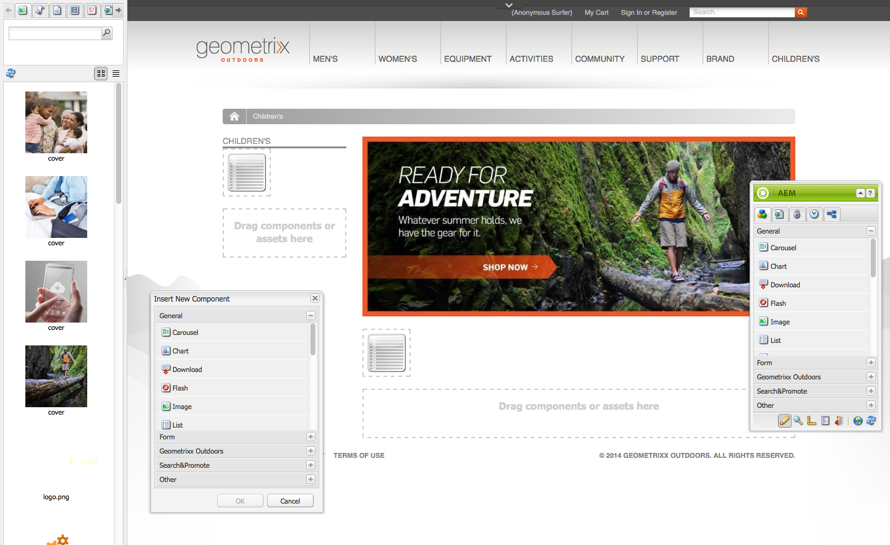
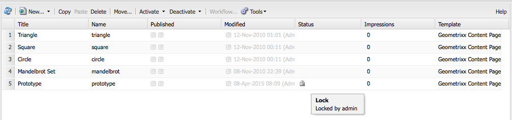

# Redigera sidinnehåll{#editing-page-content}

När sidan har skapats (antingen ny eller som en del av en lansering eller en live-kopia) kan du redigera innehållet för att få de uppdateringar du behöver.

Innehåll läggs till med [komponenter](/help/sites-classic-ui-authoring/classic-page-author-default-components.md) (lämpliga för innehållstypen) som kan dras till sidan. Du kan sedan redigera dem på plats, flytta eller ta bort dem.

>[!NOTE]
>
>Ditt konto behöver [lämpliga behörigheter](/help/sites-administering/security.md) och [behörigheter](/help/sites-administering/security.md#permissions) för att kunna redigera sidor. till exempel lägga till, redigera eller ta bort komponenter, anteckna, låsa upp.
>
>Om du råkar ut för problem rekommenderar vi att du kontaktar systemadministratören.

## Sidekick {#sidekick}

Sidsparken är ett nyckelverktyg när du skapar sidor. Det flyter när du redigerar en sida, så det är alltid synligt.

Det finns flera flikar och ikoner, bland annat:

* Komponenter
* Sidan
*  Information
* Versionshantering
* Arbetsflöde
* Lägen
*  Ställning
* Klientkontext
* Webbplatser

Dessa ger tillgång till ett brett urval av funktioner. inklusive:

* [markera komponenter](/help/sites-classic-ui-authoring/classic-page-author-env-tools.md#sidekick)
* [visa referenser](/help/sites-classic-ui-authoring/classic-page-author-env-tools.md#showing-references)
* [åtkomst till granskningsloggen](/help/sites-classic-ui-authoring/classic-page-author-env-tools.md#audit-log)
* [växlingslägen](/help/sites-classic-ui-authoring/classic-page-author-env-tools.md#page-modes)
* [skapa](/help/sites-classic-ui-authoring/classic-page-author-work-with-versions.md#creating-a-new-version), [återställa](/help/sites-classic-ui-authoring/classic-page-author-work-with-versions.md#restoring-a-page-version-from-sidekick) och [jämföra](/help/sites-classic-ui-authoring/classic-page-author-work-with-versions.md#comparing-with-a-previous-version) versioner

* [publicera](/help/sites-classic-ui-authoring/classic-page-author-publish-pages.md#publishing-a-page), [avpublicera](/help/sites-classic-ui-authoring/classic-page-author-publish-pages.md#unpublishing-a-page) en sida

* [redigera sidegenskaper](/help/sites-classic-ui-authoring/classic-page-author-edit-page-properties.md)

* [ställningar](/help/sites-authoring/scaffolding.md)

* [klientkontext](/help/sites-administering/client-context.md)

## Infoga en komponent {#inserting-a-component}

### Infoga en komponent {#inserting-a-component-1}

När du har öppnat sidan kan du börja lägga till innehåll. Det gör du genom att lägga till komponenter (kallas även stycken).

Så här infogar du en ny komponent:

1. Det finns flera sätt att välja den typ av stycke som du vill infoga:

   * **Dubbelklicka på området med etiketten** Dra komponenter eller resurser här... - verktygsfältet **Infoga ny komponent** öppnas. Markera en komponent och klicka på **OK**.

   * Dra en komponent från det flytande verktygsfältet (kallas sidospark) för att infoga ett nytt stycke.
   * **Högerklicka på ett befintligt stycke och välj** Nytt... - verktygsfältet Infoga ny komponent öppnas. Markera en komponent och klicka på **OK**.
   

1. I både sidospåret och verktygsfältet **Infoga ny komponent** visas en lista med tillgängliga komponenter (stycketyper). Dessa kan delas upp i olika avsnitt (t.ex. Allmänt, Kolumner o.s.v.) som kan färdigställas efter behov.

   Beroende på din produktionsmiljö kan dessa alternativ skilja sig åt. Fullständig information om komponenter finns i [Standardkomponenter](/help/sites-classic-ui-authoring/classic-page-author-default-components.md).

1. Infoga komponenten som du vill ha på sidan. Dubbelklicka sedan på stycket så öppnas ett fönster där du kan konfigurera stycket och lägga till innehåll.

### Infoga en komponent med hjälp av Innehållssökning {#inserting-a-component-using-the-content-finder}

Du kan också lägga till en ny komponent på sidan genom att dra en resurs från [Innehållssökning](/help/sites-classic-ui-authoring/classic-page-author-env-tools.md#the-content-finder). Då skapas automatiskt en ny komponent av lämplig typ som innehåller resursen.

Detta gäller för följande tillgångstyper (vissa kommer att vara beroende av sid-/styckesystem):

| Resurstyp | Resulterande komponenttyp |
|---|---|
| Bild | Bild |
| Dokument | Hämta |
| Produkt | Produkt |
| Video | Flash |

>[!NOTE]
>
>Det här beteendet kan konfigureras för din installation. Mer information finns i [Konfigurera ett styckesystem så att en komponentinstans](/help/sites-developing/developing-components.md#configuring-a-paragraph-system-so-that-dragging-an-asset-creates-a-component-instance) skapas när du drar en resurs.

Så här skapar du en komponent genom att dra en av resurstyperna ovan:

1. Kontrollera att sidan är i [**redigeringsläge **](/help/sites-classic-ui-authoring/classic-page-author-env-tools.md#page-modes).
1. Öppna [Innehållssökning](/help/sites-classic-ui-authoring/classic-page-author-env-tools.md#the-content-finder).
1. Dra den önskade resursen till önskad position. Platshållaren [för](#componentplaceholder) komponenten visar var komponenten kommer att placeras.

   En komponent som passar resurstypen skapas på den önskade platsen, den innehåller den valda resursen.

1. [Redigera](#editmovecopypastedelete) komponenten vid behov.

## Redigera en komponent (innehåll och egenskaper) {#editing-a-component-content-and-properties}

Om du vill redigera ett befintligt stycke gör du något av följande:

* **Dubbelklicka på** stycket för att öppna det. Du ser samma fönster som när du skapade stycket med det befintliga innehållet. Make your changes and click **OK**.

* **Högerklicka på** stycket och klicka på **Redigera**.

* **Klicka** två gånger på stycket (en långsam dubbelklickning) för att gå in i läget för redigering på plats. Du kan redigera texten direkt på sidan i stället för i ett dialogrutefönster. I det här läget visas ett verktygsfält högst upp på sidan. Gör bara ändringarna så sparas de automatiskt.

## Flytta en komponent {#moving-a-component}

Så här flyttar du ett stycke:

>[!NOTE]
>
>Du kan också använda [Klipp ut och Klistra in](#cut-copy-paste-a-component) för att flytta en komponent.

1. Markera det stycke som ska flyttas:

   

1. Dra stycket till den nya platsen - AEM anger var stycket kan flyttas med en grön bockmarkering. Släpp den där du vill.
1. Stycket flyttas:

   

## Ta bort en komponent {#deleting-a-component}

Så här tar du bort ett stycke:

1. Markera stycket och **högerklicka**:

   

1. Välj **Ta bort** på menyn. AEM WCM begär en bekräftelse på att du vill ta bort stycket eftersom den här åtgärden inte kan ångras.
1. Click **OK**.

>[!NOTE]
>
>Om du har angett att [användaregenskaperna ska visa verktygsfältet](/help/sites-classic-ui-authoring/author-env-user-props.md) Global redigering kan du även utföra vissa åtgärder på styckena med knapparna **Kopiera**, **Klipp ut**, **Klistra** in och **Ta bort** .

>Det finns även olika [kortkommandon](/help/sites-classic-ui-authoring/classic-page-author-keyboard-shortcuts.md) .
>
## Klipp ut/kopiera/klistra in en komponent {#cut-copy-paste-a-component}

Precis som när du [tar bort en komponent](#deleting-a-component) kan du använda snabbmenyn för att kopiera, klippa ut och/eller klistra in en komponent

>[!NOTE]
Om du har angett att [användaregenskaperna ska visa verktygsfältet](/help/sites-classic-ui-authoring/author-env-user-props.md) Global redigering kan du även utföra vissa åtgärder på styckena med knapparna **Kopiera**, **Klipp ut**, **Klistra** in och **Ta bort** .

>Det finns även olika [kortkommandon](/help/sites-classic-ui-authoring/classic-page-author-keyboard-shortcuts.md) .

>[!NOTE]
>
>Det går bara att klippa ut, kopiera och klistra in innehåll på samma sida.

## Ärvda komponenter {#inherited-components}

Ärvda komponenter kan vara produkten av olika scenarier, bland annat:

* [Hantering](/help/sites-administering/msm.md)av flera platser. även i kombination med [ställningar](/help/sites-classic-ui-authoring/classic-feature-scaffolding.md#scaffolding-with-msm-inheritance).

* [Startar](/help/sites-classic-ui-authoring/classic-launches.md) (baserat på livecopy).
* Särskilda komponenter. till exempel det ärvda styckesystemet i Geometrixx.

Du kan avbryta (och sedan återaktivera) arvet. Beroende på vilken komponent det gäller kan det här vara tillgängligt från:

1. **Live Copy**

   Om en komponent är en del av en livecopy eller en start visas den med en hänglåsikon. Du kan klicka på hänglåset för att avbryta arvet.

   * hänglåsikonen visas när komponenten är markerad; till exempel:
   

   * hänglåset visas också i komponentdialogen, till exempel:
   

1. **Ett ärvt styckesystem**

   Konfigurationsdialogrutan. Som med det ärvda styckesystemet i Geometrixx:

   

## Lägga till anteckningar {#adding-annotations}

[Anteckningar](/help/sites-classic-ui-authoring/classic-page-author-annotations.md) gör att andra författare kan ge feedback på ditt innehåll. Detta används ofta för granskning och validering.

## Förhandsgranska sidor {#previewing-pages}

Det finns två ikoner i den nedre kanten av sidesparten som är viktiga för att förhandsgranska sidor:

* Pennikonen visar att du befinner dig i redigeringsläge där du kan lägga till, ändra, flytta eller ta bort innehåll.

   

* Med förstoringsglaset kan du välja förhandsvisningsläge där sidan visas som den kommer att visas i publiceringsmiljön (en uppdatering av sidan behövs ibland):

   

   I förhandsgranskningsläget minskas sidosparken genom att klicka på nedpilsikonen för att återgå till redigeringsläget:

   

## Sök och ersätt {#find-replace}

För större skalredigeringar av samma fras kan du med menyalternativet **[Sök och ersätt](/help/sites-classic-ui-authoring/author-env-search.md#find-and-replace)**söka efter och ersätta flera förekomster av en sträng i ett avsnitt på webbplatsen.

## Låsa en sida {#locking-a-page}

Med AEM kan du låsa en sida så att ingen annan kan ändra innehållet. Detta är praktiskt när du gör många ändringar på en viss sida eller när du behöver frysa en sida en kort stund.

>[!CAUTION]
>
>Låsning av en sida bör användas med försiktighet eftersom den enda person som kan låsa upp en sida är den person som har låst den (eller ett konto med administratörsbehörighet).

Så här låser du en sida:

1. Markera den sida som du vill låsa på fliken **Webbplatser** .
1. Dubbelklicka på sidan för att öppna den för redigering.
1. På fliken **Sida** i sidosparken väljer du **Lås sida**:

   

   Ett meddelande visar att sidan är låst för andra användare. Dessutom visas sidan som låst i den högra rutan i konsolen **Webbplatser** , där AEM WCM anger vilken användare som har låst sidan.

   

## Låsa upp en sida {#unlocking-a-page}

Så här låser du upp en sida:

1. Markera den sida som du vill låsa upp på fliken **Webbplatser** .
1. Dubbelklicka på sidan för att öppna den.
1. På fliken **Sida** i sidosparken väljer du **Lås upp sida**.

## Ångra och göra om sidredigeringar {#undoing-and-redoing-page-edits}

Använd följande kortkommandon när innehållsramen på sidan är i fokus:

* Ångra: Ctrl+Z (Windows) eller Cmd+Z (Mac)
* Gör om: Ctrl+Y (Windows) eller Cmd+Y (Mac)

När du ångrar eller gör om borttagning, tillägg eller omplacering av ett eller flera stycken markeras de berörda styckena med blinkande (standardbeteende).

>[!NOTE]
>
>Se [Ångra och Gör om sidredigeringar - Teoriet](#undoing-and-redoing-page-edits-the-theory) innehåller alla detaljer om vad som är möjligt när du ångrar och gör om sidredigeringar.

## Ångra och göra om sidredigeringar - The Theory {#undoing-and-redoing-page-edits-the-theory}

>[!NOTE]
>
>Systemadministratören kan [konfigurera olika aspekter av funktionerna](/help/sites-administering/config-undo.md) Ångra/Gör om enligt kraven för din instans.

AEM lagrar en historik över åtgärder som du utför och i vilken ordning du utförde dem. Du ångrar därför flera åtgärder i den ordning som du utförde dem. Sedan kan du använda gör om för att återanvända en eller flera av åtgärderna.

Om ett element på innehållssidan är markerat gäller kommandot ångra och gör om det markerade objektet, till exempel en textkomponent.

Funktionen för kommandona ångra och gör om liknar den i andra program. Använd kommandona för att återställa webbsidans senaste status när du fattar beslut om innehållet. Om du till exempel flyttar ett textstycke till en annan plats på sidan kan du använda kommandot Ångra för att flytta tillbaka stycket. Om du sedan bestämmer dig för att flytta stycket igen använder du kommandot gör om.

>[!NOTE]
>
>Du kan:
>
>* gör om åtgärder så länge du inte har gjort någon sidredigering sedan du använde Ångra.
>* Ångra högst 20 redigeringsåtgärder (standardinställning).
>* Du kan även använda [kortkommandon](/help/sites-classic-ui-authoring/classic-page-author-keyboard-shortcuts.md) för att ångra och göra om.
>

Du kan använda Ångra och Gör om för följande typer av sidändringar:

* Lägga till, redigera, ta bort och flytta stycken
* In-place editing of paragraph content
* Kopiera, klippa ut och klistra in objekt på en sida
* Kopiera, klippa ut och klistra in objekt över sidor
* Lägga till, ta bort och ändra filer och bilder
* Lägga till, ta bort och ändra anteckningar och skisser
* Ändringar i ställningar
* Lägga till och ta bort referenser
* Ändra egenskapsvärden i komponentdialogrutor.

Formulärfält som formulärkomponenter återger ska inte ha värden som anges vid redigering av sidor. Kommandona Ångra och Gör om påverkar därför inte ändringar som du gör i värdena för dessa typer av komponenter. Du kan till exempel inte ångra valet av ett värde i en nedrullningsbar lista.

>[!NOTE]
>
>Särskilda behörigheter krävs för att ångra och göra om ändringar i filer och bilder. Ångra-historiken för ändringar av filer och bilder varar i minst några timmar. Efter den här gången kan du dock inte ångra ändringarna. Din administratör kan ange behörigheter och ändra standardtiden på tio timmar.
