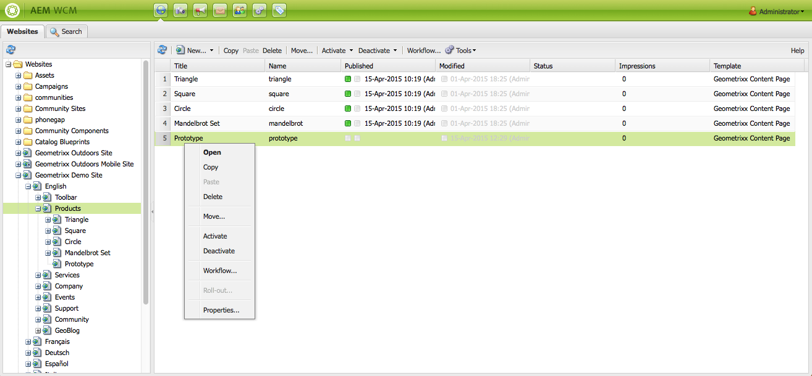
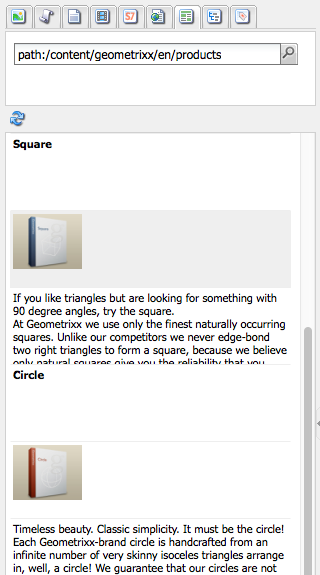
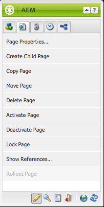

# Redigering - miljö och verktyg {#authoring-the-environment-and-tools}

I redigeringsmiljön i AEM finns olika sätt att ordna och redigera ditt innehåll. Verktygen som tillhandahålls är tillgängliga från olika konsoler och sidredigerare.

## Webbplatsadministration {#site-administration}

Med **webbplatskonsolen** kan du hantera och navigera på webbplatsen. Med hjälp av de två rutorna kan webbplatsens struktur utökas och åtgärder vidtas för det element som krävs:

## Redigera sidinnehåll {#editing-your-page-content}

Det finns en separat sidredigerare med det klassiska användargränssnittet som använder innehållssökaren och sidbrytaren:

`https://localhost:4502/cf#/content/geometrixx/en/products/triangle.html`

## Få hjälp {#accessing-help}

Olika **hjälpresurser** kan nås direkt från AEM:

Förutom [hjälp från verktygsfälten](/help/sites-classic-ui-authoring/author-env-basic-handling.md#accessing-help)i konsolen kan du även komma åt hjälp från sidan (med ? ikon) när du redigerar en sida:

Eller genom att använda **hjälpknappen** i redigeringsdialogrutan för specifika komponenter, detta visar sammanhangsberoende hjälp.

## Sidekick {#sidekick}

På fliken **Komponenter** i sidsparten kan du bläddra bland de komponenter som är tillgängliga för att läggas till på den aktuella sidan. Den önskade gruppen kan expanderas och sedan dras en komponent till önskad plats på sidan.

## Innehållssökaren {#the-content-finder}

Innehållssökaren är ett snabbt och enkelt sätt att hitta resurser och/eller innehåll i databasen när du redigerar en sida.

Du kan använda innehållssökaren för att hitta en rad olika resurser. Om det behövs kan du dra ett objekt och släppa det i ett stycke på sidan:

* [Bilder](#finding-images)
* [Dokument](#finding-documents)
* [Filmer](#finding-movies)
* [Scene 7 Media Browser](/help/sites-administering/scene7.md#scene7contentbrowser)
*  [Sidor](/help/sites-classic-ui-authoring/classic-page-author-env-tools.md#finding-pages)

* [Stycken](#referencing-paragraphs-from-other-pages)
* [Produkter](/help/sites-classic-ui-authoring/classic-page-author-env-tools.md#products)
* Eller för att [bläddra på webbplatsen efter databasstruktur](#the-content-finder)

Med alla alternativ kan du [söka efter specifika objekt](#the-content-finder).

### Söker efter bilder {#finding-images}

På den här fliken visas alla bilder i databasen.

När du har skapat ett bildstycke på sidan kan du dra ett objekt och släppa det i stycket.

### Söka efter dokument {#finding-documents}

På den här fliken visas alla dokument i databasen.

När du har skapat ett nedladdningsstycke på sidan kan du dra ett objekt och släppa det i stycket.

### Söka efter filmer {#finding-movies}

På den här fliken visas alla filmer (till exempel Flash-objekt) i databasen.

När du har skapat ett lämpligt stycke (till exempel Flash) på sidan kan du dra ett objekt och släppa det i stycket.

### Produkter {#products}

På den här fliken visas alla produkter. När du har skapat ett lämpligt stycke (till exempel Produkt) på sidan kan du dra ett objekt och släppa det i stycket.

### Söker efter sidor {#finding-pages}

På den här fliken visas alla sidor. Dubbelklicka på en sida för att öppna den för redigering.

### Referera stycken från andra sidor {#referencing-paragraphs-from-other-pages}

På den här fliken kan du söka efter en annan sida. Alla stycken från den sidan visas. Du kan sedan dra ett stycke till den aktuella sidan så skapas en referens till det ursprungliga stycket.

### Använda den fullständiga databasvyn {#using-the-full-repository-view}

På den här fliken visas alla resurser i databasen.

### Använda Söka med Innehållsläsaren {#using-search-with-the-content-browser}

På alla alternativ kan du söka efter specifika objekt. Alla taggar och resurser som matchar sökmönstret visas:

Du kan också använda jokertecken för sökning. Följande jokertecken stöds:

* `*`
matchar en sekvens med noll eller flera tecken.

* `?`
matchar ett enda tecken.

>[!NOTE]
>
>Det finns en pseudoegenskap, &quot;name&quot;, som måste användas för sökningar med jokertecken.

Om det till exempel finns en bild som heter:

`ad-nmvtis.jpg`

följande sökmönster hittar den (och alla andra bilder som matchar mönstret):

* `name:*nmv*`
* `name:AD*`
teckenmatchningen är *inte* skiftlägeskänslig.

* `name:ad?nm??is.*`
Du kan använda valfritt antal jokertecken i en fråga.

>[!NOTE]
>
>Du kan också använda [SQL2](https://helpx.adobe.com/experience-manager/6-5/sites/developing/using/reference-materials/javadoc/org/apache/jackrabbit/commons/query/sql2/package-summary.html) -sökning.

## Visar referenser {#showing-references}

Med AEM kan du visa vilka sidor som är länkade till den sida du arbetar med just nu.

Så här visar du direkta sidreferenser:

1. I sidosparken väljer du ikonen för **fliken** Sida.

   

1. **Välj** Visa referenser... AEM öppnar fönstret Referenser och visar vilka sidor som refererar till den valda sidan, inklusive deras sökvägar.

   

I vissa situationer finns ytterligare åtgärder tillgängliga från Sidekick, bland annat:

* [Startar](/help/sites-classic-ui-authoring/classic-launches.md)
* [Live-kopior](/help/sites-administering/msm.md)

* [Blueprint](/help/sites-administering/msm-best-practices.md)

Andra [relationer mellan sidor visas i webbplatskonsolen](/help/sites-classic-ui-authoring/author-env-basic-handling.md#page-information-on-the-websites-console).

## Granskningslogg {#audit-log}

Du kommer åt **granskningsloggen** på fliken **Information** i sidosparken. Den innehåller en förteckning över de senaste åtgärder som vidtagits på den aktuella sidan. till exempel:

## Sidinformation {#page-information}

Webbplatskonsolen [innehåller även information om sidans](/help/sites-classic-ui-authoring/author-env-basic-handling.md#page-information-on-the-websites-console) aktuella status, t.ex. publikation, ändring, låst, livecopy.

## Sidlägen {#page-modes}

När du redigerar en sida med det klassiska användargränssnittet finns det olika lägen som du kan komma åt med hjälp av ikonerna längst ned i sidosparken:

Ikonerna längst ned i Spark används för att växla mellan olika lägen för att arbeta med sidorna:

* [Redigera](/help/sites-classic-ui-authoring/classic-page-author-edit-mode.md)Det här är standardläget och du kan redigera sidan, lägga till eller ta bort komponenter och göra andra ändringar.

* [Förhandsgranska](/help/sites-classic-ui-authoring/classic-page-author-edit-content.md#previewing-pages)I det här läget kan du förhandsgranska sidan som om den visades på webbplatsen i dess slutliga form.

* [Design](/help/sites-classic-ui-authoring/classic-page-author-design-mode.md#main-pars-procedure-0)I det här läget kan du redigera sidans design genom att konfigurera de tillgängliga komponenterna.

>[!NOTE]
>
>Andra alternativ är också tillgängliga:

>* [Ställning](/help/sites-classic-ui-authoring/classic-feature-scaffolding.md)
>* [Klientkontext](/help/sites-administering/client-context.md)
* Webbplatser - öppnar webbplatskonsolen.
* Läs in igen - uppdaterar sidan.

## Kortkommandon {#keyboard-shortcuts}

Det finns olika [kortkommandon](/help/sites-classic-ui-authoring/classic-page-author-keyboard-shortcuts.md) .
