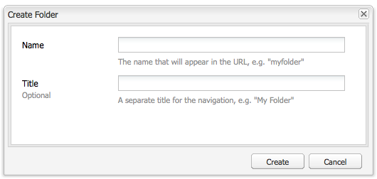

# Skapa och ordna sidor{#creating-and-organizing-pages}

I det här avsnittet beskrivs hur du skapar och hanterar sidor med Adobe Experience Manager (AEM) så att du sedan kan [skapa innehåll](/help/sites-classic-ui-authoring/classic-page-author-edit-content.md) på de sidorna.

>[!NOTE]
>
>Ditt konto behöver [lämpliga åtkomsträttigheter](/help/sites-administering/security.md) och [behörigheter](/help/sites-administering/security.md#permissions) om du vill utföra åtgärder på sidor, till exempel skapa, kopiera, flytta, redigera, ta bort.
>
>Om du råkar ut för problem rekommenderar vi att du kontaktar systemadministratören.

## Organisera din webbplats {#organizing-your-website}

Som författare måste du ordna din webbplats inom AEM. Detta innebär att du skapar och namnger innehållssidorna så att:

* kan du enkelt hitta dem i redigeringsmiljön
* besökare på er webbplats kan enkelt bläddra bland dem i publiceringsmiljön

Du kan också använda [mappar](#creating-a-new-folder) för att ordna innehållet.

Strukturen på en webbplats kan ses som en *trädstruktur* som innehåller dina innehållssidor. Namnen på dessa innehållssidor används för att skapa URL-adresserna, medan titeln visas när sidinnehållet visas.

I följande exempel visas ett utdrag från webbplatsen Geometrixx där t.ex. `Triangle` sidan öppnas:

* Författarmiljö

  `http://localhost:4502/cf#/content/geometrixx/en/products/triangle.html`

* Publiceringsmiljö

  `http://localhost:4503/content/geometrixx/en/products/triangle.html`

  Beroende på instansens konfiguration kan du använda `/content` kan vara valfritt i publiceringsmiljön.

```xml
  /content
    /geometrixx
      /en
        /toolbar...
        /products
          /triangle
            /overview
            /features
          /square...
          /circle...
          /...
        /...
      /fr...
      /de...
      /es...
      /...
    /...
```

Den här strukturen kan visas från webbplatskonsolen som du kan använda för att [navigera i trädstrukturen](/help/sites-classic-ui-authoring/author-env-basic-handling.md#main-pars-text-15).


### Konventioner för sidnamngivning {#page-naming-conventions}

När du skapar en ny sida finns det två nyckelfält:

* **[Titel](#title)**:

   * Detta visas för användaren i konsolen och visas överst i sidinnehållet när det redigeras.
   * Detta fält är obligatoriskt.

* **[Namn](#name)**:

   * Detta används för att generera URI.
   * Användarindata för det här fältet är valfria. Om inget anges hämtas namnet från titeln.

AEM skapar en ny sida [validera sidnamnet enligt konventionerna](/help/sites-developing/naming-conventions.md) som ålagts av AEM och JCR.

Implementeringen och listan över tillåtna tecken skiljer sig något beroende på användargränssnittet (det är mer omfattande för det beröringsaktiverade användargränssnittet), men det minsta tillåtna är:

* &#39;a&#39; till &#39;z&#39;
* A till Z
* 0 till 9
* _ (understreck)
* `-` (minus/bindestreck)

Använd bara dessa tecken om du vill vara säker på att de accepteras/används (om du behöver fullständig information om alla tillåtna tecken finns mer information i [namnkonventioner](/help/sites-developing/naming-conventions.md)).

#### Titel {#title}

Om du bara anger en **sidtitel** när du skapar en ny sida härleds sidans **namn**[ i AEM från den här strängen och namnet valideras enligt konventionerna i AEM och JCR. ](/help/sites-developing/naming-conventions.md) I båda användargränssnitten är **Titel** fält som innehåller ogiltiga tecken accepteras, men det härledda namnet får de ogiltiga tecknen understött. Till exempel:

| Titel | Härlett namn |
|---|---|
| Schön | schoen.html |
| SC%&amp;ast;ç+ | sc---c-.html |

#### Namn {#name}

Om du anger en sida **Namn** när du skapar en ny sida AEM [validera namnet enligt konventionerna](/help/sites-developing/naming-conventions.md) som ålagts av AEM och JCR.

I det klassiska användargränssnittet **kan inte ange ogiltiga tecken** i **Namn** fält.

>[!NOTE]
>I det pekaktiverade användargränssnittet **kan inte skicka ogiltiga tecken** i **Namn** fält. När AEM upptäcker ogiltiga tecken markeras fältet och en förklaring visas som anger vilka tecken som behöver tas bort/ersättas.

>[!NOTE]
>
>Du bör undvika att använda en kod med två bokstäver enligt ISO-639-1, om det inte är en språkrot.
>
>Se [Förbereder innehåll för översättning](/help/sites-administering/tc-prep.md) för mer information.

### Mallar {#templates}

I AEM anger en mall en speciell typ av sida. En mall kommer att användas som bas för alla nya sidor som skapas.

Mallen definierar strukturen för en sida, inklusive en miniatyrbild och andra egenskaper. Du kan till exempel ha separata mallar för produktsidor, platskartor och kontaktinformation. Mallar består av [komponenter](#components).

AEM innehåller flera färdiga mallar. Vilka mallar som visas beror på den enskilda webbplatsen och vilken information som behöver anges (när du skapar den nya sidan) beroende på vilket gränssnitt som används. Nyckelfälten är:

* **Titel**
Titeln som visas på den slutliga webbsidan.

* **Namn**
Används när sidan namnges.

* **Mall**
En lista med mallar som är tillgängliga för att användas när den nya sidan genereras.

### Komponenter {#components}

Komponenterna är de element som AEM tillhandahåller så att du kan lägga till specifika typer av innehåll. AEM innehåller en rad färdiga komponenter som ger omfattande funktionalitet:

* Text
* Bild
* Bildspel
* Video
* många fler

När du har skapat och öppnat en sida kan du [lägga till innehåll med komponenterna](/help/sites-classic-ui-authoring/classic-page-author-edit-content.md#insertinganewparagraph), finns på [sidekick](/help/sites-classic-ui-authoring/classic-page-author-env-tools.md#sidekick).

## Hantera sidor {#managing-pages}

### Skapa en ny sida {#creating-a-new-page}

Om du inte har skapat alla sidor åt dig i förväg måste du skapa en sida innan du kan börja skapa innehåll:

1. Från **Webbplatser** väljer du den nivå där du vill skapa en ny sida.

   I följande exempel skapar du en sida under nivån **Produkter** - visas i den vänstra rutan; den högra rutan visar sidor som redan finns på nivån under **Produkter**.

   

1. I **Nytt...** (klicka på pilen bredvid **Nytt...**), välja **Ny sida...**. The **Skapa sida** öppnas.

   Klicka **Nytt...** fungerar också som en genväg till **Ny sida...** alternativ.

1. The **Skapa sida** kan du

   * Ange en **Titel**; detta visas för användaren.
   * Ange en **Namn**; den används för att generera URI:n. Om inget anges hämtas namnet från titeln.

      * Om du anger en sida **Namn** när du skapar en ny sida AEM [validera namnet enligt konventionerna](/help/sites-developing/naming-conventions.md) av AEM och JCR.
      * I det klassiska användargränssnittet **kan inte ange ogiltiga tecken** i **Namn** fält.

   * Klicka på den mall som du vill använda för att skapa den nya sidan.

     Mallen används som bas för den nya sidan, till exempel för att fastställa den grundläggande layouten för en innehållssida.

   >[!NOTE]
   >
   >Se [Konventioner för sidnamngivning](#page-naming-conventions).

   Minimiinformationen som krävs för att skapa en ny sida är **Titel** och den mall som krävs.

   

   >[!NOTE]
   >
   >Om du vill använda Unicode-tecken i URL-adresserna anger du aliaset ( `sling:alias`), egenskap ([sidegenskaper](/help/sites-classic-ui-authoring/classic-page-author-edit-page-properties.md)).

1. Klicka **Skapa** för att skapa sidan. Du går tillbaka till **Webbplatser** konsol där du kan se en post för den nya sidan.

   Konsolen ger information om sidan (till exempel när den senast redigerades och av vem) som uppdateras efter behov.

   >[!NOTE]
   >
   >Du kan också skapa en sida när du redigerar en befintlig sida. Använda **Skapa underordnad sida **från **Sida** -fliken i sidosparken skapar en ny sida direkt under den sida som redigeras.

### Öppna en sida för redigering {#opening-a-page-for-editing}

Du kan öppna sidan som ska [redigerad](/help/sites-classic-ui-authoring/classic-page-author-edit-content.md#editing-a-component-content-and-properties) med någon av flera metoder:

* Från **Webbplatser** konsol kan du **dubbelklicka** sidinmatningen för att öppna den för redigering.

* Från **Webbplatser** konsol kan du **högerklicka** (snabbmeny) markerar sidobjektet och väljer **Öppna** på menyn.

* När du har öppnat en sida kan du navigera till andra sidor på webbplatsen (för att redigera dem) genom att klicka på hyperlänkar.

### Kopiera och klistra in en sida {#copying-and-pasting-a-page}

Vid kopiering kan du antingen kopiera:

* en sida
* en sida med alla undersidor

1. Från **Webbplatser** markerar du sidan som du vill kopiera.

   >[!NOTE]
   >
   >I det här skedet är det irrelevant om du vill kopiera en enstaka sida eller de underliggande undersidorna.

1. Klicka **Kopiera**.

1. Navigera till den nya platsen och klicka på:

   * **Klistra in** - om du vill klistra in sidan tillsammans med alla underordnade sidor
   * **Skift + Klistra in** - om du bara vill klistra in den markerade sidan

   Sidorna klistras in på den nya platsen.

   >[!NOTE]
   >
   >Sidnamnet kan justeras automatiskt om en befintlig sida redan har samma namn.

   >[!NOTE]
   >
   >Du kan också använda **Kopiera sida** från **Sida** sidosparkens flik. Då öppnas en dialogruta där du kan ange mål, osv.

### Flytta eller byta namn på sida {#moving-or-renaming-page}

>[!NOTE]
>
>Om du byter namn på en sida gäller även [Konventioner för sidnamngivning](#page-naming-conventions) när du anger det nya sidnamnet.

Du flyttar eller byter namn på en sida på samma sätt. Med samma åtgärd kan man

* flytta en sida till en ny plats
* byta namn på en sida på samma plats
* flytta en sida till en ny plats och byta namn på den samtidigt

I AEM finns funktioner för att uppdatera interna länkar till sidan som byter namn eller flyttas. Detta kan göras sida för sida för att ge full flexibilitet.

Så här flyttar eller byter du namn på en sida:

1. Det finns olika metoder för att utlösa en flytt:

   * Från **Webbplatser** konsol, klicka för att markera sidan och välj sedan **Flytta...**
   * Från **Webbplatser** konsolen kan du också markera sidobjektet och sedan **högerklicka** och markera **Flytta...**
   * När du redigerar en sida kan du markera **Flytta sida** från **Sida** sidosparkens flik.

1. The **Flytta** öppnas. Här kan du antingen ange en ny plats, ett nytt namn för sidan eller båda.

   

   På sidan visas även alla sidor som refererar till den sida som flyttas. Beroende på status för referenssidan kan du eventuellt justera länkarna på och/eller publicera om sidorna.

1. Fyll i följande fält, beroende på vad som är tillämpligt:

   * **Mål**

     Använd platskartan (som är tillgänglig via den nedrullningsbara väljaren) för att välja platsen dit sidan ska flyttas.

     Ignorera det här fältet om du bara byter namn på sidan.

   * **Flytta**

     Ange vilken sida som ska flyttas - den fylls vanligtvis i som standard, beroende på hur och var du startade flyttåtgärden.

   * **Byt namn till**

     Den aktuella sidetiketten visas som standard. Ange vid behov den nya sidetiketten.

   * **Justera**

     Uppdatera länkarna på den sida som listas där pekar på den flyttade sidan: om sidan A t.ex. har länkar till sidan B, AEM justerar länkarna på sidan A om du flyttar sidan B.

     Detta kan markeras/avmarkeras för varje enskild referenssida.

   * **Publicera igen**

     Publicera om referenssidan. Återigen kan du välja detta för varje enskild sida.

   >[!NOTE]
   >
   >Om sidan redan är aktiverad inaktiveras den automatiskt när du flyttar den. Som standard återaktiveras den när flytten är klar, men detta kan ändras genom att avmarkera **Publicera igen** fält för sidan i **Flytta** -fönstret.

1. Klicka **Flytta**. Bekräftelse krävs. Klicka **OK** för att bekräfta.

   >[!NOTE]
   >
   >Sidans titel kommer inte att uppdateras.

### Ta bort en sida {#deleting-a-page}

1. Du kan ta bort en sida från olika platser:

   * I **Webbplatser** konsol, klicka för att markera sidan, högerklicka och välj **Ta bort** från den resulterande menyn.
   * I **Webbplatser** konsol, klicka för att markera sidan och välj sedan **Ta bort** i verktygsfältmenyn.
   * Använd **Sida** flik att välja **Ta bort sida** - den öppna sidan tas bort.

1. När du har valt att ta bort en sida måste du bekräfta begäran eftersom åtgärden inte kan ångras.

   >[!NOTE]
   >
   >Om sidan har publicerats efter borttagningen kan du återställa den senaste versionen (eller en viss version), men detta har kanske inte exakt samma innehåll som den senaste versionen om ytterligare ändringar har gjorts. Se [Återställa sidor](/help/sites-classic-ui-authoring/classic-page-author-work-with-versions.md#restoringpages) för mer information.

>[!NOTE]
>
>Om en sida redan är aktiverad kommer den automatiskt att inaktiveras innan den tas bort.

### Låsa en sida {#locking-a-page}

Du kan [låsa/låsa upp en sida](/help/sites-classic-ui-authoring/classic-page-author-edit-content.md#locking-a-page) från en konsol eller när du redigerar en enskild sida. Information om låsta sidor visas också på båda platserna.

### Skapa en ny mapp {#creating-a-new-folder}

>[!NOTE]
>
>Mappar kan även användas i [Konventioner för sidnamngivning](#page-naming-conventions) när du anger det nya mappnamnet.

1. Öppna **Webbplatser** och navigera till önskad plats.
1. I **Nytt...** (klicka på pilen bredvid **Nytt...**), välja **Ny mapp...**.
1. The **Skapa mapp** öppnas. Här anger du **Namn** och **Titel**:

   

1. Välj **Skapa** för att skapa mappen.
